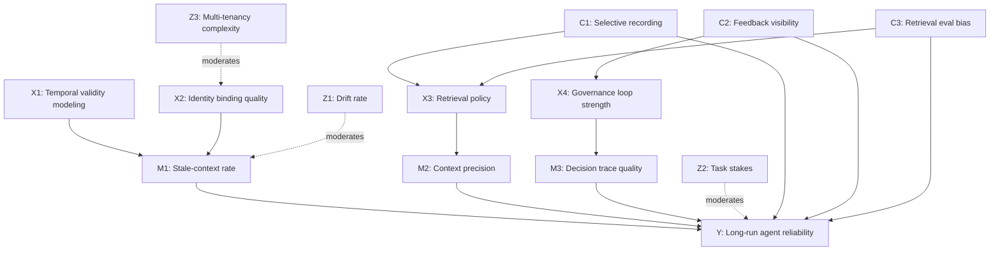
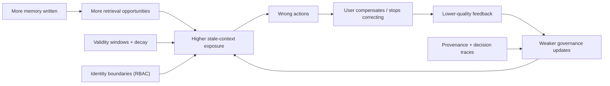
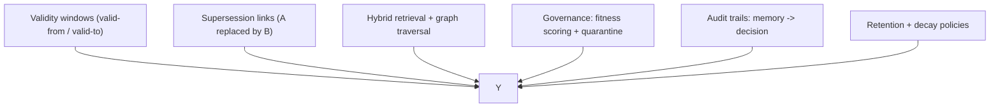

## Hook

Agent memory looks like an easy win: store past conversations, retrieve the “relevant” bits, and your assistant becomes consistent over time.

Then the failure mode shows up: the agent confidently applies a preference that stopped being true, cites a policy that was superseded, or repeats an old constraint that belonged to a different identity boundary. The system didn’t “forget” — it remembered incorrectly.

The causal question this post answers is: **why does adding memory often *increase* long-run error, and how does a temporal (time-valid) memory design change that trajectory?**

## Executive Summary

- Memory adds power by expanding context, but it also adds a new failure channel: retrieving evidence that is *relevant* yet *no longer valid*.
- “Staleness” is not a metadata bug; it is a causal variable that mediates whether retrieved context helps or harms.
- Temporal knowledge graphs (facts with valid-from/valid-to) reduce a specific class of errors: actions conditioned on superseded states.
- Hybrid retrieval (semantic + lexical + graph traversal) helps when similarity alone pulls high-frequency but low-causal-importance snippets.
- The real differentiator is governance: versioning, provenance, decay, and rollback convert memory from “more text” into an auditable system.
- A practical implication: the best memory work is often unglamorous engineering (identity boundaries, validity windows, and audit traces).

## The Causal Model

### Outcome (Y)

**Y: Long-run agent reliability** (correctness, consistency across sessions, and safety as the world drifts).

### Key causes (X)

- **X1: Temporal validity modeling** (can the system represent when a fact was true?)
- **X2: Identity binding quality** (can facts be attached to the correct actor/org/session?)
- **X3: Retrieval policy and ranking** (what is eligible to be retrieved, and how is it prioritized?)
- **X4: Governance loop strength** (can the system downgrade, quarantine, and rollback memories?)

### Mediators (M)

- **M1: Stale-context rate** (fraction of retrieved context that is no longer valid)
- **M2: Context precision** (signal-to-noise ratio of retrieved context)
- **M3: Decision trace quality** (can you explain which memory caused which action?)

### Moderators (Z)

- **Z1: Drift rate** (how quickly preferences, policies, and states change)
- **Z2: Task stakes** (support chat vs finance vs clinical ops)
- **Z3: Multi-tenancy complexity** (shared memory surfaces and RBAC complexity)

### Confounders (C)

- **C1: Selective recording** (what gets written to memory is not random)
- **C2: Feedback visibility** (silent failures produce fewer corrective signals)
- **C3: Retrieval evaluation bias** (ranking models optimized for “relevance” rather than downstream correctness)

### Measurement / proxy risks

- “Relevance” labels can overfit to short-term helpfulness and miss long-run harm.
- User satisfaction can mask errors when users stop relying on the agent.
- Reduced token usage can look like improvement while correctness stays flat.

### Counterfactual statements

- If the same agent used **validity windows + supersession** (X1↑) without changing the LLM, **the stale-context rate (M1) would fall**, lowering long-run reliability failures (Y↑).
- If the system improved **identity binding** (X2↑) while keeping retrieval volume constant, **cross-identity contamination would drop**, improving safety even if personalization stayed similar.

## Causal Diagrams (Mermaid)

### A) Primary DAG

### B) Feedback loop / system dynamics view

### C) Intervention levers

## Mechanism Walkthrough

### Step 1: Memory increases recall *and* introduces time-mismatch

A memory system changes the information set the agent conditions on. That is power — but it also creates a new mismatch class: facts that were true at $t_0$ are retrieved at $t_1$ after the world drifted.

Without a validity model, retrieval treats “was true” as “is true.” The agent then optimizes the wrong objective because it is reasoning under incorrect constraints.

### Step 2: Similarity is structurally blind to causal status

Embedding similarity is good at “aboutness.” It is not good at “caused this decision.” High-frequency, emotionally salient, or verbose memories can outrank sparse but causally decisive ones (e.g., a single policy change).

Hybrid retrieval helps because it adds alternative signals: lexical anchors for exact constraints, and graph locality that pulls connected facts rather than merely similar sentences.

### Step 3: Temporal graphs make “staleness” queryable

A temporal knowledge graph makes two things explicit:

1) the *state* (a fact or relation), and
2) the *interval* during which it is valid.

That enables retrieval to answer: “What is true now?” rather than “What has ever been mentioned?” It also supports “What used to be true?” as a distinct query, which is essential for auditing.

### Step 4: Governance converts memory from a feature to a system

Without governance, memory errors accumulate because nothing forces correction. Governance adds:

- provenance (where did the memory come from?)
- versioning (what replaced what?)
- decay (what expires by default?)
- rollback/quarantine (how do we stop using a bad memory quickly?)

Those are causal interventions: they change which memories are eligible to influence action.

### Alternative mechanisms (weaker)

- **“Just use a larger context window.”** Weaker because it increases retrieval volume without solving validity or identity. It can amplify stale-context exposure.
- **“Just build better embeddings.”** Weaker because embeddings do not encode time validity or evidence strength by default.

## Evidence & Uncertainty

### What we know

- Agent reliability degrades when systems cannot distinguish current vs historical state.
- Retrieval systems optimized for semantic relevance can surface misleading evidence.

### What we strongly suspect

- Temporal validity + supersession is a first-order requirement for safe long-run personalization.
- The biggest gains come from governance and instrumentation, not from fancier embedding models.

### What we don’t know yet

- Which decay policies minimize harm across domains with different drift rates.
- The best evaluation protocol for stale-context errors (ground truth labeling is expensive).

### Falsification ideas

- Run an A/B where only validity windows are added; measure stale-driven incident rate.
- Inject synthetic “preference reversals” and test whether the system retrieves the newest state.

## Interventions & Leverage Points

1) **Model time explicitly**
- Expected effect: reduces stale-context errors.
- Risks: incorrect invalidation can hide still-valid facts.
- Prereqs: schema support for intervals; supersession semantics.
- Measurement: stale-context rate; contradiction rate in retrieved context.

2) **Make identity binding a boundary, not a label**
- Expected effect: reduces cross-tenant leakage.
- Risks: onboarding friction.
- Prereqs: stable user/org/session identifiers; RBAC.
- Measurement: contamination tests; audit sampling.

3) **Separate “write memory” from “use memory”**
- Expected effect: limits the blast radius of bad extraction.
- Risks: slower personalization.
- Prereqs: governance workflow; quarantine states.
- Measurement: time-to-fix for bad memories.

4) **Instrument decision traces**
- Expected effect: improves debugging and accountability.
- Risks: extra logging cost.
- Prereqs: structured trace schema.
- Measurement: percent of actions with traceable causal memory inputs.

5) **Use hybrid retrieval as a default**
- Expected effect: reduces dominance of high-frequency similarity matches.
- Risks: extra complexity.
- Prereqs: lexical index and graph traversal.
- Measurement: top-k retrieval precision against labeled “causal” memories.

## Practical Takeaways

- Treat staleness as a first-class variable, not an edge case.
- Build a “superseded by” mechanism before adding more memory volume.
- Keep memory multi-tenant boundaries explicit and enforced.
- Prefer governance primitives (versioning, provenance, rollback) over clever prompt tricks.
- Evaluate memory by downstream incidents, not by retrieval “relevance.”
- For high-stakes tasks, default to conservative memory usage and require traceability.
- If you cannot audit why a memory was used, you do not have safe memory.

## Appendix

### Sources (workspace)

- `localSource/Analysis/Zep Platforma pre pamäť a kontext AI agentov 23b90bcdd8ae80e3a684ced17a3ec1cd.md` — temporal KG, hybrid retrieval, governance concepts.
- `docs/blog/posts/2026-01-17_memory-needs-identity-governance-and-decay.md` — prior site post framing memory as a governed system.

### Assumptions log

- Assumption: temporal validity features are a dominant driver of stale-context reduction.
- Assumption: hybrid retrieval improves causal precision in typical enterprise corpora.

### Glossary

- **Validity window**: time interval during which a fact is treated as true for action.
- **Supersession**: explicit replacement relation between two incompatible states.
- **Decision trace**: structured record connecting outputs to evidence and memory inputs.
