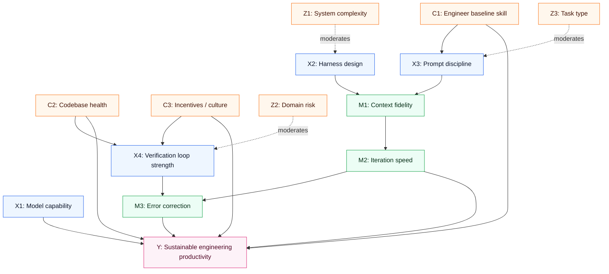
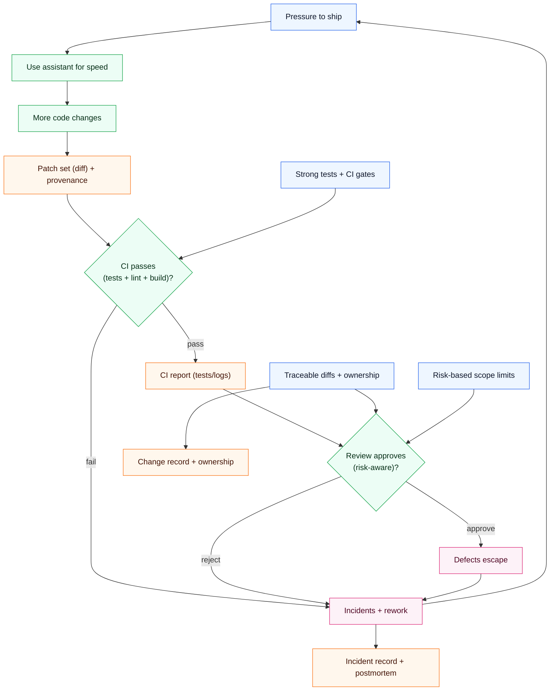
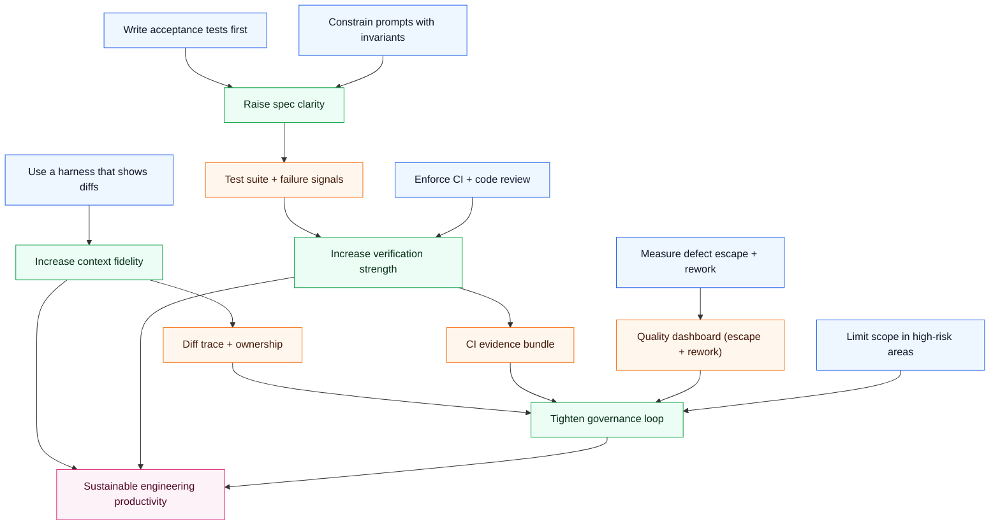

## Hook

“Which AI coding assistant is best?” is the wrong question.

Rankings are unstable because they compress a complex system into a single score—and that score depends as much on *harness design* and *team workflow* as it does on the underlying model.

The causal question this post answers is: **under what conditions do coding assistants increase team throughput—and when do they quietly increase defects and operational risk?**

## Executive Summary

- The model matters, but the harness often determines whether a model can follow long-running specs.
- Productivity improvements are mediated by context quality, test scaffolding, and error correction loops.
- If measurement is weak, teams “feel faster” while defect escape increases.
- The highest ROI interventions are governance primitives: unit tests, traceable diffs, and review gates.
- A causal view replaces “tool choice” with “system design”: incentives, prompts, context, and rollback.
- The correct unit of evaluation is not a single task—it’s a workflow over time.

## The Causal Model

### Outcome (Y)

**Y: Sustainable engineering productivity** (lead time, reliability, maintainability, defect escape rate, and developer experience).

### Key causes (X)

- **X1: Model capability** (reasoning + code generation ceiling)
- **X2: Harness design** (context injection, file ops, planning, tool use)
- **X3: Prompt discipline** (spec clarity, constraints, acceptance criteria)
- **X4: Verification loop strength** (tests, linting, CI, code review)

### Mediators (M)

- **M1: Context fidelity** (does the assistant “see” the right code + constraints?)
- **M2: Iteration speed** (time-to-first-diff, time-to-green-tests)
- **M3: Error correction effectiveness** (how fast wrong code is detected and corrected)

### Moderators (Z)

- **Z1: System complexity** (monorepo vs small service)
- **Z2: Domain risk** (payments vs internal tooling)
- **Z3: Task type** (greenfield scaffolding vs surgical patching)

### Confounders (C)

- **C1: Engineer skill and baseline speed**
- **C2: Codebase health** (existing tests, architecture, clarity)
- **C3: Incentives** (shipping pressure, quality culture)

### Measurement / proxy risks

- “Lines of code” and “PR count” are poor productivity proxies.
- “LLM-as-judge” can correlate with style, not correctness.
- “Unit tests passed” can be gamed if tests are incomplete.

### Counterfactual statements

- If we keep the same model (X1 constant) but improve harness context injection (X2↑), we should see faster convergence to passing tests and fewer spec deviations.
- If we keep tool and model constant but strengthen verification (X4↑), we should observe reduced defect escape even if perceived speed decreases slightly.

## Causal Diagrams (Mermaid)

### A) Primary DAG

### B) Feedback loop (Goodhart risk)

### C) Intervention map

## Mechanism Walkthrough

### Mechanism 1: The harness shapes what the model can do

A coding assistant is not just a model. It is a control system.

A strong harness:

- loads the right files and only the right files,
- plans work before editing,
- applies changes as diffs,
- runs tests and iterates.

A weak harness:

- leaks irrelevant context,
- loses long-running constraints,
- encourages the model to “fill in” missing details.

This is why a model that looks “great” in a demo can fail in production workflows.

### Mechanism 2: Verification loops turn generation into engineering

Without tests, a coding assistant optimizes for plausibility.

With tests, it is forced to optimize for behavior.

The productivity gain comes from converting ambiguous human intent into executable checks, then letting the model propose diffs that satisfy those checks.

### Mechanism 3: Measurement determines what teams optimize

If you reward speed, the system will produce speed.

If you reward reliability, the system will produce reliability.

Coding assistants amplify whatever your organization already optimizes.

### Alternative mechanisms (weaker)

- **“Just choose the top-ranked tool.”** Rankings are non-causal summaries; they do not transfer across codebases and workflows.
- **“The best model solves everything.”** Model improvements are real but still bounded by context fidelity and verification.

## Evidence & Uncertainty

### What we know

- Benchmark results vary dramatically by model and by harness.
- Instruction-following is harder than producing “good-looking” code.
- Unit tests provide the most reliable ground truth signal among common evaluation methods.

### What we strongly suspect

- Many teams overestimate productivity because they measure outputs (PRs) rather than outcomes (defect escape, rework).
- The largest long-run gains come from enforcing constraints and verification, not from changing which model is used.

### What we don’t know yet

- Which harness patterns generalize best across languages and monorepo structures.
- How to build evaluation that is robust to “teaching to the test.”

### Falsification ideas

- Swap harnesses while keeping the same model; measure time-to-green-tests and spec deviations.
- Increase verification gates for assistant-generated diffs; measure changes in defect escape rate.

## Interventions & Leverage Points

1) **Define acceptance criteria as tests**
- Expected effect: tighter feedback loop, fewer speculative diffs.
- Risks: upfront time.
- Prerequisites: test framework discipline.
- Measurement: time-to-green-tests; coverage of edge cases.

2) **Adopt diff-first workflows**
- Expected effect: safer review, easier rollback.
- Risks: requires tooling support.
- Prerequisites: harness that produces clean diffs.
- Measurement: review time; revert rate.

3) **Constrain prompts with invariants**
- Expected effect: reduces scope creep and spec drift.
- Risks: false rigidity.
- Prerequisites: written invariants per module.
- Measurement: “violation rate” of constraints.

4) **Strengthen CI gates and ownership**
- Expected effect: reduces defect escape.
- Risks: perceived slowdown.
- Prerequisites: stable CI.
- Measurement: post-merge incident rate; rollbacks.

5) **Measure rework, not vibes**
- Expected effect: corrects Goodhart loops.
- Risks: metric fatigue.
- Prerequisites: lightweight tagging of “AI-assisted changes.”
- Measurement: rework hours per feature; production incidents.

6) **Scope limits in high-risk domains**
- Expected effect: prevents catastrophic failures.
- Risks: lost opportunity.
- Prerequisites: risk classification.
- Measurement: incident severity distribution.

## Practical Takeaways

- Evaluate assistants as systems: model + harness + workflow.
- Treat tests as the interface between intent and code.
- Prefer tools that show diffs and support rollback.
- Constrain prompts with explicit invariants and acceptance criteria.
- Measure defect escape and rework to avoid self-deception.
- Keep high-risk modules behind stricter gates.
- Expect rankings to drift; design for robustness instead.

## Appendix

### Sources from workspace

- `localSource/Analysis/The Best AI Coding Assistants August 2025 interest 4f9515fd50a94bee8d86b1073d67bcc0.md` — benchmark framing: model vs harness vs prompt; instruction following; unit tests; LLM-as-judge.
- `localSource/Analysis/SWOTs for the brModel 2e890bcdd8ae8127a3b9d179664e9540.md` — software development SWOT: observability, postmortems, Goodhart risks.

### Assumptions log

- Assumption: organizations can materially strengthen verification loops (tests/CI) without prohibitive cost.
- Assumption: assistant-generated diffs are reviewable when surfaced as patch sets.

### Glossary

- **Harness:** the orchestration layer that manages context, file edits, tool execution, and iteration.
- **Defect escape:** failures that reach production.
- **Goodhart effect:** when a measure becomes a target, it stops being a good measure.
