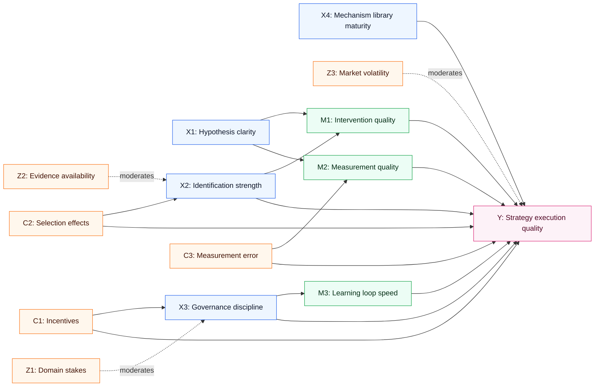
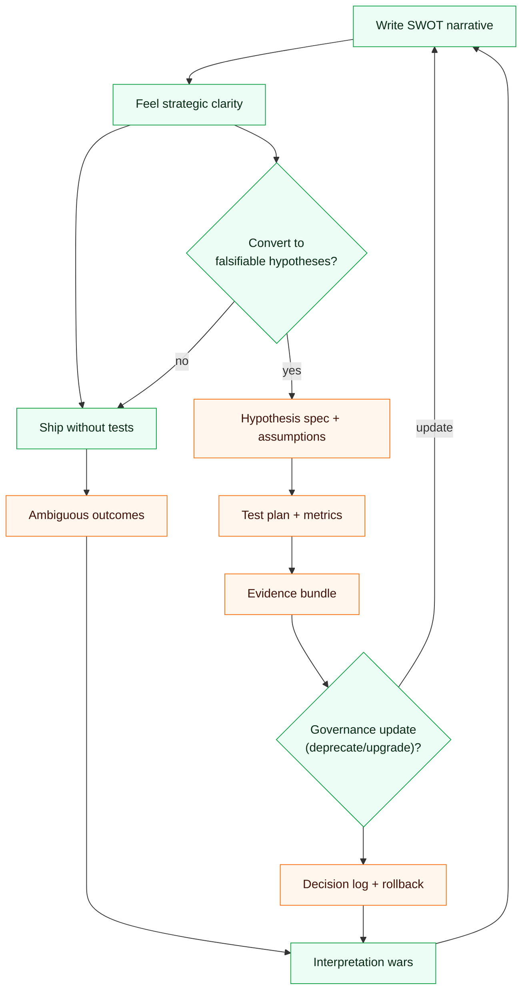
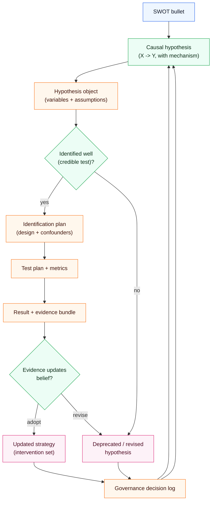

## Hook

SWOT is the easiest strategic artifact to produce and the hardest to use well.

The failure mode is predictable: teams write a persuasive list of Strengths, Weaknesses, Opportunities, and Threats—then they treat that list as a strategy.

The causal question this post answers is: **how do we convert SWOT into a set of causal hypotheses that can be tested, updated, and governed—so it actually changes outcomes?**

## Executive Summary

- SWOT is descriptive; strategy is causal.
- Every SWOT bullet implicitly claims a mechanism (“if we do X, Y will improve”); make that mechanism explicit.
- The right unit of work is a **hypothesis** with a measurement plan and a falsification path.
- Governance matters because SWOT is vulnerable to narrative bias and incentives.
- Mechanism-executable graphs turn “strengths” into reusable modules and turn “threats” into policy constraints.
- The goal is not to be optimistic—it is to be **calibrated**.

## The Causal Model

### Outcome (Y)

**Y: Strategy execution quality** (predictable delivery of value, controlled risk, and learning speed).

### Key causes (X)

- **X1: Hypothesis clarity** (do we know what causes what?)
- **X2: Identification strength** (can we infer effects, or are we confounded?)
- **X3: Governance discipline** (update/rollback rules, audit trails)
- **X4: Mechanism library maturity** (reusable causal modules)

### Mediators (M)

- **M1: Intervention quality** (are actions targeted to causes?)
- **M2: Measurement quality** (do metrics track the causal target?)
- **M3: Learning loop speed** (how fast beliefs change when evidence arrives)

### Moderators (Z)

- **Z1: Domain stakes** (enterprise AI vs low-risk tooling)
- **Z2: Evidence availability** (observability vs sparse outcomes)
- **Z3: Market volatility** (how fast threats shift)

### Confounders (C)

- **C1: Incentives** (pressure to confirm rather than test)
- **C2: Selection effects** (only successful cases are visible)
- **C3: Measurement error** (proxies diverge from constructs)

### Measurement / proxy risks

- “Adoption” can rise while real impact stagnates.
- “Accuracy” can improve while governance degrades.
- “Growth” can hide churn risk until it’s too late.

### Counterfactual statements

- If we keep the same SWOT list but add governance (X3↑), we should see faster deprecation of wrong beliefs and fewer strategy pivots driven by anecdotes.
- If we convert one major “threat” into an explicit constraint and test plan (X1↑, X2↑), we should reduce catastrophic downside even if topline outcomes remain unchanged.

## Causal Diagrams (Mermaid)

### A) Primary DAG

### B) “Narrative trap” feedback loop

### C) Translation pipeline: SWOT → hypothesis → governance

## Mechanism Walkthrough

### Step 1: Identify the hidden causal claim inside each SWOT bullet

Examples:

- “Auditability is a strength.”
  - Hidden claim: auditability reduces downstream risk and increases adoption in regulated contexts.

- “High modeling overhead is a weakness.”
  - Hidden claim: upfront cost delays time-to-value, which reduces adoption and weakens learning loops.

- “Standardization is an opportunity.”
  - Hidden claim: a shared mechanism library increases reuse, reduces variance, and raises trust.

- “Hype is a threat.”
  - Hidden claim: short-term adoption favors simpler systems, reducing willingness to invest in governance.

### Step 2: Convert the claim into a structural causal statement

A usable hypothesis requires:

- a manipulable intervention (what we can do),
- an outcome variable,
- mediators and confounders,
- and a falsification plan.

### Step 3: Decide what kind of identification is possible

Not every hypothesis can be identified with the same rigor.

- In software systems, you can often run controlled interventions.
- In cognitive science or healthcare, you often rely on quasi-experiments and careful causal assumptions.

### Step 4: Add governance so the system can learn

Without a governance loop, SWOT becomes a frozen story.

With governance:

- low-fitness hypotheses get downgraded,
- mechanism modules get reused and improved,
- threats become enforceable constraints.

### Alternative mechanisms (weaker)

- **“SWOT is enough for alignment.”** Alignment without tests often produces coordinated error.
- **“We can decide by intuition.”** Intuition can be valuable, but it is not auditable or transferable.

## Evidence & Uncertainty

### What we know

- Narrative-first strategy tends to overfit to anecdotes.
- Governance and provenance increase the ability to correct errors and justify decisions.

### What we strongly suspect

- Teams that formalize hypotheses and run disciplined evaluations outperform teams that iterate on stories.
- Mechanism libraries are a compounding advantage: they reduce marginal cost of future modeling.

### What we don’t know yet

- The minimal governance loop that is “good enough” for small teams.
- How to quantify “fitness” across heterogeneous evidence sources without false precision.

### Falsification ideas

- Take one SWOT threat and encode it as a constraint + test; measure incident reduction vs baseline.
- Compare time-to-correct-wrong-belief with and without a governance loop.

## Interventions & Leverage Points

1) **Introduce a hypothesis register**
- Expected effect: converts narrative into testable units.
- Risks: bureaucracy.
- Prerequisites: a lightweight template.
- Measurement: percent of initiatives with falsification criteria.

2) **Define “fitness” and “rollback” rules**
- Expected effect: prevents overclaiming.
- Risks: gaming.
- Prerequisites: governance owner.
- Measurement: downgrade/rollback frequency; time-to-correction.

3) **Separate facts from prescriptions**
- Expected effect: reduces policy leakage into “truth.”
- Risks: slows messaging.
- Prerequisites: artifact separation.
- Measurement: proportion of decisions traceable to evidence.

4) **Build a mechanism library**
- Expected effect: compounding reuse.
- Risks: premature standardization.
- Prerequisites: naming conventions and versioning.
- Measurement: reuse rate; marginal modeling cost.

5) **Create hard constraints from threats**
- Expected effect: reduces catastrophic downside.
- Risks: over-constraining exploration.
- Prerequisites: explicit risk appetite.
- Measurement: severity distribution of failures.

6) **Run “transportability checks”**
- Expected effect: prevents false generalization.
- Risks: analytical overhead.
- Prerequisites: clarity about scope.
- Measurement: failure rate when moving between domains.

## Practical Takeaways

- Never ship a SWOT without translating each bullet into a causal claim.
- Make interventions explicit: what changes in the world if we act?
- Write down confounders before you debate tactics.
- Use governance to keep your strategy honest.
- Prefer small, falsifiable tests to large, narrative-driven commitments.
- Turn threats into constraints, not just warnings.
- Build mechanism modules that survive personnel turnover.
- Treat evidence quality as a first-class variable, not an afterthought.

## Appendix

### Sources from workspace

- `localSource/Analysis/SWOTs for the brModel 2e890bcdd8ae8127a3b9d179664e9540.md` — domain SWOTs and explicit strengths/weaknesses/opportunities/threats framed as mechanisms.
- `localSource/Analysis/R&D - Mechanism-Executable Causal GraphRAG for Cog 2e890bcdd8ae8128b6b6ca207f70cb39.md` — specification checklist for “real causal” systems: layers, artifacts, governance.

### Assumptions log

- Assumption: strategy quality can be operationalized as predictable execution + controlled risk.
- Assumption: governance is feasible to implement incrementally (start small, tighten over time).

### Glossary

- **Identification:** whether a causal effect can be inferred from data + assumptions.
- **Governance loop:** a process that updates beliefs and constraints based on evidence.
- **Mechanism library:** reusable causal modules (transfers) that encode “how the world works.”
