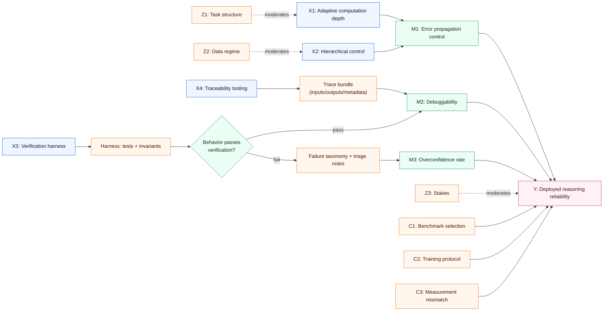
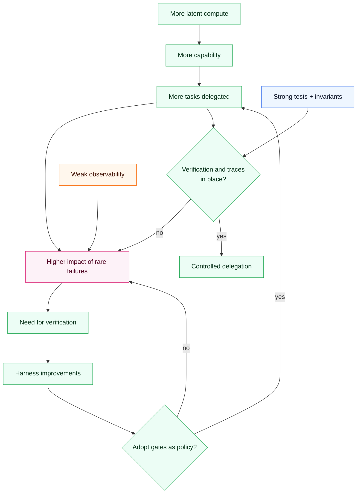
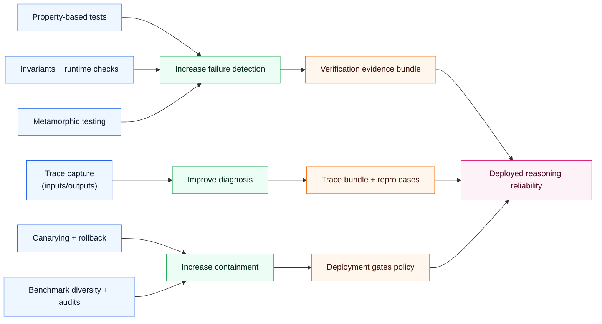

## Hook

Chain-of-thought made one thing obvious: today’s models often “think” only as far as they can afford to print tokens.

Hierarchical Reasoning Models (HRM) invert that tradeoff. They perform longer computations inside latent state — fewer narrated steps, more internal work.

That sounds like progress. It is.

But it also breaks a convenient illusion: when reasoning is latent, you lose the most accessible debugging artifact we had — a readable chain of intermediate claims.

The causal question this post answers is: **what mechanism gives HRM-like models algorithmic depth, and what verification machinery becomes mandatory once reasoning moves out of text?**

## Executive Summary

- HRM’s core mechanism is hierarchical recurrence: a slow high-level module sets strategy while a fast low-level module iterates and resets.
- This creates adaptive effective depth — more compute for harder problems — without relying on long token chains.
- The upside is algorithmic capability (e.g., hard puzzles) with fewer brittle language-step failures.
- The downside is auditability: latent steps are not human-readable, so “looks plausible” becomes an even weaker safety signal.
- The correct response is not nostalgia for chain-of-thought; it is **verification infrastructure**: tests, invariants, traces, and governance.
- Practically: model improvements and harness improvements are complements; without a harness, latent reasoning can become uninspectable confidence.

## The Causal Model

### Outcome (Y)

**Y: Reliable algorithmic reasoning in deployment** (correct solutions, stable behavior, and controllable failure modes).

### Key causes (X)

- **X1: Adaptive computation depth** (ability to allocate more internal steps when needed)
- **X2: Hierarchical control structure** (high-level planning + low-level execution)
- **X3: Verification harness strength** (tests, invariants, tooling)
- **X4: Interpretability / traceability tooling** (ability to inspect or constrain internal reasoning)

### Mediators (M)

- **M1: Error propagation control** (do small internal errors cascade?)
- **M2: Debuggability** (speed and quality of diagnosing failures)
- **M3: Overconfidence rate** (frequency of confident wrong answers)

### Moderators (Z)

- **Z1: Task structure** (puzzles vs open-ended language)
- **Z2: Data regime** (few-shot algorithm learning vs massive pretraining)
- **Z3: Stakes** (toy benchmarks vs high-stakes decisions)

### Confounders (C)

- **C1: Benchmark selection bias** (tasks chosen to favor a specific architecture)
- **C2: Training protocol differences** (optimization tricks can dominate architectural effects)
- **C3: Measurement mismatch** (benchmark score ≠ deployed utility)

### Counterfactual statements

- If HRM provided adaptive depth (X1↑) but verification stayed weak (X3↓), **overconfidence (M3) would rise** in deployment even if benchmark scores improved.
- If verification harness strength (X3↑) increased while keeping the base model constant, **deployed reliability (Y) would improve** by catching failure modes earlier.

## Causal Diagrams (Mermaid)

### A) Primary DAG

### B) Loop: capability without control

### C) Intervention levers

## Mechanism Walkthrough

### 1) Why standard Transformers struggle with deep algorithms

A fixed-depth architecture executes a bounded amount of computation per token. You can simulate longer reasoning by generating more tokens (externalized chain-of-thought), but that couples reasoning quality to language-generation stability.

### 2) HRM’s mechanism: hierarchical recurrence with resets

The key idea is not mystical. It is architectural:

- a **high-level module** updates slowly, maintaining global strategy;
- a **low-level module** iterates quickly to solve a subproblem;
- after low-level convergence, the low-level state is reset and the high-level state advances.

This creates a deep computation graph without printing intermediate text.

### 3) Latent reasoning shifts the verification burden

When intermediate steps are not visible, you lose a debugging channel. That does not make the system unsafe by default — but it makes “looks reasonable” even less diagnostic.

Verification must move from “read the chain” to “test the behavior.”

This is where harness design becomes causal: it changes which failures are detected early, which are quarantined, and which ship.

### 4) The complement: harness + governance

A robust deployment stack treats reasoning as a component with:

- unit tests (known cases)
- property-based tests (broad invariant checks)
- metamorphic tests (if we transform the input in a way that should preserve the answer, does it?)
- canary deployments and rollback

Those interventions reduce the impact of latent errors even when interpretability remains limited.

### Alternative mechanisms (weaker)

- **“Make the model explain itself after the fact.”** Weaker because post-hoc explanations can be rationalizations.
- **“Rely on benchmark score.”** Weaker because benchmark selection is confounded with real-world deployment distributions.

## Evidence & Uncertainty

### What we know

- Adaptive computation schemes often improve performance on tasks requiring variable-depth reasoning.
- Verification harnesses improve real-world reliability even without changing the model.

### What we strongly suspect

- Latent reasoning increases the importance of behavioral testing and governance.
- Gains on narrow puzzles may not translate directly to open-ended reasoning tasks.

### What we don’t know yet

- How HRM-like architectures scale when combined with large pretraining and broad domains.
- Which interpretability tools are most effective for latent multi-step computation.

### Falsification ideas

- Evaluate on benchmark suites designed to resist shortcut learning (distribution shifts, adversarial variants).
- Measure calibration: when the model is wrong, does it know it is wrong?

## Interventions & Leverage Points

1) **Invest in a verification harness**
- Expected effect: catches brittle failures early.
- Risks: engineering cost.
- Prereqs: test oracles and invariants.
- Measurement: defect escape rate; rollback frequency.

2) **Use metamorphic testing for reasoning tasks**
- Expected effect: detects shortcut strategies.
- Risks: harder to design transforms.
- Prereqs: domain-specific metamorphic relations.
- Measurement: failure rate under transformations.

3) **Capture traces at the system boundary**
- Expected effect: enables auditing without internal interpretability.
- Risks: privacy/logging overhead.
- Prereqs: structured logging.
- Measurement: percent of decisions with complete trace.

4) **Diversify evaluation**
- Expected effect: reduces benchmark confounding.
- Risks: slower iteration.
- Prereqs: curated suite.
- Measurement: performance variance across suites.

5) **Treat confidence as a product feature**
- Expected effect: reduces harm from overconfidence.
- Risks: users may dislike uncertainty.
- Prereqs: calibration methods.
- Measurement: overconfidence rate on known-hard sets.

## Practical Takeaways

- Latent reasoning increases capability and shifts verification responsibilities.
- Do not confuse “no chain-of-thought” with “no reasoning.”
- Benchmark wins are not deployment guarantees; audit transferability.
- Build tests that target invariants, not just examples.
- Prefer rollbacks and canaries over manual postmortems.
- Make confidence calibration and traceability non-negotiable for high-stakes use.
- Treat the harness as part of the causal system, not tooling trivia.

## Glossary

- **Metamorphic testing**: testing via input transformations with predictable output relations.
- **Adaptive computation depth**: allocating variable internal steps based on difficulty.
- **Calibration**: aligning confidence with actual correctness.
