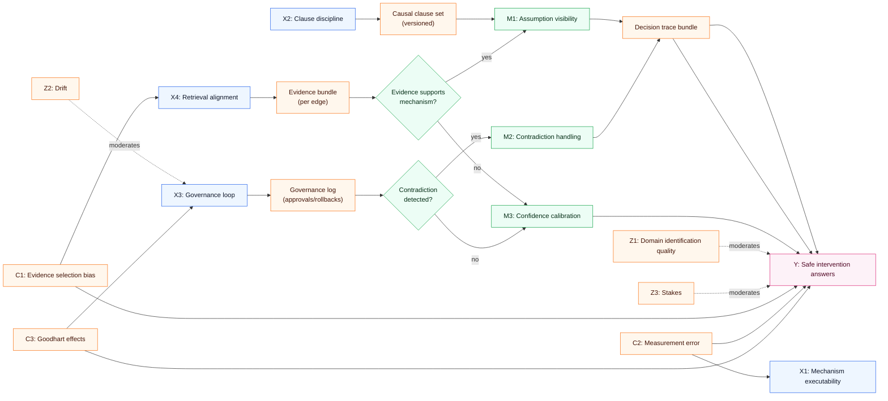
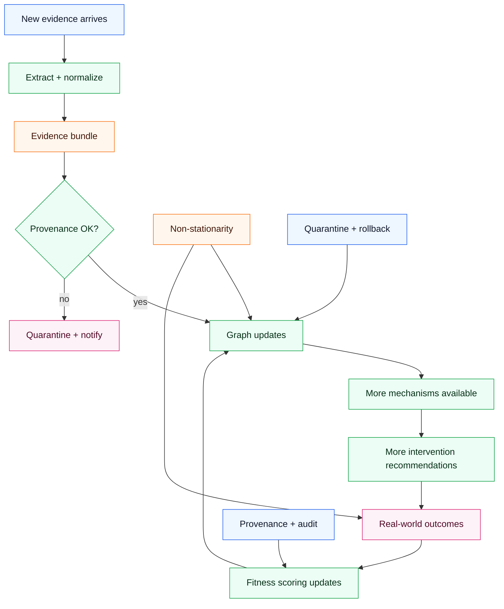
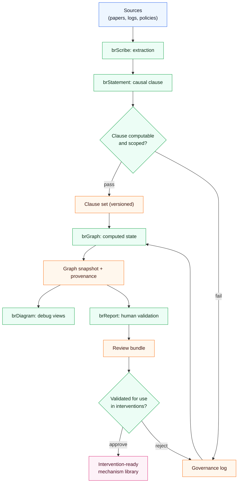

## Hook

Most “GraphRAG” demos succeed at one thing: pulling plausible supporting text into an LLM prompt.

That can be useful — until you ask the question you actually care about in operations, science, or safety-critical domains: **“What happens if we intervene?”**

Text retrieval can tell you what people wrote. It cannot, by itself, compute how a mechanism propagates, which assumptions are doing the work, or what evidence would falsify the claim.

The causal question this post answers is: **what structural changes turn GraphRAG into a system that can support interventions and counterfactuals without collapsing into storytelling?**

## Executive Summary

- “Causal GraphRAG” is not a marketing label; it requires explicit causal semantics, identification discipline, and validation loops.
- The minimum executable unit is not a paragraph — it is a structured causal clause: **Effect → Cause → Transfer → Affect**.
- A practical architecture must separate **execution** (compute mechanisms) from **governance** (score, version, rollback) to avoid rationalized errors.
- brModel’s layered framing (L0–L6) is useful because it forces a distinction between objective knowledge (L1–L4) and subjective optimization (L5–L6).
- Retrieval must return *graph-relevant mechanisms* (subgraphs/clauses), not merely semantically similar text.
- The “hard part” is not retrieval; it is the governance loop that keeps the graph from drifting into confident fiction.

## The Causal Model

### Outcome (Y)

**Y: Safe and useful intervention answers** (decisions that improve outcomes without overclaiming, with auditable evidence).

### Key causes (X)

- **X1: Mechanism executability** (are causal edges computable via Transfers?)
- **X2: Causal clause discipline** (are claims encoded as structured Effect→Cause→Transfer→Affect units?)
- **X3: Governance loop strength** (fitness scoring, provenance, versioning, rollback)
- **X4: Retrieval alignment** (does retrieval return mechanisms and constraints relevant to the query step?)

### Mediators (M)

- **M1: Assumption visibility** (can the system list what must be true for the answer?)
- **M2: Contradiction handling** (can it quarantine conflicts rather than average them?)
- **M3: Calibration of confidence** (does the system map fitness to uncertainty?)

### Moderators (Z)

- **Z1: Identification quality of the domain** (are interventions or quasi-interventions available?)
- **Z2: Non-stationarity / drift** (do mechanisms expire quickly?)
- **Z3: Stakes and liability** (how costly is a wrong “what-if”?)

### Confounders (C)

- **C1: Selection bias in evidence ingestion** (which papers/logs get captured?)
- **C2: Proxy measurement error** (latents measured via tasks/metrics)
- **C3: Incentive distortions (Goodhart)** (fitness becomes a target)

### Counterfactual statements

- If the system used the same documents but replaced text retrieval with **clause-level mechanism retrieval** (X4↑), then **assumption visibility (M1) would increase**, reducing overconfident interventions.
- If governance (X3↑) enabled rollback and quarantining, then **contradiction handling (M2) would improve**, increasing safety even with imperfect mechanisms.

## Causal Diagrams (Mermaid)

### A) Primary DAG

### B) System loop: drift vs governance

### C) Pipeline as a causal system

## Mechanism Walkthrough

### 1) Replace “documents” with executable primitives

The core failure of naive GraphRAG is category error: it treats a paragraph as if it were a mechanism. A paragraph can contain mechanisms, but it is not computable.

A mechanism-executable system encodes causal knowledge as primitives:

- **Elements** (what exists)
- **Metrics** (what is measured)
- **Causes** (what drives change)
- **Transfers** (how change propagates; where math/logic lives)

A **Transfer** can be deterministic or probabilistic, but it must be runnable.

### 2) Make causal clauses the retrieval unit

A brModel-style clause is a compact execution object:

- **Effect**: triggering conditions
- **Cause**: the causal logic block
- **Transfer**: the transformation/propagation
- **Affect**: the target state change

Retrieval should return one or more clauses (and their subgraphs), not a text blob.

### 3) Separate execution from governance

Execution answers: “Given these assumptions and this clause set, what follows?”

Governance answers: “Should we trust and apply these clauses?”

Without separation, the system tends to:

- merge contradictions into fluent summaries,
- drift under selective evidence,
- become un-auditable (“the model said so”).

Governance provides provenance, scoring, quarantine, rollback, and policy constraints.

### 4) Treat measurement as part of causality

In many domains, the causal variables are latent. You only observe proxies.

A mechanism-executable GraphRAG must model measurement Transfers (construct → task → metric), and explicitly track proxy risk. Otherwise, the system will build “causal” edges on top of measurement noise.

### Alternative mechanisms (weaker)

- **“Just add a knowledge graph and traverse it.”** Weaker because edge types are often correlational; traversal does not guarantee causal meaning.
- **“Let the LLM do causal reasoning from retrieved text.”** Weaker because it hides assumptions and cannot execute stable Transfers.

## Evidence & Uncertainty

### What we know

- Graph retrieval improves factual grounding when documents are consistent and the query is descriptive.
- Explicit structure improves auditability and reduces silent failure modes.

### What we strongly suspect

- Mechanism executability is the biggest step-change for intervention questions.
- Governance is the difference between “demo” and “system.”

### What we don’t know yet

- Which evaluation benchmarks best measure counterfactual correctness across domains.
- How to price the knowledge engineering overhead vs operational benefit.

### Falsification ideas

- Hold documents constant; compare “text GraphRAG” vs “clause GraphRAG” on intervention consistency tests.
- Stress-test with contradictory sources and measure quarantine/rollback behavior.

## Interventions & Leverage Points

1) **Define a minimal EMCT schema**
- Effect: forces mechanism discipline.
- Risk: initial overhead.
- Measurement: percent of knowledge encoded as executable clauses.

2) **Implement provenance + versioning early**
- Effect: makes rollback possible.
- Risk: extra engineering.
- Measurement: mean time to quarantine a bad clause.

3) **Add contradiction policy**
- Effect: avoids averaging conflicts.
- Risk: reduced coverage.
- Measurement: contradiction incidence and resolution time.

4) **Build domain-specific Transfer library**
- Effect: reusability and replication.
- Risk: theory lock-in.
- Measurement: fraction of interventions answered by reusable Transfers.

5) **Separate L0/L5/L6 from L1–L4**
- Effect: reduces “optimization masquerading as truth.”
- Risk: conceptual complexity.
- Measurement: audit success rate for intervention outputs.

## Practical Takeaways

- If you cannot execute a mechanism, you cannot safely answer “what if.”
- Retrieve clauses/subgraphs, not documents.
- Treat measurement as causal infrastructure, not an afterthought.
- Build rollback and quarantine before scaling ingestion.
- Use diagrams as debug artifacts, not as decoration.
- Score knowledge by fitness against outcomes, not by rhetorical plausibility.
- Keep subjective optimization (prescriptions) distinct from objective mechanism state.

## Glossary

- **GraphRAG**: retrieval-augmented generation with a graph retrieval layer.
- **Transfer**: an executable mechanism that maps inputs to outputs.
- **Governance loop**: scoring, curation, quarantine, and rollback of knowledge.
