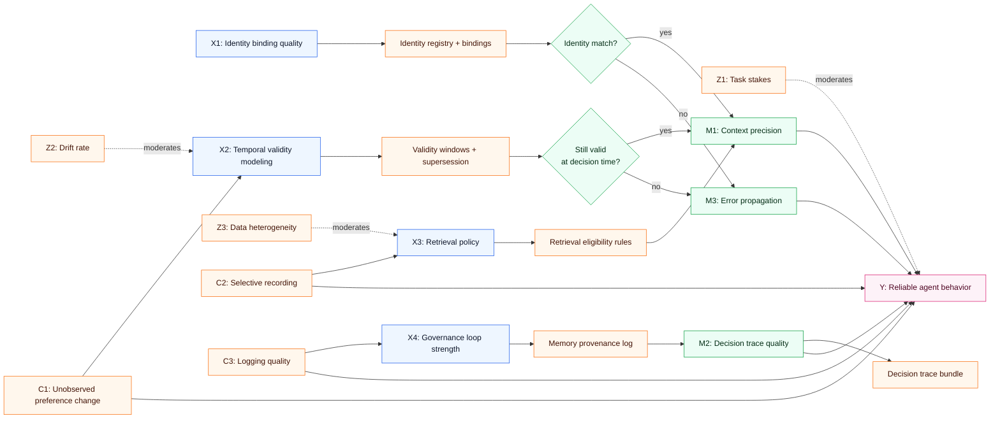
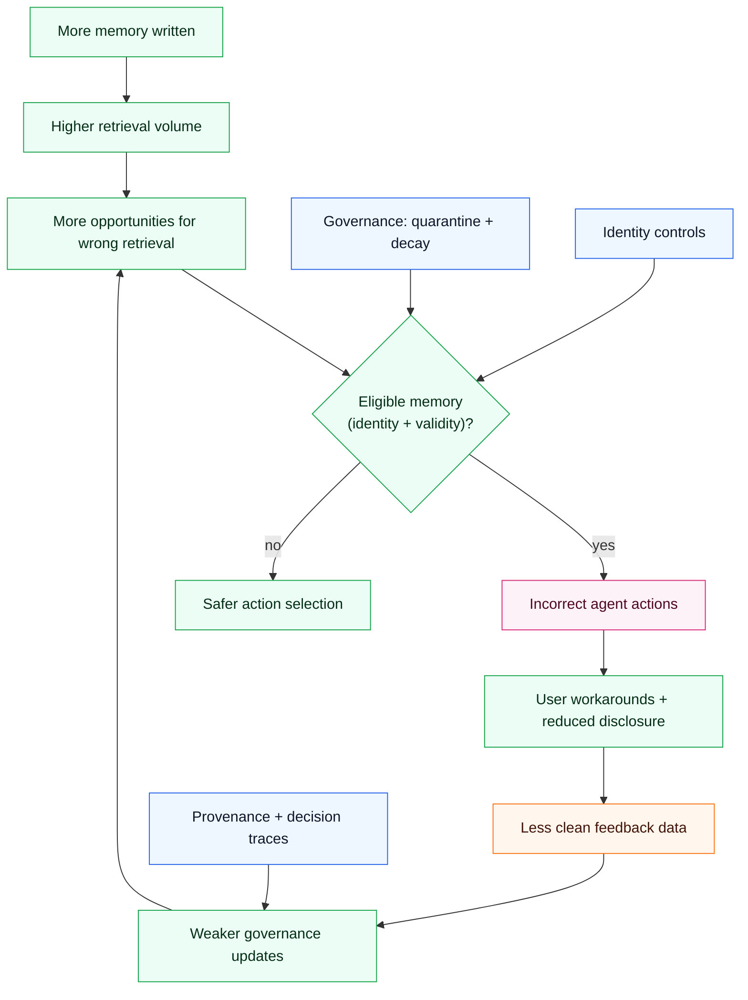
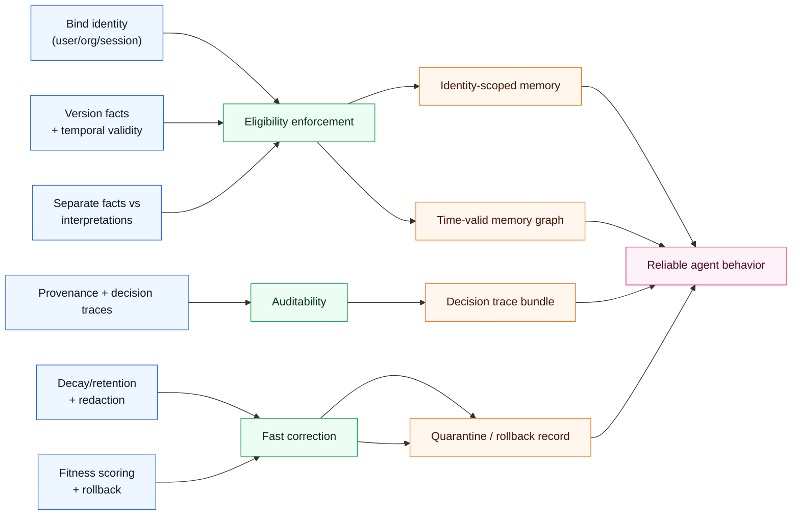

## Hook

Most “agent memory” failures are not model failures. They are systems failures.

The common pattern looks deceptively simple: you add a memory store, retrieval improves, users feel personalization—then a week later the agent starts making confident, wrong moves based on stale preferences, mis-linked identities, or quietly corrupted facts.

The causal question this post answers is: **what *mechanisms* turn memory from an asset into a liability—and what governance makes memory safe enough to scale?**

## Executive Summary

- “More context” is not a monotonic improvement; after a threshold, extra memory increases the probability of retrieving *the wrong* evidence.
- Identity is a causal variable: a memory system that cannot reliably bind facts to the right actor will create cross-user leakage and irreversible trust loss.
- Temporal validity is not metadata—it is part of the mechanism. Stale facts behave like latent confounders that bias downstream decisions.
- Pure similarity retrieval is structurally blind to causal status (correlation vs cause) and to evidence strength; governance must compensate.
- A workable memory system needs four separations: **facts vs interpretations**, **current vs historical**, **personal vs shared**, **execution vs governance**.
- The highest-leverage interventions are boring: versioning, provenance, decay policies, and audit trails beat clever embeddings.

## The Causal Model

### Outcome (Y)

**Y: Reliable agent behavior over time** (accuracy, consistency, user trust, and safety in real workflows).

### Key causes (X)

- **X1: Identity binding quality** (are memories attached to the correct user/session/organization?)
- **X2: Temporal validity modeling** (can the system represent “this used to be true”?)
- **X3: Retrieval policy** (what gets surfaced to the model and when?)
- **X4: Governance loop strength** (how quickly wrong memories are detected, downgraded, or quarantined)

### Mediators (M)

- **M1: Context precision** (signal-to-noise of retrieved context)
- **M2: Decision trace quality** (ability to explain “why this output happened”)
- **M3: Error propagation** (how mistakes compound across turns)

### Moderators (Z)

- **Z1: Task stakes** (support chat vs clinical ops vs security response)
- **Z2: Drift rate** (how fast the underlying world changes)
- **Z3: Data heterogeneity** (text + structured records + telemetry)

### Confounders (C)

- **C1: User behavior changes** (unobserved shifts in preferences)
- **C2: Selective recording** (what gets written to memory is not random)
- **C3: Logging quality** (missingness correlated with incidents)

### Measurement / proxy risks

- “Personalization accuracy” can be inflated by short-term recency.
- Low complaint rates can mask silent failures (users disengage).
- Retrieval relevance scores can correlate with confidence without correlating with truth.

### Counterfactual statements

- If the same agent had **strong identity binding** (X1↑) but unchanged retrieval, **cross-user hallucinations would drop** even if overall retrieval volume stayed constant.
- If the system enforced **time-bounded validity** (X2↑) with decay, then for the same total memory size, the probability of acting on stale facts would be lower and trust would decay more slowly.

## Causal Diagrams (Mermaid)

### A) Primary DAG

### B) Feedback loop / system dynamics

### C) Intervention levers

## Mechanism Walkthrough

### Mechanism 1: Identity failures create irreversible trust loss

If “who this memory belongs to” is wrong, then downstream correctness becomes unfixable. The agent may still sound coherent, but its decisions target the wrong constraints.

Typical root causes:

- weak user identifiers (email change, shared devices, multiple accounts)
- multi-tenant leakage (shared “team memory” without access boundaries)
- entity resolution errors (two people merged; one person split into two)

Why this is causal: identity binding changes which memories are even *eligible* to be retrieved.

### Mechanism 2: Stale facts behave like confounders

A memory store that records “preferences” or “policies” without validity windows creates a hidden variable: “was this still true at decision time?”

If the system cannot model that variable, retrieval will produce facts that correlate with an entity but are no longer causally relevant. The result is biased action selection.

### Mechanism 3: Similarity retrieval amplifies correlation

Most retrieval stacks optimize for semantic similarity, not causal relevance.

This means:

- edges that are merely associated can outrank mechanistic edges,
- sensational or frequent snippets get retrieved disproportionately,
- confidence can rise because the agent sees “supporting text,” not because the text is true.

### Mechanism 4: Governance is the brake—and it must be a separate loop

Governance is the part of the system that:

- audits provenance,
- scores evidence fitness,
- disables or quarantines low-fitness memories,
- supports rollback.

If governance is fused into generation, the model will rationalize rather than correct.

### Alternative mechanisms (weaker)

- **“Bigger context windows will solve memory.”** Weaker because it does not address identity binding or temporal validity; it mostly increases retrieval volume.
- **“Better embeddings will solve retrieval.”** Weaker because embeddings do not encode causal status, provenance, or validity windows by default.

## Evidence & Uncertainty

### What we know

- Memory systems improve short-term coherence and personalization when identity is correct and drift is low.
- Systems that track provenance and validity can explain and correct errors faster.

### What we strongly suspect

- Most “memory regressions” are governance failures: the system lacks downgrade/rollback paths.
- Temporal modeling (valid-from/valid-to, “superseded by”) is a first-order requirement for safe personalization.

### What we don’t know yet

- Which decay policies are best for different domains (support vs finance vs healthcare).
- How to benchmark “identity binding quality” consistently across toolchains.

### Falsification ideas

- Run an A/B where only temporal validity is added (validity windows + decay) while the LLM and embeddings remain constant; measure reduction in stale-action incidents.
- Inject controlled identity collisions (two synthetic users with overlapping attributes) and measure cross-user contamination rates.

### What data would change conclusions

- Evidence that large-context models with no governance maintain long-run trust and correctness in high-drift domains.
- Evidence that similarity-only retrieval can reliably separate causal from correlational edges without additional structure.

## Interventions & Leverage Points

1) **Identity as a first-class boundary**
- Expected effect: reduces catastrophic cross-user mistakes.
- Risks: friction for users; onboarding complexity.
- Prerequisites: stable user/org identifiers; RBAC.
- Measurement: cross-user leakage tests; audit sampling.

2) **Temporal validity and supersession**
- Expected effect: reduces stale retrieval and contradictory prompts.
- Risks: incorrect invalidation can hide still-true facts.
- Prerequisites: storage supports valid-from/valid-to; conflict resolution.
- Measurement: stale-fact incidence; “contradiction rate” in retrieved context.

3) **Facts vs interpretations separation**
- Expected effect: reduces memoized speculation.
- Risks: extra engineering overhead.
- Prerequisites: schema for fact types; provenance requirements.
- Measurement: proportion of retrieved context tagged as “observation” vs “inference.”

4) **Decision traces (PROV-style provenance)**
- Expected effect: faster debugging; easier governance.
- Risks: logs can leak sensitive data.
- Prerequisites: structured tracing pipeline.
- Measurement: mean time to root cause; ability to reproduce outputs.

5) **Decay + retention policies**
- Expected effect: reduces accumulation of low-signal memory.
- Risks: over-decay can erase long-horizon constraints.
- Prerequisites: domain-specific retention rules.
- Measurement: context precision vs memory size; user trust surveys.

6) **Fitness scoring + rollback**
- Expected effect: converts memory into an improvable system.
- Risks: gaming; Goodhart effects.
- Prerequisites: explicit evaluation metrics; quarantine process.
- Measurement: survival curves of edges; rollback frequency.

## Practical Takeaways

- Treat identity binding as a safety feature, not a UX feature.
- Model time explicitly: “valid then” is not “valid now.”
- Assume similarity retrieval will surface correlation; add causal structure or policies.
- Build a governance loop that can downgrade, quarantine, and roll back.
- Separate observations from inferences before you store them.
- Add decision traces early; they are your future debugging interface.
- Use decay to protect context precision—more memory is not automatically better.
- Benchmark failure modes (identity collisions, drift, stale facts) deliberately.

## Glossary

- **Temporal validity:** representing when a fact is true (valid-from/valid-to).
- **Decision trace:** a structured record of evidence and reasoning steps that produced an output.
- **Governance loop:** the mechanism that evaluates, updates, quarantines, and rolls back knowledge over time.
