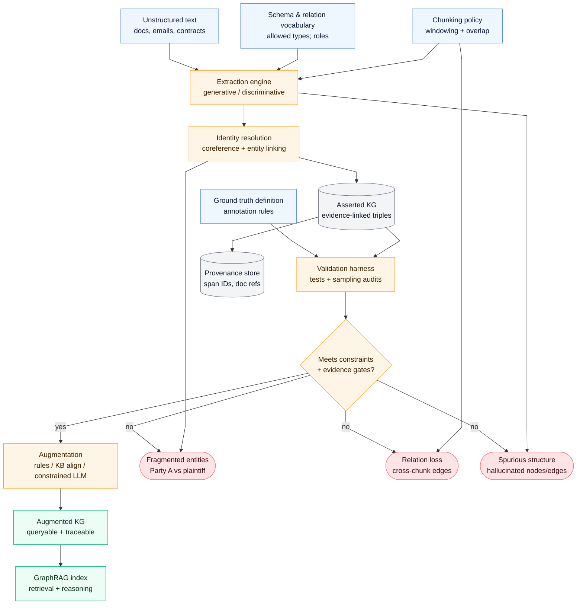
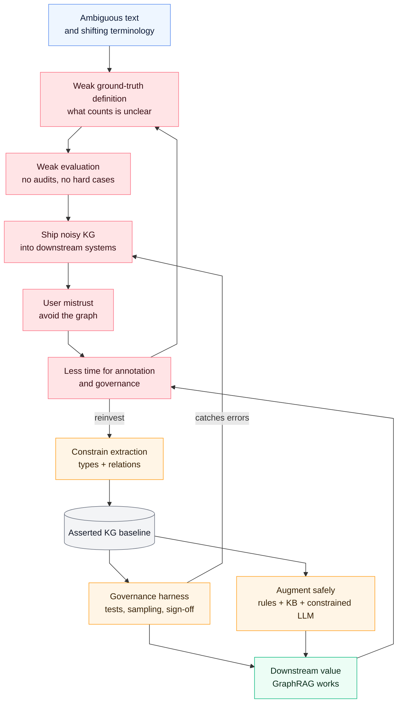
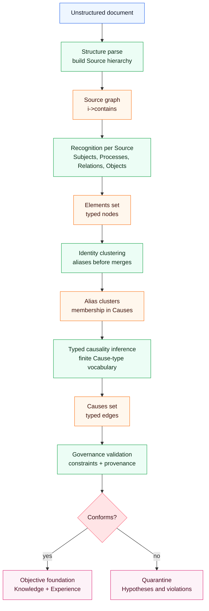

## Hook

A language model can explain a contract clause flawlessly—then turn the same paragraph into a broken knowledge graph: duplicate entities, missing links, and “plausible” relations that were never stated. The failure is not mysterious. It is structural.

> The question is simple: **what causes knowledge graph (KG) extraction to fail in production, even when the model looks competent in a chat window?** 

> And the practical corollary: **what pipeline choices make success more likely, without hand-waving “just prompt better”?**

## Executive Summary

- Unstructured text is ambiguous by default; extraction fails when we mistake *fluency* for *structural reliability*.
- The core breakpoints are predictable: coreference/identity fragmentation, compositional entities, chunking-induced relation loss, and hallucination under global constraints.
- “Asserted knowledge graphs” (facts explicitly supported by the source) are not optional—they are the audit baseline that makes debugging and safe augmentation possible.
- Multi-stage pipelines (NER → relation extraction → coreference) compound errors; end-to-end approaches can reduce compounding but increase governance burden.
- The right role for LLMs is often **augmentation under constraints**, not unconstrained ground-truth extraction.
- The real bottleneck is frequently *ground truth definition and measurement*, not model choice.
- Surprising implication: you can improve KG quality more by tightening schemas, identity rules, and evidence gates than by upgrading to a larger model.

## The Causal Model

**Outcome (Y):** A production knowledge graph that is *structurally usable* for downstream tasks (GraphRAG, analytics, compliance, reasoning).

**Key causes (X):**

- $X_1$ **Extraction architecture** (generative vs discriminative; end-to-end vs pipeline)
- $X_2$ **Identity resolution strength** (coreference, canonicalization, entity linking)
- $X_3$ **Constraint tightness** (schema, relation vocabulary, allowable entity types)
- $X_4$ **Chunking policy** (context window strategy, cross-chunk linking)
- $X_5$ **Evaluation rigor** (gold definition, unit tests, sampling/audits)

**Mediators (M):**

- $M_1$ Entity fragmentation (duplicates for the same real-world entity)
- $M_2$ Relation loss (missing edges due to context truncation)
- $M_3$ Spurious structure (hallucinated entities/edges)
- $M_4$ Ontology flattening (compositional entities represented incorrectly)

**Moderators (Z):**

- $Z_1$ Domain ambiguity / reference style (e.g., legal “Party A”, “the plaintiff”)
- $Z_2$ Downstream tolerance for errors (classification vs high-stakes compliance)

**Confounders (C):**

- $C_1$ Document quality and formatting
- $C_2$ Annotation guidelines (what “counts” as an entity/relation)

**Measurement/proxy risks:**

- “Accuracy” measured on easy, short snippets will overestimate performance on long documents.
- Graph “connectivity” can be gamed by adding generic edges; it is not the same as correctness.

**Counterfactuals:**

- If we hold the model constant but add strict schemas, entity canonicalization, and evidence gates, then spurious structure ($M_3$) decreases and usability ($Y$) increases.
- If we hold schemas constant but reduce context via aggressive chunking, then relation loss ($M_2$) increases and usability ($Y$) decreases—unless we also add cross-chunk linking and provenance.

## Causal Diagrams (Mermaid)

### A) Primary DAG: Why extraction breaks

### B) Feedback loop: How teams drift into failure

## Mechanism Walkthrough

1) **Identity fractures first.** Real documents reference the same entity with different surface forms (“Party A”, “the plaintiff”, “the aforementioned party”). If identity resolution is weak, you do not get one node—you get a cluster of duplicates.

2) **Chunking trades hallucinations for broken edges.** Small chunks reduce some generative drift, but they also sever cross-sentence relations. Without explicit cross-chunk linking or provenance, the graph loses the very structure it was built to capture.

3) **Compositional entities expose ontology debt.** Terms like “City of Mexico” are not only strings; they encode structure (city vs country vs administrative region). If the schema is flat or unclear, the model cannot be “correct” in a stable sense.

4) **Pipelines compound errors.** A pipeline that is 90% accurate at each stage quickly degrades (e.g., $0.9 \times 0.9 = 0.81$ before coreference errors). End-to-end generation can reduce compounding—but then governance must tighten.

5) **Augmentation is where LLMs can shine—if constrained.** Adding taxonomies (“is-a”), rule-based inferences, link prediction, and context/provenance can make graphs more useful. But augmentation without gates recreates the hallucination problem at a larger scale.

### Alternative mechanisms (weaker)

- **“Just use a bigger model.”** Larger models may reduce some local mistakes, but they do not resolve schema ambiguity, weak ground-truth definitions, or missing governance.
- **“Just chunk smaller.”** Smaller chunks can reduce some hallucinations but increase relation loss and duplication unless you add identity + linking + provenance mechanisms.

## Evidence & Uncertainty

### What we know

- Generative KG extraction struggles with identity/coreference and global consistency in realistic documents.
- Chunking introduces a tradeoff: smaller context can reduce some errors while losing relations that span sentences/paragraphs.
- An asserted-only baseline is essential for auditability and debugging.

### What we strongly suspect

- The dominant failure mode in production is often *measurement*: teams lack a stable definition of ground truth and therefore cannot iterate effectively.
- Constraining relation vocabularies and adding provenance often yields bigger gains than switching models.

### What we don’t know yet

- How much end-to-end extraction improves *net* reliability after you include governance cost and real-world distribution shift.
- Which augmentation mix (rules vs link prediction vs constrained LLM) dominates by domain and task.

**Falsification ideas:**

- Run an ablation: keep the same model and prompts, but toggle (a) strict schema enforcement, (b) canonical entity linking, (c) provenance, (d) augmentation constraints. Measure structural usability and audit error rates.
- Add “hard cases” to evaluation: heavy coreference, long-range relations, compositional entities, and adversarial ambiguity.

## Interventions & Leverage Points

1) **Start with an asserted graph (baseline).**
   - Expected effect: separates “supported by text” from “inferred/augmented”.
   - Risks: coverage initially looks low; stakeholders may misread this as failure.
   - Prerequisites: clear schema and annotation guidelines.
   - Measurement: audit agreement rate; percentage of triples with direct evidence links.

2) **Constrain the extraction contract.**
   - Expected effect: reduces spurious relations and type drift.
   - Risks: overly rigid schemas miss real relations.
   - Prerequisites: versioned schema + relation vocabulary.
   - Measurement: invalid-type rate; relation-vocab violation rate.

3) **Make identity resolution a first-class product feature.**
   - Expected effect: reduces fragmentation, boosts graph traversability.
   - Risks: over-merge distinct entities.
   - Prerequisites: canonical IDs, alias tables, linking model/rules.
   - Measurement: duplicate-rate, merge precision/recall on sampled cases.

4) **Add provenance as structure (or metadata) from day one.**
   - Expected effect: makes debugging and governance tractable.
   - Risks: storage/complexity overhead.
   - Prerequisites: span IDs and document references.
   - Measurement: % of nodes/edges traceable to source spans.

5) **Use LLMs mainly for constrained augmentation.**
   - Expected effect: increases connectivity and usefulness with bounded risk.
   - Risks: hallucination if unconstrained; Goodhart on connectivity metrics.
   - Prerequisites: evidence gates, allowed relation subsets.
   - Measurement: augmentation acceptance rate; hallucination rate in audits.

## How We Would Do This (brModel Playbook)

The goal is not “extract triples”. The goal is to build a **governable cognitive structure** that survives ambiguity, synonym drift, and model churn.

In brModel terms, we reduce the world into a bounded vocabulary:

- **Schema layer (abstract):** Element, Metric, Cause, Transfer
- **Domain-facing DSL (interfaces):** Source, Subject, Process, Relation, Object

Operationally, we work with two coupled products:

1) **Elements** — the typed nodes we accept into memory (Source/Subject/Process/Relation/Object)
2) **Causes** — typed, directional edges between Elements (the system’s causal grammar)

### Step 1: Build a structure graph first (Sources only)

We begin by breaking a document into a *context scaffold*.

- Each document becomes a **Source** node.
- Each chapter/section/subsection becomes a nested **Source** node.
- The hierarchy is encoded via `i->contains` edges.

This matters because most KG extraction failures are context failures. A chapter boundary is not just formatting; it is often a semantic regime change.

Deliverable after Step 1: a **Source hierarchy graph** that is complete even if we have not recognized a single domain entity yet.

### Step 2: Recognize domain Elements inside each Source (in-context)

For each Source (section) we run recognition in context:

- Identify **Subjects** (actors)
- Identify **Processes** (events/transformations)
- Identify **Relations** (contracts/interfaces/constraints)
- Identify **Objects** (artifacts/resources)

Critically, we do not force early global merges. We allow provisional duplicates, because premature canonicalization creates silent corruption.

Deliverable after Step 2: a graph containing a *grey scaffold* (Sources) plus *colored nodes* (Subjects/Processes/Relations/Objects) attached to their Sources.

### Step 3: Treat synonymy as a first-class object (cluster before you merge)

When a text uses “Party A”, “the plaintiff”, and “the aforementioned party”, we represent it as a controlled identity problem:

- We keep a **canonical candidate** Element (e.g., a Subject representing the real organization).
- We keep **surface forms** as subordinate variants clustered under that candidate.

Practically, the clustering lives in the **Causes** component (as typed membership links such as `s->contains`, `o->contains`, and similar “Parent/Subs” relations), while the **Elements** component holds the eventual canonical nodes.

Only after clustering has enough evidence do we *merge* into a single shared name. Until then, we preserve ambiguity rather than overwrite it.

### Step 4: Add typed causal links only after the schema exists

Once the structure scaffold and the recognized Elements exist, we start searching for **typed links** between them.

We do not allow an open-ended edge vocabulary. We use a constrained DSL where each edge is one of a finite set of “Cause types” (examples below), which makes auditing and constraint validation possible.

- Subject → Process: `s->p Performs`
- Subject → Object: `s->o Controls`, `s->o Owns`
- Subject → Relation: `s->r Sends`, `s->r Receives`
- Process → Object: `p->o Produces`, `p->o Consumes`
- Process → Relation: `p->r Develops`, `p->r Realizes`
- Relation → Object: `r->o Supply`, `r->o Request`
- Object → Relation: `o->r Requests`

This sequencing is deliberate: if you try to infer relations before you have stable Elements, you get exactly the “plausible but wrong” structure that breaks KGs in production.

### Step 5: Isolate layers: objective facts vs subjective hypotheses

We separate memory into layers so that *uncertainty does not pollute the foundation*.

- **Objective foundation**
   - Knowledge layer: reusable types and patterns (concepts)
   - Experience layer: concrete instances and evidence-backed observations
- **Subjective layers**
   - Prescription: proposed plans/workflows optimized for goals
   - Prediction: hypotheses, forecasts, speculative judgments

The rule is simple:

- Facts and evidence-backed instances can live in the objective foundation.
- Hypotheses can exist, but they must remain clearly tagged and isolated until validated by constraints, audits, and (where required) experts.

This is the mechanism that enables “crystallization”: the system can gradually turn repeated, validated Experience into stable Knowledge, while quarantining speculation.

## Concrete Implementation Guide (From Text to Governable Graph)

Below is how we would execute this end-to-end as a repeatable pipeline.

### 0) Inputs

- A document stream (PDFs, emails, web pages)
- A schema profile (allowed element types, allowed cause types)
- Constraint rules (what is allowed vs blocked; what requires provenance)

### 1) Structural parse pass (Sources)

1. Create a root Source for the document.
2. Create nested Sources for each section.
3. Emit `i->contains` edges to encode hierarchy.
4. Store provenance for each Source: document ID, version, offsets.

### 2) Recognition pass per Source (Elements)

For each Source node:

1. Extract candidate Subjects, Processes, Relations, Objects.
2. Attach them to the Source context (either as metadata or via explicit context edges).
3. Record span-level provenance for every extracted node.

### 3) Identity clustering pass (Causes for alias membership)

1. For each new Element, check for candidate equivalence clusters.
2. If uncertain, keep it separate and connect it as a subordinate variant (do not merge).
3. Maintain a canonical candidate per cluster, but treat it as revisable.

### 4) Causality pass (typed links only)

1. Propose candidate edges only using the finite Cause-type vocabulary.
2. Require evidence support for each edge: which sentence/paragraph implies it.
3. If an edge is plausible but unsupported, keep it in the subjective layer (Prediction), not in the objective foundation.

### 5) Governance pass (constraints + reports)

1. Validate graph updates against constraint rules (shape, allowed edge types, provenance requirements).
2. Produce a validation report: what failed, what rule, which node/edge.
3. Either commit into objective foundation or quarantine.

### 6) Output products

- A versioned **Elements** set (typed nodes)
- A versioned **Causes** set (typed hyper-edges)
- A provenance bundle (traceability)
- A governance log (decisions and violations)

### Diagram: Our extraction pipeline in brModel terms

## Practical Takeaways

- Build a **structure graph first**: parse the document into a Source hierarchy (`i->contains`) before you attempt entity or relation extraction.
- Treat KG extraction as a **system pipeline**, not a prompt: separate parsing, recognition, identity clustering, typed-link inference, and governance into explicit stages.
- Define **ground truth** before you pick a model: what counts as a Subject/Process/Relation/Object, what evidence is required, and what “correct” means for your downstream task.
- Separate **asserted vs augmented** from day one: keep an evidence-backed baseline, then add inference/KB alignment under constraints.
- Make **identity resolution** a first-class product feature: cluster aliases and surface forms before you merge; preserve ambiguity when evidence is insufficient.
- Constrain the edge vocabulary to **typed Causes**: prefer a finite DSL (e.g., `s->p Performs`, `p->o Produces`) over open-ended “any relation,” so constraints and audits can actually work.
- Treat chunking as a **budget allocation problem**: smaller chunks reduce some drift but increase relation loss; plan cross-chunk linking and provenance rather than hoping overlap fixes it.
- Record provenance at the smallest useful unit (span/section): every node and edge should be traceable to a Source location, version, and extraction method.
- Isolate **objective vs subjective layers**: keep evidence-backed Knowledge/Experience separate from hypotheses (Prediction/Prescription) until validated by constraints and experts.
- Evaluate on **hard cases** and run ablations: heavy coreference, long-range relations, compositional entities, contradictions, and distribution shift; measure both correctness and auditability.

### Glossary

- **Asserted KG:** A graph containing only facts explicitly supported by the source text.
- **Augmented KG:** An asserted KG plus inferred or externally aligned entities/relations.
- **Provenance:** Links from nodes/edges back to source spans (document, paragraph, sentence).
- **GraphRAG:** Retrieval-augmented generation that uses graph structure for retrieval/aggregation.
