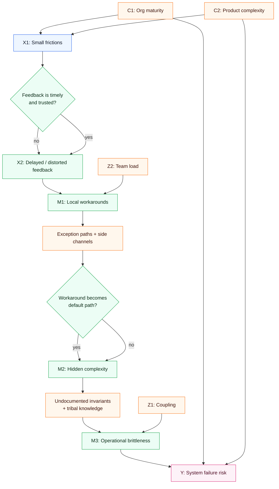
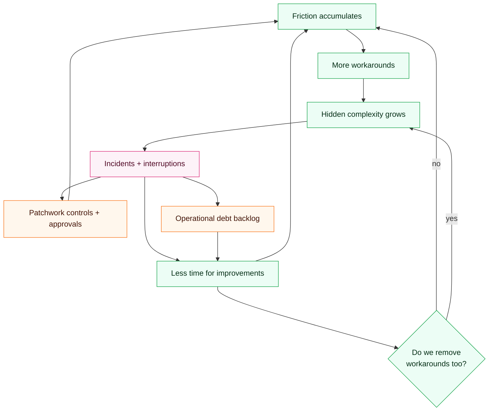

Small frictions rarely look like root causes.

A missing field in a form. A weekly handoff that becomes a daily Slack thread. A build that takes five minutes longer than it should. None of these sound like “system failure.” Yet these are often the first dominoes in a sequence that ends with outages, churn, or an org that can no longer ship reliably.

The causal question is simple: *how do minor, local inefficiencies turn into global breakdowns?* The useful answer is not “because everything is complex,” but a mechanism you can test, measure, and interrupt.

## Executive Summary

- Small frictions matter less for their direct cost and more for how they **distort feedback**.
- When feedback is delayed, teams compensate with **workarounds** that feel rational locally.
- Workarounds accumulate into **hidden complexity**: undocumented states, exceptions, and brittle dependencies.
- Hidden complexity raises the probability that routine changes trigger **nonlinear failure modes**.
- Surprising implication: removing frictions sometimes fails because it doesn’t remove the *workarounds* already embedded in the system.
- The best early-warning signals are often **proxy measures** (queue age, retry rates, “unknown unknown” tickets), not incident counts.

## The Causal Model

### Variables

**Outcome (Y)**
- $Y$: system failure risk (incidents, downtime, missed deliveries, severe quality regressions).

**Key causes (X)**
- $X_1$: small frictions (micro-delays, tool friction, policy overhead, coordination overhead).
- $X_2$: feedback delay (time between action and reliable signal).

**Mediators (M)**
- $M_1$: local workarounds (manual steps, side channels, bypasses, retries).
- $M_2$: hidden complexity (implicit dependencies, undocumented invariants, exception paths).
- $M_3$: operational brittleness (high coupling, low observability, fragile runbooks).

**Moderators (Z)**
- $Z_1$: system coupling (tight vs loose coupling).
- $Z_2$: team load (on-call burden, cognitive load, multitasking).
- $Z_3$: change velocity (deployment frequency, incident tempo).

**Confounders (C)**
- $C_1$: organizational maturity (process/ownership clarity) impacts both friction levels and failure risk.
- $C_2$: product complexity (feature surface area) increases both friction and brittleness.
- $C_3$: staffing/skills mix affects workaround quality and observability.

### Measurement / Proxy Risks

- “Friction” is often proxied by cycle time or throughput, but those can be confounded by scope.
- “Failure risk” measured as incident count underestimates risk when detection is weak; under-reporting is common.
- Workarounds are frequently invisible unless you instrument them (e.g., retry storms, manual approvals, spreadsheet-driven state).

### Counterfactuals

- If we hold confounders constant and reduce small frictions ($X_1$) *without* changing anything else, then we should observe a reduction in workaround formation ($M_1$) and, downstream, lower brittleness ($M_3$) and failure risk ($Y$).
- If we hold $X_1$ constant but shorten feedback delay ($X_2$)—for example by improving observability—then the same frictions should produce fewer risky workarounds and a lower probability of cascading failures.

## Causal Diagrams (Mermaid)

### A) Primary DAG

### B) Feedback Loop / System Dynamics View

## Mechanism Walkthrough

1) **A small friction appears**

A friction can be a tool that is slow, a permission gate, a flaky test, or a policy that requires a manual approval. Individually, these costs seem tolerable.

2) **Feedback gets delayed or distorted**

When doing the “right” thing is slow, people stop waiting for clean signals. They act on partial information. They avoid instrumentation because it takes time. They ship changes with less certainty about outcomes.

3) **Local workarounds form**

Workarounds are locally rational: copy/paste a config instead of automating, bypass the ticketing system in a hurry, rerun the job until it passes, add an exception “just for this case.”

4) **Workarounds become hidden complexity**

The workaround is rarely documented as a first-class system behavior. Over time it becomes an implicit dependency: “It only works if you also update the spreadsheet,” or “We always redeploy twice.”

5) **Hidden complexity becomes brittleness**

Brittleness is the system-level property: small changes trigger big breaks. The system is now sensitive to unobserved state and relies on tribal knowledge.

6) **Failure cascades**

Incidents cost attention. Attention scarcity prevents the deeper fixes. The next friction compounds with the last.

### Two Alternative Mechanisms (and why they’re weaker)

**Alternative 1: “Frictions cause failure by slowing delivery only.”**
- Weaker because delivery speed alone does not explain *nonlinear* failure cascades; many slow systems are stable. The key is how frictions change behavior under uncertainty, not just throughput.

**Alternative 2: “Failure is mostly caused by bad engineers or careless changes.”**
- Weaker because it does not predict why failure rate increases as workaround density increases, even with the same people. It also fails to account for learning constraints: teams adapt to frictions with shortcuts regardless of talent.

## Evidence & Uncertainty

### What we know

- Frictions can introduce decision latency and coordination overhead.
- Workarounds are common responses to delayed feedback in socio-technical systems.

### What we strongly suspect

- The primary danger is not the friction itself but the **workaround layer** it induces.
- Systems with higher coupling and higher cognitive load amplify the friction → workaround → brittleness pathway.

### What we don’t know yet

- Which frictions are *causal bottlenecks* versus mere annoyances.
- The threshold where workaround density turns into a regime shift (from resilient to brittle).

### Falsification ideas

- If workaround inventory decreases but failure risk does not, then brittleness may be driven by coupling or external complexity rather than workaround accumulation.
- If feedback delay is reduced (better monitoring, faster incident detection) yet workaround formation remains unchanged, then incentives or governance may be the dominant mechanism.

## Interventions & Leverage Points

1) **Shorten feedback loops (observability first)**
- Expected effect: reduces distorted decisions under uncertainty; lowers workaround need.
- Risks: alert fatigue; instrumentation debt.
- Prerequisites: ownership, on-call rotation, baseline SLOs.
- Measurement plan: time-to-detect, time-to-diagnose, percent of changes with rollback signals.

2) **Make the “right path” the easy path**
- Expected effect: reduces bypass behavior; converts workarounds into supported flows.
- Risks: local optimization; overbuilding tooling.
- Prerequisites: identify top 3 recurring frictions.
- Measurement plan: adoption of paved path, time-to-complete key workflows, drop in manual steps.

3) **Workaround discovery + elimination backlog**
- Expected effect: turns hidden complexity into visible work.
- Risks: blame culture if handled poorly.
- Prerequisites: psychological safety; a non-punitive incident review.
- Measurement plan: count of workarounds removed per month; “unknown steps” incidents.

4) **Reduce coupling (architectural seams, feature flags)**
- Expected effect: lowers cascade probability; isolates failures.
- Risks: increased coordination to define boundaries.
- Prerequisites: architecture ownership.
- Measurement plan: blast radius per incident; dependency graph changes.

5) **Capacity protection for improvement work**
- Expected effect: breaks the loop where incidents consume all improvement capacity.
- Risks: short-term throughput dip.
- Prerequisites: leadership commitment.
- Measurement plan: percentage of sprint spent on reliability/ops; on-call load trend.

## Practical Takeaways

- Treat friction as a **causal amplifier**, not just a time tax.
- Measure feedback speed before measuring productivity.
- Inventory workarounds the way you inventory bugs.
- If you remove friction, also remove the *workaround that friction created*.
- Look for brittle spots where tribal knowledge substitutes for observability.
- Break cascades by decoupling and by protecting improvement capacity.
- Use incident reviews to map mechanism links, not to assign blame.

## Glossary

- **Friction**: small recurring costs in workflows (time, uncertainty, coordination, tool impedance).
- **Workaround**: a local bypass that achieves progress while increasing hidden complexity.
- **Hidden complexity**: system behaviors that exist in practice but are not modeled, instrumented, or documented.

