--8<-- "includes/quicknav.html"

# Biomedicine: Mechanism Discovery

  

    

      
Case study → biomedicine

      <h2 class="landing-title">Mechanism discovery: from “relevant papers” to testable causal chains.</h2>
      

        The question is not whether two concepts co-occur in text.
        The question is whether there is a mechanistic chain you can inspect, challenge, and experimentally validate.
      

      

        <a class="md-button md-button--primary" href="/services/start/">Start a Conversation</a>
        <a class="md-button" href="/methodology/causalgraphrag/">CausalGraphRAG</a>
        <a class="md-button" href="/methodology/constraints/">Constraints &amp; SHACL</a>
      

    

  

## The question

  

    

      How do we uncover mechanistic chains (not just correlations) around targets like <strong>CA IX</strong> in tumor microenvironments?
    

  

    

## Why probabilistic search fails (even when it is “honest”)

  

    

      <h3>Retrieval returns relevance</h3>
      
“Here are papers about CA IX†does not equal “here is a chain that explains the outcome.”

    

    

      <h3>Text summaries blur mechanisms</h3>
      
Models can produce cautious language (“evidence is mixed”) without specifying what would falsify which link.

    

    

      <h3>No trace = no lab plan</h3>
      
Without a structured path and citations per edge, you can’t design targeted experiments.

    

  

## What changes with causal traversal

  

    
<strong>We encode entities, interactions, and provenance into a causal graph and run directed pathfinding.</strong>

    
The output is a candidate mechanism with evidence per edge — or an abstention with missing data requirements.

  

🧬 The key shift is <strong>directed traversal</strong>: we build <strong>🧠 causal memory</strong>, run <strong>🕸️ pathfinding</strong>, and explicitly decide whether a mechanistic chain exists. Either way, the system outputs a <strong>🧾 trace package</strong> — so the result is falsifiable, not rhetorical.

```mermaid
flowchart TB
%% Styles (brModel Standard)
classDef i fill:#D3D3D3,stroke-width:0px,color:#000;
classDef p fill:#B3D9FF,stroke-width:0px,color:#000;
classDef r fill:#FFFFB3,stroke-width:0px,color:#000;
classDef o fill:#C1F0C1,stroke-width:0px,color:#000;
classDef s fill:#FFB3B3,stroke-width:0px,color:#000;

I_Q(["🎯 Causal question<br>(what mechanism explains Y?)"]):::i
P_G("🧠 Build causal graph + provenance"):::p
P_Trv("🕸️ Directed pathfinding"):::p
G_Path{"Path found?"}:::s
R_Path(["🧬 Candidate mechanism chain<br>(edge-level evidence)"]):::r
R_Trace(["🧾 Trace package<br>(edges, citations, versions)"]):::r
O_Lab(["✅ Test plan<br>(what would falsify which link)"]):::o
S_Abs(["🛑 Abstain + missing evidence list"]):::i

I_Q --> P_G --> P_Trv --> G_Path
G_Path -->|"yes"| R_Path --> R_Trace --> O_Lab
G_Path -->|"no"| S_Abs --> R_Trace

%% Clickable nodes
click P_Trv "/methodology/causalgraphrag/" "CausalGraphRAG"
click P_G "/methodology/property-and-knowledge-graphs/" "Graphs"
```

## Diagram: evidence and provenance per edge

```mermaid
flowchart TB
%% Styles (brModel Standard)
classDef i fill:#D3D3D3,stroke-width:0px,color:#000;
classDef p fill:#B3D9FF,stroke-width:0px,color:#000;
classDef r fill:#FFFFB3,stroke-width:0px,color:#000;
classDef o fill:#C1F0C1,stroke-width:0px,color:#000;
classDef s fill:#FFB3B3,stroke-width:0px,color:#000;

I_S(["📄 Source<br>(paper / dataset)"]):::i
P_Ingest("🧼 Ingest + fingerprint"):::p
R_Src(["📎 Source record<br>(versioned)"]):::r

P_Extract("🧾 Extract claim"):::p
R_C(["🧾 Claim object<br>(who said what, when)"]):::r
G_Q{"Quality sufficient?"}:::s
S_Down(["🛑 Downweight / flag<br>(low quality)"]):::i

P_Map("📐 Map measurements + units"):::p
G_Meas{"Measurement aligned?"}:::s
S_Ask(["🛑 Missing measurement details"]):::i

P_E("🔗 Edge assertion"):::p
R_Edge(["🔗 Edge object<br>(X → Y, direction)"]):::r

P_Ev("📎 Attach evidence per edge"):::p
R_Ev(["📎 Evidence bundle<br>(citations, snippets, stats)"]):::r
G_Conf{"Confounders controlled?"}:::s

P_Path("🧭 Assemble path candidate"):::p
R_T(["🧾 Trace object<br>(edges + evidence + assumptions)"]):::r
O_Out(["✅ Reviewable hypothesis" ]):::o

I_S --> P_Ingest --> R_Src --> P_Extract --> R_C --> G_Q
G_Q -->|"no"| S_Down --> P_Map
G_Q -->|"yes"| P_Map

P_Map --> G_Meas
G_Meas -->|"no"| S_Ask --> R_T
G_Meas -->|"yes"| P_E --> R_Edge --> P_Ev --> R_Ev --> G_Conf

G_Conf -->|"no"| S_Down --> P_Path
G_Conf -->|"yes"| P_Path --> R_T --> O_Out
```

📠Each edge in the chain is backed by <strong>explicit evidence</strong>, not just a summary. The trace ties <strong>claims</strong> → <strong>edges</strong> → <strong>paths</strong> into an artifact you can challenge and iterate. <strong>Product:</strong> an edge-level <strong>evidence bundle</strong> plus a <strong>trace object</strong> that makes the hypothesis reviewable and falsifiable.

## Diagram: falsification loop (how uncertainty becomes a lab plan)

```mermaid
flowchart TB
%% Styles (brModel Standard)
classDef i fill:#D3D3D3,stroke-width:0px,color:#000;
classDef p fill:#B3D9FF,stroke-width:0px,color:#000;
classDef r fill:#FFFFB3,stroke-width:0px,color:#000;
classDef o fill:#C1F0C1,stroke-width:0px,color:#000;
classDef s fill:#FFB3B3,stroke-width:0px,color:#000;

R_Path(["🧬 Candidate mechanism"]):::r
P_Weak("🔎 Identify weakest link"):::p
G_Fals{"Falsifiable?"}:::s
R_Exp(["🧪 Minimal experiment<br>(most informative intervention)"]):::r
O_Upd(["✅ Update graph + confidence"]):::o
S_Miss(["🛑 Not falsifiable yet<br>request missing measurements"]):::i

R_Path --> P_Weak --> G_Fals
G_Fals -->|"yes"| R_Exp --> O_Upd --> R_Path
G_Fals -->|"no"| S_Miss --> R_Path
```

🧪 This loop turns “more reading†into <strong>targeted falsification</strong>: find the weakest link, decide if it’s falsifiable, run the smallest experiment that would flip your conclusion, then update the causal memory.

## Outputs

  

    
<h3>Traceable paths</h3>
Causal chains with supporting sources and versioned evidence.

    
<h3>Hypotheses</h3>
Candidates ranked by mechanistic plausibility, not by rhetorical fluency.

    
<h3>Falsification plan</h3>
Clear missing evidence and which link would change the conclusion.

    
<h3>Iterability</h3>
A model that improves as new studies arrive without losing auditability.

    
<h3>Experiment prioritization</h3>
Targeted follow-ups: which intervention would most reduce uncertainty in the mechanism chain.

    
<h3>Evidence gaps map</h3>
A structured view of missing links, contradictory studies, and where new data would unlock a valid path.

  

## Next steps

  

    

      <a class="md-button md-button--primary" href="/services/start/">Start a Conversation</a>
      <a class="md-button" href="/methodology/">Explore Methodology</a>
    

  

