--8<-- "includes/quicknav.html"

# SOC Decisions With Evidence Paths

  

    

      
Case study → cybersecurity

      <h2 class="landing-title">Incident response needs traces, not vibes.</h2>
      

        Security operations combine messy telemetry, fast timelines, and strict playbooks.
        The system must connect evidence into defensible chains — and enforce what actions are allowed.
      

      

        <a class="md-button md-button--primary" href="/services/start/">Start a Conversation</a>
        <a class="md-button" href="/methodology/causalgraphrag/">CausalGraphRAG</a>
        <a class="md-button" href="/methodology/constraints/">Constraints &amp; SHACL</a>
      

    

  

## The question

  

    

      Can AI support SOC triage and response while preserving chain-of-custody, enforcing playbooks,
      and producing incident traces that withstand review?
    

  

    

## Failure modes to avoid

  

    
<h3>Hallucinated links</h3>
Invented relationships between events can send responders down the wrong path.

    
<h3>Action without authorization</h3>
Some responses must be gated by role, environment, and blast-radius constraints.

    
<h3>Lost provenance</h3>
If you cannot show where a claim came from, you cannot justify the response.

    
<h3>Non-replayable decisions</h3>
You need a trace you can replay later, not a transient chat transcript.

    
<h3>Context collapse</h3>
Alerts lack business and infrastructure context; without it, prioritization becomes guesswork.

    
<h3>Overbroad containment</h3>
Fast actions can cause outages; response steps must be constrained by impact and safety checks.

  

## What changes with causal memory + playbook constraints

```mermaid
flowchart TB
%% Styles (brModel Standard)
classDef i fill:#D3D3D3,stroke-width:0px,color:#000;
classDef p fill:#B3D9FF,stroke-width:0px,color:#000;
classDef r fill:#FFFFB3,stroke-width:0px,color:#000;
classDef o fill:#C1F0C1,stroke-width:0px,color:#000;
classDef s fill:#FFB3B3,stroke-width:0px,color:#000;

I_A(["🚨 Alert"]):::i

R_Tel(["📎 Telemetry<br>(EDR, SIEM, cloud logs)"]):::r
R_Asset(["🧾 Asset + business context"]):::r
R_IAM(["🔐 IAM + privileges"]):::r
R_PB(["📜 Playbooks + approvals<br>(versioned)"]):::r

P_Enr("🧩 Enrich + correlate"):::p
P_TL("🕒 Build timeline"):::p
R_TL(["🕒 Timeline artifact"]):::r

P_E("🕸️ Expand evidence graph"):::p
R_Path(["🧭 Hypothesis paths<br>(evidence per edge)"]):::r
G_Ev{"Evidence sufficient?"}:::s
S_Req(["🛑 Request missing telemetry/scope"]):::s

P_Sel("📋 Select playbook step"):::p
P_Sim("🧪 Simulate blast radius"):::p
G_Risk{"High risk?"}:::s
G_Auth{"Authorized?"}:::s

P_G("🔒 Playbook + constraint gate"):::p
G_OK{"Gates pass?"}:::s

O_R(["✅ Recommend / execute response"]):::o
S_X(["🛑 Abstain + escalate"]):::s
R_T(["🧾 Incident trace package<br>(evidence + rules + actions)"]):::r
O_IR(["✅ Incident record<br>(postmortem-ready)"]):::o

I_A --> P_Enr
R_Tel --> P_Enr
R_Asset --> P_Enr
R_IAM --> P_Enr
R_PB --> P_Enr

P_Enr --> P_TL --> R_TL --> P_E --> R_Path --> G_Ev
G_Ev -->|"no"| S_Req --> R_T
G_Ev -->|"yes"| P_Sel --> P_Sim --> G_Risk

G_Risk -->|"yes"| G_Auth
G_Risk -->|"no"| G_Auth

G_Auth -->|"no"| S_X --> R_T
G_Auth -->|"yes"| P_G --> G_OK

G_OK -->|"yes"| O_R --> R_T --> O_IR
G_OK -->|"no"| S_X --> R_T --> O_IR

%% Clickable nodes
click P_G "/methodology/constraints/" "Constraints & SHACL"
click P_E "/methodology/causalgraphrag/" "CausalGraphRAG"
```

🛡️ The point is decision mechanics: telemetry and context become a <strong>timeline artifact</strong> and <strong>hypothesis paths</strong>. Then gates enforce <strong>evidence sufficiency</strong>, <strong>authorization</strong>, <strong>risk/blast radius</strong>, and <strong>playbook constraints</strong>. Every path ends in a trace package plus a postmortem-ready incident record.

## Diagram: incident trace object (conceptual)

```mermaid
flowchart TB
%% Styles (brModel Standard)
classDef i fill:#D3D3D3,stroke-width:0px,color:#000;
classDef p fill:#B3D9FF,stroke-width:0px,color:#000;
classDef r fill:#FFFFB3,stroke-width:0px,color:#000;
classDef o fill:#C1F0C1,stroke-width:0px,color:#000;
classDef s fill:#FFB3B3,stroke-width:0px,color:#000;

I_Ev(["📎 Raw evidence<br>(logs, alerts, snapshots)"]):::i
P_Norm("🧼 Normalize + hash"):::p
R_Ev(["📎 Evidence items<br>(with fingerprints)"]):::r

P_Cust("🔐 Bind chain-of-custody"):::p
G_Cust{"Custody intact?"}:::s
S_Stop(["🛑 Stop + notify<br>(provenance break)"]):::s

P_Build("🧾 Build trace object"):::p
R_H(["🧭 Hypotheses + paths"]):::r
R_RU(["🔒 Rules applied<br>(playbooks + constraints)"]):::r
R_AC(["✅ Actions<br>allowed / blocked"]):::r
R_TS(["🕒 Timestamps + scope"]):::r
R_T(["🧾 Incident trace<br>(signed artifact)"]):::r

P_Store("🗄️ Write to case store"):::p
O_Case(["✅ Replayable case file<br>(postmortem / audit)"]):::o

I_Ev --> P_Norm --> R_Ev --> P_Cust --> G_Cust
G_Cust -->|"no"| S_Stop
G_Cust -->|"yes"| P_Build

P_Build --> R_H
P_Build --> R_RU
P_Build --> R_AC
P_Build --> R_TS
R_H --> R_T
R_RU --> R_T
R_AC --> R_T
R_TS --> R_T

R_T --> P_Store --> O_Case

%% Clickable nodes
click R_T "/methodology/brcausalgraphrag/" "Trace objects"
```

🧾 A trace is a signed artifact with custody: raw evidence is fingerprinted, custody is validated, and only then does the system bind <strong>evidence</strong>, <strong>paths</strong>, <strong>rules</strong>, and <strong>actions</strong>. “Provenance break†becomes an explicit stop condition, not a hidden failure.

## Diagram: escalation gates (blast radius, authorization, and uncertainty)

```mermaid
flowchart TB
%% Styles (brModel Standard)
classDef i fill:#D3D3D3,stroke-width:0px,color:#000;
classDef p fill:#B3D9FF,stroke-width:0px,color:#000;
classDef r fill:#FFFFB3,stroke-width:0px,color:#000;
classDef o fill:#C1F0C1,stroke-width:0px,color:#000;
classDef s fill:#FFB3B3,stroke-width:0px,color:#000;

I_Trig(["🎯 Trigger<br>(hypothesis + playbook step)"]):::i
P_Der("🧩 Derive action candidate"):::p
R_Act(["⚙️ Action candidate<br>(contain / block / isolate)"]):::r

P_Scope("🧾 Estimate scope"):::p
R_Scope(["🧾 Scope estimate<br>(assets, accounts, time)"]):::r

P_Run("📜 Select runbook steps"):::p
R_Run(["📜 Runbook plan<br>(step list)"]):::r

G_Auth{"Authorized?"}:::s
G_Ev{"Evidence sufficient?"}:::s
G_Risk{"High risk?"}:::s
G_Safe{"Containment safe?"}:::s

P_Approve("🧑‍⚖️ Collect approvals"):::p
G_App{"Approvals complete?"}:::s

O_Auto(["✅ Auto-execute<br>(low risk)"]):::o
O_Rec(["✅ Recommend<br>(runbook steps)"]):::o
S_Esc(["🛑 Escalate to IR lead<br>+ change control"]):::s

R_Trace(["🧾 Decision trace<br>(gates + reasons)"]):::r
R_Tkt(["🎫 Case / change ticket<br>(links to trace)"]):::r

I_Trig --> P_Der --> R_Act --> P_Scope --> R_Scope --> P_Run --> R_Run --> G_Auth
G_Auth -->|"no"| S_Esc --> R_Trace
G_Auth -->|"yes"| G_Ev

G_Ev -->|"no"| S_Esc --> R_Trace
G_Ev -->|"yes"| G_Risk

G_Risk -->|"yes"| G_Safe
G_Risk -->|"no"| G_Safe

G_Safe -->|"no"| S_Esc --> R_Trace
G_Safe -->|"yes"| P_Approve --> G_App

G_App -->|"no"| S_Esc --> R_Trace
G_App -->|"yes"| O_Auto --> R_Trace

R_Trace --> O_Rec --> R_Tkt
```

🚦 These gates prevent dangerous automation: even if a hypothesis exists, actions must pass <strong>authorization</strong>, <strong>evidence sufficiency</strong>, <strong>risk/blast radius</strong>, and <strong>containment safety</strong>. The trace records every gate and reason, and can be attached to case/change tickets for accountable execution. <strong>Product:</strong> a <strong>decision trace</strong> linked to a <strong>case/change ticket</strong> with the concrete runbook plan and approvals.

## Outputs

  

    
<h3>Defensible hypotheses</h3>
Mechanistic chains that connect alerts to likely causes with evidence per edge.

    
<h3>Governed responses</h3>
Actions are constrained by playbooks, roles, environments, and blast radius.

    
<h3>Replayable incident traces</h3>
Postmortems become faster because the reasoning artifact is explicit.

    
<h3>Safer automation</h3>
Abstention is a designed outcome when evidence or authorization is insufficient.

    
<h3>Chain-of-custody evidence</h3>
Telemetry, timestamps, and scope captured as an artifact so reviews don’t depend on screenshots and memory.

    
<h3>Playbook gap detection</h3>
When constraints block action, you learn which playbook step or permission is missing — and how to fix it.

  

## Next steps

  

    

      <a class="md-button md-button--primary" href="/services/epistemic-audit/">Epistemic Audit</a>
      <a class="md-button" href="/services/blueprint/">Architecture Blueprint</a>
    

  

