--8<-- "includes/quicknav.html"

# SOC Decisions With Evidence Paths

  

    

      
Case study → cybersecurity

      <h2 class="landing-title">Incident response needs traces, not vibes.</h2>
      

        Security operations combine messy telemetry, fast timelines, and strict playbooks.
        The system must connect evidence into defensible chains — and enforce what actions are allowed.
      

      

        <a class="md-button md-button--primary" href="/services/start/">Start a Conversation</a>
        <a class="md-button" href="/methodology/causalgraphrag/">CausalGraphRAG</a>
        <a class="md-button" href="/methodology/constraints/">Constraints &amp; SHACL</a>
      

    

  

## The question

  

    

      Can AI support SOC triage and response while preserving chain-of-custody, enforcing playbooks,
      and producing incident traces that withstand review?
    

  

    

## Failure modes to avoid

  

    
<h3>Hallucinated links</h3>
Invented relationships between events can send responders down the wrong path.

    
<h3>Action without authorization</h3>
Some responses must be gated by role, environment, and blast-radius constraints.

    
<h3>Lost provenance</h3>
If you cannot show where a claim came from, you cannot justify the response.

    
<h3>Non-replayable decisions</h3>
You need a trace you can replay later, not a transient chat transcript.

    
<h3>Context collapse</h3>
Alerts lack business and infrastructure context; without it, prioritization becomes guesswork.

    
<h3>Overbroad containment</h3>
Fast actions can cause outages; response steps must be constrained by impact and safety checks.

  

## What changes with causal memory + playbook constraints

```mermaid
flowchart TB
%% Styles (brModel Standard)
classDef i fill:#D3D3D3,stroke-width:0px,color:#000;
classDef p fill:#B3D9FF,stroke-width:0px,color:#000;
classDef r fill:#FFFFB3,stroke-width:0px,color:#000;
classDef o fill:#C1F0C1,stroke-width:0px,color:#000;
classDef s fill:#FFB3B3,stroke-width:0px,color:#000;

I_A(["🚨 Alert"]):::i
P_E("🕸️ Expand evidence graph"):::p
R_Path(["🧭 Path candidates<br>(hypotheses)"]):::r
P_G("🔒 Playbook constraint gate"):::p
G_OK{"Gates pass?"}:::s
O_R(["✅ Recommended response"]):::o
S_X(["🛑 Abstain + escalate"]):::s
R_T(["🧾 Incident trace package"]):::r

I_A --> P_E --> R_Path --> P_G --> G_OK
G_OK -->|"yes"| O_R --> R_T
G_OK -->|"no"| S_X --> R_T

%% Clickable nodes
click P_G "/methodology/constraints/" "Constraints & SHACL"
click P_E "/methodology/causalgraphrag/" "CausalGraphRAG"
```

🛡️ The critical change is that response is <strong>gated</strong>: evidence expands into hypotheses, then a <strong>🔒 playbook gate</strong> decides what actions are allowed. Either way, the system emits a <strong>🧾 trace package</strong> you can replay.

## Diagram: incident trace object (conceptual)

```mermaid
flowchart TB
%% Styles (brModel Standard)
classDef i fill:#D3D3D3,stroke-width:0px,color:#000;
classDef p fill:#B3D9FF,stroke-width:0px,color:#000;
classDef r fill:#FFFFB3,stroke-width:0px,color:#000;
classDef o fill:#C1F0C1,stroke-width:0px,color:#000;
classDef s fill:#FFB3B3,stroke-width:0px,color:#000;

R_T(["🧾 Incident trace"]):::r
R_EV(["📎 Evidence (telemetry)"]):::r
R_H(["🧭 Hypotheses + paths"]):::r
R_RU(["🔒 Rules applied"]):::r
R_AC(["✅ Actions allowed / blocked"]):::r
R_TS(["🕒 Timestamps + scope"]):::r

R_T --> R_EV
R_T --> R_H
R_T --> R_RU
R_T --> R_AC
R_T --> R_TS

%% Clickable nodes
click R_T "/methodology/brcausalgraphrag/" "Trace objects"
```

🧾 A trace is not a transcript: it’s a structured artifact that binds <strong>evidence</strong>, <strong>paths</strong>, <strong>rules</strong>, and <strong>actions</strong> with timestamps and scope — so postmortems are reproducible.

## Diagram: escalation gates (blast radius, authorization, and uncertainty)

```mermaid
flowchart TB
%% Styles (brModel Standard)
classDef i fill:#D3D3D3,stroke-width:0px,color:#000;
classDef p fill:#B3D9FF,stroke-width:0px,color:#000;
classDef r fill:#FFFFB3,stroke-width:0px,color:#000;
classDef o fill:#C1F0C1,stroke-width:0px,color:#000;
classDef s fill:#FFB3B3,stroke-width:0px,color:#000;

I_Action(["⚙️ Proposed action<br>(contain / block / isolate)"]):::i
G_Auth{"Authorized?"}:::s
G_Risk{"High risk?"}:::s
G_Ev{"Evidence sufficient?"}:::s
O_Do(["✅ Execute / recommend"]):::o
S_Esc(["🛑 Escalate to human review"]):::s
R_Trace(["🧾 Decision trace"]):::r

I_Action --> G_Auth
G_Auth -->|"no"| S_Esc --> R_Trace
G_Auth -->|"yes"| G_Risk

G_Risk -->|"yes"| G_Ev
G_Risk -->|"no"| G_Ev

G_Ev -->|"yes"| O_Do --> R_Trace
G_Ev -->|"no"| S_Esc --> R_Trace
```

🚦 These gates prevent dangerous automation: even if a path exists, the system must check <strong>authorization</strong>, <strong>risk/blast radius</strong>, and <strong>evidence sufficiency</strong>. When any gate fails, it escalates — and records why.

## Outputs

  

    
<h3>Defensible hypotheses</h3>
Mechanistic chains that connect alerts to likely causes with evidence per edge.

    
<h3>Governed responses</h3>
Actions are constrained by playbooks, roles, environments, and blast radius.

    
<h3>Replayable incident traces</h3>
Postmortems become faster because the reasoning artifact is explicit.

    
<h3>Safer automation</h3>
Abstention is a designed outcome when evidence or authorization is insufficient.

    
<h3>Chain-of-custody evidence</h3>
Telemetry, timestamps, and scope captured as an artifact so reviews don’t depend on screenshots and memory.

    
<h3>Playbook gap detection</h3>
When constraints block action, you learn which playbook step or permission is missing — and how to fix it.

  

## Next steps

  

    

      <a class="md-button md-button--primary" href="/services/epistemic-audit/">Epistemic Audit</a>
      <a class="md-button" href="/services/blueprint/">Architecture Blueprint</a>
    

  

