# Case Study: The Elephant Protocol

## **Engineering Synthetic Lethality: How Causal Modeling Translated Evolutionary Logic into a Safer Cancer Therapy**

  <audio controls preload="none" style="width: 100%;">
        <source src="/assets/Reprogramming_Cancer_With_The_Elephant_Protocol.m4a" type="audio/mp4" />
    Your browser does not support the audio element.
  </audio>

<div class="landing-section">
    
</div>

### **1. Executive Summary: The Paradox of the Guardian**

In high-stakes domains—whether nuclear safety, algorithmic trading, or oncology—reliability is usually achieved through redundancy. Nature reached this conclusion millions of years ago.

The African Elephant (*Loxodonta africana*) presents a biological anomaly known as **Peto’s Paradox**. Given their massive size (100x humans) and long lifespan, elephants possess exponentially more dividing cells than humans, creating a vast statistical surface area for malignant mutations. Theoretically, every elephant should die of cancer in infancy. In reality, their cancer mortality rate is estimated at less than 5%—significantly lower than humans (11-25%).

The secret lies in their source code. While the human genome contains a single copy of *TP53* (the tumor suppressor gene coding for the p53 protein), the elephant genome encodes **~20 copies**. Furthermore, elephants possess a unique "zombie gene," *LIF6*, which acts as a rapid-response executioner for damaged cells.

**The Problem: You Cannot Copy-Paste Evolution**

For decades, oncology has sought to restore p53 function in human tumors. The logic seems obvious: if p53 protects the genome, more p53 should cure cancer.

In practice, this approach fails due to **systemic toxicity**. The p53 protein is a potent growth inhibitor. If hyper-activated systemically in a human, it does not distinguish between a tumor and healthy, fast-dividing tissue (bone marrow, gut lining). The result is not a cure, but catastrophic tissue failure and accelerated aging. We possess the weapon, but we lack the targeting system.

**The Solution: Abstracting Logic, Not Genetics**

We approached this not as a gene-editing problem, but as a **control systems problem**. Using the **brModel™ methodology**, we decoupled the *structure* of the elephant genome from its *function*.

We mapped the biological reality into a **Causal Graph**:

1.  **Controller Capacity:** The 20 gene copies are functionally equivalent to a **high-gain controller** that overrides negative regulation.
2.  **Effector Sensitivity:** The *LIF6* gene functions as a **mitochondrial sensitizer**, lowering the threshold for cell death.
3.  **Context Governance:** The elephant’s evolution provided a safety context that we must artificially engineer.

**The Blueprint: The Context Guard**

The resulting "Elephant Protocol" is a pharmacological strategy that mimics the elephant’s cellular decision-making without requiring its DNA.

Instead of gene therapy, we utilize a combination of **MDM2 inhibitors** (to simulate high capacity) and **BH3 mimetics** (to simulate the *LIF6* effector). Crucially, we encase this high-potency mechanism within a **Context Guard**—a strict logic gate derived from **brModel constraints**. This ensures the "Elephant Program" executes *only* when specific tumor signals (e.g., TERT reactivation) are present, effectively creating a digital "AND" gate within biological tissue.

<div class="landing-section">
    
</div>

**The Outcome:** A blueprint for synthetic lethality that transforms cancer therapy from a cytotoxic poisoning match into a reprogramming of cellular logic—governed, traceable, and safe by design.

<div class="landing-section">
    <div class="landing-grid">
    <div class="landing-card">
        <div class="landing-section">
            
        </div>
    </div>
    <div class="landing-card">
        <div class="landing-section">
            
        </div>
    </div>
    <div class="landing-card">
        <div class="landing-section">
            
        </div>
    </div>
  </div>
</div>

---

### **Conceptual Model: The Logic Transfer**

```mermaid
flowchart LR
    %% Styles
    classDef bio fill:#e1f5fe,stroke:#01579b,stroke-width:2px,color:#000
    classDef logic fill:#fff9c4,stroke:#fbc02d,stroke-width:2px,color:#000
    classDef therapy fill:#e8f5e9,stroke:#2e7d32,stroke-width:2px,color:#000

    subgraph Elephant ["🐘 Nature's R&D"]
        G1(20x TP53 Copies):::bio
        G2(LIF6 'Zombie Gene'):::bio
        Out1(Rapid Apoptosis):::bio
    end

    subgraph brModel ["📐 Causal Abstraction"]
        L1(Controller Capacity):::logic
        L2(Effector Sensitivity):::logic
        L3(Decision Logic):::logic
    end

    subgraph Human ["💊 Clinical Translation"]
        T1(MDM2 Inhibitors):::therapy
        T2(BH3 Mimetics):::therapy
        T3(Context Guard / Logic Gate):::therapy
    end

    %% Flow
    G1 -- "Abstracted to" --> L1
    G2 -- "Abstracted to" --> L2
    
    L1 -- "Implemented via" --> T1
    L2 -- "Implemented via" --> T2
    L3 -- "Enforced by" --> T3

    Out1 -. "Replicated Outcome" .-> T3
```



---

### **2. The Epistemic Audit: Deconstructing Evolution**

Before building a solution, we must audit the existing system. Why does the human genome, which shares so much architecture with the elephant, fail to protect us from cancer at the same rate?

An Epistemic Audit looks for **structural failure modes**. In the case of p53, the failure is not usually "broken parts" (though mutations happen), but rather a **bad policy**. The human cellular operating system is configured to prioritize *survival* over *purity*, whereas the elephant system prioritizes *purity* over *survival*.

**2.1. p53 is a Manager, Not a Soldier**

The common metaphor of p53 as the "Guardian" suggests a soldier fighting cancer. This is causally incorrect.
In **brModel** terms, p53 is a **Controller (`s:Subject`)**. It does not execute the cell; it *decides* whether to execute the cell.

Upon detecting damage (`o:DNA Lesion`), the p53 Controller initiates a **Process (`p:Dynamics`)**. This process has two distinct modes:

1.  **Pulsed Mode (Oscillation):** p53 levels rise and fall. The message to the cell is: *"Hold on. Pause division. Attempt repair."*
2.  **Sustained Mode (Monotonic):** p53 levels rise and stay high. The message to the cell is: *"The damage is irreversible. Execute Apoptosis."*

**2.2. The Failure Mode: The "Pulse Trap"**

Human cells, having only one functional copy of *TP53* (low **Capacity**), are biased toward the **Pulsed Mode**.

*   **The Trap:** When a human cell sustains moderate damage, the low-gain controller triggers a "Repair" cycle.
*   **The Risk:** DNA repair is imperfect. By allowing the cell to survive and attempt repair, the system inadvertently preserves mutations. These surviving, mutated cells are the seeds of cancer.
*   **Causal Diagnosis:** The human system has a **High Threshold** for death. It waits too long to switch from Pulse (Repair) to Sustained (Death).

**2.3. The Elephant’s Solution: The "Zombie" Effector**

The elephant genome solves this not by being "better" at repair, but by being **intolerant of error**.

1.  **Redundancy (The Amplifier):** With ~20 gene copies, the elephant's controller has massive **Capacity**. It creates a "Sustained" signal much faster.
2.  **LIF6 (The Executioner):** This is the critical finding. *LIF6* is a "zombie gene" (a refunctionalized pseudogene) that p53 activates. It travels directly to the mitochondria to punch holes in the membrane.
    *   *In brModel terms:* This is a **High-Gain Relation (`r:LIF6_Link`)**. It shortens the causal distance between "Decision" and "Death."

**The Result:** The elephant cell bypasses the "Repair" attempt for dangerous damage levels. It moves immediately to "Elimination."

**2.4. Defining the Causal Goal (Y)**

To engineer this effectively, we must redefine the outcome variable.

*   **Current Human Outcome (Y_old):** `Cell Survival` (Maximum viability, even with errors).
*   **Target Therapeutic Outcome (Y_new):** `Safe Elimination` (Minimum residual damage).

The goal of our therapy is to force the human system to adopt the elephant's `Y_new` by artificially modulating two variables: **Capacity** (simulating 20 copies) and **Sensitivity** (simulating LIF6).

---

### **Diagram: The "Pulse Trap" vs. "Elephant Logic"**

This visualizes the divergent decision paths. Note how the Elephant path (Right) has a structural shortcut that the Human path (Left) lacks.


---

### **3. The Causal Architecture (brCD): Building the Digital Twin**

With the audit complete, we proceed to the design phase. We must represent the p53 system not as a biological diagram, but as a **Causal Graph** using the **brModel™ L0/L1/L2 primitives**. This abstraction allows us to model the system's logic independently of its biological substrate, making it possible to design pharmacological interventions that are functionally equivalent to genetic ones.

**3.1. Mapping to the DSL (L2 Layer)**

The first step is translating biological entities into **brModel Primitives** (Source, Subject, Process, Relation, Object) and assigning their governing **Metrics**.

*   **Subject (`s`): The p53 Controller Module**
    *   *Metric:* **Capacity**. In the elephant, this is high (~20 copies). In humans, low (1 copy).
    *   *Role:* The decision-making agent. It consumes energy (ATP/signaling) to perform the logic of life and death.
*   **Relation (`r`): The LIF6 Shortcut**
    *   *Metric:* **Length** (inversely proportional to **Gain**).
    *   *Role:* A high-gain connection between the controller and the executioner. It represents the "sensitivity" of the mitochondria to the death signal.
*   **Process (`p`): p53 Dynamics**
    *   *Metric:* **Duration**.
    *   *Role:* The temporal pattern of the signal. **Pulsed** (oscillatory) vs. **Sustained** (monotonic). This process determines which Relation develops (Repair vs. Death).
*   **Object (`o`): DNA Lesion Burden**
    *   *Metric:* **Weight** (Load).
    *   *Role:* The input variable. It **requests** the attention of the system.

**3.2. The Logic Graph (L0 Layer)**

The logic of the system is defined by how these primitives interact via specific causal verbs (**performs, realizes, develops, produces**).

1.  **Sensing:** `o:Lesion` --requests--> `r:Signal_Link`. `s:Cell` --performs--> `p:Sensing`, which --realizes--> the link.
2.  **Decision:** `s:p53` --performs--> `p:Dynamics`. The *mode* of this process is the central switch.
    *   *Pulse Mode* --develops--> `r:Repair`.
    *   *Sustained Mode* --develops--> `r:Death`.
3.  **Elephant Modification:** The presence of `o:LIF6_Gene` adds a new edge: `r:LIF6_Shortcut`. This edge connects `s:p53` directly to `s:Mitochondria` with extreme sensitivity, bypassing the usual dampers (BCL-2).

**3.3. The Causal Mechanism (The "Why")**

This architecture reveals the causal mechanism of the elephant's success:
It is not that elephants have "more p53" in a vacuum. It is that their high **Subject Capacity** forces the **Process Dynamics** into "Sustained Mode" faster, and their unique **Relation (LIF6)** ensures that "Sustained Mode" triggers **Execution** immediately.

We have thus converted a fuzzy biological observation ("elephants fight cancer better") into a precise engineering specification: **"Increase Subject Capacity and Shorten Relation Length."**

---

### **Visualizing the Digital Twin**

This is the "Master Causal Diagram" derived from the brModel ontology. It shows the complete flow from Input to Outcome, including the critical branching logic that we intend to hijack therapeutically.


---

### **4. The Translation Layer: From Genetics to Pharmacology**

Having built the **Causal Architecture**, we now face the translation challenge. We cannot edit the human genome to add 20 copies of *TP53* or the *LIF6* gene without unacceptable risks. However, the brModel reveals that we do not need the *structure* (the genes); we only need the *causal function*.

We apply the **Principle of Equifinality**: different structures can produce the same outcome if they fulfill the same causal role.

**4.1. Strategy A: Simulating Capacity (The Controller)**

*   **The Biological Target:** `s:p53` (Capacity).
*   **The Elephant Method:** Genomic redundancy (20 copies).
*   **The Human Limitation:** Single copy, suppressed by the negative regulator **MDM2**. MDM2 binds to p53 and degrades it, keeping "Capacity" low.
*   **The Pharmacological Solution:** **MDM2 Inhibitors**.
    *   *Mechanism:* Small molecules (e.g., Idasanutlin) block the MDM2-p53 interaction.
    *   *Causal Effect:* This prevents p53 degradation, causing protein levels to skyrocket.
    *   *Result:* The single human gene acts with the **Functional Capacity** of 20 genes. The system is forced out of the "Repair" pulse and into the "Sustained" decision mode.

**4.2. Strategy B: Simulating Sensitivity (The Effector)**

*   **The Biological Target:** `r:LIF6_Shortcut` (Gain/Length).
*   **The Elephant Method:** The *LIF6* protein physically permeabilizes the mitochondria.
*   **The Human Limitation:** Human mitochondria are guarded by anti-apoptotic proteins (BCL-2, BCL-xL) that raise the death threshold.
*   **The Pharmacological Solution:** **BH3 Mimetics**.
    *   *Mechanism:* Drugs like Venetoclax bind to BCL-2, neutralizing the guard.
    *   *Causal Effect:* This lowers the thermodynamic threshold for MOMP (Mitochondrial Outer Membrane Permeabilization).
    *   *Result:* The mitochondria become "trigger-happy," functionally replicating the high-sensitivity state induced by elephant *LIF6*.

**4.3. The Synthetic Phenotype**

By combining these two agents, we create a **Synthetic Elephant Phenotype** in human cells.
*   **High p53 Signal (MDM2i)** + **Low Death Threshold (BH3m)** = **Rapid Elimination**.

This combination successfully replicates the elephant's causal logic. However, it creates a new, deadly problem: **Systemic Toxicity**. If we apply this "Elephant Logic" to the whole body, we will kill the cancer, but we will also kill the bone marrow and the gut. We need a safety switch.

---

### **Diagram: The Pharmacological Map**

This diagram shows the direct mapping from "Elephant Genes" to "Human Drugs."

```mermaid
flowchart LR
    %% Styles
    classDef elephant fill:#e8f5e9,stroke:#2e7d32,stroke-width:2px,color:#000
    classDef human fill:#ffebee,stroke:#c62828,stroke-width:2px,color:#000
    classDef drug fill:#e3f2fd,stroke:#1565c0,stroke-width:2px,color:#000

    subgraph Evolution ["🐘 Evolutionary Strategy"]
        E_Gen1(20x TP53 Copies):::elephant
        E_Gen2(LIF6 Gene):::elephant
    end

    subgraph Function ["⚙️ Causal Function"]
        F_Cap(High Controller Capacity):::human
        F_Sens(High Effector Sensitivity):::human
    end

    subgraph Therapy ["💊 Pharmacological Translation"]
        D_MDM2(MDM2 Inhibitor):::drug
        D_BH3(BH3 Mimetic):::drug
    end

    %% Mapping
    E_Gen1 -- "Provides" --> F_Cap
    E_Gen2 -- "Provides" --> F_Sens

    D_MDM2 -- "Simulates" --> F_Cap
    D_BH3 -- "Simulates" --> F_Sens

    %% Logic Check
    F_Cap -- "+" --> Syn(Synthetic Lethality):::human
    F_Sens -- "+" --> Syn
```



---

### **5. The Governance Layer: The "Context Guard"**

We have successfully designed a weapon: a pharmacological protocol that forces cells to commit suicide upon detecting damage. But a weapon without a safety catch is useless.

If we administer MDM2 inhibitors and BH3 mimetics systemically, we replicate the "Elephant Phenotype" in *every* dividing cell. The result would be fatal aplastic anemia (bone marrow failure) and gastrointestinal collapse. The elephant genome evolved compensatory protections over millions of years; we must engineer ours *now*.

**5.1. The Risk: Context Collapse**

In causal terms, the toxicity arises from **Context Collapse**. The therapy treats the `Healthy Context` and the `Tumor Context` as identical because they both share the target machinery (p53 and mitochondria).
*   **The Constraint:** We must enforce a rule: *Only execute the Elephant Protocol IF the context is Malignant.*

**5.2. The Solution: The Context Guard**

We solve this by wrapping the therapeutic payload inside a biological **Logic Gate (`r:Gate`)**. This gate acts as a strict dependency for the therapy's activation.

**The AND Gate Architecture:**

1.  **Input A:** The Therapeutic Vector (carrying the "Elephant Program").
2.  **Input B:** A unique Tumor Signal.

The therapy remains inert unless **Input B** is present.

**5.3. The Sensor: TERT Re-activation**

To define "Input B," we look for the most reliable hallmark of cancer: **Immortality**.
Healthy adult cells keep the *TERT* gene (telomerase) silenced. 90% of human cancers re-activate *TERT* to enable infinite division.

We construct our therapeutic vector using a synthetic **hTERT Promoter**.
*   **In a Healthy Cell:** The hTERT promoter is "Off." The therapeutic DNA enters the nucleus but is never transcribed. The cell ignores the "Elephant Program." **Outcome: Safety.**
*   **In a Tumor Cell:** The cell's own transcription factors bind to the hTERT promoter (thinking they are driving growth). Instead, they unlock our vector. The "Elephant Program" floods the cell. **Outcome: Execution.**

**5.4. Enforcing the Constraint**

This is not a "guideline." It is **Governance by Design**.
*   **SHACL Constraint:** `Tumor_Apoptosis REQUIRES (Vector AND TERT_Signal)`.
*   By embedding this logic into the DNA of the vector itself, we move governance from the "Clinician's Judgment" (fallible) to the "Molecular Interaction" (infallible). The therapy literally *cannot* work in a healthy cell.

---

### **Visualizing the Context Guard**

This diagram shows the logic gate in action. Notice how the same input (The Vector) produces two completely opposite outcomes based entirely on the Context.

```mermaid
flowchart TB
    %% Styles
    classDef safe fill:#e8f5e9,stroke:#2e7d32,stroke-width:2px,color:#000
    classDef kill fill:#ffebee,stroke:#c62828,stroke-width:2px,color:#000
    classDef gate fill:#fff9c4,stroke:#fbc02d,stroke-width:2px,color:#000
    classDef input fill:#e3f2fd,stroke:#1565c0,stroke-width:2px,color:#000

    Vector(o: TERT-Gated Vector):::input

    subgraph Healthy_Context ["🌿 Healthy Cell (TERT Negative)"]
        direction TB
        Gate1{Logic Gate: TERT?}:::gate
        Result1(o: Silence / Safety):::safe
    end

    subgraph Tumor_Context ["🦀 Tumor Cell (TERT Positive)"]
        direction TB
        Gate2{Logic Gate: TERT?}:::gate
        Payload(Elephant Program):::kill
        Result2(o: Rapid Apoptosis):::kill
    end

    %% Flow
    Vector -- "Enters" --> Healthy_Context
    Gate1 -- "NO" --> Result1

    Vector -- "Enters" --> Tumor_Context
    Gate2 -- "YES" --> Payload
    Payload -- "Executes" --> Result2
```



---

### **6. Traceability & Audit: The Evidence Bundle**

In high-stakes medicine, "it works" is not enough. We must be able to prove *why* it works and *when* it will fail. This is the role of **brCausalGraphRAG** and the **Trace Object**.

Instead of a "black box" efficacy score (e.g., "Tumor shrank by 30%"), the Elephant Protocol produces a **Decision Trace**—a replayable log of the causal chain for every treatment event. This turns biological complexity into an inspectable artifact for regulators (FDA/EMA).

**6.1. The Trace Object**

Every therapeutic intervention generates a structured JSON artifact containing:

1.  **The Trigger:** Evidence of `o:DNA Lesion` and `o:TERT Signal`.
2.  **The Logic Path:** The specific path traversed in the causal graph (`Sensing -> Decision -> Branch B -> Execution`).
3.  **The Governance Check:** Proof that the `Context Guard` was evaluated and passed (i.e., TERT was confirmed).
4.  **The Outcome:** The production of `o:Apoptotic Bodies` (confirming clean death, not necrosis).

**6.2. The Falsification Plan**

A robust system must define how it can be proven wrong. We define explicit falsification criteria for the Elephant Protocol:

*   **Hypothesis:** "MDM2 inhibition + BH3 mimetics will induce apoptosis only in TERT+ cells."
*   **Falsification Trigger:** If apoptosis occurs in TERT-negative cells (off-target toxicity), the `Context Guard` has failed.
*   **Debug Action:** The Trace Object allows us to pinpoint the failure—was the promoter leaky? Was the BH3 dose too high, bypassing the gate? We fix the specific causal link, not the whole system.

**6.3. The "Glass-Box" Deliverable**

For a regulator, this approach transforms the submission package.

*   **Old Way:** Statistical tables showing p-values and survival curves.
*   **New Way:** A **Causal Evidence Bundle**. "Here is the logic. Here are the constraints. Here is the trace of 1,000 simulations showing that the therapy *abstains* in healthy tissue."

This is **Epistemic Safety**: the assurance that the system understands the difference between a tumor and a patient.

---

### **Visualizing the Trace Object**

This diagram represents the digital artifact generated by the system—the "receipt" for the decision.

```mermaid
flowchart LR
    %% Styles
    classDef trace fill:#f3e5f5,stroke:#4a148c,stroke-width:2px,color:#000
    classDef data fill:#e3f2fd,stroke:#1565c0,stroke-width:2px,color:#000

    subgraph Trace_Artifact ["🧾 Decision Trace Object"]
        direction TB
        ID(Trace ID: TRC.p53.001):::trace
        
        subgraph Evidence ["1. Evidence"]
            E1(Lesion Detected):::data
            E2(TERT Signal Confirmed):::data
        end
        
        subgraph Logic ["2. Causal Path"]
            L1(Dynamics: Sustained):::data
            L2(Branch: Apoptosis):::data
        end
        
        subgraph Governance ["3. Constraints"]
            G1(Context Guard: PASS):::data
            G2(Safety Check: PASS):::data
        end
        
        subgraph Outcome ["4. Result"]
            Out(Action: EXECUTE):::trace
        end
    end

    %% Connections
    ID --> Evidence
    Evidence --> Logic
    Logic --> Governance
    Governance --> Outcome
```



---

### **7. Conclusion: From "Drugging Targets" to "Reprogramming Logic"**

The Elephant Protocol is more than a cancer therapy proposal; it is a validation of the **Causal Modeling** approach.

We started with a biological paradox: "Why do elephants survive cancer?" By refusing to accept a superficial answer ("they have more genes"), we dug down to the **causal primitives**: Capacity, Sensitivity, and Dynamics.

**7.1. The Shift**

This case study demonstrates the shift from **Correlation to Causality**:
*   **Correlation:** "Elephants have 20 TP53 copies and low cancer rates." (Useful for observation, useless for therapy).
*   **Causality:** "High Controller Capacity forces Sustained Dynamics, which triggers the Effector." (Useful for engineering).

By abstracting the *function* from the *structure*, we designed a human therapy that mimics the elephant's logic without needing its DNA. We replaced evolution with engineering.

**7.2. The Future of High-Stakes Systems**

This approach extends far beyond oncology. Whether we are securing a power grid, adjudicating an insurance claim, or diagnosing a rare disease, the requirements are identical:

1.  **Map the Domain** into stable primitives (Source, Subject, Process).
2.  **Define the Logic** (the Causal Graph).
3.  **Enforce the Boundaries** (Governance Constraints).
4.  **Audit the Decisions** (Traceability).

**7.3. Final Verdict**

In complex, high-stakes domains, "smart" is not enough. Systems must be **governable**.
The Context Guard proves that we can deploy powerful, potentially dangerous capabilities (like high-potency p53 or autonomous agents) *if and only if* we wrap them in rigorous, enforceable logic gates.

<div class="landing-section">
    <div class="landing-grid">
    <div class="landing-card">
        <div class="landing-section">
            
        </div>
    </div>
    <div class="landing-card">
        <div class="landing-section">
            
        </div>
    </div>
    <div class="landing-card">
        <div class="landing-section">
            
        </div>
    </div>
    <div class="landing-card">
        <div class="landing-section">
            
        </div>
    </div>
    <div class="landing-card">
        <div class="landing-section">
            
        </div>
    </div>
    <div class="landing-card">
        <div class="landing-section">
            
        </div>
    </div>
    <div class="landing-card">
        <div class="landing-section">
            
        </div>
    </div>
    <div class="landing-card">
        <div class="landing-section">
            
        </div>
    </div>
    <div class="landing-card">
        <div class="landing-section">
            
        </div>
    </div>
    <div class="landing-card">
        <div class="landing-section">
            
        </div>
    </div>
    <div class="landing-card">
        <div class="landing-section">
            
        </div>
    </div>
    <div class="landing-card">
        <div class="landing-section">
            
        </div>
    </div>
  </div>
</div>

---

# Technical Appendix: The Evolution of the Elephant Protocol

**Target Audience:** Biochemists, Bioinformaticians, Systems Pharmacologists.
**Objective:** To document the rigorous translation of biological observations into a computable causal graph (brModel), demonstrating the specific mechanisms, variables, and falsification criteria used to construct the "Elephant Protocol."

<div class="landing-section">
    
</div>

---

## **Part 1: The Biological Causal Mechanism**

Before any abstraction, we must establish the ground truth of the p53 system. This section details the molecular cascade from DNA damage to cell fate decision, serving as the raw data for our causal model.

### **1.1 The Trigger: DNA Damage and Stress Signals**
The inputs to the system are physical insults to the genome.
*   **Typical Inputs:** Double-strand breaks (DSBs), UV lesions, chemical adducts, replication stress, oncogenic activation (abnormal proliferation signals).
*   **Sensing Mechanism:** The cell detects these via a kinase cascade, conceptually represented as the **ATM/ATR → CHK1/CHK2** axis (the DNA Damage Response or "DDR").

### **1.2 The Controller: Stabilization and Activation of p53**
Under homeostasis, p53 (encoded by *TP53*) is constitutively degraded by the E3 ubiquitin ligase **MDM2**. Upon DDR activation:
*   p53 is phosphorylated, preventing MDM2 binding.
*   p53 accumulates in the nucleus and tetramerizes.
*   It functions as a **transcription factor**, modulating a vast gene network governing arrest, repair, and apoptosis.

### **1.3 The Decision Node: Arrest vs. Apoptosis**
p53 does not execute a single program; it branches based on signal dynamics and intensity.
*   **Branch A: Cell Cycle Arrest (The "Wait" Signal)**
    *   *Key Effector:* **CDKN1A (p21)**.
    *   *Mechanism:* Inhibits cyclin-dependent kinases (CDKs), halting the G1/S or G2/M transition to allow time for repair.
*   **Branch B: DNA Repair (The "Fix" Signal)**
    *   *Mechanism:* Upregulation of repair genes (e.g., *GADD45*, *XPC*) and antioxidant defenses.
*   **Branch C: Elimination (The "Kill" Signal)**
    *   *Context:* Irreparable damage or sustained oncogenic signaling.
    *   *Outcomes:* **Senescence** (permanent arrest) or **Apoptosis** (programmed death).

### **1.4 The Execution: Mitochondrial Apoptosis**
When the decision is "Death," p53 triggers the intrinsic apoptotic pathway:
*   Upregulation of BH3-only proteins (**PUMA, NOXA**).
*   Activation of **BAX/BAK** at the mitochondrial outer membrane.
*   **MOMP (Mitochondrial Outer Membrane Permeabilization):** The release of cytochrome c.
*   **Caspase Cascade:** Formation of the apoptosome → activation of Caspase-9 → Caspase-3/7 → cellular demolition.

---

## **Part 2: The Elephant-Specific Modifications**

The African Elephant (*Loxodonta africana*) has modified this standard mammalian circuit to resolve Peto's Paradox.

### **2.1 Genomic Redundancy (The Capacity Amplifier)**
*   **Observation:** The elephant genome contains ~20 copies of *TP53* (19 retrogenes + 1 ancestral).
*   **Functional Effect:** This does not create "different" p53 proteins, but rather increases the **functional capacity** of the p53 pool. The response to genotoxic stress is hypersensitive; the threshold for triggering a response is significantly lower than in humans.

### **2.2 The "Zombie" Effector (The Sensitivity Shortcut)**
*   **Observation:** One specific retrogene, *LIF6*, has been refunctionalized.
*   **Mechanism:** p53 transcriptionally upregulates *LIF6*. The LIF6 protein localizes to the mitochondria, where it acts as a **BH3-only mimetic**, promoting BAX/BAK activation and MOMP.
*   **Causal Role:** LIF6 acts as a "shortcut" or amplifier between the nuclear decision (p53) and the mitochondrial execution, ensuring that the decision to kill is executed rapidly and irreversibly.

---

## **Part 3: The Formal Causal Model (brModel)**

We now translate the biological narrative into a formal Structural Causal Model (SCM). This allows us to define variables, identifying confounders, and simulate interventions.

### **3.1 Outcome (Y)**
We define the outcome at multiple levels of abstraction:
*   **$Y_1$ (Individual Risk):** Cancer incidence/mortality (observable in populations).
*   **$Y_2$ (Cellular Transformation):** Probability of a cell escaping control (measurable *in vitro* via clonogenic assays).
*   **$Y_3$ (Early Lesion):** Accumulation of pre-malignant mutations (measurable via sequencing).

### **3.2 Key Causes (X)**
The primary drivers of the elephant's advantage:
*   **$X_1$ (TP53 Capacity):** Copy number and transcriptional dosage.
*   **$X_2$ (LIF6 Function):** Presence and inducibility of the mitochondrial effector.
*   **$X_3$ (Exposure):** Genotoxic load (UV, toxins, replication stress).
*   **$X_4$ (Proliferation):** Total number of cell divisions (tissue kinetics).
*   **$X_5$ (Body Size/Lifespan):** The statistical opportunity for mutation (Peto's context).

### **3.3 Mediators (M)**
The mechanisms through which X influences Y:
*   **$M_1$ (Signal Dynamics):** The intensity and temporal pattern (pulse vs. sustained) of p53 activation.
*   **$M_2$ (Arrest Strength):** Duration and robustness of the p21 checkpoint.
*   **$M_3$ (Repair Efficacy):** Fidelity of DNA repair.
*   **$M_4$ (Apoptotic Propensity):** The likelihood of MOMP given a specific p53 signal level.
*   **$M_5$ (Clearance):** Efficiency of removing senescent or apoptotic cells.

### **3.4 Moderators (Z)**
Contextual factors that alter the strength of causal links:
*   **$Z_1$ (Tissue Context):** Epithelial vs. Mesenchymal logic.
*   **$Z_2$ (Aging):** Immunosenescence and accumulated damage.
*   **$Z_3$ (Metabolism):** Oxidative stress levels.
*   **$Z_4$ (Decision Logic):** Cell-type specific bias (e.g., lymphocytes induce apoptosis easily; fibroblasts prefer arrest).

### **3.5 Confounders (C)**
Variables that can create spurious associations, particularly in cross-species comparisons:
*   **$C_1$ (Phylogeny):** Shared evolutionary history.
*   **$C_2$ (Life History):** Reproductive strategy and developmental rates.
*   **$C_3$ (Ecological Niche):** Diet and environmental exposures.
*   **$C_4$ (Detection Bias):** Differences in necropsy protocols between zoo elephants and humans.

---

## **Part 4: The Directed Acyclic Graph (DAG) & Structural Equations**

We formalize the relationships into a system of equations suitable for simulation or causal inference.

### **4.1 The Causal DAG**
1.  $X_1$ (TP53 Capacity) $\to$ $M_1$ (p53 Threshold)
2.  $M_1$ (Signal) $\to$ {$M_2$ (Arrest), $M_4$ (Apoptosis)}
3.  $X_2$ (LIF6) $\to$ $M_4$ (Mitochondrial Sensitivity)
4.  $X_3$ (Damage) $\to$ $M_1$ (Signal)
5.  {$M_2$, $M_3$, $M_4$} $\to$ $Y$ (Transformation Risk)

### **4.2 Structural Equations (Simplified)**
Let $S$ = Stress/Damage, $T$ = TP53 Capacity, $L$ = LIF6 Function.

1.  **p53 Activity ($M_1$):**
    $$M_1 = f_1(S, T, C) + \epsilon_1$$
    *(Higher Capacity $T$ leads to a stronger Signal $M_1$ for the same Stress $S$.)*

2.  **Arrest/Repair ($M_2, M_3$):**
    $$M_2 = f_2(M_1, Z, C) + \epsilon_2$$
    $$M_3 = f_3(M_2, M_1, Z, C) + \epsilon_3$$

3.  **Apoptosis ($M_4$):**
    $$M_4 = f_4(M_1, L, Z, C) + \epsilon_4$$
    *(This is the critical node: Apoptosis depends on the Signal $M_1$ AND the Effector $L$.)*

4.  **Outcome ($Y$):**
    $$Y = f_5(S, M_3, M_4, Z, C) + \epsilon_5$$
    *(Risk $Y$ decreases if Apoptosis $M_4$ increases.)*

**The Elephant Interpretation:** Elephants possess high $T$ and functional $L$. For a given Stress $S$, this drives the system preferentially toward $M_4$ (Death) rather than $M_2/M_3$ (Repair), drastically reducing $Y$ (Transformation Risk).

---

## **Part 5: Falsification & Testing**

A scientific model must be falsifiable. We propose specific experiments to validate the "Elephant Protocol" hypothesis.

### **5.1 Direct Intervention (Gold Standard)**
*   **Experiment 1 (LIF6 Knockdown):** In elephant cells, use CRISPR/siRNA to silence *LIF6*. Subject cells to DNA damage.
    *   *Prediction:* Apoptosis ($M_4$) will decrease, and cell survival ($Y$) will increase (mimicking human cancer risk).
*   **Experiment 2 (TP53 Overexpression):** Introduce elephant *TP53* retrogenes into human cells.
    *   *Prediction:* The threshold for p53 activation ($M_1$) will drop; apoptosis ($M_4$) will rise.

### **5.2 Dose-Response Analysis**
*   **Experiment 3:** Apply graded doses of genotoxic stress (e.g., Doxorubicin). Measure the transition point between Arrest and Apoptosis.
    *   *Prediction:* The elephant curve will shift left (earlier apoptosis) compared to the human curve.

---

### **brDiagram: Molecular Causal Mechanism (Human vs. Elephant)**


---

### **Diagram Logic Breakdown**

1.  **Input:** `o:DNA Lesions` trigger the `p:DDR Signaling`.
2.  **Controller:** `s:p53` receives the signal. Its **Capacity** is determined by `o:TP53 Copy Number`.
    *   *Human:* Low Capacity $\to$ Bias toward Pulsed Dynamics.
    *   *Elephant:* High Capacity $\to$ Bias toward Sustained Dynamics.
3.  **Branching:**
    *   **Repair Branch:** Activated by low/pulsed signals via `r:p21 Link`. Results in `o:Repair Attempt` (Risk of mutation).
    *   **Death Branch:** Activated by high/sustained signals via `r:Apoptosis Link`.
4.  **The Elephant Shortcut:** `o:LIF6 Gene` creates the `r:LIF6 Shortcut`. This sensitizes `s:Mitochondria`, ensuring that even a moderate death signal triggers rapid `p:MOMP`.
5.  **Outcome:** `p:MOMP` produces `o:Apoptotic Bodies` (Safe elimination), preventing `o:Mutated Survivor`.

---

## **Part 6: Generalization of the "Elephant Phenomenon"**

To design effective therapies, we must move beyond the specific biological instance (the elephant) to the underlying control principles. The elephant's solution is not "magic DNA," but a specific tuning of a universal control circuit.

### **6.1 The p53 System as a Control Circuit**
We model p53 not as a gene, but as a **Decision-Making Controller**.
*   **Sensors:** DDR kinase cascade (Input: Damage).
*   **Controller:** p53/MDM2 feedback loop (State: Pulse vs. Sustained).
*   **Actuators:**
    *   *Repair Branch:* p21/CDKN1A (Arrest).
    *   *Death Branch:* BAX/BAK/Mitochondria (Apoptosis).

**The Core Insight:** The cell fate decision is encoded in the **dynamics** (temporal pattern) of the p53 signal, not just its amplitude.
*   **Pulsed Signal:** Low/repairable damage $\to$ Oscillatory p53 $\to$ Preferential activation of high-affinity targets (p21) $\to$ Arrest.
*   **Sustained Signal:** High/irreparable damage $\to$ Monotonic p53 $\to$ Accumulation sufficient to activate low-affinity targets (Apoptosis) $\to$ Death.

### **6.2 The Three Transferable Principles**
The elephant genome achieves cancer resistance by retuning this circuit:

1.  **Redundancy (Controller Gain):**
    *   *Mechanism:* ~20 *TP53* copies.
    *   *Control Theory:* Increased **Gain**. A small input signal (damage) produces a massive output signal (p53 protein). This shifts the system rapidly from "Pulsed" to "Sustained" mode.
2.  **The "Zombie" Switch (Actuator Sensitivity):**
    *   *Mechanism:* *LIF6* upregulation.
    *   *Control Theory:* Increased **Sensitivity** of the death actuator. The mitochondrial threshold for MOMP is lowered, ensuring that the "Sustained" signal triggers death immediately rather than stalling.
3.  **Mitochondrial Shortcut (Bypass):**
    *   *Mechanism:* Direct mitochondrial localization of p53/LIF6.
    *   *Control Theory:* **Feedforward Loop**. It bypasses the slow transcriptional machinery for a rapid, irreversible kill switch.

---

## **Part 7: Hypothesis Generator (The Parametric Space)**

Using this control theory model, we can generate specific, testable hypotheses by modulating the system's "knobs."

### **7.1 The "Knobs" of the p53 System**

1.  **Thresholding ($T_1, T_2$):** The damage levels required to trigger Arrest ($T_1$) vs. Death ($T_2$).
2.  **Dynamics:** The frequency and amplitude of p53 pulses.
3.  **Branching Bias:** The relative affinity of p53 for repair promoters vs. apoptotic promoters.
4.  **Effector Gain:** The readiness of the mitochondria to permeabilize (BCL-2 vs. BAX balance).

### **7.2 Formal Logic (The Safety Automaton)**
*   If $Damage < T_1$: **Ignore/Adapt.**
*   If $T_1 \le Damage < T_2$: **Pulse Mode $\to$ Arrest + Repair.**
*   If $Damage \ge T_2$: **Sustained Mode $\to$ Apoptosis.**

**Elephant Strategy:** Lower $T_2$ (Death Threshold) and increase Effector Gain.

### **7.3 Generated Hypotheses**
*   **H1 (Threshold):** In TP53-WT tumors, MDM2 overexpression raises $T_2$, trapping the cell in the "Pulse/Repair" loop despite damage. *Test:* MDM2 inhibition should restore the "Sustained" profile.
*   **H2 (Dynamics):** Chronotherapy (drug timing) can force p53 into "Sustained" mode, mimicking the elephant response without genetic modification.
*   **H3 (Effector):** Human tumors often have a high p53 signal but a "numb" effector (high BCL-2). *Test:* BH3 mimetics should restore the "Elephant" death rate even with normal p53 levels.

---

## **Part 8: Therapeutic Translation (The Design Space)**

We map these control principles to clinical interventions. The goal is to replicate the "Elephant State" pharmacologically.

### **8.1 Strategy: If Tumor is TP53-WT (Suppressed)**
*   **Problem:** Functional p53 is present but kept below the $T_2$ threshold by MDM2.
*   **Intervention:** **MDM2 Inhibitors** (e.g., Idasanutlin).
*   **Mechanism:** Decouples the negative feedback loop $\to$ p53 accumulation $\to$ Sustained Mode.

### **8.2 Strategy: If Tumor is TP53-Mutant (Broken)**
*   **Problem:** The controller is absent or dominant-negative.
*   **Intervention:** **Synthetic Lethality**. Target the dependencies that survive *because* p53 is gone (e.g., reliance on G2/M checkpoints or specific metabolic pathways).

### **8.3 The "Elephant-Style" Add-On**
*   **Concept:** Introduce a synthetic effector that mimics *LIF6*.
*   **Method 1 (Gene Therapy):** A viral vector encoding a potent pro-apoptotic gene (e.g., *PUMA*), driven by a tumor-specific promoter (TERT).
*   **Method 2 (Pharmacology):** **BH3 Mimetics** (Venetoclax). These drugs lower the mitochondrial activation energy, functionally replicating the *LIF6* effect.

---

## **Part 9: Critical Risks (Why Logic Gates are Mandatory)**

The primary risk of "Elephantization" is **Systemic Toxicity**.
*   **P53 is Toxic:** Systemic activation kills stem cells in the bone marrow and gut epithelium (the "Acute Radiation Syndrome" phenotype).
*   **The Constraint:** We cannot lower $T_2$ globally. We must lower it *locally*.

**Conclusion:** Any therapeutic application of the "Elephant Protocol" requires a **Context Guard**—a strict logic gate that restricts the intervention to the tumor microenvironment.

---

### **brDiagram: The p53 Control System & Therapeutic Knobs**


---

### **Diagram Logic Breakdown**

1.  **Sensors:** Inputs (`Damage`, `Stress`) are detected by the `DDR Kinases`.
2.  **Controller:** The `p53/MDM2` module processes the signal.
    *   **Knob 1: Gain (Capacity):** Modulated by *TP53* copy number (Elephant) or **MDM2 Inhibitors** (Therapy).
    *   **Knob 2: Thresholds:** Determines the switch point between Pulsed and Sustained modes.
3.  **Dynamics (The Switch):**
    *   **Pulsed Mode:** Triggers `Actuator A` (Arrest/Repair). Result: `Survival` (with potential mutation risk).
    *   **Sustained Mode:** Triggers `Actuator B` (Mitochondria). Result: `Elimination` (Safety).
4.  **Actuators:**
    *   `Actuator B` is modulated by **Knob 3: Sensitivity**.
    *   This is the **LIF6** effect (Elephant) or **BH3 Mimetics** (Therapy).
5.  **Intervention:** The diagram explicitly shows how drugs (`Rx_MDM2`, `Rx_BH3`) hack the control knobs to force the system into the "Elimination" path.

---

## **Part 10: brModel Mapping (L2 DSL Layer)**

To make the "Elephant Protocol" computable, we map the biological components to the **brModel Domain-Specific Language (DSL)**. This ensures that every entity has a defined **Type** and a governing **Metric**.

### **10.1 Element Definitions**

**A. Source (`i`) – The Context**

*   **Definition:** The origin of information or the boundary of the system.
*   **Entity:** `i_Sys: Genome Integrity System`.
*   **Metric:** **Order**. Represents the complexity of the regulatory schema.
*   **Role:** Defines the domain where `DNA Damage` acts as entropy and `p53` acts as the ordering agent.

**B. Subject (`s`) – The Active Agents**

*   **Definition:** Entities with the capacity to act or expend energy.
*   **Entity 1:** `s_p53: p53 Controller Module`.
    *   **Metric:** **Capacity** (`Functional_Dose`).
    *   *Mapping:* Corresponds to $X_1$ (TP53 Copy Number). High Capacity = Elephant Mode.
*   **Entity 2:** `s_Mito: Mitochondrial Executor`.
    *   **Metric:** **Capacity** (`Execution_Readiness`).
    *   *Mapping:* The "gun" that executes the cell via MOMP.

**C. Process (`p`) – The Mechanisms**

*   **Definition:** Actions or transformations occurring over time.
*   **Entity 1:** `p_Dyn: p53 Dynamics`.
    *   **Metric:** **Duration**.
    *   *Mapping:* The "Switch." Short pulses $\to$ Repair. Sustained duration $\to$ Death.
*   **Entity 2:** `p_Apop: Apoptosis Execution`.
    *   **Metric:** **Duration** (`Time_to_Death`).
    *   *Mapping:* The critical parameter for cancer suppression. Elephant adaptation minimizes this duration.

**D. Relation (`r`) – The Functional Links**

*   **Definition:** Connections or interactions between entities.
*   **Entity 1:** `r_LIF6: LIF6-to-MOMP Link` (The Elephant Add-on).
    *   **Metric:** **Length** (inversely proportional to **Gain**).
    *   *Mapping:* A high-gain shortcut that amplifies the death signal.
*   **Entity 2:** `r_Sig: DDR-to-p53 Signal Link`.
    *   **Metric:** **Length** (`Signal_Coupling`).

**E. Object (`o`) – The State Variables**

*   **Definition:** Passive resources, inputs, or outcomes.
*   **Entity 1:** `o_Dam: DNA Lesion Burden`.
    *   **Metric:** **Weight** (`Load`).
    *   *Mapping:* The input stressor ($X_3$).
*   **Entity 2:** `o_Risk: Transform Risk`.
    *   **Metric:** **Weight** (`Probability`).
    *   *Mapping:* The primary outcome ($Y$).

---

## **Part 11: The Causal Mechanism (L3 Logic Layer)**

We define the logic using the strict **Cause $\to$ Affect $\to$ Transfer** syntax of the brModel.

### **11.1 The Sensing Clause (Recognize $\to$ Parse)**
*   **Cause (Recognize):** The system identifies `o:DNA Lesion` via `s:Cell` sensors.
*   **Relation:** `o:Lesion` --**requests**--> `r:DDR_Link`.
*   **Transfer (Parse):** The "Order" (structure) of the damage is parsed into the "Duration" of the `p:DDR Sensing` process.

### **11.2 The Decision Clause (Dimension $\to$ Divide)**
*   **Cause (Dimension):** `s:p53 Controller` evaluates the input intensity against its internal Capacity.
*   **Relation:** `s:p53` --**performs**--> `p:Dynamics`.
*   **Transfer (Divide):** The flow divides into branches based on the dynamics:
    *   *If Pulse Mode:* `p:Dynamics` --**develops**--> `r:Repair_Link`.
    *   *If Sustained Mode:* `p:Dynamics` --**develops**--> `r:Apoptosis_Link`.
    *   *Elephant Mod:* `p:Dynamics` --**develops**--> `r:LIF6_Link` (Reinforced Apoptosis).

### **11.3 The Execution Clause (Causality $\to$ Trigger)**
*   **Cause (Causality):** The decision activates the Executor.
*   **Relation:** `r:LIF6_Link` --**connects**--> `s:Mito_Executor`.
*   **Transfer (Trigger):** `s:Mito_Executor` --**performs**--> `p:Apoptosis`.
*   **Output:** `p:Apoptosis` --**produces**--> `o:Apoptotic Bodies` (Safe waste).

### **11.4 The Outcome Clause (Compile $\to$ Aggregate)**
*   **Cause (Compile):** The system aggregates the state of all cells to determine organism-level risk.
*   **Relation:** `o:Residual Damage` --**matter**--> `o:Transformation Risk`.
*   **Constraint (Guard):** `o:Detection Bias` --**controls**--> `o:Incidence` (Prevents false interpretation of the Outcome).

---

## **Part 12: Generating "Better Hypotheses"**

Using this formal structure, we can algorithmically generate hypotheses by perturbing specific nodes or edges.

### **12.1 Threshold Hypothesis**
*   **Intervention:** Increase **Capacity** of `s:p53` (via MDM2 inhibition).
*   **Prediction:** The switch from Pulse to Sustained dynamics will occur at a lower `o:Damage` weight.
*   **Measure:** Shift in `p:Dynamics` duration distribution.

### **12.2 Dynamics Hypothesis**
*   **Intervention:** Force `p:Dynamics` into Sustained mode via chronotherapy (drug timing).
*   **Prediction:** Activation of `r:Apoptosis_Link` even without increasing p53 capacity.
*   **Measure:** Ratio of `o:Apoptotic Bodies` to `o:Repair Attempts`.

### **12.3 Elephant Add-on Hypothesis**
*   **Intervention:** Introduce `r:LIF6_Link` function (via BH3 mimetics).
*   **Prediction:** Decrease in `p:Apoptosis` Duration (Time-to-Death) for a given p53 signal.
*   **Measure:** Kinetics of MOMP (Mitochondrial Permeabilization).

---

## **Part 13: Technical Safety Note**

This brModel mapping is a **mechanistic model**, not a proof. For clinical application, every edge in the graph must be backed by a **Trace Object** containing:

1.  **Provenance:** Which paper/experiment supports this link?
2.  **Constraints:** Under what tissue/species contexts is this link valid?
3.  **Falsification:** What experimental result would delete this edge?

**Conclusion:** This Appendix demonstrates that the "Elephant Protocol" is not a metaphor. It is a rigorously defined, computable system architecture ready for simulation and audit.

---

### **brDiagram: The brModel Digital Twin**


---

### **Diagram Logic Breakdown**

1.  **Sensing Clause:** `o:DNA Lesion` acts as the input load. It **requests** a connection (`r:DDR Link`), which forces `s:Cell` to **perform** sensing.
2.  **Decision Clause:** `s:p53 Controller` processes the signal. Its **Capacity** determines the `p:Dynamics` (Pulse vs. Sustained).
    *   This process **develops** one of three relations: `Repair Link`, `Death Link`, or `LIF6 Shortcut`.
3.  **Execution Clause:** The chosen relation connects to `s:Mito-Executor`.
    *   Note: `r:LIF6 Shortcut` acts as a high-gain line, reducing the activation energy for `s:Mito`.
    *   `s:Mito` **performs** `p:Apoptosis`, which **produces** `o:Apoptotic Bodies`.
4.  **Outcome Clause:**
    *   `o:Residual Damage` (from Repair path) increases `o:Transform Risk`.
    *   `o:Apoptotic Bodies` (from Death path) do *not* increase risk (Safe disposal).
    *   `o:Detect Bias` acts as a **Constraint/Guard** on the outcome interpretation.

---

## **Part 14: brCD Specification (L0 Layer)**

This document defines the **p53 Genome-Integrity Decision System** as a computable causal graph. It uses the `Cause -> Affect -> Transfer -> Factor` execution flow.

### **14.1 Graph Metadata**

*   **ID:** `brCD_p53_001`
*   **Name:** Generalized p53 Genome-Integrity Decision System (Elephant-Inspired)
*   **Scope:** Cell to Organism
*   **Semantics:** brModel v3.5 (L2 DSL + L3 Knowledge)

### **14.2 Node Registry (State Variables)**

**Source (Domain)**

*   **Src.S0:** `Cellular_GenomeIntegrity_System` [Metric: Order]
    *   *Context Params (Z):* Tissue Type, Age, Replication Rate, Inflammation.

**Subjects (Agents)**

*   **Sbj.Cell:** `Somatic Cell` [Metric: Capacity (Response Energy)]
*   **Sbj.p53:** `p53 Controller Module` [Metric: Capacity (Functional Dose)]
*   **Sbj.MitoExec:** `Mitochondrial Executor` [Metric: Capacity (Apoptotic Readiness)]
*   **Sbj.Clearance:** `Immune Clearance System` [Metric: Capacity (Efferocytosis Rate)]

**Processes (Mechanisms)**

*   **Prc.DDR:** `DDR Sensing` [Metric: Duration (Activation Time)]
*   **Prc.p53Dyn:** `p53 Dynamics` [Metric: Duration (Pulse Period vs. Sustained Time)]
    *   *State:* `Mode` {PULSED, SUSTAINED}
*   **Prc.Arrest:** `Cell Cycle Arrest` [Metric: Duration]
*   **Prc.Repair:** `DNA Repair` [Metric: Duration]
*   **Prc.Apoptosis:** `Apoptosis Execution` [Metric: Duration (Time-to-MOMP)]
*   **Prc.Clear:** `Clearance` [Metric: Duration]

**Relations (Functional Links)**

*   **Rel.DDR_to_p53:** `Signal Link` [Metric: Length (Coupling)]
*   **Rel.p53_to_p21:** `Checkpoint Link` [Metric: Length (Gain)]
*   **Rel.p53_to_repair:** `Repair Link` [Metric: Length (Gain)]
*   **Rel.p53_to_apop:** `Apoptosis Link` [Metric: Length (Gain)]
*   **Rel.p53_to_LIF6:** `LIF6 Shortcut` [Metric: Length (High Gain)]
*   **Rel.LIF6_to_MOMP:** `MOMP Switch` [Metric: Length (Sensitivity)]

**Objects (Inputs/Outcomes)**

*   **Obj.DNA_Damage:** `Lesion Burden` [Metric: Weight (Load)]
*   **Obj.RepairState:** `Residual Damage` [Metric: Weight]
*   **Obj.Bodies:** `Apoptotic Bodies` [Metric: Weight]
*   **Obj.Transform_Risk:** `Malignant Risk (Y_cell)` [Metric: Weight (Probability)]
*   **Obj.Cancer_Incidence:** `Incidence (Y_org)` [Metric: Weight (Rate)]
*   **Obj.DetectBias:** `Detection Bias` [Metric: Weight (Confounder Guard)]

---

### **14.3 Executable Causal Clauses**

These clauses define the logic flow.

**Clause 1: Sensing (Recognize $\to$ Parse)**

*   **ID:** `C1`
*   **Logic:** `Recognize` DNA Damage patterns in the Source.
*   **Transfer:** `Parse` the "Order" of damage into specific Object weights (`Obj.DNA_Damage`) and Process durations (`Prc.DDR`).

**Clause 2: Contextualization (Contexts $\to$ Sequence)**

*   **ID:** `C2`
*   **Logic:** `Contextualize` the cell based on Tissue Type and Age ($Z$).
*   **Transfer:** `Sequence` the thresholds. (e.g., "Old neurons have a higher death threshold than young lymphocytes").

**Clause 3: Controller Capacity (Causality $\to$ Trigger)**

*   **ID:** `C3`
*   **Logic:** `Controls` capacity.
*   **Input:** Genotype ($X_1$).
*   **Transfer:** Sets the `Sbj.p53` Capacity. High capacity (Elephant/MDM2i) lowers the activation energy for downstream clauses.

**Clause 4: Dynamics Decision (Dimension $\to$ Divide)**

*   **ID:** `C6` (Critical Decision Node)
*   **Logic:** `Decide` Dynamics Mode.
*   **Rule:**
    *   IF `Damage < Threshold(Capacity)`: Set Mode = **PULSED**.
    *   IF `Damage > Threshold(Capacity)`: Set Mode = **SUSTAINED**.
*   **Transfer:** `Divide` the flow into Branch A or Branch B.

**Clause 5: Branch A - Repair (Causality $\to$ Trigger)**

*   **ID:** `C7A`
*   **Precondition:** Mode == PULSED.
*   **Logic:** `Sbj.p53` performs `Prc.Arrest` + `Prc.Repair`.
*   **Output:** `Obj.RepairState` (Residual Damage).

**Clause 6: Branch B - Apoptosis (Causality $\to$ Trigger)**

*   **ID:** `C7B`
*   **Precondition:** Mode == SUSTAINED.
*   **Logic:** `Sbj.p53` performs `Prc.Apoptosis`.
*   **Output:** `Obj.Bodies` (Clearance).

**Clause 7: Elephant Add-on (Causality $\to$ Trigger)**

*   **ID:** `C8`
*   **Precondition:** Mode == SUSTAINED AND `LIF6` Present.
*   **Logic:** Activate `Rel.LIF6_Shortcut`.
*   **Effect:** Drastically reduce `Prc.Apoptosis` Duration (Rapid Kill).

**Clause 8: Outcome Compilation (Compile $\to$ Aggregate)**

*   **ID:** `C10`
*   **Logic:** `Aggregate` risks.
*   **Formula:** $Y_{org} = \sum Y_{cell} \times Bias_{detection}$.
*   **Guard:** Fails validation if `Obj.DetectBias` is missing.

---

## **Part 15: Interpretation Guidelines**

This brCD is not just a diagram; it is a **simulation constraints file**.
*   **Simulation:** To simulate "Elephantization," you modify the initial state of `Sbj.p53` (Capacity) and enabling `C8` (LIF6).
*   **Audit:** To audit a decision, you trace which Clause ($C_6, C_7$) was activated and why (e.g., "Damage exceeded Threshold").
*   **Safety:** To ensure safety, you check if the "Context Guard" (not explicitly listed here, but implied in the implementation layer) blocked the execution in healthy cells.

**Conclusion:** This specification provides the complete "Source Code" for the Elephant Protocol digital twin.

---

## **Part 16: Normalized Typed Claims**

The brModel treats edges not as simple connections, but as **Assertion Objects** with metadata. This allows us to track *why* we believe a link exists and *how confident* we are.

### **16.1 The Claim Schema**
Every edge in the graph must conform to this schema to be valid.
```yaml
Claim:
  id: "CLM.[UUID]"
  type: "EdgeAssertion"
  edge_family: "Causality | Influence"
  predicate: "performs | realizes | develops | produces | consumes | requests"
  from_node: "NodeID"
  to_node: "NodeID"
  qualifiers:
    scope: "cell | organism"
    confidence: 0.0 - 1.0
    context_binding: "Src.S0"
  provenance:
    source_id: "SRC.[PaperDOI/LabNotebook]"
    method: "manual_curation | automated_extraction"
    timestamp: "ISO-8601"
```

### **16.2 Core Causal Claims (The "Skeleton")**
These assertions define the p53 mechanism.

*   **CLM.001 (Sensing Request):** `Obj.DNA_Damage` --*requests*--> `Rel.DDR_to_p53`.
    *   *Confidence:* 0.95 (Established biology).
*   **CLM.002 (Controller Action):** `Sbj.Cell` --*performs*--> `Prc.DDR`.
*   **CLM.004 (Dynamics):** `Sbj.p53` --*performs*--> `Prc.p53Dyn`.
*   **CLM.006 (Branch A):** `Prc.p53Dyn` --*develops*--> `Rel.p53_to_p21` (Low Stress).
*   **CLM.010 (Branch B):** `Prc.p53Dyn` --*develops*--> `Rel.p53_to_apop` (High Stress).
*   **CLM.015 (Elephant Mod):** `Prc.p53Dyn` --*develops*--> `Rel.p53_to_LIF6`.
    *   *Qualifier:* `species_mode: elephant | human_synthetic`.

### **16.3 Influence Claims (The "Physics")**
These define how parameters flow through the system (Cause $\to$ Affect $\to$ Transfer).

*   **CLM.I01 (Modulation):** `Obj.Geno_TP53` --*controls*--> `Sbj.p53.Capacity`.
*   **CLM.I02 (Feedback):** `Obj.RepairState` --*effects*--> `Prc.p53Dyn.Mode`. (Residual damage forces Sustained Mode).

---

## **Part 17: SHACL Constraints (The Governance Layer)**

We use **SHACL (Shapes Constraint Language)** to enforce validity. If a graph state violates these shapes, the system **abstains**.

### **17.1 Shape 1: Edge Type Safety**
*   **Goal:** Prevent nonsensical connections (e.g., an Object performing a Process).
*   **Constraint:**
    *   `performs` must originate from a `Subject` and target a `Process`.
    *   `produces` must originate from a `Process` and target an `Object`.

### **17.2 Shape 2: Provenance Requirement**
*   **Goal:** Prevent "hallucinated" edges.
*   **Constraint:** Every `EdgeAssertion` must have a non-null `provenance.source_id`.

### **17.3 Shape 3: The "Context Guard" (Safety)**
*   **Goal:** Prevent dangerous interpretations of organism-level cancer incidence.
*   **Constraint:** `TargetNode: Obj.Cancer_Incidence`
    *   *Rule:* Must be connected to `Obj.DetectBias` via a `controlled_by` edge.
    *   *Message:* "Cannot calculate Incidence without Detection Bias correction."

### **17.4 Shape 4: Cross-Species Validity**
*   **Goal:** Prevent naive comparisons between mice, humans, and elephants.
*   **Constraint:** If `scope.species_mode == cross`, the graph must contain `Obj.Phylogeny` as a confounder.

---

## **Part 18: The Trace Object (The Audit Artifact)**

This is the JSON output generated by a query. It proves *how* the system reached a conclusion.

### **18.1 Trace Template**
```json
{
  "trace_id": "TRC.p53.001",
  "header": {
    "question": "Minimal intervention to reduce Transform_Risk without senescence?",
    "timestamp": "2026-01-24",
    "identity": "Research_Agent_01"
  },
  "query_spec": {
    "start": ["Obj.DNA_Damage", "Sbj.p53"],
    "target": "Obj.Transform_Risk",
    "constraints": ["Avoid: Obj.Senescence"]
  },
  "path_artifact": {
    "nodes": ["Sbj.p53", "Prc.p53Dyn", "Rel.p53_to_LIF6", "Prc.Apoptosis", "Obj.Transform_Risk"],
    "edges": ["CLM.004", "CLM.015", "CLM.011"]
  },
  "evidence_set": {
    "claims": ["CLM.004", "CLM.015"],
    "provenance": ["SRC.Abegglen2015", "SRC.Vazquez2018"]
  },
  "rules_evaluated": {
    "SHACL_EdgeType": "PASS",
    "SHACL_Provenance": "PASS",
    "Policy_Safety": "PASS"
  },
  "decision": {
    "status": "ALLOWED",
    "rationale": "Valid mechanistic path found via LIF6 shortcut. Bypasses Senescence branch.",
    "falsification": "If LIF6 knockdown fails to increase survival, CLM.015 is invalid."
  }
}
```

### **18.2 Interpretation of the Sample Trace**
*   **The Query:** Find a way to reduce cancer risk without causing senescence (aging).
*   **The Path:** The system selected the **Elephant Branch** (`Rel.p53_to_LIF6`).
*   **Why?** Because the standard "Sustained" branch can lead to either Apoptosis OR Senescence. The LIF6 shortcut forces **Apoptosis** specifically, avoiding the Senescence outcome.
*   **Audit:** The trace shows exactly which claims support this (CLM.015) and validates that all constraints passed.

---

## **Part 19: The "Governed Retriever" Engine**

This structure transforms the static graph into a dynamic engine.

1.  **Input:** A query (Question + Constraints).
2.  **Search:** Find paths from Input to Outcome.
3.  **Filter:** Remove paths that violate SHACL constraints or lack evidence.
4.  **Rank:** Prioritize paths based on **Chain Strength** (Cumulative Confidence) and **Leverage** (Gain).
5.  **Output:** A Trace Object (not just text).

**Final State:** The graph is no longer a "story" about elephants. It is a **governed mechanistic retriever** capable of simulating therapeutic interventions.

---

## **Part 20: KnowledgePerformer Import Protocol**

This section translates the **brCD** and **Causal Logic** into a format ready for direct import into the **KnowledgePerformer** system or any brModel-compliant graph database (e.g., Neo4j, RDF/OWL).

### **20.1 The Visual Protocol (Mermaid Source)**

This diagram represents the "Golden Causal Chain" of the p53 mechanism. It is the visual standard for the ontology.


### **20.2 Import Definitions (brModel Elements)**

Use this structure to populate the database schema.

**⚪ SOURCE (`i`) [Metric: Order]**

*   **i1: Cellular Genome-Integrity System**
    *   *Definition:* The domain defining the rules of DNA maintenance, cell fate decisions, and survival logic.
    *   *Logic:* `i->contains` Tissue Contexts, `i->subjects` p53 Controller.

**🔴 SUBJECT (`s`) [Metric: Capacity]**

*   **s1: p53 Controller Module**
    *   *Definition:* The active decision-making agent (TP53 + regulators). Processes signals and directs energy toward Repair or Death.
    *   *Metric:* `Functional_Capacity` (Dose/Copy Number + Stability).
    *   *Logic:* `s->performs` p53 Dynamics, `s->sends` Repair Signals.
*   **s2: Mitochondrial Executor**
    *   *Definition:* The execution agent responsible for MOMP (Mitochondrial Outer Membrane Permeabilization).
    *   *Metric:* `Execution_Readiness` (BAX/BAK levels).
    *   *Logic:* `s->performs` Apoptosis Execution.

**🔵 PROCESS (`p`) [Metric: Duration]**

*   **p1: p53 Stabilization & Dynamics**
    *   *Definition:* The temporal pattern of p53 accumulation (Pulsed vs. Sustained).
    *   *Metric:* `Pulse_Period` or `Sustained_Duration`.
    *   *Logic:* `p->develops` Relations (determines which link activates).
*   **p2: Apoptosis Execution**
    *   *Definition:* The irreversible cascade of cell dismantling.
    *   *Metric:* `Time_to_Death` (Critical parameter for cancer suppression).
    *   *Logic:* `p->produces` Apoptotic Bodies, `p->consumes` Energy.

**🟡 RELATION (`r`) [Metric: Length]**

*   **r1: LIF6-to-MOMP Link (Elephant Add-on)**
    *   *Definition:* The reinforced connection between the p53 signal and the Mitochondrial Executor.
    *   *Metric:* `Coupling_Strength` (Short length = high sensitivity/gain).
    *   *Logic:* `r->connects` p53 to Mito-Executor, `r->supply` Death Signal.
*   **r2: DDR-to-p53 Signal Link**
    *   *Definition:* The transmission channel from DNA damage sensors (ATM/ATR) to the p53 controller.
    *   *Metric:* `Signal_Gain`.

**🟢 OBJECT (`o`) [Metric: Weight]**

*   **o1: Malignant Transformation Risk (Y)**
    *   *Definition:* The probabilistic weight of a cell escaping control and becoming cancerous.
    *   *Metric:* `Probability` (The Outcome variable).
    *   *Logic:* `o->matter` of the System, `o->requests` Control.
*   **o2: DNA Lesion Burden**
    *   *Definition:* The physical damage accumulation.
    *   *Metric:* `Load`.
    *   *Logic:* `o->requests` DDR Link.

---

### **20.3 The Causal Mechanism (brModel Logic Layer)**

This defines the **Cause $\to$ Affect $\to$ Transfer** flow for the logic engine.

**Step 1: Sensing (Recognize $\to$ Parse)**

*   **Cause (Recognize):** System identifies `o:DNA Lesion` via sensors.
*   **Relation:** `o:Lesion` --*requests*--> `r:DDR_Link`.
*   **Transfer:** The "Order" of damage is parsed into "Duration" of `p:DDR Sensing`.

**Step 2: Dynamics & Decision (Dimension $\to$ Divide)**

*   **Cause (Dimension):** `s:p53 Controller` evaluates input vs. capacity.
*   **Relation:** `s:p53` --*performs*--> `p:Dynamics`.
*   **Logic:**
    *   If Damage < Threshold: `p:Dynamics` --*develops*--> `r:Repair_Link`.
    *   If Damage > Threshold: `p:Dynamics` --*develops*--> `r:Apoptosis_Link`.
    *   *Elephant Mod:* `p:Dynamics` --*develops*--> `r:LIF6_Link` (Reinforced Apoptosis).

**Step 3: Execution (Causality $\to$ Trigger)**

*   **Cause (Causality):** Decision activates Executor.
*   **Relation:** `r:LIF6_Link` --*connects*--> `s:Mito_Executor`.
*   **Transfer:** `s:Mito_Executor` --*performs*--> `p:Apoptosis`.
*   **Output:** `p:Apoptosis` --*produces*--> `o:Apoptotic Bodies`.

**Step 4: Outcome & Governance (Compile $\to$ Aggregate)**

*   **Cause (Compile):** Aggregates state of all cells.
*   **Relation:** `o:Residual Damage` --*matter*--> `o:Transformation Risk`.
*   **Constraint (Guard):** `o:Detection Bias` --*controls*--> `o:Incidence` (Prevents false interpretation).

---

### **20.4 Entity Summary Table**

| ID | Name | Type | Metric | Causal Role |
| :--- | :--- | :--- | :--- | :--- |
| **i_Sys** | Genome Integrity System | **Source** | Order | Context Provider |
| **s_p53** | p53 Controller | **Subject** | Capacity | Decision Maker |
| **s_Mito** | Mitochondrial Executor | **Subject** | Capacity | Death Effector |
| **p_Dyn** | p53 Dynamics | **Process** | Duration | Signal Processing |
| **p_Apop** | Apoptosis Execution | **Process** | Duration | Elimination |
| **r_Lif6** | LIF6 Link | **Relation** | Length | Sensitivity Amplifier |
| **o_Risk** | Transformation Risk | **Object** | Weight | Primary Outcome (Y) |

---

**Conclusion of the Technical Appendix:** This completes the documentation. We have traversed from the biological observation (Part 1), through control theory generalization (Part 2), to a formal brModel mapping (Part 3), the L0 source code (Part 4), the governance layer (Part 5), and finally the import protocol (Part 6). This is a complete, auditable artifact.

---

## **Part 21: Comprehensive Causal Mapping**

This section provides the master reference for the "Elephant Protocol." It integrates the visual topology (Mermaid), the semantic definitions (DSL), and the execution logic (L3 Protocol).

### **21.1 The Master Causal Diagram (Visual Topology)**

This diagram visualizes the complete **Control System** architecture. It explicitly maps the flow from the entropic input (Damage) through the controller (p53) and its branches, to the negentropic outcome (Clearance). It highlights the critical **Elephant Modulations** (Capacity + LIF6) that shift the system state.


---

### **21.2 Detailed Element Definitions (Semantic Reference)**

This section provides the strict definitions for each node in the diagram, ensuring consistency during database population.

**A. Source (`i`) – The Context**

*   **`i_Sys` (Genome Integrity System):**
    *   **Metric:** Order (Complexity of regulation).
    *   **Logic:** The bounding context where DNA damage acts as entropy and p53 acts as the ordering agent.

**B. Subjects (`s`) – The Active Agents**

*   **`s_Cell` (Somatic Cell):**
    *   **Metric:** Capacity (`Response_Energy`).
    *   **Role:** The host entity performing sensing and maintenance.
*   **`s_p53` (p53 Controller Module):**
    *   **Metric:** Capacity (`Functional_Dose`).
    *   **Role:** The decision logic. High capacity (Elephant/MDM2i) creates a bias toward "Sustained" signaling.
*   **`s_Mito` (Mitochondrial Executor):**
    *   **Metric:** Capacity (`Apoptotic_Readiness`).
    *   **Role:** The executioner. Primed by LIF6/BH3-mimetics to undergo MOMP.
*   **`s_Imm` (Immune Clearance System):**
    *   **Metric:** Capacity (`Efferocytosis_Rate`).
    *   **Role:** The waste management system that removes apoptotic bodies.

**C. Processes (`p`) – The Mechanisms**

*   **`p_DDR` (DDR Sensing):**
    *   **Metric:** Duration (`Latency`). Speed of detection.
*   **`p_Dyn` (p53 Dynamics):**
    *   **Metric:** Duration (`Pulse_Period` vs `Sustained_Time`).
    *   **Generalization:** The central switch. Pulsed = Repair; Sustained = Death.
*   **`p_Arr` (Cycle Arrest):**
    *   **Metric:** Duration (`Pause_Length`).
*   **`p_Rep` (DNA Repair):**
    *   **Metric:** Duration (`Repair_Time`).
*   **`p_Apop` (Apoptosis Execution):**
    *   **Metric:** Duration (`Time_to_MOMP`).
    *   **Elephant Feature:** LIF6 minimizes this duration, preventing mutation escape.
*   **`p_Clear` (Clearance):**
    *   **Metric:** Duration (`Clearance_Time`).

**D. Relations (`r`) – The Functional Links**

*   **`r_Sig` (DDR-p53 Signal Link):**
    *   **Metric:** Length (`Coupling`).
*   **`r_LIF6` (LIF6-MOMP Shortcut):**
    *   **Metric:** Length (`Gain`).
    *   **Definition:** The elephant-specific "Turbo Button." A high-gain link between the p53 decision and mitochondrial execution.
*   **`r_Chk`, `r_Rep`, `r_Death`:** Standard regulatory links.

**E. Objects (`o`) – The State Variables**

*   **`o_Dam` (DNA Lesion Burden):**
    *   **Metric:** Weight (`Damage_Load`). Input variable X.
*   **`o_Geno` (TP53 Copy Number):**
    *   **Metric:** Weight (`Dose`). Genotypic Cause X1.
*   **`o_LIF6_Gene` (LIF6 Functional Presence):**
    *   **Metric:** Weight (`Functionality`). Genotypic Cause X2.
*   **`o_Res` (Residual Damage):**
    *   **Metric:** Weight (`Mutation_Load`). Intermediate risk factor.
*   **`o_Bod` (Apoptotic Bodies):**
    *   **Metric:** Weight (`Debris_Load`). Indicator of safe elimination.
*   **`o_Risk` (Transform Risk - Y_cell):**
    *   **Metric:** Weight (`Probability`).
*   **`o_Inc` (Cancer Incidence - Y_org):**
    *   **Metric:** Weight (`Rate`).
*   **`o_Bias`, `o_Phy`:** Guard Objects (Confounders).

---

### **21.3 The Causal Logic Trace (L3 Protocol)**

This section narrates the **execution flow** of the graph, defining the sequence of operations that the system simulates.

1.  **Input Trigger:**
    *   `o_Dam` (Lesions) **requests** `r_Sig`.
    *   This forces `s_Cell` to **perform** `p_DDR`.

2.  **Controller Activation:**
    *   `p_DDR` **realizes** `r_Sig`.
    *   `r_Sig` connects to and activates `s_p53`.

3.  **Capacity Modulation (The Elephant Factor):**
    *   The **Capacity** of `s_p53` is **controlled** by `o_Geno` (Copy Number).
    *   *Effect:* Higher Capacity enables `s_p53` to generate a "Sustained" signal at lower damage thresholds.

4.  **Dynamics & Branching (The Generalization):**
    *   `s_p53` **performs** `p_Dyn` (Dynamics).
    *   **Branch A (Pulse Mode):** If Capacity is low or Damage is low, `p_Dyn` **develops** `r_Rep`. This triggers `p_Rep`, producing `o_Res` (Risk remains).
    *   **Branch B (Sustained Mode):** If Capacity is high or Damage is high, `p_Dyn` **develops** `r_Death`. This triggers `p_Apop`, producing `o_Bod` (Risk eliminated).

5.  **The LIF6 Shortcut (Amplification):**
    *   The presence of `o_LIF6_Gene` creates `r_LIF6`.
    *   This Relation acts as a high-gain amplifier, significantly reducing the **Duration** of `p_Apop` (Rapid killing).

6.  **Outcome Formulation:**
    *   `o_Risk` is calculated based on the **weight** of `o_Res` (surviving damaged cells).
    *   `o_Inc` is aggregated from `o_Risk`, **controlled** by `o_Bias` (Detection Probability).

---

### **21.4 KnowledgePerformer Notion Import Block**

This table is formatted for direct copy-paste into a Notion database to instantiate the ontology.

| ID | Name | Type | Metric | Connected To (Causal) |
| :--- | :--- | :--- | :--- | :--- |
| **i_Sys** | Genome Integrity System | **Source** | Order | i_Ctx |
| **s_p53** | p53 Controller | **Subject** | Capacity | p_Dyn, r_Chk, r_Death |
| **s_Mito** | Mitochondrial Executor | **Subject** | Capacity | p_Apop |
| **p_Dyn** | p53 Dynamics | **Process** | Duration | r_Rep, r_Death, r_LIF6 |
| **r_LIF6** | LIF6 Shortcut | **Relation** | Length | s_Mito |
| **o_Geno** | TP53 Copy Number | **Object** | Weight | s_p53 (Controls) |
| **o_Dam** | DNA Lesion | **Object** | Weight | r_Sig (Requests) |
| **o_Risk** | Transform Risk | **Object** | Weight | o_Inc (Matter) |
| **o_Bias** | Detection Bias | **Object** | Weight | o_Inc (Controls) |

---

**Conclusion of Part 7:** This concludes the comprehensive mapping. The system is now fully defined: visually, semantically, and logically. It is ready for deployment as a **Causal Digital Twin**.

---

## **Part 22: Therapeutic Causal Mapping**

This section defines the **Therapeutic Digital Twin**. It models the intersection of the **Clinical Layer** (Source: Lab) and the **Cellular Layer** (Source: Tumor), explicitly mapping how pharmacological agents hijack the natural p53 system.

### **22.1 The Therapeutic Causal Diagram (Visual Topology)**

This diagram visualizes the "Elephantization" protocol. It shows how the clinician injects objects (`MDM2i`, `BH3m`, `Vector`) that modify the internal state of the tumor cell, governed by a strict logic gate (`r_Gate`).


---

### **22.2 Detailed Therapeutic Definitions (Semantic Reference)**

This section defines the "Intervention Kit" in brModel syntax.

**I. Source: Clinical Supervision (`i_Lab`)**

*   **Definition:** The external system providing "Order" (Therapy) to the high-entropy system (Cancer).
*   **Key Logic:** `i_Lab -> controls -> i_Tumor`.
*   **Entity:** `i_Sched: Chronotherapy Schedule`.
    *   **Metric:** Order (Timing/Frequency).
    *   **Role:** Dictates whether the p53 signal is Pulsed (Repair) or Sustained (Death).

**II. Subject: The Agents**

*   **`s_Clin` (Clinician):** The external Subject initiating the causal chain.
*   **`s_p53` (p53 Controller):**
    *   *Native State:* Wild-Type but Suppressed (Low Capacity).
    *   *Therapeutic State:* **High Capacity** (Restored by `o_MDM2i`).
*   **`s_Mito` (Mitochondrial Executor):**
    *   *Native State:* Resistant (BCL-2 guarded).
    *   *Therapeutic State:* **Hyper-Sensitive** (Primed by `o_BH3m`, mimicking elephant biology).

**III. Object: The "Elephant Mimicry Kit"**

*   **`o_MDM2i` (MDM2 Inhibitor):**
    *   **Causal Role:** Capacity Restorer. Removes the "brake" on p53, simulating high gene dosage.
    *   **Relation:** `o_MDM2i -> controls -> p_Inhib`.
*   **`o_BH3m` (BH3 Mimetic):**
    *   **Causal Role:** LIF6 Simulator. Lowers the activation energy for mitochondrial permeabilization.
    *   **Relation:** `o_BH3m -> controls -> r_Gain`.
*   **`o_Vector` (TERT-Gated Vector):**
    *   **Causal Role:** Context Sensor. Ensures therapy is confined to tumor cells.
    *   **Relation:** `o_Vector -> requests -> r_Gate`.

**IV. Relations: The Control Logic**

*   **`r_Gate` (Tumor Specificity Gate):**
    *   **Definition:** A logical connection that only forms if `o_TERT` (Cancer Signal) is present.
    *   **Function:** Prevents `o_Vector` from affecting `s_p53` in healthy cells (The Safety Catch).
*   **`r_Gain` (High-Gain Link / LIF6-Sim):**
    *   **Definition:** The modified interface between `s_p53` and `s_Mito`.
    *   **Function:** Amplifies the death signal. Normally, p53 needs a shout to kill; with this link, it only needs a whisper.

**V. Process: The Mechanism of Action**

*   **`p_Dyn` (p53 Dynamics):**
    *   **Input:** High Capacity `s_p53` + `i_Sched`.
    *   **Output:** **Sustained Signal** (The only signal that triggers `r_Death`).
*   **`p_Apop` (Irreversible Apoptosis):**
    *   **Trigger:** `s_Mito` activation via `r_Death` + `r_Gain`.
    *   **Result:** Rapid, clean cell death (`o_Bod`), avoiding inflammation (Necrosis).

---

### **22.3 Summary of the Generalized Solution**

This diagram expresses the metaphor: **"Turning a Human Cell into an Elephant Cell"** via three precise causal adjustments:

1.  **Capacity Adjustment:** `o_MDM2i` replaces the need for 20 TP53 gene copies.
2.  **Sensitivity Adjustment:** `o_BH3m` replaces the need for the LIF6 gene.
3.  **Governance Adjustment:** `i_Sched` and `r_Gate` provide the safety context that evolution provided to elephants, but which we must provide clinically.

---

**Conclusion of Part 8:** This section completes the therapeutic mapping. We have moved from identifying the biological mechanism to designing a specific, governable intervention protocol. The next logical step is defining the Trace Object for a hypothetical clinical run.

---

## **Part 23: Scientific Assessment and Critical Evaluation**

**Subject:** Systems Analysis of the *Loxodonta africana* (African Elephant) TP53/LIF6 Tumor Suppression Mechanism and its Translational Application to Human Oncology via Causal Modeling (brModel).

**Date:** January 24, 2026
**Evaluator:** KnowledgePerformer Architect Assessment Module
**Classification:** Comparative Oncology / Systems Pharmacology / Theoretical Biology

### **23.1 Abstract**

The evaluated corpus presents a sophisticated integration of evolutionary biology—specifically the resolution of Peto’s Paradox in elephants—with control systems theory. The model successfully identifies the granular biological components of elephant cancer resistance: genomic redundancy (*TP53* retrogene expansion) and enhanced effector sensitivity (the *LIF6* "zombie" gene). By abstracting these biological realities into a formal causal graph (the **brModel**), the work transcends descriptive biology to propose a mechanistic blueprint for therapy. The resulting "Elephantization Protocol"—a combinatorial strategy employing MDM2 inhibition, BH3 mimetics, and logic-gated vectors—is theoretically robust. It offers a viable pathway for synthetic lethality in human tumors, provided that significant challenges regarding toxicity management and context-specificity are addressed.

### **23.2 Evaluation of Biological and Mechanistic Validity**

**23.2.1 Robustness of Biological Premises**

The model rests on a solid foundation of recent, high-impact research (e.g., Abegglen et al., Vazquez et al.), correctly interpreting that elephant cancer resistance is not a result of superior DNA repair fidelity, but rather of a **hyper-sensitive and rapid elimination threshold** for damaged cells. The move from "survival of the fittest cell" to "survival of the fittest organism" (via cellular altruism/suicide) is captured accurately.

*   **Validity of the Capacity Metric (`s_p53`):** Interpreting the massive expansion of *TP53* retrogenes (~20 copies) as an increase in "Controller Capacity" is precise. In systems terms, this redundancy provides a high signal-to-noise ratio and robustness against negative regulation (e.g., by MDM2), ensuring that the damage signal is not easily dampened. It creates a controller with **High Gain**, capable of amplifying weak stress signals into definitive action.
*   **Validity of the Effector Shortcut (`r_LIF6`):** The identification of *LIF6* as a mitochondrial "shortcut" is critical. The model correctly discerns that p53 is merely a decision-maker; without a potent executioner (LIF6 acting on the mitochondria), the decision to apoptose is prone to delay or failure (a common feature in human cancer). This validates the distinction between the **Decision Process** (`p_Dyn`) and the **Execution Process** (`p_Apop`).

### **23.3 Abstraction into brModel (Source-Subject-Process-Relation-Object)**

The translation of biological narrative into a strict causal graph eliminates ambiguity and "magical thinking," enforcing a mechanistic discipline often lacking in conceptual biological models.

*   **Process Dynamics (`p_Dynamics`):** A major strength is the explicit modeling of the **temporal dimension**. Distinguishing between "Pulsed" (oscillatory) and "Sustained" p53 dynamics is vital. Human therapy often fails because it ignores this temporal code; the model correctly posits that the *mode* of dynamics dictates the outcome (Repair vs. Death). By mapping this to the `Transfer: Divide` mechanism in brModel, the switch becomes a computable function.
*   **Relation Gain (`r_Gain`):** Defining the elephant advantage as a "High-Gain Link" between the nucleus (p53) and the mitochondria (Executor) provides a quantifiable target for drug development. It shifts the focus from "adding a gene" to "shortening a causal distance" (increasing sensitivity), which is pharmacologically actionable.

### **23.4 Evaluation of Therapeutic Translation ("The Elephantization Protocol")**

The proposed tripartite strategy (MDM2 Inhibitor + BH3 Mimetic + Logic Gate) represents a rational design for **context-dependent synthetic lethality**. It does not merely copy nature but emulates its functional logic using available pharmacological tools.

1.  **MDM2 Inhibition (Simulating Capacity):**
    *   *Assessment:* Scientifically sound. In *TP53*-wild-type tumors, blocking the E3 ligase MDM2 prevents p53 degradation, functionally mimicking the high gene dosage of elephants.
    *   *Constraint:* The model correctly identifies that this "restoration" must be transient or targeted, as systemic p53 hyperactivation is toxic to healthy stem cells (causing phenotypes similar to acute radiation syndrome).
2.  **BH3 Mimetics (Simulating the LIF6 Effector):**
    *   *Assessment:* This is the most translational aspect of the proposal. Human tumors are often "primed for death" (high apoptotic stress) but survive by upregulating anti-apoptotic buffers (BCL-2/BCL-xL). Using BH3 mimetics (e.g., venetoclax) effectively removes this buffer, replicating the pro-apoptotic function of LIF6. It lowers the thermodynamic threshold for MOMP (Mitochondrial Outer Membrane Permeabilization), acting as the **Sensitizer**.
3.  **Logic-Gated Vectors (Ensuring Specificity):**
    *   *Assessment:* A necessary safety condition. The proposal to use TERT-promoter-driven vectors creates a digital "AND" gate (Context = Tumor AND Mechanism = Activated). This addresses the primary risk of "Elephantization": that healthy human tissues cannot withstand the elephant's hair-trigger apoptotic response. This maps perfectly to the **Context Guard (`r_Gate`)** in the brModel.

### **23.5 Critical Limitations and Challenges**

While elegant, the model idealizes certain messy biological realities that must be acknowledged for clinical success:

1.  **Tumor Heterogeneity & *TP53* Status:** The model assumes the tumor retains a functional (wild-type) *TP53* gene that is merely suppressed. In reality, ~50% of human cancers harbor *TP53* mutations or deletions. For these patients, MDM2 inhibition is useless (zero Capacity cannot be boosted). The model would need an alternative "Subject" branch (e.g., p53-independent death pathways) to be universally applicable.
2.  **Adaptive Resistance:** Cancer is an evolutionary system. Pharmacological pressure (e.g., blocking MDM2) often selects for resistant clones (e.g., those overexpressing MCL-1, which resists some BH3 mimetics). The causal graph should ideally include feedback loops representing "Evolutionary Escape."
3.  **Delivery Barriers:** The delivery of logic-gated viral vectors to metastatic sites remains the "Holy Grail" (and bottleneck) of gene therapy. While the *logic* is sound, the *logistics* of `r_Gate` formation in every tumor cell are currently unresolved.

---

## **Part 24: Conclusion and Wisdom Extraction (The Key Insights)**

This analytical project demonstrates the transformative power of **Causal Modeling** in translational medicine. By deconstructing the elephant's evolutionary success into abstract control-theory components, we have derived a blueprint that transcends simple genetics.

Here are the **4 Pillars of Wisdom (Key Insights)** extracted from this model, applicable to future oncology R&D:

### **💡 Insight 1: Function Trumps Structure (The Principle of Equifinality)**
To achieve "elephant-level resilience," we do not need elephant DNA. We need to replicate the **causal effect** of that DNA.
*   *Structure:* 20 copies of a gene. $\to$ *Function:* Inhibition of the MDM2 negative regulator.
*   *Structure:* A unique *LIF6* gene. $\to$ *Function:* Pharmacological sensitization of mitochondria (BH3 mimetics).
**Conclusion:** Therapeutic design should focus on finding pharmacological equivalents to evolutionary adaptations, not on genetic transplantation.

### **💡 Insight 2: Decision is Encoded in Time, Not Just Concentration**
The model clarifies that the p53 system is a **frequency modulator**, not just a switch.
*   Short pulses signal "Repair."
*   Sustained signaling signals "Death."
**Conclusion:** A drug administered with the wrong timing (chronopharmacology) might accidentally protect the tumor by inducing cell cycle arrest (repair) instead of apoptosis. The *temporal profile* of the drug is as important as the molecule itself.

### **💡 Insight 3: The "Safety Valve" is More Critical Than the "Mechanic"**
Elephants resolved Peto's Paradox not by becoming better at repairing DNA, but by **lowering their tolerance for error**.
*   Human cells often attempt to repair extensive damage (risking mutation).
*   Elephant cells (via LIF6) immediately commit suicide upon detecting significant error.
**Conclusion:** The future of oncology lies in **lowering the death threshold** (pro-apoptotic therapy), rather than attempting to enhance genomic fidelity or repair mechanisms.

### **💡 Insight 4: Context is King (The Context Guard)**
No matter how potent the therapeutic agent (Subject Capacity), without precise targeting (Source Context / Logic Gate), it acts as a systemic toxin.
*   The mechanism that protects an elephant would cause fatal bone marrow failure in a human if unregulated.
**Conclusion:** The viability of "High-Capacity" therapies depends entirely on the development of robust **Logic Gates** (context-aware delivery systems) that can distinguish the context of "Malignancy" from the context of "Health."

---

> **Final Verdict:** The proposed **brModel** and its derived **"Elephantization Protocol"** constitute a scientifically rigorous, mechanistically precise, and innovative framework. It provides a theoretically validated roadmap for a new generation of "bio-inspired" cancer therapies that move beyond cytotoxic poisons toward the systemic reprogramming of cellular decision-making.

**Conclusion of the Technical Appendix:** This detailed scientific assessment completes the technical documentation. It provides the final layer of validation, ensuring that the proposed model stands up to rigorous biochemical and systems-level scrutiny. The "Elephant Protocol" is now fully specified from molecule to mechanism to model to critique.

---

## **Part 25: White Paper – The Context Guard Protocol**

**Title:** Engineering Systemic Safety into High-Potency p53 Therapeutics via Logic-Gated Contextualization.
**Version:** 1.0
**Date:** January 24, 2026
**Domain:** Synthetic Biology / Comparative Oncology
**Status:** Theoretical Framework / Pre-Clinical Architecture

### **25.1 Executive Summary**
The history of cancer therapy is defined by the **Potency vs. Toxicity** trade-off. Agents capable of killing tumors often destroy healthy tissue. Nature, however, solved this in the African Elephant through genomic redundancy (*TP53* expansion) and enhanced sensitivity (*LIF6*).

**The Proposal:** "Elephantization of Human Therapy" argues that we do not need to edit the human genome. Instead, we can simulate the elephant's **causal logic** using a combination of MDM2 inhibitors (Capacity) and BH3 mimetics (Sensitivity), wrapped in a strict **Context Guard**. This logic gate ensures the high-potency "Elephant Program" executes *only* within the tumor microenvironment.

### **25.2 The Problem: The Paradox of the Guardian**
p53 is a decision-maker. In humans (1 copy), it is conservative, often choosing "Repair" over "Death" to protect tissue. In elephants (~20 copies), it is aggressive, choosing "Death" rapidly.

*   **Challenge:** Systemic hyper-activation of p53 in humans causes fatal toxicity (marrow failure). We possess the weapon (high p53), but we lack the targeting system.

### **25.3 The Innovation: Context is King**
The **Context Guard** is a synthetic biological circuit derived from the **brModel** causal graph. It functions as a digital **AND Gate**:
> **IF** (Payload Present) **AND** (Tumor Context Detected) **THEN** (Execute Apoptosis) **ELSE** (Remain Silent).

**The Sensor:** We utilize the **hTERT Promoter** (active only in immortal cancer cells) to drive the expression of the therapeutic payload. This physical constraint prevents the "Elephant Program" from running in healthy tissue.

### **25.4 The Mechanism: Virtualizing the Elephant**
Once the guard is breached (inside a tumor), the protocol initiates:

1.  **Capacity Restoration:** MDM2 inhibition simulates the "20-copy" high-gain state.
2.  **Sensitivity:** BH3 mimetics simulate the *LIF6* effector, lowering the mitochondrial death threshold.
3.  **Result:** Rapid, irreversible apoptosis (Clean Death).

### **25.5 Strategic Implications**
This shifts safety from the **Effector** to the **Sensor**. We can use highly potent agents because the **Context Guard** (Logic Gate) provides the safety boundary that evolution provided to the elephant.

---

## **Part 26: Architectural Visualization (brDiagram)**

This diagram visualizes the fully realized "Context Guard" architecture, mapping the flow from Input (Context) $\to$ Gate (Logic) $\to$ Mechanism (Elephantization) $\to$ Outcome.

### **26.1 The Logic Flow (Mermaid Source)**


### **26.2 brDiagram Logic Mapping**

*   **Path 1 (Input):** `Clinician` sends `TERT-Gated Vector` which requests entry via `Context Guard`.
*   **Path 2 (Logic Gate):**
    *   **Condition A (Tumor):** `Tumor Context (TERT+)` forms the gate. Result: **Gate Opens**.
    *   **Condition B (Healthy):** `Healthy Context (TERT-)` fails to form the gate. Result: **Gate Closed**.
*   **Path 3 (Elephantization - If Tumor):**
    *   The Gate supplies `Capacity Boost` (MDM2i effect) to `p53 Controller`.
    *   The Gate supplies `Sensitivity` (LIF6 effect) to `Mito-Executor`.
    *   Result: `Sustained Dynamics` $\to$ `Death Link` $\to$ `Rapid Apoptosis`.
*   **Path 4 (Outcome):**
    *   `Tumor Cell Death` + `Healthy Cell Safety` = `Patient Survival`.

---

**Conclusion of the Technical Appendix:** This final visualization completes the documentation. It provides a strategic summary and a rigorous architectural diagram of the "Context Guard" protocol, demonstrating how the system enforces safety by design.

---

# Validation Addendum: Feasibility Assessment of the “Elephantization Protocol” (Critical, Realistic)

## 0) Scope and intent

This addendum is written as a practical validation attachment to the Elephant Protocol document. It evaluates whether the proposed work is *implementable* as (i) a computational/mechanistic framework and (ii) a translational therapeutic program, and it identifies the main failure modes and the minimum redesign needed to make the proposal operational. 

---

## 1) What the document proposes (as stated)

The protocol formalizes elephant cancer resistance as a control-system retuning of the p53 circuit: (1) increased “controller capacity” via expanded *TP53* dosage and (2) a high-gain mitochondrial “execution shortcut” via *LIF6*, which behaves functionally like a BH3-only sensitizer promoting MOMP.  

The therapeutic translation (“Elephantization Protocol”) is presented as a tripartite strategy:

1. **MDM2 inhibition** to simulate elephant-like p53 “capacity” in *TP53*-wild-type tumors. 
2. **BH3 mimetics** (e.g., venetoclax-class) to simulate LIF6-like effector hypersensitivity by lowering the MOMP threshold. 
3. A **logic-gated Context Guard** (TERT-promoter gating) intended to confine the lethal program to malignant context (TERT+).  

In parallel, the document builds a governed causal-graph system (brModel + constraints + traceability) that outputs a replayable “Trace Object” for audit and falsification-driven debugging.  

---

## 2) Feasibility verdict by layer

### 2.1 Feasible today: the formal causal + governance + audit framework (software deliverable)

**Verdict: Realistically feasible.**
The brModel abstraction (Source–Subject–Process–Relation–Object), the SHACL governance layer (edge typing, provenance requirements, safety constraints), and the Trace Object as an auditable artifact are all implementable with existing graph/RDF tooling and standard validation patterns.   

Key strengths that are implementable (and valuable):

* **Temporal p53 dynamics** (pulsed vs sustained) treated as a first-class mechanistic variable rather than a narrative detail. 
* **Falsification plan** integrated into the system output (Trace identifies failure location: promoter leakiness vs dose bypass vs causal-link invalidity). 
* **Governed retriever** concept: constraints + evidence provenance prevent “hallucinated” mechanistic claims, at least structurally.  

**Practical constraint:** this layer’s credibility depends on rigorous provenance discipline (every edge assertion must carry source IDs; cross-species confounding must be enforced) and well-defined scope boundaries. The document anticipates this via provenance constraints and cross-species validity rules. 

### 2.2 Feasible with focused scope: the preclinical biological hypothesis (lab deliverable)

**Verdict: Feasible as a preclinical program, with strict stratification.**
The mechanistic logic “increase p53 capacity + reduce mitochondrial death threshold → faster apoptosis” is coherent and experimentally testable in vitro and in vivo. 

However, feasibility is conditional:

* **MDM2 inhibition requires functional p53**: if the tumor is *TP53*-mutant or deleted, MDM2 inhibition is mechanistically pointless (“zero capacity cannot be boosted”). The document explicitly notes this and calls for an alternate branch (p53-independent synthetic lethality) for TP53-broken tumors.  
* The “elephant phenotype” is expected to be *selective only if gating is real*; otherwise it becomes systemic toxicity. This is acknowledged as the core risk.  

So: as a **biomarker-driven**, **TP53-WT**, **apoptotically primed** tumor program, the preclinical plan is realistic.

### 2.3 Not feasible as written: clinical safety claims rely on a gating mechanism that does not actually gate the key toxic components

**Verdict: Not clinically realistic in the current integrated form.**

The central safety promise is that the therapy “literally cannot work in a healthy cell” because the Context Guard prevents execution outside TERT+ context. 
But the proposed lethal effect, as described, is driven substantially by **systemically administered small molecules** (MDM2 inhibitors + BH3 mimetics). Small molecules do not obey promoter logic; they distribute pharmacokinetically and act wherever their targets exist. Meanwhile, TERT-promoter gating primarily constrains **transgene expression in a vector**, not systemic drug action.  

This creates a structural mismatch:

* The document positions TERT gating as the “safety catch,” yet the most dangerous elements (capacity restoration + apoptosis priming) are pharmacological and therefore not inherently “context-gated.” 
* The document itself emphasizes that systemic p53 activation plus lowered death threshold is expected to cause marrow failure and GI collapse—i.e., acute, dose-limiting toxicity.  

**Clinical implication:** without an *actual pharmacologic or delivery-level gate* for the small molecules (or without replacing them with a vector-only payload), the safety model is not closed and the proposed “Context Guard” is not sufficient to support human translation.

---

## 3) Major risk factors and likely failure modes

### 3.1 Dose-bypass of the “gate”

The falsification plan explicitly anticipates a failure mode where apoptosis occurs in TERT-negative cells because the BH3 mimetic dose is high enough to bypass gating. That is not just a theoretical concern; it is a predictable risk whenever the lethal driver is systemic pharmacology rather than conditional activation. 

### 3.2 Tumor heterogeneity and TP53 status shrink the addressable population

The proposal’s “clean” translation hinges on TP53-WT tumors where p53 is suppressed rather than broken. The document states that ~half of cancers have TP53 mutations/deletions and would require an alternative branch.  
This is not a minor detail: it changes trial feasibility, biomarker gating, and commercial viability.

### 3.3 TERT gating is not universally tumor-exclusive

The protocol treats TERT as a strong malignancy signal and uses it as the core context sensor. 
In practice, TERT expression patterns vary by tumor type and context; relying on a single gate increases both false negatives (tumors not captured) and potential false positives (non-malignant contexts with permissive activity). This is why robust clinical “logic gates” typically require *multi-signal* logic, not a single promoter.

---

## 4) Validation conclusion

**The Elephant Protocol is implementable and valuable as a mechanistic + governance framework and as a biomarker-stratified preclinical hypothesis generator.** Its emphasis on temporal p53 dynamics, explicit causal structure, provenance constraints, and traceable falsification is technically sound and unusually disciplined.   

**However, the therapy as written is not clinically realizable because the principal safety mechanism (TERT-gated Context Guard) does not gate the principal systemic toxic drivers (MDM2 inhibitors and BH3 mimetics).** The safety argument is therefore incomplete at the implementation level, even though it is directionally correct at the conceptual level.  

---

# Proposed solution (closing the feasibility gap)

## A) Split the “Elephantization” implementation into two coherent, buildable routes

### Route 1 — Vector-gated “executor” (cleanest alignment with the Context Guard)

Make the **vector** carry the decisive lethal payload (the “LIF6-like effector”), under **TERT-gated** (and ideally multi-input) control, so that the gate actually controls execution. The document already names this design space: a TERT-driven vector encoding a potent pro-apoptotic gene such as PUMA.  

* Use systemic small molecules sparingly or not at all; if used, they must be demonstrably sublethal without the vector payload.

### Route 2 — Pharmacology with a real pharmacologic gate (if you keep MDM2i + BH3m)

If the program must include MDM2i and BH3m, then the “Context Guard” must be implemented at the **delivery/activation** layer (i.e., the drug is inert unless tumor context activates it). Conceptually, this preserves the document’s “context-aware delivery systems” requirement, but it must be engineered explicitly rather than assumed. 
Examples of implementable gating modalities (design categories, not product claims):

* tumor-local activation (prodrug logic),
* targeted delivery vehicles (localized release),
* multi-signal AND/NOT gating using tumor microenvironment features.

## B) Upgrade the guard from single-signal (TERT-only) to multi-signal logic

Implement a **2-of-3 AND gate** (or AND + NOT) rather than a single promoter. The protocol already frames gating as a strict dependency (`r_Gate`)—extend it from one context input (`o_TERT`) to multiple orthogonal tumor-context inputs. 
This materially reduces both:

* false negatives (heterogeneous tumors),
* false positives (non-malignant permissive contexts).

## C) Convert the falsification plan into hard go/no-go thresholds (minimum viable validation)

Operationalize the document’s falsification trigger into explicit acceptance criteria:

* “Apoptosis must be confined to TERT+ (or multi-gate+) cells at exposures where TERT− cells remain below a defined death fraction,” and
* “Any TERT− apoptosis beyond threshold = gate failure → redesign required,” with Trace Object labeling the dominant cause (leakiness vs pharmacologic bypass). 

## D) Enforce patient stratification as a first-class design constraint

Make TP53 status and apoptotic dependency (e.g., BCL-2/BCL-xL reliance) mandatory inclusion criteria for any translational path. The document already defines the TP53-WT vs TP53-mutant branch split; treat it as non-negotiable.  

---

