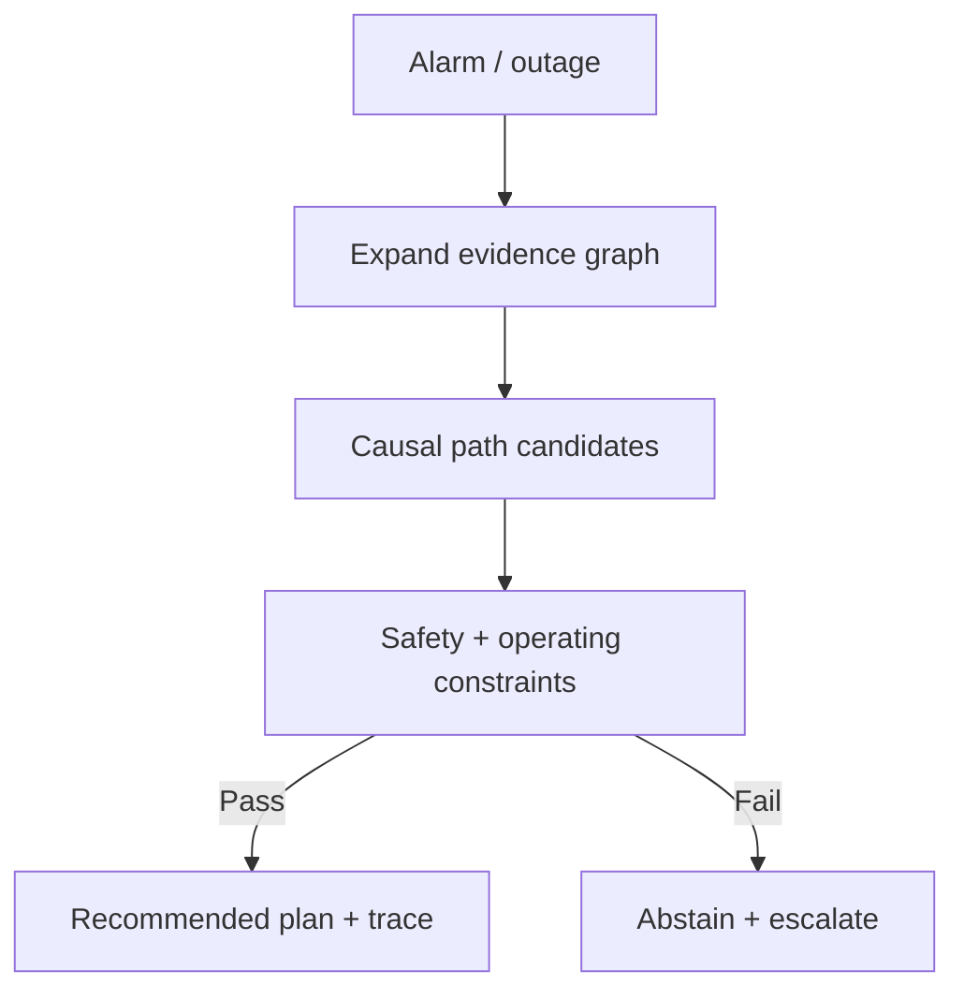

<!-- markdownlint-disable MD033 MD025 -->

--8<-- "includes/quicknav.html"

# Energy & Utilities: Grid Operations Under Constraints

  

    

      
Case study → energy & utilities

      <h2 class="landing-title">Grid decisions need safety gates and replayable traces.</h2>
      

        Utilities operate under strict safety and reliability constraints.
        A decision-support system must enforce what actions are allowed, and provide a trace that survives audits and post-incident reviews.
      

      

        <a class="md-button md-button--primary" href="/services/start/">Start a Conversation</a>
        <a class="md-button" href="/methodology/constraints/">Constraints &amp; SHACL</a>
        <a class="md-button" href="/services/blueprint/">Architecture Blueprint</a>
      

    

  

  <h2>The question</h2>
  

    

      Can AI support grid operations (outage response, switching plans, capacity constraints) while preventing unsafe actions,
      and producing decision artifacts that can be reviewed and replayed?
    

  

  <h2>Failure modes to avoid</h2>
  

    
<h3>Unsafe suggestions</h3>
Recommending actions that violate safety procedures or operating limits.

    
<h3>Non-local constraints</h3>
Switching constraints depend on topology, equipment state, and work orders across systems.

    
<h3>Evidence gaps</h3>
Telemetry and tickets disagree; the system must be able to abstain and request missing data.

    
<h3>Unreplayable incidents</h3>
Postmortems fail if reasoning exists only as transient chat output.

  

  <h2>What changes with governed causal memory</h2>
  

    
<strong>We connect topology, telemetry, work orders, and procedures into a constraint-gated reasoning layer.</strong>

    
The result is a recommended plan with evidence paths — or a deterministic escalation.

  

  <h2>Diagram: typical evidence path (illustrative)</h2>

  <h2>Outputs</h2>
  

    
<h3>Safe-by-design recommendations</h3>
Plans that are validated against procedure and operating constraints.

    
<h3>Incident traces</h3>
Evidence, rules applied, decisions, and escalations captured as artifacts.

    
<h3>Faster postmortems</h3>
Replayable reasoning reduces time-to-resolution and improves learning.

    
<h3>Governed automation boundaries</h3>
Clear lines between auto-suggest, auto-execute, and mandatory human review.

  

  <h2>Next steps</h2>
  

    

      <a class="md-button md-button--primary" href="/services/epistemic-audit/">Epistemic Audit</a>
      <a class="md-button" href="/services/implementation/">Implementation</a>
    

  

