<!-- markdownlint-disable MD033 MD025 -->

--8<-- "includes/quicknav.html"

# Energy & Utilities: Grid Operations Under Constraints

  

    

      
Case study → energy & utilities

      <h2 class="landing-title">Grid decisions need safety gates and replayable traces.</h2>
      

        Utilities operate under strict safety and reliability constraints.
        A decision-support system must enforce what actions are allowed, and provide a trace that survives audits and post-incident reviews.
      

      

        <a class="md-button md-button--primary" href="/services/start/">Start a Conversation</a>
        <a class="md-button" href="/methodology/constraints/">Constraints &amp; SHACL</a>
        <a class="md-button" href="/services/blueprint/">Architecture Blueprint</a>
      

    

  

## The question

  

    

      Can AI support grid operations (outage response, switching plans, capacity constraints) while preventing unsafe actions,
      and producing decision artifacts that can be reviewed and replayed?
    

  

    

## Failure modes to avoid

  

    
<h3>Unsafe suggestions</h3>
Recommending actions that violate safety procedures or operating limits.

    
<h3>Non-local constraints</h3>
Switching constraints depend on topology, equipment state, and work orders across systems.

    
<h3>Evidence gaps</h3>
Telemetry and tickets disagree; the system must be able to abstain and request missing data.

    
<h3>Unreplayable incidents</h3>
Postmortems fail if reasoning exists only as transient chat output.

    
<h3>Topology misread</h3>
Small modeling errors (feeds, ties, islands) can flip which actions are safe and permissible.

    
<h3>Work-order conflicts</h3>
Planned maintenance and switching constraints can contradict proposed actions unless integrated and enforced.

  

## What changes with governed causal memory

  

    
<strong>We connect topology, telemetry, work orders, and procedures into a constraint-gated reasoning layer.</strong>

    
The result is a recommended plan with evidence paths — or a deterministic escalation.

  

⚡ Grid ops becomes decision-grade when the system builds artifacts (state snapshot, hypotheses, plan draft, simulation results) and enforces explicit gates: <strong>state consistency</strong>, <strong>evidence sufficiency</strong>, <strong>simulation validity</strong>, <strong>permit conflicts</strong>, and <strong>safety/operating constraints</strong>. When gates fail, escalation is deterministic — not “best effort”.

```mermaid
flowchart TB
%% Styles (brModel Standard)
classDef i fill:#D3D3D3,stroke-width:0px,color:#000;
classDef p fill:#B3D9FF,stroke-width:0px,color:#000;
classDef r fill:#FFFFB3,stroke-width:0px,color:#000;
classDef o fill:#C1F0C1,stroke-width:0px,color:#000;
classDef s fill:#FFB3B3,stroke-width:0px,color:#000;

I_A(["🚨 Alarm / outage"]):::i

R_Topo(["🗺️ Topology model<br>(versioned)"]):::r
R_Tel(["📈 SCADA / telemetry snapshot"]):::r
R_OMS(["🎫 OMS tickets + calls"]):::r
R_WO(["🛠️ Work orders + permits-to-work"]):::r
R_Proc(["📜 Switching procedures<br>(approved)"]):::r

P_Rec("🧩 Reconcile state"):::p
G_State{"State consistent?"}:::s
S_Ask(["🛑 Request missing data / reconcile conflicts"]):::i
R_State(["🧾 State snapshot<br>(topology + telemetry)"]):::r

P_E("🕸️ Expand evidence graph"):::p
R_Path(["🧭 Fault hypotheses<br>(evidence per edge)"]):::r
G_Ev{"Evidence sufficient?"}:::s

P_Plan("🔀 Propose switching plan"):::p
R_Plan(["🔀 Plan draft<br>(step sequence)"]):::r
P_Sim("🧪 Simulate load/flow + safety"):::p
G_Sim{"Simulation ok?"}:::s

P_G("🔒 Safety + operating constraints"):::p
G_PTW{"Permit conflicts?"}:::s
G_OK{"Gates pass?"}:::s

O_R(["✅ Recommended plan + trace"]):::o
S_X(["🛑 Abstain + escalate"]):::i
R_Tr(["🧾 Plan trace bundle<br>(evidence + sims + limits)"]):::r

I_A --> P_Rec
R_Topo --> P_Rec
R_Tel --> P_Rec
R_OMS --> P_Rec
R_WO --> P_Rec

P_Rec --> G_State
G_State -->|"no"| S_Ask
G_State -->|"yes"| R_State --> P_E --> R_Path --> G_Ev

G_Ev -->|"no"| S_Ask
G_Ev -->|"yes"| P_Plan --> R_Plan --> P_Sim --> G_Sim

G_Sim -->|"no"| S_X
G_Sim -->|"yes"| P_G --> G_PTW

R_Proc --> P_G
G_PTW -->|"yes"| S_X
G_PTW -->|"no"| G_OK

G_OK -->|"yes"| O_R --> R_Tr
G_OK -->|"no"| S_X --> R_Tr

%% Clickable nodes
click P_G "/methodology/constraints/" "Constraints & SHACL"
```

## Diagram: typical evidence path (illustrative)

```mermaid
flowchart TB
%% Styles (brModel Standard)
classDef i fill:#D3D3D3,stroke-width:0px,color:#000;
classDef p fill:#B3D9FF,stroke-width:0px,color:#000;
classDef r fill:#FFFFB3,stroke-width:0px,color:#000;
classDef o fill:#C1F0C1,stroke-width:0px,color:#000;
classDef s fill:#FFB3B3,stroke-width:0px,color:#000;

R_Tel(["📈 Telemetry snapshot"]):::r
R_Topo(["🗺️ Topology version"]):::r
P_F("🧭 Fault hypothesis"):::p
R_H(["🧭 Hypothesis artifact"]):::r

P_Sim("🧪 Simulation"):::p
R_Sim(["📎 Simulation results"]):::r
G_Sim{"Simulation ok?"}:::s

P_C("🔒 Constraint checks"):::p
R_Cons(["📎 Constraint set<br>(limits + procedures)"]):::r
G_Lim{"Limits pass?"}:::s

P_S("🔀 Switching plan"):::p
R_Plan(["🔀 Plan steps"]):::r
R_TR(["🧾 Trace bundle<br>(why each step is safe)"]):::r
O_Out(["✅ Operator-ready plan"]):::o

R_Tel --> P_F
R_Topo --> P_F
P_F --> R_H --> P_Sim --> R_Sim --> G_Sim
G_Sim -->|"no"| R_TR
G_Sim -->|"yes"| P_C

R_Cons --> P_C
P_C --> G_Lim
G_Lim -->|"no"| R_TR
G_Lim -->|"yes"| P_S --> R_Plan --> R_TR --> O_Out
```

🧾 A “path†is not one arrow: it’s telemetry + topology → hypothesis artifact → simulation results → constraint set → plan steps → trace. If simulation fails or limits don’t pass, the trace must show where and why — so reviews are fast and defensible.

## Diagram: switching plan gates (topology, authorization, constraints)

```mermaid
flowchart TB
%% Styles (brModel Standard)
classDef i fill:#D3D3D3,stroke-width:0px,color:#000;
classDef p fill:#B3D9FF,stroke-width:0px,color:#000;
classDef r fill:#FFFFB3,stroke-width:0px,color:#000;
classDef o fill:#C1F0C1,stroke-width:0px,color:#000;
classDef s fill:#FFB3B3,stroke-width:0px,color:#000;

I_Plan(["🔀 Proposed switching plan" ]):::i
R_Topo(["🗺️ Topology model<br>(versioned)" ]):::r
R_State(["📈 State snapshot<br>(telemetry + breakers)" ]):::r
R_PTW(["🛠️ Permits-to-work<br>(active)" ]):::r
R_Lim(["📎 Operating limits<br>(thermal, voltage)" ]):::r
R_Auth(["🔐 Authority/roles" ]):::r
R_Sim(["📎 Simulation results" ]):::r

P_Topo("🧩 Validate topology"):::p
G_Topo{"Topology correct?"}:::s

P_Iso("🧪 Verify isolation points"):::p
G_Iso{"Isolation verified?"}:::s

P_BF("🧭 Check backfeed scenarios"):::p
G_BF{"Backfeed risk?"}:::s

P_PTW("🛠️ Check permit conflicts"):::p
G_PTW{"Permit conflicts?"}:::s

P_Auth("🔐 Validate authorization"):::p
G_Auth{"Authorized?"}:::s

P_Lim("🔒 Evaluate limits"):::p
G_Lim{"Operating limits pass?"}:::s

O_Do(["✅ Execute / recommend" ]):::o
O_Hold(["⏸️ Hold + verify" ]):::o
S_Esc(["🛑 Escalate to operator review" ]):::s
R_Tr(["🧾 Plan trace bundle<br>(inputs + gates + simulations)" ]):::r
O_Check(["✅ Execution checklist<br>(operator-ready)" ]):::o

I_Plan --> P_Topo
R_Topo --> P_Topo
R_State --> P_Topo
P_Topo --> G_Topo
G_Topo -->|"no"| S_Esc --> R_Tr
G_Topo -->|"yes"| P_Iso

R_State --> P_Iso
P_Iso --> G_Iso

G_Iso -->|"no"| O_Hold --> R_Tr
G_Iso -->|"yes"| P_BF

R_Sim --> P_BF
P_BF --> G_BF

G_BF -->|"yes"| S_Esc 
G_BF -->|"no"| P_PTW

R_PTW --> P_PTW
P_PTW --> G_PTW

G_PTW -->|"yes"| S_Esc 
G_PTW -->|"no"| P_Auth

R_Auth --> P_Auth
P_Auth --> G_Auth

G_Auth -->|"no"| S_Esc
G_Auth -->|"yes"| P_Lim

R_Lim --> P_Lim
R_Sim --> P_Lim
P_Lim --> G_Lim

G_Lim -->|"yes"| O_Do --> R_Tr --> O_Check
G_Lim -->|"no"| S_Esc
```

🚦 This is why “AI suggestions†are unsafe by default: a plan must pass gates for topology correctness, isolation verification, backfeed risk, permit conflicts, authorization, and operating limits. When any gate fails, escalation is mandatory — and the trace shows exactly which gate failed and why. <strong>Product:</strong> a <strong>plan trace bundle</strong> plus an <strong>operator-ready execution checklist</strong>.

## Outputs

  

    
<h3>Safe-by-design recommendations</h3>
Plans that are validated against procedure and operating constraints.

    
<h3>Incident traces</h3>
Evidence, rules applied, decisions, and escalations captured as artifacts.

    
<h3>Faster postmortems</h3>
Replayable reasoning reduces time-to-resolution and improves learning.

    
<h3>Governed automation boundaries</h3>
Clear lines between auto-suggest, auto-execute, and mandatory human review.

    
<h3>Constraint library</h3>
Operating limits, procedures, and exception rules encoded as enforceable checks — versioned like any other policy.

    
<h3>Operator-ready rationale</h3>
Not just a plan, but why it is safe: which evidence and constraints justify each step of the recommendation.

  

## Next steps

  

    

      <a class="md-button md-button--primary" href="/services/epistemic-audit/">Epistemic Audit</a>
      <a class="md-button" href="/services/implementation/">Implementation</a>
    

  

