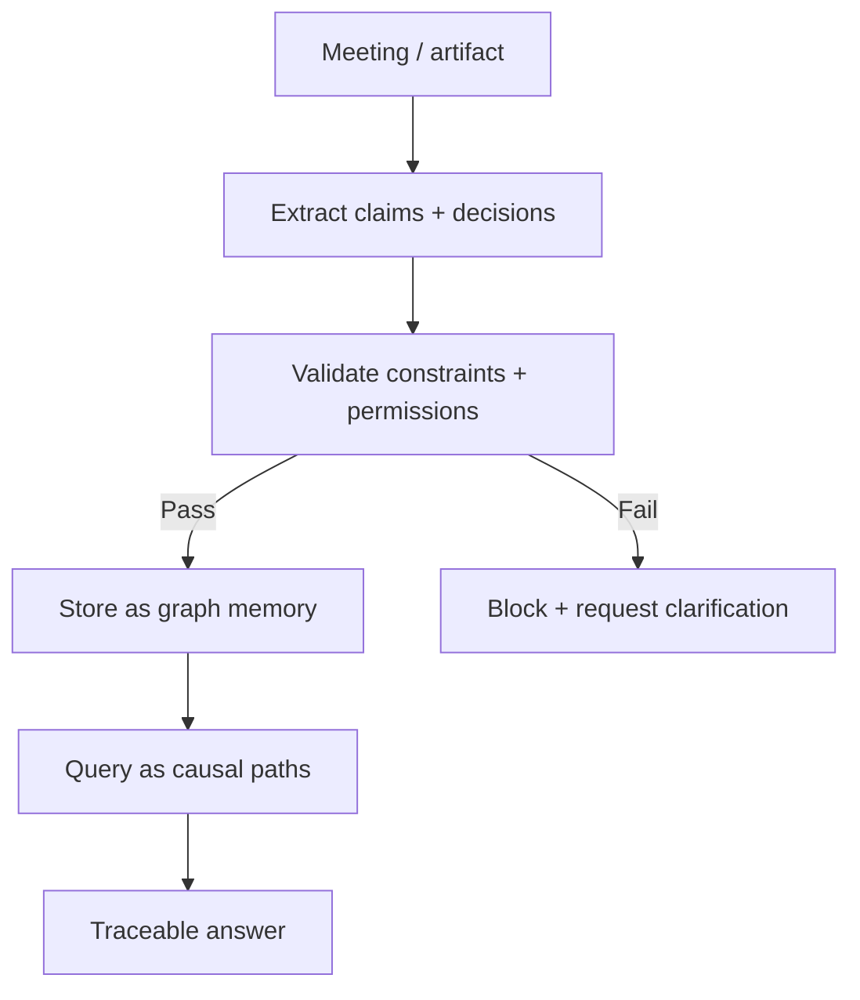
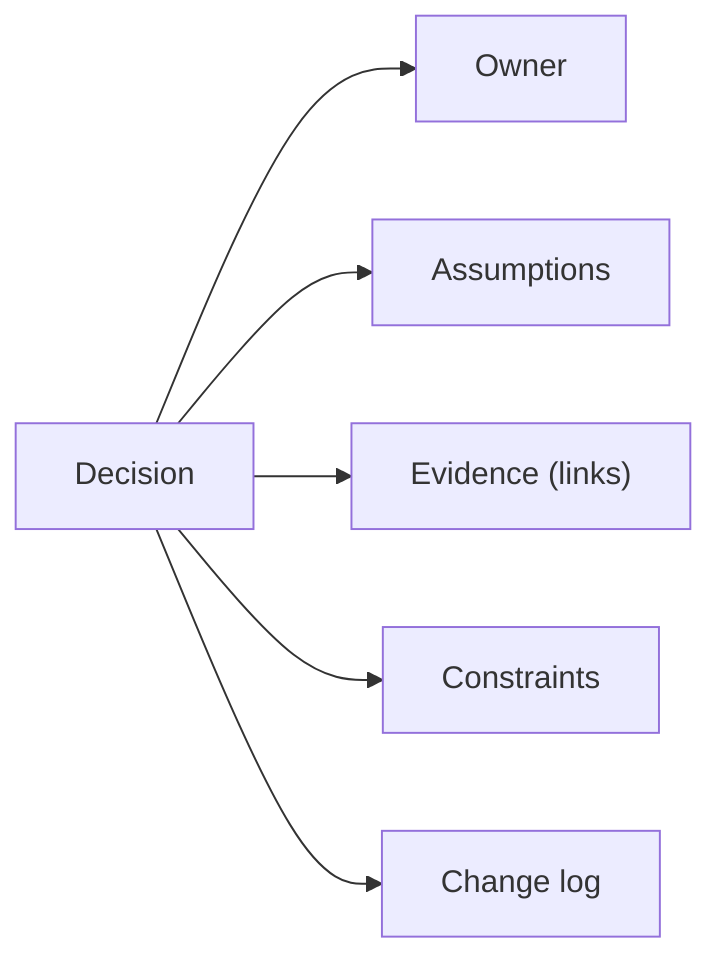

<!-- markdownlint-disable MD033 MD025 -->

--8<-- "includes/quicknav.html"

# Enterprise Central Memory: Meetings, Projects, and Decision Traceability

  

    

      
Case study → enterprise

      <h2 class="landing-title">Your organization already has memory. It’s just fragmented and unauditable.</h2>
      

        Most enterprise “knowledge” lives in meetings, tickets, docs, spreadsheets, and emails.
        Central memory is about turning that sprawl into governed, versioned, traceable decision artifacts — not a nicer chat UI.
      

      

        <a class="md-button md-button--primary" href="/services/start/">Start a Conversation</a>
        <a class="md-button" href="/services/epistemic-audit/">Epistemic Audit</a>
        <a class="md-button" href="/methodology/core-primitives/">Core primitives</a>
      

    

  

  <h2>The question</h2>
  

    

      Can AI help leadership and teams make better decisions from meeting notes and project artifacts
      while preserving provenance, preventing contradiction, and keeping accountability explicit?
    

  

  <h2>Failure modes to avoid</h2>
  

    
<h3>Meeting amnesia</h3>
Decisions get made, then lost; later plans contradict earlier constraints.

    
<h3>“Consensus hallucinations”</h3>
Systems summarize without capturing who decided what, under which assumptions.

    
<h3>Version confusion</h3>
Projects reference outdated specs and silently drift across teams.

    
<h3>No governance</h3>
Confidentiality and permissions must be enforced, not “remembered”.

  

  <h2>What changes with central memory + constraints</h2>

  <h2>Diagram: decision trace as an organizational primitive</h2>

  <h2>Outputs</h2>
  

    
<h3>Decision register</h3>
Versioned decisions tied to owners, assumptions, and artifacts.

    
<h3>Constraint-aware planning</h3>
Plans that respect policies, dependencies, and “must never happen” rules.

    
<h3>Faster onboarding</h3>
New team members can traverse “why we did this”, not just “what we did”.

    
<h3>Governed access</h3>
Permissions and confidentiality enforced at the memory layer.

  

  <h2>Next steps</h2>
  

    

      <a class="md-button md-button--primary" href="/services/epistemic-audit/">Epistemic Audit</a>
      <a class="md-button" href="/services/blueprint/">Architecture Blueprint</a>
      <a class="md-button" href="/services/implementation/">Implementation</a>
    

  

