<!-- markdownlint-disable MD033 MD025 -->

--8<-- "includes/quicknav.html"

# Enterprise Central Memory: Projects, Meetings and Decisions

  

    

      
Case study → enterprise

      <h2 class="landing-title">Your organization already has memory. It’s just fragmented and unauditable.</h2>
      

        Most enterprise “knowledge” lives in meetings, tickets, docs, spreadsheets, and emails.
        Central memory is about turning that sprawl into governed, versioned, traceable decision artifacts — not a nicer chat UI.
      

      

        <a class="md-button md-button--primary" href="/services/start/">Start a Conversation</a>
        <a class="md-button" href="/services/epistemic-audit/">Epistemic Audit</a>
        <a class="md-button" href="/methodology/core-primitives/">Core primitives</a>
      

    

  

## The question

  

    

      Can AI help leadership and teams make better decisions from meeting notes and project artifacts
      while preserving provenance, preventing contradiction, and keeping accountability explicit?
    

  

    

## Failure modes to avoid

  

    
<h3>Meeting amnesia</h3>
Decisions get made, then lost; later plans contradict earlier constraints.

    
<h3>“Consensus hallucinations”</h3>
Systems summarize without capturing who decided what, under which assumptions.

    
<h3>Version confusion</h3>
Projects reference outdated specs and silently drift across teams.

    
<h3>No governance</h3>
Confidentiality and permissions must be enforced, not “remembered”.

    
<h3>Attribution loss</h3>
Without owners and timestamps, accountability disappears and “why†becomes a matter of opinion.

    
<h3>Strategic revisionism</h3>
People rewrite history after outcomes; traces prevent retroactive narratives from replacing facts.

  

## What changes with central memory + constraints

```mermaid
flowchart TB
%% Styles (brModel Standard)
classDef i fill:#D3D3D3,stroke-width:0px,color:#000;
classDef p fill:#B3D9FF,stroke-width:0px,color:#000;
classDef r fill:#FFFFB3,stroke-width:0px,color:#000;
classDef o fill:#C1F0C1,stroke-width:0px,color:#000;
classDef s fill:#FFB3B3,stroke-width:0px,color:#000;

I_M(["📝 Meeting / artifact"]):::i
P_X("🧾 Extract claims + decisions"):::p
P_V("🔒 Validate permissions + constraints"):::p
G_OK{"Gates pass?"}:::s
P_S("🧠 Store as graph memory"):::p
P_Q("🕸️ Query as causal paths"):::p
O_T(["✅ Traceable answer"]):::o
S_B(["🛑 Block + request clarification"]):::s
R_Tr(["🧾 Decision trace"]):::r

I_M --> P_X --> P_V --> G_OK
G_OK -->|"yes"| P_S --> P_Q --> O_T --> R_Tr
G_OK -->|"no"| S_B --> R_Tr

%% Clickable nodes
click P_V "/methodology/constraints/" "Constraints & SHACL"
click P_S "/methodology/property-and-knowledge-graphs/" "Graphs"
```

🢠Central memory is not “better notes”: it is <strong>governed ingestion</strong>. Every extracted claim or decision is validated against <strong>permissions</strong> and <strong>constraints</strong> before it becomes memory, and every answer is backed by a <strong>🧾 trace</strong>.

## Diagram: decision trace as an organizational primitive

```mermaid
flowchart LR
%% Styles (brModel Standard)
classDef i fill:#D3D3D3,stroke-width:0px,color:#000;
classDef p fill:#B3D9FF,stroke-width:0px,color:#000;
classDef r fill:#FFFFB3,stroke-width:0px,color:#000;
classDef o fill:#C1F0C1,stroke-width:0px,color:#000;
classDef s fill:#FFB3B3,stroke-width:0px,color:#000;

R_D(["🧾 Decision object"]):::r
R_O(["👤 Owner"]):::r
R_A(["🧠 Assumptions"]):::r
R_E(["📎 Evidence links"]):::r
R_C(["🔒 Constraints"]):::r
R_CH(["🕒 Change log"]):::r

R_D --> R_O
R_D --> R_A
R_D --> R_E
R_D --> R_C
R_D --> R_CH

%% Clickable nodes
click R_C "/methodology/constraints/" "Constraints"
```

🧾 Treat decisions as first-class objects: a decision without an <strong>owner</strong>, <strong>assumptions</strong>, <strong>evidence</strong>, and a <strong>change log</strong> is just a story. This makes accountability computable.

## Diagram: contradiction detection loop (preventing “organizational amnesia”)

```mermaid
flowchart TB
%% Styles (brModel Standard)
classDef i fill:#D3D3D3,stroke-width:0px,color:#000;
classDef p fill:#B3D9FF,stroke-width:0px,color:#000;
classDef r fill:#FFFFB3,stroke-width:0px,color:#000;
classDef o fill:#C1F0C1,stroke-width:0px,color:#000;
classDef s fill:#FFB3B3,stroke-width:0px,color:#000;

I_New(["🧩 New proposal / plan"]):::i
P_Link("🔗 Link to prior decisions + constraints"):::p
G_Contr{"Contradiction?"}:::s
O_OK(["✅ Approve + trace"]):::o
S_Block(["🛑 Block + request resolution"]):::s
R_Iss(["🧾 Issue record<br>(what conflicts with what)"]):::r

I_New --> P_Link --> G_Contr
G_Contr -->|"no"| O_OK
G_Contr -->|"yes"| S_Block --> R_Iss
```

🚦 The system does not “smooth over†conflict: it checks whether a new plan contradicts an existing decision or constraint. If yes, it blocks and produces a structured issue record instead of a polite summary.

## Outputs

  

    
<h3>Decision register</h3>
Versioned decisions tied to owners, assumptions, and artifacts.

    
<h3>Constraint-aware planning</h3>
Plans that respect policies, dependencies, and “must never happen†rules.

    
<h3>Faster onboarding</h3>
New team members can traverse “why we did this”, not just “what we did”.

    
<h3>Governed access</h3>
Permissions and confidentiality enforced at the memory layer.

    
<h3>Contradiction detection</h3>
When new plans conflict with earlier constraints or decisions, the system can surface the clash and demand resolution.

    
<h3>Replayable decision trails</h3>
You can reconstruct how a decision was made at the time — what was known, what rules applied, and what changed later.

  

## Next steps

  

    

      <a class="md-button md-button--primary" href="/services/epistemic-audit/">Epistemic Audit</a>
      <a class="md-button" href="/services/blueprint/">Architecture Blueprint</a>
      <a class="md-button" href="/services/implementation/">Implementation</a>
    

  

