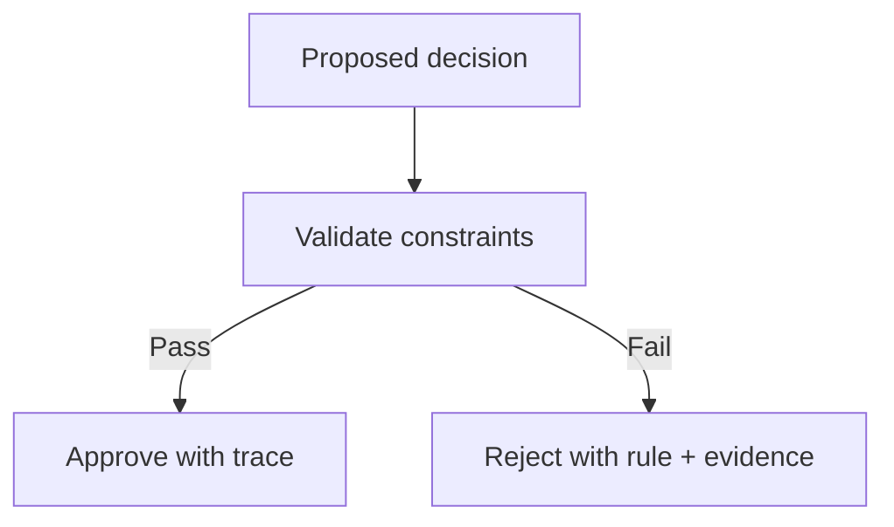

--8<-- "includes/quicknav.html"

# Finance: Compliance & Risk

## The question

Can AI assist credit decisions without violating policy, sector restrictions, or regulatory expectations?

## Failure mode to avoid

Chat-style systems can provide plausible narratives while missing:

- exceptions hidden in footnotes
- cross-document constraints
- sector-specific prohibitions

## What changes with governance constraints

Instead of “asking the model to behave”, we enforce constraints at the system level.

## Outputs (skeleton)

- rule IDs and rationale for each decision
- non-bypassable constraints
- audit trail suitable for internal review

Next: [Services](../services/index.md).
