--8<-- "includes/quicknav.html"

# Finance: Compliance & Risk

  

    

      
Case study → finance

      <h2 class="landing-title">Compliance by design: decisions that can’t “talk their way around” policy.</h2>
      

        Financial decisions are not just predictions. They are governed actions.
        We make policy enforcement deterministic and produce traces suitable for audit.
      

      

        <a class="md-button md-button--primary" href="/services/start/">Start a Conversation</a>
        <a class="md-button" href="/methodology/constraints/">Constraints &amp; SHACL</a>
        <a class="md-button" href="/services/epistemic-audit/">Epistemic Audit</a>
      

    

  

## The question

  

    
Can AI assist credit decisions without violating policy, sector restrictions, or regulatory expectations?

  

    

## Failure mode to avoid

  

    
<h3>Footnote exceptions</h3>
Important clauses live in appendices, edge cases, and “only if…†conditions.

    
<h3>Cross-document constraints</h3>
Policies and risk rules are distributed across multiple sources and versions.

    
<h3>Sector prohibitions</h3>
Some decisions are disallowed regardless of narrative quality.

    
<h3>Silent uncertainty</h3>
Fluent text can hide missing evidence. The system must be able to refuse.

    
<h3>Proxy discrimination</h3>
“Neutral†features can encode protected attributes unless governance explicitly constrains them.

    
<h3>Rule drift</h3>
When policies change, you need diffs and re-evaluation — not silent grandfathering of past decisions.

  

## What changes with governance constraints

  

    
<strong>Instead of “asking the model to behave”, we enforce constraints at the system level.</strong>

    
Every approval or rejection points to the rule and the evidence that triggered it.

  

💳 The system does not “ask the model to comply”: it runs a <strong>🔒 non-bypassable constraint gate</strong>. The output is either an approval or a rejection — both with a <strong>🧾 trace bundle</strong> showing which rules triggered and what evidence was used.

```mermaid
flowchart TB
%% Styles (brModel Standard)
classDef i fill:#D3D3D3,stroke-width:0px,color:#000;
classDef p fill:#B3D9FF,stroke-width:0px,color:#000;
classDef r fill:#FFFFB3,stroke-width:0px,color:#000;
classDef o fill:#C1F0C1,stroke-width:0px,color:#000;
classDef s fill:#FFB3B3,stroke-width:0px,color:#000;

I_Q(["📥 Proposed decision"]):::i
P_V("🔒 Validate constraints"):::p
G_OK{"Constraints pass?"}:::s
O_OK(["✅ Approve + trace"]):::o
S_NO(["🛑 Reject + violations"]):::i
R_T(["🧾 Trace bundle<br>(rules + evidence + inputs)"]):::r

I_Q --> P_V --> G_OK
G_OK -->|"yes"| O_OK --> R_T
G_OK -->|"no"| S_NO --> R_T

%% Clickable nodes
click P_V "/methodology/constraints/" "Constraints & SHACL"
```

## Diagram: constraint taxonomy (examples)

```mermaid
flowchart TB
%% Styles (brModel Standard)
classDef i fill:#D3D3D3,stroke-width:0px,color:#000;
classDef p fill:#B3D9FF,stroke-width:0px,color:#000;
classDef r fill:#FFFFB3,stroke-width:0px,color:#000;
classDef o fill:#C1F0C1,stroke-width:0px,color:#000;
classDef s fill:#FFB3B3,stroke-width:0px,color:#000;

R_P(["📜 Policy library<br>(versioned)"]):::r
R1(["👤 Role restrictions<br>(who can do what)"]):::r
R2(["🚫 Sector prohibitions<br>(must-never)"]):::r
R3(["📎 Evidence requirements<br>(what must be attached)"]):::r
R4(["📏 Threshold limits<br>(numeric caps)"]):::r
R5(["🕒 Time/window rules<br>(when allowed)"]):::r
R_C(["🧾 Citations + provenance" ]):::r

P_Comp("🧩 Compile constraints"):::p
R_Set(["🔒 Constraint set<br>(executable checks)"]):::r

I_Dec(["📥 Proposed decision<br>(trade/approve/execute)"]):::i
P_G("🔒 Constraint gate"):::p

G_Role{"Role allowed?"}:::s
G_Proh{"Prohibited?"}:::s
G_Ev{"Evidence attached?"}:::s
G_Lim{"Limits pass?"}:::s
G_Time{"Window ok?"}:::s

O_OK(["✅ Allow + trace"]):::o
S_No(["🛑 Block / escalate<br>violations"]):::i
R_Rep(["🧾 Validation report<br>(which checks fired)"]):::r

R_P --> P_Comp --> R_Set
R_P --> R1
R_P --> R2
R_P --> R3 --> R_C
R_P --> R4
R_P --> R5

R1 --> P_G
R2 --> P_G
R3 --> P_G
R4 --> P_G
R5 --> P_G
R_Set --> P_G
I_Dec --> P_G --> G_Role

G_Role -->|"no"| S_No --> R_Rep
G_Role -->|"yes"| G_Proh

G_Proh -->|"yes"| S_No
G_Proh -->|"no"| G_Ev

G_Ev -->|"no"| S_No 
G_Ev -->|"yes"| G_Lim

G_Lim -->|"no"| S_No 
G_Lim -->|"yes"| G_Time

G_Time -->|"no"| S_No 
G_Time -->|"yes"| O_OK --> R_Rep

%% Clickable nodes
click R_P "/methodology/constraints/" "Constraints"
```

📜 “Constraints†are not one thing: finance needs role controls, hard prohibitions, evidence requirements, and numeric limits — each versioned and enforceable, so policy can’t be bypassed by fluent text. <strong>Product:</strong> a deterministic <strong>validation report</strong> showing exactly which checks fired (or passed) for a given decision.

## Diagram: policy diffs and re-evaluation loop

```mermaid
flowchart TB
%% Styles (brModel Standard)
classDef i fill:#D3D3D3,stroke-width:0px,color:#000;
classDef p fill:#B3D9FF,stroke-width:0px,color:#000;
classDef r fill:#FFFFB3,stroke-width:0px,color:#000;
classDef o fill:#C1F0C1,stroke-width:0px,color:#000;
classDef s fill:#FFB3B3,stroke-width:0px,color:#000;

I_Upd(["🧩 Policy update"]):::i
P_Diff("🧾 Compute diff"):::p
R_Diff(["🧾 Policy diff<br>(what changed)"]):::r

P_Impact("🔎 Find impacted decisions"):::p
R_Idx(["🧠 Decision index<br>(rules → decisions)"]):::r
R_Set(["📎 Impacted decision set" ]):::r

P_Reeval("🧪 Re-evaluate decisions"):::p
G_Flip{"Any outcomes flip?"}:::s
P_Pack("🧾 Build review bundles"):::p
R_Bun(["🧾 Review bundle<br>(before/after + reasons)"]):::r

G_Risk{"High stakes?"}:::s
S_Sign(["🛑 Require sign-off" ]):::i
O_Apply(["✅ Apply updates" ]):::o

P_Log("🕒 Write change log"):::p
R_Log(["🕒 Governance log<br>(diff + approvals)"]):::r

S_No(["🛑 No material changes" ]):::i

I_Upd --> P_Diff --> R_Diff --> P_Impact
R_Idx --> P_Impact
P_Impact --> R_Set --> P_Reeval --> G_Flip

G_Flip -->|"no"| S_No --> P_Log
G_Flip -->|"yes"| P_Pack --> R_Bun --> G_Risk

G_Risk -->|"yes"| S_Sign --> P_Log
G_Risk -->|"no"| O_Apply --> P_Log

P_Log --> R_Log
```

🧪 Governance stays stable under change only if policy updates are <strong>diffed</strong> and decisions are <strong>re-evaluated</strong>. This turns “rule drift†into a reviewable artifact, not a silent production risk. <strong>Product:</strong> a <strong>review bundle</strong> (before/after + reasons) plus a <strong>governance log</strong> (diff + approvals) you can audit.

## Outputs

  

    
<h3>Rule IDs + rationale</h3>
Every decision is tied to a specific rule and its evaluated inputs.

    
<h3>Non-bypassable governance</h3>
Constraints are enforced in code/data, not in prompt text.

    
<h3>Audit-ready trail</h3>
Traces and validation reports suitable for internal review.

    
<h3>Deterministic abstention</h3>
When evidence is missing, the system refuses and states what is required.

    
<h3>Policy diffs over time</h3>
When rules change, you can see what decisions would flip and why — before changes go live.

    
<h3>Review bundles</h3>
Decision artifacts packaged for compliance: evidence, scope, rule triggers, and the exact enforcement path.

  

## Next steps

  

    

      <a class="md-button md-button--primary" href="/services/">Services</a>
      <a class="md-button" href="/services/start/">Start a Conversation</a>
    

  

