--8<-- "includes/quicknav.html"

# Case Studies

	

		

			
Case studies → outcomes

			<h2 class="landing-title">Theory is cheap. Decision-grade outcomes are not.</h2>
			

				These case studies show what changes when systems are built around causal memory, enforceable constraints, and traceability.
				The common thread: reliability becomes a system property, not a prompt suggestion.
			

			

				<a class="md-button md-button--primary" href="/services/start/">Start a Conversation</a>
				<a class="md-button" href="/methodology/">Methodology</a>
				<a class="md-button" href="/reasoners/governance/">Governance approach</a>
			

		

	

## How to read these

	

		
<strong>These are representative patterns.</strong>

		
They illustrate the mechanism: provenance → constraints → traces → auditable decisions.

	

    

## Diagram: what this section covers

```mermaid
flowchart LR
%% Styles (brModel Standard)
classDef i fill:#D3D3D3,stroke-width:0px,color:#000;
classDef p fill:#B3D9FF,stroke-width:0px,color:#000;
classDef r fill:#FFFFB3,stroke-width:0px,color:#000;
classDef o fill:#C1F0C1,stroke-width:0px,color:#000;
classDef s fill:#FFB3B3,stroke-width:0px,color:#000;

I_Cases(["📚 Case studies (domains)"]):::i
P_Primitives("🧠 Shared primitives: causal memory + constraints + traces"):::p
R_Artifacts(["🧾 Decision artifacts: evidence paths, rule triggers, trace bundles"]):::r
O_Out(["✅ Outcomes: auditable decisions + safe abstention + measurable reliability"]):::o

I_Cases --> P_Primitives --> R_Artifacts --> O_Out

subgraph D["Domains"]
	D1("🧬 Biomedicine"):::p
	D2("💳 Finance"):::p
	D3("⚖️ Legal"):::p
	D4("🛡️ Cybersecurity"):::p
	D5("🏭 Manufacturing"):::p
	D6("⚡ Energy & Utilities"):::p
	D7("💊 Pharma / Clinical Ops"):::p
	D8("🏢 Enterprise central memory"):::p
	D9("🧾 Insurance"):::p
end

D1 --> P_Primitives
D2 --> P_Primitives
D3 --> P_Primitives
D4 --> P_Primitives
D5 --> P_Primitives
D6 --> P_Primitives
D7 --> P_Primitives
D8 --> P_Primitives
D9 --> P_Primitives

%% Clickable nodes
click D1 "/case-studies/biomedicine/" "Biomedicine"
click D2 "/case-studies/finance/" "Finance"
click D3 "/case-studies/legal/" "Legal"
click D4 "/case-studies/cybersecurity/" "Cybersecurity"
click D5 "/case-studies/manufacturing/" "Manufacturing"
click D6 "/case-studies/energy-utilities/" "Energy & Utilities"
click D7 "/case-studies/pharma-clinical-ops/" "Pharma / Clinical Ops"
click D8 "/case-studies/enterprise-central-memory/" "Enterprise central memory"
click D9 "/case-studies/insurance/" "Insurance"
click P_Primitives "/methodology/" "Methodology"
```

🗺️ This overview shows the section’s organizing idea: very different domains, but the same <strong>shared primitives</strong>. The case studies are examples of turning domain mess into <strong>🧾 decision artifacts</strong> and measurable reliability, not better prose.

## Curated case studies

	

		

			<h3>Biomedicine</h3>
			
Mechanism discovery: connecting entities into testable causal chains beyond document similarity.

			
<a class="md-button md-button--primary" href="/case-studies/biomedicine/">Read case study</a>

		

		

			<h3>Finance</h3>
			
Compliance by design: constraints make policy violations impossible and produce audit-ready traces.

			
<a class="md-button md-button--primary" href="/case-studies/finance/">Read case study</a>

		

		

			<h3>Legal</h3>
			
Contract logic conflicts: graph structure surfaces contradictions and hidden dependencies.

			
<a class="md-button md-button--primary" href="/case-studies/legal/">Read case study</a>

		

	

## High-value verticals we also focus on

	

		

			<h3>Insurance</h3>
			
Claims and underwriting under hard constraints, with traceable evidence and deterministic abstention.

			
<a class="md-button md-button--primary" href="/case-studies/insurance/">Read case study</a>

		

		

			<h3>Cybersecurity</h3>
			
SOC decision support: evidence paths, playbook constraints, and incident traces you can replay.

			
<a class="md-button md-button--primary" href="/case-studies/cybersecurity/">Read case study</a>

		

		

			<h3>Manufacturing</h3>
			
Quality and root-cause analysis: causal chains across process steps, suppliers, and sensor evidence.

			
<a class="md-button md-button--primary" href="/case-studies/manufacturing/">Read case study</a>

		

		

			<h3>Energy &amp; Utilities</h3>
			
Grid operations: safety gates, operating constraints, and replayable incident reasoning.

			
<a class="md-button md-button--primary" href="/case-studies/energy-utilities/">Read case study</a>

		

		

			<h3>Pharma / Clinical Ops</h3>
			
Protocol and safety constraints with inspection-ready evidence paths and deterministic escalation.

			
<a class="md-button md-button--primary" href="/case-studies/pharma-clinical-ops/">Read case study</a>

		

		

			<h3>Enterprise central memory</h3>
			
Meetings and projects as governed decision artifacts: owners, assumptions, constraints, and change logs.

			
<a class="md-button md-button--primary" href="/case-studies/enterprise-central-memory/">Read case study</a>

		

	

