<!-- markdownlint-disable MD033 MD025 -->

--8<-- "includes/quicknav.html"

# Insurance: Claims & Underwriting Under Constraints

  

    

      
Case study → insurance

      <h2 class="landing-title">Insurance decisions are governed actions, not “smart guesses”.</h2>
      

        Claims and underwriting workflows combine policy rules, evidence, exceptions, and legal constraints.
        A decision-grade system must be able to <strong>prove why</strong> a decision was allowed — or refuse.
      

      

        <a class="md-button md-button--primary" href="/services/start/">Start a Conversation</a>
        <a class="md-button" href="/methodology/constraints/">Constraints &amp; SHACL</a>
        <a class="md-button" href="/services/epistemic-audit/">Epistemic Audit</a>
      

    

  

## The question

  

    

      Can AI assist claims and underwriting decisions while enforcing policy, fraud controls, and regulatory constraints —
      and producing an audit-ready trail?
    

  

## Failure modes to avoid

  

    
<h3>Policy as prose</h3>
Policies contain non-local exceptions and precedence rules that text summaries routinely flatten.

    
<h3>Evidence leakage</h3>
Approvals without defensible evidence paths lead to leakage, disputes, and adverse selection.

    
<h3>Fraud blind spots</h3>
Fraud signals are multi-source and relational; similarity search misses structured contradictions.

    
<h3>Unbounded automation</h3>
High-risk actions must be constrained and sometimes escalated, not “handled end-to-end”.

    
<h3>Coverage misclassification</h3>
Small wording differences can flip eligibility; mistakes compound into denials, complaints, and regulatory risk.

    
<h3>Adversarial behavior</h3>
Claimants and intermediaries adapt; systems need controls against gaming, not just better summaries.

  

## What changes with constraint-gated reasoning

  

    
<strong>The model can propose; the system decides what is allowed.</strong>

    
Every step is validated against policy shapes, required evidence, and role permissions.

  

🧾 Insurance workflows become decision-grade when <strong>policy</strong> is enforced as a <strong>🔒 gate</strong>. The system either approves or escalates — and always emits a <strong>trace bundle</strong> you can audit.

```mermaid
flowchart TB
%% Styles (brModel Standard)
classDef i fill:#D3D3D3,stroke-width:0px,color:#000;
classDef p fill:#B3D9FF,stroke-width:0px,color:#000;
classDef r fill:#FFFFB3,stroke-width:0px,color:#000;
classDef o fill:#C1F0C1,stroke-width:0px,color:#000;
classDef s fill:#FFB3B3,stroke-width:0px,color:#000;

I_C(["📥 Claim / underwriting proposal"]):::i
R_E(["📎 Evidence set"]):::r
R_P(["📜 Policy rules"]):::r
P_V("🔒 Constraint gate"):::p
G_OK{"Gates pass?"}:::s
O_OK(["✅ Approve + trace"]):::o
S_NO(["🛑 Reject / escalate + violations"]):::s
R_T(["🧾 Trace bundle"]):::r

I_C --> R_E --> R_P --> P_V --> G_OK
G_OK -->|"yes"| O_OK --> R_T
G_OK -->|"no"| S_NO --> R_T

%% Clickable nodes
click P_V "/methodology/constraints/" "Constraints & SHACL"
```

## Diagram: typical causal/evidence path (illustrative)

```mermaid
flowchart LR
%% Styles (brModel Standard)
classDef i fill:#D3D3D3,stroke-width:0px,color:#000;
classDef p fill:#B3D9FF,stroke-width:0px,color:#000;
classDef r fill:#FFFFB3,stroke-width:0px,color:#000;
classDef o fill:#C1F0C1,stroke-width:0px,color:#000;
classDef s fill:#FFB3B3,stroke-width:0px,color:#000;

R_EV(["📎 Evidence"]):::r
P_F("🔎 Finding"):::p
P_R("🧭 Risk factor"):::p
P_D("⚖️ Decision impact"):::p
R_T(["🧾 Trace"]):::r

R_EV --> P_F --> P_R --> P_D --> R_T
```

🧭 This is the unit of accountability: evidence leads to findings, findings to risk factors, and risk factors to decision impact — all captured in a trace so disputes don’t devolve into opinions.

## Diagram: fraud triage gates (when to escalate)

```mermaid
flowchart TB
%% Styles (brModel Standard)
classDef i fill:#D3D3D3,stroke-width:0px,color:#000;
classDef p fill:#B3D9FF,stroke-width:0px,color:#000;
classDef r fill:#FFFFB3,stroke-width:0px,color:#000;
classDef o fill:#C1F0C1,stroke-width:0px,color:#000;
classDef s fill:#FFB3B3,stroke-width:0px,color:#000;

I_Cl(["📥 Claim intake"]):::i
P_Link("🕸️ Link entities<br>(people, vehicles, addresses)"):::p
R_Sig(["🔎 Fraud signals"]):::r
G_Ev{"Evidence sufficient?"}:::s
G_Risk{"High risk?"}:::s
O_Pay(["✅ Pay / approve"]):::o
S_Esc(["🛑 Escalate to investigation"]):::s
R_Tr(["🧾 Trace bundle"]):::r

I_Cl --> P_Link --> R_Sig --> G_Ev
G_Ev -->|"no"| S_Esc --> R_Tr
G_Ev -->|"yes"| G_Risk

G_Risk -->|"yes"| S_Esc --> R_Tr
G_Risk -->|"no"| O_Pay --> R_Tr
```

🚦 Fraud controls need explicit gates: if evidence is incomplete or risk is high, the system escalates to investigation rather than “auto-paying with confidence”. Every path ends in a trace bundle.

## Outputs

  

    
<h3>Audit-ready traces</h3>
Decision, evidence, rules applied, and policy violations (if any).

    
<h3>Deterministic abstention</h3>
If required evidence is missing, the system refuses and states what must be provided.

    
<h3>Fraud investigation graph</h3>
Relational signals and contradictions surfaced as navigable structures.

    
<h3>Governable automation</h3>
Explicit boundaries for what can be auto-approved vs what must escalate.

    
<h3>Dispute-ready justification</h3>
When challenged, the system can point to the exact evidence path and policy rule that drove the outcome.

    
<h3>Leakage reduction</h3>
Fewer unforced errors from missing documentation, inconsistent evidence, or bypassed exclusions and limits.

  

## Next steps

  

    

      <a class="md-button md-button--primary" href="/services/epistemic-audit/">Epistemic Audit</a>
      <a class="md-button" href="/services/blueprint/">Architecture Blueprint</a>
    

  

