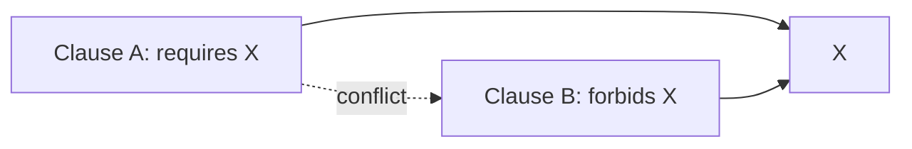
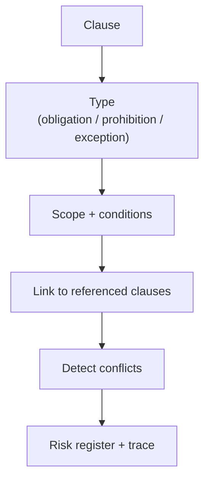

--8<-- "includes/quicknav.html"

# Legal: Contract Logic Conflicts

  

    

      
Case study → legal

      <h2 class="landing-title">Contracts are logic systems. Treat them like logic systems.</h2>
      

        Long agreements hide conflicts because obligations and exceptions are far apart.
        Chat summaries can be fluent while structurally wrong.
      

      

        <a class="md-button md-button--primary" href="../services/start.md">Start a Conversation</a>
        <a class="md-button" href="../methodology/property-and-knowledge-graphs.md">Graphs</a>
        <a class="md-button" href="../methodology/constraints.md">Constraints &amp; SHACL</a>
      

    

    

      
    

  

  <h2>The question</h2>
  

    
How do we surface contradictions in long contracts where obligations and exceptions are far apart?

  

  <h2>Why chat summaries fail</h2>
  

    
<h3>Structure is the point</h3>
Contracts are not prose; they are conditional rules with scope and precedence.

    
<h3>Conflicts are non-local</h3>
Clause A can silently contradict Clause B across sections and appendices.

    
<h3>No trace, no accountability</h3>
You need clause references and logic links, not just a summary paragraph.

  

  <h2>Graph representation</h2>
  

    
<strong>Model clauses as nodes and dependencies/conflicts as edges.</strong>

    
This makes contradictions computable and reviewable.

  

  <h2>Diagram: obligation/exception flow</h2>

  <h2>Outputs</h2>
  

    
<h3>Conflict graph</h3>
Edges with clause references and conditions under which the conflict triggers.

    
<h3>Risk register</h3>
Prioritized issues with remediation suggestions and owner workflows.

    
<h3>Traceable justification</h3>
Every flag links back to clauses, sources, and logic edges.

    
<h3>Governance integration</h3>
Constraints can block prohibited actions and require legal escalation.

  

  <h2>Next steps</h2>
  

    

      <a class="md-button md-button--primary" href="../services/start.md">Start a Conversation</a>
      <a class="md-button" href="../services/epistemic-audit.md">Epistemic Audit</a>
    

  

