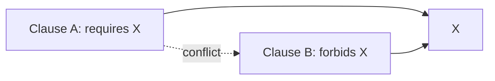

--8<-- "includes/quicknav.html"

# Legal: Contract Logic Conflicts

## The question

How do we surface contradictions in long contracts where obligations and exceptions are far apart?

## Why chat summaries fail

A model can summarize “standard-looking” language while missing structural conflicts:

- Clause A requires X
- Clause B forbids X

## Graph representation

Model clauses as nodes and dependencies/conflicts as edges.

## Outputs (skeleton)

- conflict graph with clause references
- risk register and remediation suggestions
- traceable justification for every flagged issue

Next: [Start a Conversation](../services/start.md).
