--8<-- "includes/quicknav.html"

# Legal: Contract Logic Conflicts

  

    

      
Case study → legal

      <h2 class="landing-title">Contracts are logic systems. Treat them like logic systems.</h2>
      

        Long agreements hide conflicts because obligations and exceptions are far apart.
        Chat summaries can be fluent while structurally wrong.
      

      

        <a class="md-button md-button--primary" href="/services/start/">Start a Conversation</a>
        <a class="md-button" href="/methodology/property-and-knowledge-graphs/">Graphs</a>
        <a class="md-button" href="/methodology/constraints/">Constraints &amp; SHACL</a>
      

    

  

## The question

  

    
How do we surface contradictions in long contracts where obligations and exceptions are far apart?

  

    

## Why chat summaries fail

  

    
<h3>Structure is the point</h3>
Contracts are not prose; they are conditional rules with scope and precedence.

    
<h3>Conflicts are non-local</h3>
Clause A can silently contradict Clause B across sections and appendices.

    
<h3>No trace, no accountability</h3>
You need clause references and logic links, not just a summary paragraph.

  

## Graph representation

  

    
<strong>Model clauses as nodes and dependencies/conflicts as edges.</strong>

    
This makes contradictions computable and reviewable.

  

⚖️ Contracts behave like logic graphs: when two clauses create incompatible constraints on the same object (X), a <strong>conflict edge</strong> becomes computable and reviewable.

```mermaid
flowchart LR
%% Styles (brModel Standard)
classDef i fill:#D3D3D3,stroke-width:0px,color:#000;
classDef p fill:#B3D9FF,stroke-width:0px,color:#000;
classDef r fill:#FFFFB3,stroke-width:0px,color:#000;
classDef o fill:#C1F0C1,stroke-width:0px,color:#000;
classDef s fill:#FFB3B3,stroke-width:0px,color:#000;

R_A(["📄 Clause A<br>requires X"]):::r
R_B(["📄 Clause B<br>forbids X"]):::r
P_X("🧩 X"):::p
S_C(["⚠️ Conflict edge"]):::s

R_A --> P_X
R_B --> P_X
R_A -. "conflict" .-> R_B
```

## Diagram: obligation/exception flow

```mermaid
flowchart TB
%% Styles (brModel Standard)
classDef i fill:#D3D3D3,stroke-width:0px,color:#000;
classDef p fill:#B3D9FF,stroke-width:0px,color:#000;
classDef r fill:#FFFFB3,stroke-width:0px,color:#000;
classDef o fill:#C1F0C1,stroke-width:0px,color:#000;
classDef s fill:#FFB3B3,stroke-width:0px,color:#000;

I_C(["📄 Clause"]):::i
P_T("🏷️ Classify type"):::p
R_Type(["obligation / prohibition / exception"]):::r
P_S("🧭 Extract scope + conditions"):::p
P_L("🔗 Link references"):::p
P_D("🔎 Detect conflicts"):::p
R_R(["🧾 Risk register + trace"]):::r
O_Out(["✅ Reviewable issues"]):::o

I_C --> P_T --> R_Type --> P_S --> P_L --> P_D --> R_R --> O_Out
```

🧭 This flow turns prose into structure: classify clause type, extract scope/conditions, link references, then detect conflicts. The output is a <strong>🧾 risk register</strong> with traceable clause paths — not a summary paragraph.

## Diagram: precedence and exception gates (what overrides what)

```mermaid
flowchart TB
%% Styles (brModel Standard)
classDef i fill:#D3D3D3,stroke-width:0px,color:#000;
classDef p fill:#B3D9FF,stroke-width:0px,color:#000;
classDef r fill:#FFFFB3,stroke-width:0px,color:#000;
classDef o fill:#C1F0C1,stroke-width:0px,color:#000;
classDef s fill:#FFB3B3,stroke-width:0px,color:#000;

I_Q(["🎯 Question / action"]):::i
P_Find("🔎 Find relevant clauses"):::p
R_Set(["📎 Candidate clause set"]):::r
G_Exc{"Exception applies?"}:::s
G_Prec{"Precedence clear?"}:::s
O_OK(["✅ Allowed / required<br>(with clause path)"]):::o
S_Esc(["🛑 Escalate: ambiguous conflict"]):::s
R_Tr(["🧾 Trace bundle<br>(clauses + conditions)"]):::r

I_Q --> P_Find --> R_Set --> G_Exc
G_Exc -->|"yes"| G_Prec
G_Exc -->|"no"| G_Prec

G_Prec -->|"yes"| O_OK --> R_Tr
G_Prec -->|"no"| S_Esc --> R_Tr
```

🚦 The hard part is not finding clauses — it’s deciding whether an <strong>exception</strong> applies and whether <strong>precedence</strong> is unambiguous. When it isn’t, the system must escalate instead of hallucinating certainty.

## Outputs

  

    
<h3>Conflict graph</h3>
Edges with clause references and conditions under which the conflict triggers.

    
<h3>Risk register</h3>
Prioritized issues with remediation suggestions and owner workflows.

    
<h3>Traceable justification</h3>
Every flag links back to clauses, sources, and logic edges.

    
<h3>Governance integration</h3>
Constraints can block prohibited actions and require legal escalation.

    
<h3>Exception handling</h3>
Non-local carve-outs and precedence rules surfaced explicitly, so reviewers don’t miss “only if…†conditions.

    
<h3>Negotiation levers</h3>
Which clauses drive the most downstream risk, and what edits reduce conflict without breaking the deal intent.

  

## Next steps

  

    

      <a class="md-button md-button--primary" href="/services/start/">Start a Conversation</a>
      <a class="md-button" href="/services/epistemic-audit/">Epistemic Audit</a>
    

  

