--8<-- "includes/quicknav.html"

# Legal: Contract Logic Conflicts

  

    

      
Case study → legal

      <h2 class="landing-title">Contracts are logic systems. Treat them like logic systems.</h2>
      

        Long agreements hide conflicts because obligations and exceptions are far apart.
        Chat summaries can be fluent while structurally wrong.
      

      

        <a class="md-button md-button--primary" href="/services/start/">Start a Conversation</a>
        <a class="md-button" href="/methodology/property-and-knowledge-graphs/">Graphs</a>
        <a class="md-button" href="/methodology/constraints/">Constraints &amp; SHACL</a>
      

    

  

## The question

  

    
How do we surface contradictions in long contracts where obligations and exceptions are far apart?

  

    

## Why chat summaries fail

  

    
<h3>Structure is the point</h3>
Contracts are not prose; they are conditional rules with scope and precedence.

    
<h3>Conflicts are non-local</h3>
Clause A can silently contradict Clause B across sections and appendices.

    
<h3>No trace, no accountability</h3>
You need clause references and logic links, not just a summary paragraph.

  

## Graph representation

  

    
<strong>Model clauses as nodes and dependencies/conflicts as edges.</strong>

    
This makes contradictions computable and reviewable.

  

⚖️ A contract becomes computable when you turn it into artifacts: <strong>clause objects</strong>, a <strong>term/definition graph</strong>, a <strong>precedence map</strong>, and a <strong>trace bundle</strong>. Conflicts aren’t guessed — they are detected through explicit gates (definitions resolved? precedence clear?) and escalated when ambiguity is structural.

```mermaid
flowchart TB
%% Styles (brModel Standard)
classDef i fill:#D3D3D3,stroke-width:0px,color:#000;
classDef p fill:#B3D9FF,stroke-width:0px,color:#000;
classDef r fill:#FFFFB3,stroke-width:0px,color:#000;
classDef o fill:#C1F0C1,stroke-width:0px,color:#000;
classDef s fill:#FFB3B3,stroke-width:0px,color:#000;

I_Doc(["📄 Contract + exhibits"]):::i
I_Def(["📘 Definitions section"]):::i
I_Jur(["⚖️ Jurisdiction / governing law"]):::i

P_Seg("✂️ Segment into clauses"):::p
R_Cla(["📄 Clause objects<br>(id, text, section)"]):::r

P_Ent("🏷️ Extract entities, terms, modalities"):::p
R_Terms(["📘 Term graph<br>(definitions + aliases)"]):::r
G_Def{"Definitions resolved?"}:::s
S_AskDef(["🛑 Ask for clarification / missing definitions"]):::s

P_Link("🔗 Link references + cross-refs"):::p
R_CG(["🕸️ Clause graph<br>(references, scope)"]):::r

P_Prec("📐 Build precedence + exception hierarchy"):::p
R_Prec(["📎 Precedence map<br>(overrides, carve-outs)"]):::r
G_Prec{"Precedence clear?"}:::s

P_Check("🧪 Evaluate obligations vs prohibitions"):::p
R_Conf(["⚠️ Conflict candidates<br>(with clause paths)"]):::r
G_Mat{"Material risk?"}:::s

O_Out(["✅ Review pack<br>(issues + suggested edits)"]):::o
S_Esc(["🛑 Escalate to counsel review"]):::s
R_Tr(["🧾 Trace bundle<br>(clause paths + conditions)"]):::r

I_Doc --> P_Seg --> R_Cla --> P_Ent --> R_Terms --> G_Def
I_Def --> P_Ent
I_Jur --> P_Prec

G_Def -->|"no"| S_AskDef --> R_Tr
G_Def -->|"yes"| P_Link --> R_CG --> P_Prec --> R_Prec --> G_Prec

G_Prec -->|"no"| S_Esc --> R_Tr
G_Prec -->|"yes"| P_Check --> R_Conf --> G_Mat

G_Mat -->|"yes"| S_Esc --> R_Tr --> O_Out
G_Mat -->|"no"| R_Tr --> O_Out
```

## Diagram: obligation/exception flow

```mermaid
flowchart TB
%% Styles (brModel Standard)
classDef i fill:#D3D3D3,stroke-width:0px,color:#000;
classDef p fill:#B3D9FF,stroke-width:0px,color:#000;
classDef r fill:#FFFFB3,stroke-width:0px,color:#000;
classDef o fill:#C1F0C1,stroke-width:0px,color:#000;
classDef s fill:#FFB3B3,stroke-width:0px,color:#000;

I_C(["📄 Clause text"]):::i
P_T("🏷️ Classify modality"):::p
G_Type{"Type clear?"}:::s
R_Type(["📎 Clause type<br>(obligation/prohibition/exception)"]):::r
S_EscType(["🛑 Escalate: ambiguous modality"]):::s

P_S("🧭 Extract scope + conditions"):::p
R_Scope(["🧾 Scope object<br>(who/what/when)"]):::r
P_Refs("🔗 Resolve defined terms + cross-refs"):::p
G_Refs{"Refs resolved?"}:::s
S_Ask(["🛑 Ask: missing definition / reference"]):::s

P_Rule("🧩 Translate to rule"):::p
R_Rule(["📐 Rule node<br>(condition → constraint)"]):::r
P_Insert("🕸️ Insert into clause graph"):::p
R_CG(["🕸️ Updated clause graph"]):::r

P_Check("🔎 Check against existing rules"):::p
G_Conf{"Conflict found?"}:::s
P_Diag("🧪 Diagnose trigger conditions"):::p
R_Conf(["⚠️ Conflict record<br>(paths + conditions)"]):::r

G_Prec{"Precedence resolves?"}:::s
O_OK(["✅ OK (with trace)"]):::o
O_Iss(["✅ Review issue<br>(with proposed edits)"]):::o
S_Esc(["🛑 Escalate to counsel"]):::s
R_Tr(["🧾 Trace bundle"]):::r

I_C --> P_T --> G_Type
G_Type -->|"no"| S_EscType --> R_Tr
G_Type -->|"yes"| R_Type --> P_S --> R_Scope --> P_Refs --> G_Refs

G_Refs -->|"no"| S_Ask --> R_Tr
G_Refs -->|"yes"| P_Rule --> R_Rule --> P_Insert --> R_CG --> P_Check --> G_Conf

G_Conf -->|"no"| O_OK --> R_Tr
G_Conf -->|"yes"| P_Diag --> R_Conf --> G_Prec

G_Prec -->|"yes"| O_Iss --> R_Tr
G_Prec -->|"no"| S_Esc --> R_Tr
```

🧭 This is where “point†happens: every clause is converted into a <strong>rule node</strong> and inserted into a graph. If terms or references can’t be resolved, the system must <strong>stop and ask</strong>. If conflicts appear, precedence is tested; if precedence is unclear, it escalates instead of inventing certainty.

## Diagram: precedence and exception gates (what overrides what)

```mermaid
flowchart TB
%% Styles (brModel Standard)
classDef i fill:#D3D3D3,stroke-width:0px,color:#000;
classDef p fill:#B3D9FF,stroke-width:0px,color:#000;
classDef r fill:#FFFFB3,stroke-width:0px,color:#000;
classDef o fill:#C1F0C1,stroke-width:0px,color:#000;
classDef s fill:#FFB3B3,stroke-width:0px,color:#000;

I_Q(["🎯 Proposed action<br>(send, disclose, terminate)"]):::i
P_Find("🔎 Retrieve applicable clauses"):::p
R_Set(["📎 Candidate clause set"]):::r

P_App("🧭 Build applicability chain"):::p
R_App(["🧾 Applicability record<br>(conditions met?)"]):::r
G_Exc{"Exception applies?"}:::s

P_Prec("📐 Evaluate precedence"):::p
G_Prec{"Precedence clear?"}:::s

P_Out("⚖️ Determine allowed/required"):::p
G_Risk{"High stakes?"}:::s

O_OK(["✅ Allow / require<br>(with clause path)"]):::o
S_Esc(["🛑 Escalate: ambiguity / conflict"]):::s
R_Tr(["🧾 Trace bundle<br>(clauses + conditions)"]):::r
R_Neg(["📝 Negotiation levers<br>(which clause drives risk)"]):::r

I_Q --> P_Find --> R_Set --> P_App --> R_App --> G_Exc
G_Exc -->|"yes"| P_Prec
G_Exc -->|"no"| P_Prec

P_Prec --> G_Prec
G_Prec -->|"no"| S_Esc --> R_Tr
G_Prec -->|"yes"| P_Out --> G_Risk

G_Risk -->|"yes"| S_Esc --> R_Tr
G_Risk -->|"no"| O_OK --> R_Tr

R_Tr --> R_Neg
```

🚦 The decision mechanism is explicit: compute applicability, test exceptions, evaluate precedence, and gate on high-stakes actions. The output isn’t a chat answer — it’s a <strong>trace bundle</strong> plus <strong>negotiation levers</strong> that show exactly which clauses create downstream risk.

## Outputs

  

    
<h3>Conflict graph</h3>
Edges with clause references and conditions under which the conflict triggers.

    
<h3>Risk register</h3>
Prioritized issues with remediation suggestions and owner workflows.

    
<h3>Traceable justification</h3>
Every flag links back to clauses, sources, and logic edges.

    
<h3>Governance integration</h3>
Constraints can block prohibited actions and require legal escalation.

    
<h3>Exception handling</h3>
Non-local carve-outs and precedence rules surfaced explicitly, so reviewers don’t miss “only if…†conditions.

    
<h3>Negotiation levers</h3>
Which clauses drive the most downstream risk, and what edits reduce conflict without breaking the deal intent.

  

## Next steps

  

    

      <a class="md-button md-button--primary" href="/services/start/">Start a Conversation</a>
      <a class="md-button" href="/services/epistemic-audit/">Epistemic Audit</a>
    

  

