--8<-- "includes/quicknav.html"

# Manufacturing: Root-Cause Analysis Across the Supply Chain

  

    

      
Case study → manufacturing

      <h2 class="landing-title">Quality failures are causal systems, not isolated defects.</h2>
      

        Manufacturing issues rarely have one cause.
        They propagate through process steps, tooling, suppliers, and environmental conditions.
        We make those chains explicit and auditable.
      

      

        <a class="md-button md-button--primary" href="/services/start/">Start a Conversation</a>
        <a class="md-button" href="/methodology/causalgraphrag/">CausalGraphRAG</a>
        <a class="md-button" href="/services/blueprint/">Architecture Blueprint</a>
      

    

  

## The question

  

    

      How do we identify root causes of quality failures when evidence spans sensors, process logs,
      maintenance events, and supplier batches — and decisions must be justified?
    

  

## Failure modes to avoid

  

    
<h3>Correlation traps</h3>
Spurious correlations appear in high-dimensional sensor data.

    
<h3>Missing context</h3>
Process step dependencies and maintenance history are often disconnected.

    
<h3>Non-reproducible investigations</h3>
Root-cause analysis becomes tribal knowledge without traces.

    
<h3>Unsafe actions</h3>
Line stops, recalls, and supplier blocks must be governed and reviewed.

    
<h3>Batch confounding</h3>
Supplier lots, shifts, and ambient conditions can confound signals unless modeled explicitly.

    
<h3>Measurement drift</h3>
Sensor calibration and threshold changes can look like process change without a provenance trail.

  

## What changes with causal chains

```mermaid
flowchart TB
%% Styles (brModel Standard)
classDef i fill:#D3D3D3,stroke-width:0px,color:#000;
classDef p fill:#B3D9FF,stroke-width:0px,color:#000;
classDef r fill:#FFFFB3,stroke-width:0px,color:#000;
classDef o fill:#C1F0C1,stroke-width:0px,color:#000;
classDef s fill:#FFB3B3,stroke-width:0px,color:#000;

I_B(["📦 Batch / lot"]):::i
R_Sup(["📎 Supplier COA + lot history"]):::r
R_Proc(["📎 Process recipe + setpoints"]):::r
R_Tool(["📎 Tool calibration + maintenance"]):::r
R_Env(["📎 Environment<br>(temp, humidity)"]):::r
R_Sens(["📈 Sensor telemetry"]):::r

P_Prov("🧾 Provenance + time alignment"):::p
R_EB(["📎 Evidence bundle<br>(joined by batch/time)"]):::r

P_CG("🕸️ Build causal graph"):::p
R_CG(["🕸️ Process causal graph<br>(steps, tools, suppliers)"]):::r

P_Anom("🔎 Detect anomalies"):::p
R_Q(["📈 Quality signals<br>(yield, defects)"]):::r

G_Drift{"Drift detected?"}:::s
G_Conf{"Confounders controlled?"}:::s

S_F(["⚠️ Failure / deviation"]):::s
O_R(["✅ Root-cause candidates<br>(with evidence per link)"]):::o
R_Tr(["🧾 Trace object<br>(batch → signals → causes)"]):::r

I_B --> P_Prov
R_Sup --> P_Prov
R_Proc --> P_Prov
R_Tool --> P_Prov
R_Env --> P_Prov
R_Sens --> P_Prov

P_Prov --> R_EB --> P_CG --> R_CG --> P_Anom --> R_Q --> G_Drift
G_Drift -->|"yes"| S_F --> G_Conf
G_Drift -->|"no"| G_Conf
G_Conf -->|"yes"| O_R --> R_Tr
G_Conf -->|"no"| S_F --> R_Tr
```

🭠The mechanism is multi-source: supplier lots, recipes, tooling, environment, and telemetry are merged into an <strong>evidence bundle</strong>, then turned into a <strong>causal graph</strong>. Drift and confounders become explicit gates; the output is root-cause candidates with evidence per link — packaged as a trace object.

## Diagram: governed RCA workflow

```mermaid
flowchart TB
%% Styles (brModel Standard)
classDef i fill:#D3D3D3,stroke-width:0px,color:#000;
classDef p fill:#B3D9FF,stroke-width:0px,color:#000;
classDef r fill:#FFFFB3,stroke-width:0px,color:#000;
classDef o fill:#C1F0C1,stroke-width:0px,color:#000;
classDef s fill:#FFB3B3,stroke-width:0px,color:#000;

I_Inc(["⚠️ Incident"]):::i
P_E("📎 Collect evidence"):::p
R_Src(["📎 Sources<br>(MES, SCADA, CMMS, supplier)"]):::r
P_Prov("🧾 Validate provenance"):::p
G_Prov{"Provenance ok?"}:::s

P_Path("🧭 Generate causal paths"):::p
R_Path(["🧭 Path candidates<br>(with assumptions)"]):::r
G_Ev{"Evidence sufficient?"}:::s

P_Conf("🧪 Confounder checks"):::p
G_Conf{"Confounders controlled?"}:::s

P_V("🔒 Validate constraints + required evidence"):::p
G_OK{"Gates pass?"}:::s

O_A(["✅ RCA report + recommendation"]):::o
R_Tr(["🧾 RCA trace bundle<br>(evidence + paths + gates)"]):::r
S_X(["🛑 Abstain + request missing data"]):::s

I_Inc --> P_E --> R_Src --> P_Prov --> G_Prov
G_Prov -->|"no"| S_X
G_Prov -->|"yes"| P_Path --> R_Path --> G_Ev

G_Ev -->|"no"| S_X
G_Ev -->|"yes"| P_Conf --> G_Conf

G_Conf -->|"no"| S_X
G_Conf -->|"yes"| P_V --> G_OK

G_OK -->|"yes"| O_A --> R_Tr
G_OK -->|"no"| S_X --> R_Tr

%% Clickable nodes
click P_V "/methodology/constraints/" "Constraints & SHACL"
click P_Path "/methodology/causalgraphrag/" "CausalGraphRAG"
```

🔠RCA becomes reproducible when gates are explicit: provenance must hold, evidence must be sufficient, confounders must be controlled, and only then do constraints approve a recommendation. When any gate fails, the correct output is <strong>abstention</strong> with a precise missing-data request — not a forced conclusion.

## Diagram: intervention approval gates (preventing unsafe fixes)

```mermaid
flowchart TB
%% Styles (brModel Standard)
classDef i fill:#D3D3D3,stroke-width:0px,color:#000;
classDef p fill:#B3D9FF,stroke-width:0px,color:#000;
classDef r fill:#FFFFB3,stroke-width:0px,color:#000;
classDef o fill:#C1F0C1,stroke-width:0px,color:#000;
classDef s fill:#FFB3B3,stroke-width:0px,color:#000;

I_Fix(["🧩 Proposed intervention<br>(tooling, recipe, supplier)"]):::i
G_Impact{"High impact?"}:::s
G_Ev{"Evidence sufficient?"}:::s
G_Safe{"Safety constraints pass?"}:::s

P_Pilot("🧪 Pilot / sandbox test"):::p
G_Pilot{"Pilot success?"}:::s
P_RB("🧯 Define rollback plan"):::p
G_Sign{"Sign-offs complete?"}:::s

O_Do(["✅ Execute change"]):::o
P_Mon("📈 Monitor outcome"):::p
G_Reg{"Regression detected?"}:::s

S_Rev(["🛑 Require review / sign-off"]):::s
S_Stop(["🛑 Stop + rollback"]):::s
R_Tr(["🧾 Change trace bundle<br>(tests + approvals + results)"]):::r

I_Fix --> G_Impact
G_Impact -->|"yes"| G_Ev
G_Impact -->|"no"| G_Ev

G_Ev -->|"no"| S_Rev --> R_Tr
G_Ev -->|"yes"| G_Safe

G_Safe -->|"no"| S_Rev --> R_Tr
G_Safe -->|"yes"| P_Pilot --> G_Pilot

G_Pilot -->|"no"| S_Rev --> R_Tr
G_Pilot -->|"yes"| P_RB --> G_Sign

G_Sign -->|"no"| S_Rev --> R_Tr
G_Sign -->|"yes"| O_Do --> P_Mon --> G_Reg

G_Reg -->|"yes"| S_Stop --> R_Tr
G_Reg -->|"no"| R_Tr
```

🚦 The fix is also a governed decision: impact, evidence, and safety constraints gate the intervention; then a pilot test, rollback plan, and sign-offs are required. After execution, monitoring gates whether to keep or rollback — and the full lifecycle is captured in a trace bundle.

## Outputs

  

    
<h3>Root-cause paths</h3>
Mechanistic chains with evidence per edge and explicit assumptions.

    
<h3>Traceable interventions</h3>
Line adjustments, supplier actions, and mitigations tied to the trace artifact.

    
<h3>Faster postmortems</h3>
Investigations become repeatable and comparable over time.

    
<h3>Governed escalation</h3>
High-impact actions trigger review gates and mandatory sign-offs.

    
<h3>Supplier propagation map</h3>
How upstream batch and supplier events flow into downstream quality signals — with evidence per link.

    
<h3>Change-impact analysis</h3>
Before you adjust a process, the system can show which constraints, steps, and failure modes the change touches.

  

## Next steps

  

    

      <a class="md-button md-button--primary" href="/services/epistemic-audit/">Epistemic Audit</a>
      <a class="md-button" href="/services/implementation/">Implementation</a>
    

  

