<!-- markdownlint-disable MD033 MD025 -->

--8<-- "includes/quicknav.html"

# Pharma & Clinical Ops: Trial Decisions With Auditable Evidence

  

    

      
Case study → pharma / clinical ops

      <h2 class="landing-title">Clinical decisions require provenance, protocol constraints, and abstention.</h2>
      

        Clinical operations are full of non-negotiable constraints: protocol, consent, safety reporting, and regulatory requirements.
        A decision-grade system must surface evidence paths and refuse when the chain is incomplete.
      

      

        <a class="md-button md-button--primary" href="/services/start/">Start a Conversation</a>
        <a class="md-button" href="/methodology/brcausalgraphrag/">brCausalGraphRAG</a>
        <a class="md-button" href="/methodology/constraints/">Constraints &amp; SHACL</a>
      

    

  

## The question

  

    

      Can AI support trial operations (eligibility checks, deviations, safety signals, vendor coordination)
      while enforcing protocol and producing artifacts that withstand audit and inspection?
    

  

    

## Failure modes to avoid

  

    
<h3>Protocol drift</h3>
Recommendations that ignore inclusion/exclusion criteria or exception procedures.

    
<h3>Evidence ambiguity</h3>
Summaries that merge incompatible sources across versions and sites.

    
<h3>Unsafe overconfidence</h3>
Fluent outputs that hide missing data or unverified assumptions.

    
<h3>Non-auditable workflows</h3>
If you can’t show provenance and rules applied, you can’t defend decisions.

    
<h3>Amendment confusion</h3>
Protocol amendments change requirements; systems must enforce the correct version per site and time.

    
<h3>Site variability</h3>
Local practices and vendor workflows differ; constraints must reflect real operational context.

  

## What changes with constraint-gated evidence paths

```mermaid
flowchart TB
%% Styles (brModel Standard)
classDef i fill:#D3D3D3,stroke-width:0px,color:#000;
classDef p fill:#B3D9FF,stroke-width:0px,color:#000;
classDef r fill:#FFFFB3,stroke-width:0px,color:#000;
classDef o fill:#C1F0C1,stroke-width:0px,color:#000;
classDef s fill:#FFB3B3,stroke-width:0px,color:#000;

I_Q(["📥 Operational question"]):::i

R_Sub(["🧾 Subject + site context"]):::r
R_Prot(["📜 Protocol + amendments<br>(versioned)"]):::r
R_Cons(["📝 Consent artifacts"]):::r
R_Safety(["⚕️ Safety reporting rules"]):::r
R_Ops(["📎 Ops sources<br>(EDC, CTMS, vendor logs)"]):::r

P_E("📎 Retrieve + normalize evidence"):::p
R_EB(["📎 Evidence bundle<br>(fingerprinted)"]):::r

P_Map("🧭 Map correct version per site/time"):::p
G_Ver{"Correct version?"}:::s
S_Stop(["🛑 Block + escalate<br>(version mismatch)"]):::s

P_Path("🕸️ Build evidence paths"):::p
R_Path(["🧭 Path candidates<br>(eligibility / safety / ops)"]):::r
G_Ev{"Evidence sufficient?"}:::s
S_Req(["🛑 Request missing data"]):::s

G_Elig{"Eligibility satisfied?"}:::s
G_SAE{"Safety trigger?"}:::s

P_G("🔒 Protocol + safety constraints"):::p
G_OK{"Gates pass?"}:::s

O_O(["✅ Recommendation + trace"]):::o
S_X(["🛑 Abstain + escalate"]):::s
R_Tr(["🧾 Inspection bundle<br>(evidence + rules + versions)"]):::r

I_Q --> P_E
R_Sub --> P_E
R_Prot --> P_E
R_Cons --> P_E
R_Safety --> P_E
R_Ops --> P_E

P_E --> R_EB --> P_Map --> G_Ver
G_Ver -->|"no"| S_Stop --> R_Tr
G_Ver -->|"yes"| P_Path --> R_Path --> G_Ev

G_Ev -->|"no"| S_Req --> R_Tr
G_Ev -->|"yes"| G_Elig

G_Elig -->|"no"| S_X --> R_Tr
G_Elig -->|"yes"| G_SAE

G_SAE -->|"yes"| P_G
G_SAE -->|"no"| P_G

P_G --> G_OK
G_OK -->|"yes"| O_O --> R_Tr
G_OK -->|"no"| S_X --> R_Tr

%% Clickable nodes
click P_G "/methodology/constraints/" "Constraints & SHACL"
click R_Path "/methodology/causalgraphrag/" "CausalGraphRAG"
```

💊 Clinical ops becomes decision-grade when the system produces inspection artifacts (evidence bundle, version mapping, evidence paths) and enforces explicit gates: <strong>correct protocol version</strong>, <strong>evidence sufficiency</strong>, <strong>eligibility</strong>, and <strong>protocol/safety constraints</strong>. Every path ends in an inspection bundle — even abstentions.

## Diagram: provenance-first decision artifact

```mermaid
flowchart TB
%% Styles (brModel Standard)
classDef i fill:#D3D3D3,stroke-width:0px,color:#000;
classDef p fill:#B3D9FF,stroke-width:0px,color:#000;
classDef r fill:#FFFFB3,stroke-width:0px,color:#000;
classDef o fill:#C1F0C1,stroke-width:0px,color:#000;
classDef s fill:#FFB3B3,stroke-width:0px,color:#000;

I_S(["📄 Sources<br>(protocol, logs, reports)"]):::i
P_Fp("🧼 Normalize + fingerprint"):::p
R_EB(["📎 Evidence bundle<br>(signed references)"]):::r

P_Cl("🧾 Extract claims"):::p
R_C(["🧾 Claim set<br>(with provenance)"]):::r

P_R("🔒 Rules applied"):::p
R_R(["📎 Rule triggers<br>(protocol + SOP)"]):::r

P_D("⚖️ Decision"):::p
G_Rev{"High stakes?"}:::s
S_Rev(["🛑 Require human review"]):::s

R_T(["🧾 Trace + inspection bundle<br>(claims + rules + versions)"]):::r
P_Store("🗄️ Store in TMF-ready archive"):::p
O_Out(["✅ Defensible outcome"]):::o

I_S --> P_Fp --> R_EB --> P_Cl --> R_C --> P_R --> R_R --> P_D --> G_Rev
G_Rev -->|"yes"| S_Rev --> R_T
G_Rev -->|"no"| R_T
R_T --> P_Store --> O_Out
```

🧾 The inspection artifact is explicit: sources are fingerprinted into an evidence bundle, claims are extracted with provenance, rule triggers are applied, and high-stakes decisions are gated to human review. The output is a trace + inspection bundle suitable for TMF-style archival.

## Diagram: protocol versioning gates (avoid amendment confusion)

```mermaid
flowchart TB
%% Styles (brModel Standard)
classDef i fill:#D3D3D3,stroke-width:0px,color:#000;
classDef p fill:#B3D9FF,stroke-width:0px,color:#000;
classDef r fill:#FFFFB3,stroke-width:0px,color:#000;
classDef o fill:#C1F0C1,stroke-width:0px,color:#000;
classDef s fill:#FFB3B3,stroke-width:0px,color:#000;

I_Am(["🧩 Protocol amendment / version"]):::i
P_Map("🧭 Map version to site + time"):::p
G_Ver{"Correct version selected?"}:::s
S_Stop(["🛑 Block + escalate"]):::s

P_Impact("🧪 Impact analysis"):::p
R_Aff(["📎 Affected subjects + workflows"]):::r
P_Diff("🧾 Compute decision diffs"):::p
R_Diff(["🧾 Diff bundle<br>(what changes, where)"]):::r

G_Train{"Training updated?"}:::s
P_Reeval("🧪 Re-evaluate impacted decisions"):::p
G_Gate{"Gates pass?"}:::s

O_OK(["✅ Continue operations"]):::o
R_Tr(["🧾 Inspection bundle<br>(version + diffs + gates)"]):::r

I_Am --> P_Map --> G_Ver
G_Ver -->|"no"| S_Stop --> R_Tr
G_Ver -->|"yes"| P_Impact --> R_Aff --> P_Diff --> R_Diff --> G_Train

G_Train -->|"no"| S_Stop --> R_Tr
G_Train -->|"yes"| P_Reeval --> G_Gate

G_Gate -->|"yes"| O_OK --> R_Tr
G_Gate -->|"no"| S_Stop --> R_Tr
```

🚦 Amendments change what is allowed. Versioning must be operational: select the correct version per site/time, run impact analysis, compute decision diffs, verify training updates, and only then re-evaluate and gate continuation. The output is an inspection bundle that shows what changed and why operations stayed compliant.

## Outputs

  

    
<h3>Protocol-safe recommendations</h3>
Decisions bounded by eligibility, consent, and safety reporting rules.

    
<h3>Inspection-ready traces</h3>
Evidence, versions, rules applied, and justification captured as artifacts.

    
<h3>Faster deviation triage</h3>
Non-local dependencies across sites and vendors become navigable structures.

    
<h3>Deterministic escalation</h3>
When evidence is insufficient, the system refuses and specifies what is required.

    
<h3>Protocol deviation prevention</h3>
Constraint gates block risky recommendations early, before they become operational deviations or inspection findings.

    
<h3>Regulatory evidence bundles</h3>
Decision artifacts packaged for audit: provenance, versions, rule triggers, and the full trace path in one place.

  

## Next steps

  

    

      <a class="md-button md-button--primary" href="/services/epistemic-audit/">Epistemic Audit</a>
      <a class="md-button" href="/services/blueprint/">Architecture Blueprint</a>
    

  

