# Diagram Gallery

--8<-- "includes/quicknav.html"

A curated library of causal diagrams (SVG) with fast preview and search.

## Featured

{ .glightbox }

## Model library (sources)

The following diagrams have Mermaid source files in `docs/diagrams/mmd/`. SVG previews can be rendered via the diagram workflow.

### AI Agent vs Agentic AI

{ .glightbox }

Source: `mmd/ai-agent-vs-agentic-ai.mmd`

### Correlation vs Causality

{ .glightbox }

Source: `mmd/correlation-vs-causality.mmd`

### Property & Knowledge Graphs

{ .glightbox }

Source: `mmd/property-and-knowledge-graphs.mmd`

### LLM + Tool + RAG

{ .glightbox }

Source: `mmd/llm-tool-rag.mmd`

### CausalGraphRAG

{ .glightbox }

Source: `mmd/causalgraphrag.mmd`

### brCausalGraphRAG

{ .glightbox }

Source: `mmd/brcausalgraphrag.mmd`

### Temporal Memory Beats Bigger Context

{ .glightbox }

Source: `mmd/temporal-memory-beats-bigger-context.mmd`

### Mechanism-Executable Causal GraphRAG

{ .glightbox }

Source: `mmd/mechanism-executable-causal-graphrag.mmd`

### HRM’s Latent Reasoning Still Needs Verification

{ .glightbox }

Source: `mmd/hrm-latent-reasoning-needs-verification.mmd`

!!! note
    The SVGs in this gallery are preview assets. The source of truth lives in the corresponding Mermaid blocks inside posts.

!!! tip
    The preview uses a small local lightbox (no third-party analytics). To enable the same behavior elsewhere, add `{ .glightbox }` to an image.
