--8<-- "includes/quicknav.html"

# How This Site Works

	

		

			
Site conventions

			<h2 class="landing-title">A docs site, run like a product.</h2>
			

				The goal is simple: keep navigation stable, make content discoverable at scale, and ensure every diagram and model has an obvious home.
				This page explains the conventions we actually use today.
			

			

				<a class="md-button md-button--primary" href="/home/start-here/">Start Here</a>
				<a class="md-button" href="/blog/">Blog</a>
			

		

	

## Navigation philosophy

This site is intentionally *diagram-first* and *index-driven*.

- The top tabs are stable section entry points.
- Section landing pages (like Blog and Diagram Gallery) carry most discovery.
- Diagrams are not decoration: many of them are interactive navigation.

!!! info
    Some Mermaid diagram nodes are clickable. Hover to see a pointer cursor, then click to navigate.

	

		

			<h3>Sidebar is curated</h3>
			
The left sidebar is a small tree of durable pages. It should stay calm as the site grows.

		

		

			<h3>Blog scales via indexes</h3>
			
We don’t add every post to navigation. Discovery happens through the <strong>Blog index</strong>, built-in <strong>search</strong>, and <strong>Topics</strong>.

		

		

			<h3>Landing pages do the heavy lifting</h3>
			
Each section has an overview page that routes readers to the right depth: overview → evergreen → posts/models.

		

	

## How to read this site

If you only remember one heuristic, use this:

1. Start on a landing page.
2. Follow the diagram.
3. When you want depth, open the evergreen page.
4. When you want examples, open a case study or a blog post.

### Diagram conventions (practical)

- If a diagram node is clickable, it routes you to the relevant page.
- Long labels are allowed to wrap (you can also use ` ` in labels for deterministic line breaks).
- In dark mode, node label text is kept readable.

## Where content lives (for contributors)

	

		

			<h3>Blog posts</h3>
			
Posts live in <code>docs/blog/posts/</code>. The Blog index links to them chronologically.

		

		

			<h3>Evergreen pages</h3>
			
Stable concepts live in their section folders (e.g., Methodology, Philosophy). Only truly durable pages go into nav.

		

		

			<h3>Experimental drafts</h3>
			
Diagram sources live in <code>docs/diagrams/mmd/</code> and rendered previews live in <code>docs/diagrams/img/</code>.

		

	

## Site structure at a glance

```mermaid
flowchart TB
%% Styles (brModel Standard)
classDef i fill:#D3D3D3,stroke-width:0px,color:#000;
classDef p fill:#B3D9FF,stroke-width:0px,color:#000;
classDef r fill:#FFFFB3,stroke-width:0px,color:#000;
classDef o fill:#C1F0C1,stroke-width:0px,color:#000;
classDef s fill:#FFB3B3,stroke-width:0px,color:#000;

S_You("👤 You"):::s
P_Start("🧭 Start Here"):::p
P_HowWorks("ℹ️ How This Site Works"):::p
I_Map(["🗺️ Use diagrams as navigation\n(clickable nodes)"]):::i

S_You --> P_Start --> I_Map
S_You -. "need context" .-> P_HowWorks --> P_Start

%% Home
H_Sec(["🏠 Home"]):::i
H_Overview("🏠 Overview"):::i
H_Start("🧭 Start Here"):::i
H_Inquiry("📝 Inquiry"):::i
H_HowWorks("ℹ️ How This Site Works"):::i
H_Sec --> H_Overview --> H_Start --> H_Inquiry --> H_HowWorks

%% Reasoners
R_Sec(["🤝 Reasoners"]):::i
R_Overview("🤝 Overview"):::i
R_About("ℹ️ About"):::i
R_Team("👥 Team & Philosophy"):::i
R_FAQ("❓ FAQ"):::i
R_Terms("📜 Terms of Use"):::i
R_Vision("🗓️ Vision 2026"):::i
R_Ops("🛰️ Operating Model"):::i
R_Gov("🏛️ Governance Approach"):::i
R_Sec --> R_Overview --> R_About --> R_Team --> R_FAQ --> R_Terms --> R_Vision --> R_Ops --> R_Gov

%% Philosophy
PH_Sec(["🧠 Philosophy"]):::i
PH_Overview("🧠 Overview"):::i
PH_Prob("🎲 Why Probabilistic AI Fails"):::i
PH_Laws("⚖️ The Three Laws"):::i
PH_Agent("🤖 AI Agent vs Agentic AI"):::i
PH_Corr("📈 Correlation vs Causality"):::i
PH_Consc("🧠 AI Consciousness"):::i
PH_Sec --> PH_Overview --> PH_Prob --> PH_Laws --> PH_Agent --> PH_Corr --> PH_Consc

%% Methodology
M_Sec(["📐 Methodology"]):::i
M_Overview("📐 Overview"):::i
M_Prim("🧱 Core Primitives"):::i
M_Tool("🧰 LLM + Tool + RAG"):::i
M_PKG("🧩 Property-Knowledge Graph"):::i
M_CGR("🧭 CausalGraphRAG"):::i
M_brCGR("🧭 brCausalGraphRAG"):::i
M_Constr("🔒 Constraints & SHACL"):::i
M_Sec --> M_Overview --> M_Prim --> M_Tool --> M_PKG --> M_CGR --> M_brCGR --> M_Constr

%% Services
S_Sec(["🧰 Services"]):::i
S_Overview("🧰 Overview"):::i
S_Audit("🔎 Epistemic Audit"):::i
S_Blue("📐 Architecture Blueprint"):::i
S_Impl("🧑‍💻 Implementation"):::i
S_Partner("🤝 Ongoing Partnership"):::i
S_Contact("📞 Start a conversation"):::i
S_Sec --> S_Overview --> S_Audit --> S_Blue --> S_Impl --> S_Partner --> S_Contact

%% Case Studies
C_Sec(["🧾 Case Studies"]):::i
C_Overview("🧾 Overview"):::i
C_ECM("🏢 Enterprise Central Memory"):::i
C_Bio("🧬 Biomedicine"):::i
C_Fin("💳 Finance"):::i
C_Legal("⚖️ Legal"):::i
C_Ins("🛡️ Insurance"):::i
C_Cyber("🧯 Cybersecurity"):::i
C_Manu("🏭 Manufacturing"):::i
C_Energy("⚡ Energy & Utilities"):::i
C_Pharma("🧪 Pharma & Clinical Ops"):::i
C_Sec --> C_Overview --> C_ECM --> C_Bio --> C_Fin --> C_Legal --> C_Ins --> C_Cyber --> C_Manu --> C_Energy --> C_Pharma

%% Blog
B_Sec(["📰 Blog"]):::i
B_Index("📰 Blog index"):::i
B_Read("📝 How to read"):::i
B_Topics("🏷️ Topics"):::i
B_Posts("📚 Posts (chronological)"):::i

B_P1("Temporal Memory Beats Bigger Context"):::i
B_P2("Mechanism-Executable Causal GraphRAG"):::i
B_P3("HRM’s Latent Reasoning Still Needs Verification"):::i
B_P4("Agent Memory Needs Identity, Governance, and Decay"):::i
B_P5("AI Coding Assistants: A Causal Framework"):::i
B_P6("From SWOT to Testable Causal Hypotheses"):::i
B_P7("Why Small Frictions Cascade into System Failure"):::i

B_Sec --> B_Index --> B_Read --> B_Topics --> B_Posts
B_Posts --> B_P1 --> B_P2 --> B_P3 --> B_P4 --> B_P5 --> B_P6 --> B_P7


I_Map --> H_Sec
I_Map --> R_Sec
I_Map --> PH_Sec
I_Map --> M_Sec
I_Map --> S_Sec
I_Map --> C_Sec
I_Map --> B_Sec

%% Clickable nodes
click P_Start "/home/start-here/" "Start Here"
click P_HowWorks "/home/how-this-site-works/" "How This Site Works"

click H_Overview "/" "Home"
click H_Start "/home/start-here/" "Start Here"
click H_Inquiry "/home/inquiry/" "Inquiry"
click H_HowWorks "/home/how-this-site-works/" "How This Site Works"

click R_Overview "/reasoners/" "Reasoners"
click R_About "/reasoners/about/" "About"
click R_Team "/reasoners/team/" "Team & Philosophy"
click R_FAQ "/reasoners/faq/" "FAQ"
click R_Terms "/reasoners/terms/" "Terms of Use"
click R_Vision "/reasoners/vision-2026/" "Vision 2026"
click R_Ops "/reasoners/operating-model/" "Operating Model"
click R_Gov "/reasoners/governance/" "Governance Approach"

click PH_Overview "/philosophy/" "Philosophy"
click PH_Prob "/philosophy/probabilistic-ai/" "Why Probabilistic AI Fails"
click PH_Laws "/philosophy/three-laws/" "The Three Laws"
click PH_Agent "/philosophy/ai-agent-vs-agentic-ai/" "AI Agent vs Agentic AI"
click PH_Corr "/philosophy/correlation-vs-causality/" "Correlation vs Causality"
click PH_Consc "/philosophy/ai-consciousness/" "AI Consciousness"

click M_Overview "/methodology/" "Methodology"
click M_Prim "/methodology/core-primitives/" "Core Primitives"
click M_Tool "/methodology/llm-tool-rag/" "LLM + Tool + RAG"
click M_PKG "/methodology/property-and-knowledge-graphs/" "Property-Knowledge Graph"
click M_CGR "/methodology/causalgraphrag/" "CausalGraphRAG"
click M_brCGR "/methodology/brcausalgraphrag/" "brCausalGraphRAG"
click M_Constr "/methodology/constraints/" "Constraints & SHACL"

click S_Overview "/services/" "Services"
click S_Audit "/services/epistemic-audit/" "Epistemic Audit"
click S_Blue "/services/blueprint/" "Architecture Blueprint"
click S_Impl "/services/implementation/" "Implementation"
click S_Partner "/services/partnership/" "Ongoing Partnership"
click S_Contact "/services/start/" "Start a conversation"

click C_Overview "/case-studies/" "Case Studies"
click C_ECM "/case-studies/enterprise-central-memory/" "Enterprise Central Memory"
click C_Bio "/case-studies/biomedicine/" "Biomedicine"
click C_Fin "/case-studies/finance/" "Finance"
click C_Legal "/case-studies/legal/" "Legal"
click C_Ins "/case-studies/insurance/" "Insurance"
click C_Cyber "/case-studies/cybersecurity/" "Cybersecurity"
click C_Manu "/case-studies/manufacturing/" "Manufacturing"
click C_Energy "/case-studies/energy-utilities/" "Energy & Utilities"
click C_Pharma "/case-studies/pharma-clinical-ops/" "Pharma & Clinical Ops"

click B_Index "/blog/" "Blog"
click B_Read "/blog/how-to-read/" "How to Read"
click B_Topics "/blog/topics/" "Topics"
click B_P1 "/blog/posts/temporal-memory-beats-bigger-context/" "Post"
click B_P2 "/blog/posts/mechanism-executable-causal-graphrag/" "Post"
click B_P3 "/blog/posts/hrm-latent-reasoning-needs-verification/" "Post"
click B_P4 "/blog/posts/memory-needs-identity-governance-and-decay/" "Post"
click B_P5 "/blog/posts/ai-coding-assistants-a-causal-framework/" "Post"
click B_P6 "/blog/posts/from-swot-to-testable-hypotheses/" "Post"
click B_P7 "/blog/posts/why-small-frictions-cascade-into-system-failure/" "Post"

click D_Overview "/diagrams/" "Diagram Gallery"
```

## Under the hood (what’s actually implemented)

### Fast navigation

The site uses MkDocs Material “instant navigation”, which swaps pages without a full reload. To keep behavior consistent after page swaps, custom scripts subscribe to Material’s `document$` hook when available.

### Links and legacy routes

- Internal links that end with `.md` are rewritten to directory-style URLs (for clean URLs).
- Legacy `/about/*` paths are redirected to `/reasoners/*`.

### Diagrams

- Mermaid is rendered from fenced code blocks.
- Some nodes are clickable via Mermaid `click` directives.
- We apply small runtime fixes so label wrapping and link styling behave consistently.

### Images and large diagrams

- Any image with the `.glightbox` class opens in a small local lightbox (no third-party embed).
- Some pages can optionally open diagrams in a `<dialog>` modal.

## Build and deploy

- Deployment is done via GitHub Actions to GitHub Pages.
- The deploy workflow uses `zensical serve` on CI and pre-renders every Markdown URL into `site/` before publishing.
- Diagram previews are rendered from `.mmd` sources into `.svg` via a separate workflow.

---

### Next step

If you’re done with “how it works”, return to <strong>Start Here</strong> and pick your role-driven path.

<a class="md-button md-button--primary" href="/home/start-here/">Go back to Start Here</a>
