--8<-- "includes/quicknav.html"

# Start Here

	

		

			
Your first 10 minutes

			<h2 class="landing-title">Pick a path. Get to signal fast.</h2>
			

				This site has two complementary layers: <strong>Reasoners</strong> (consulting + cognitive infrastructure) and <strong>5Reasons</strong> (writing about causal AI).
				Use this page to choose the fastest route based on your role.
			

			

				<a class="md-button md-button--primary" href="/services/start/">Start a conversation</a>
				<a class="md-button" href="/methodology/">Open the methodology</a>
				<a class="md-button" href="/case-studies/">See case studies</a>
			

		

	

## Choose your role

```mermaid
flowchart TB
%% Styles (brModel Standard)
classDef i fill:#D3D3D3,stroke-width:0px,color:#000;
classDef s fill:#FFB3B3,stroke-width:0px,color:#000;
classDef p fill:#B3D9FF,stroke-width:0px,color:#000;
classDef r fill:#FFFFB3,stroke-width:0px,color:#000;
classDef o fill:#C1F0C1,stroke-width:0px,color:#000;

I_Home("Back to home"):::i
S_Visitor("👤 Visitor"):::s
P_Ident{"Choose your role"}:::p

S_Buyer("🧑‍💼 Buyer / operator"):::s
S_Eng("🧑‍💻 Engineer / architect"):::s
S_Read("🧑‍🔬 Reader / analyst"):::s

I_Home --> S_Visitor
S_Visitor --> P_Ident
P_Ident --> S_Buyer
P_Ident --> S_Eng
P_Ident --> S_Read

click S_Buyer "/home/start-here/#buyer-operator" "Jump to Buyer path"
click S_Eng "/home/start-here/#engineer-architect" "Jump to Engineer path"
click S_Read "/home/start-here/#reader-analyst" "Jump to Reader path"
click I_Home "/" "Home"
```

How does a first-time visitor self-identify, and which mental path leads them to real value?

## Buyer / operator

```mermaid
flowchart TB
%% Styles (brModel Standard)
classDef i fill:#D3D3D3,stroke-width:0px,color:#000;
classDef s fill:#FFB3B3,stroke-width:0px,color:#000;
classDef p fill:#B3D9FF,stroke-width:0px,color:#000;
classDef r fill:#FFFFB3,stroke-width:0px,color:#000;
classDef o fill:#C1F0C1,stroke-width:0px,color:#000;

S_Buyer("🧑‍💼 Buyer / operator"):::s
I_Problem(["🎯 Decision + constraints + unacceptable failure"]):::i

P_Services("🧰 Services"):::p
P_Case("🧾 Case studies"):::p
R_Risk["🧾 Risk picture + staged roadmap"]:::r

P_Start("📞 Start a conversation"):::p
O_Next("✅ Clear lowest-risk next step"):::o

S_Buyer --> I_Problem --> P_Services --> P_Case --> R_Risk --> P_Start --> O_Next

click P_Services "/services/" "Services"
click P_Case "/case-studies/" "Case studies"
click P_Start "/services/start/" "Start a conversation"
```

<strong>The causal question</strong>: If your job is to own risk and outcomes, what sequence of pages turns ambiguity into a safe next step?

For an operator, the value is not “more information” — it’s <strong>risk reduction</strong>. You start from the decision you must make, use <strong>🧰 services</strong> and <strong>🧾 case studies</strong> to surface failure modes, and convert that into a <strong>🧾 risk picture + roadmap</strong> before you invest further.

## Engineer / architect

```mermaid
flowchart TB
%% Styles (brModel Standard)
classDef i fill:#D3D3D3,stroke-width:0px,color:#000;
classDef s fill:#FFB3B3,stroke-width:0px,color:#000;
classDef p fill:#B3D9FF,stroke-width:0px,color:#000;
classDef r fill:#FFFFB3,stroke-width:0px,color:#000;
classDef o fill:#C1F0C1,stroke-width:0px,color:#000;

S_Eng("🧑‍💻 Engineer / architect"):::s
I_Stack(["🧩 What must be enforced and why?"]):::i

P_Prim("📐 Methodology"):::p
P_Traces("🧭 CausalGraphRAG"):::p
P_Constr("🔒 Constraints & SHACL"):::p

R_Design["📐 Architecture primitives + enforcement model"]:::r
O_Build("✅ Buildable, auditable system design"):::o

S_Eng --> I_Stack --> P_Prim --> P_Traces --> P_Constr --> R_Design --> O_Build

click P_Prim "/methodology/" "Methodology"
click P_Traces "/methodology/causalgraphrag/" "CausalGraphRAG"
click P_Constr "/methodology/constraints/" "Constraints & SHACL"
```

<strong>The causal question</strong>: If you build systems, what path gets you from “interesting idea” to a concrete architecture you can implement and govern?

For an engineer, the causal pivot is simple: <strong>constraints + provenance + traces</strong> turn an LLM from “chat” into a system that can be <strong>governed</strong>. This path gives you the primitives you need to reason about correctness, not just capability.

## Reader / analyst

```mermaid
flowchart TB
%% Styles (brModel Standard)
classDef i fill:#D3D3D3,stroke-width:0px,color:#000;
classDef s fill:#FFB3B3,stroke-width:0px,color:#000;
classDef p fill:#B3D9FF,stroke-width:0px,color:#000;
classDef r fill:#FFFFB3,stroke-width:0px,color:#000;
classDef o fill:#C1F0C1,stroke-width:0px,color:#000;

S_Read("🧑‍🔬 Reader / analyst"):::s
I_Why(["❓ What causes failure and what fixes it?"]):::i

P_ReadHow("📝 How to read"):::p
P_Blog("📰 Blog"):::p
P_Topics("🏷️ Topics"):::p

R_Models["🧾 Causal models + diagrams + counterfactuals"]:::r
O_Transfer("✅ Transferable frameworks"):::o

S_Read --> I_Why --> P_ReadHow --> P_Blog --> P_Topics --> R_Models --> O_Transfer

click P_ReadHow "/blog/how-to-read/" "How to Read Posts"
click P_Blog "/blog/" "Blog"
click P_Topics "/blog/topics/" "Topics"
```

<strong>The causal question</strong>: If you’re learning, what path gives you reusable mental models (not just opinions) as fast as possible?

For analysts, the output is a <strong>model you can argue with</strong>: explicit mechanisms, counterfactual claims, and diagrams that connect evidence to decisions. That’s the fastest way to build signal without getting trapped in “AI vibes”.

	

		

			<h3>Buyer / operator</h3>
			
If you’re evaluating fit, risk, and outcomes — start with services and one real case.

			

				<a class="md-button md-button--primary" href="/services/">Services</a>
				<a class="md-button" href="/case-studies/">Case studies</a>
			

		

		

			<h3>Engineer / architect</h3>
			
If you care about how it works — start with primitives, traces, and constraints.

			

				<a class="md-button md-button--primary" href="/methodology/">Methodology</a>
				<a class="md-button" href="/philosophy/">Philosophy</a>
			

		

		

			<h3>Reader / analyst</h3>
			
If you want causal writing and reusable diagrams — start with the blog index and diagram gallery.

			

				<a class="md-button md-button--primary" href="/blog/">Blog</a>
			

		

	

## Three recommended “reading paths”

	

		

			<h3>Path A: evaluate business fit (30 minutes)</h3>
			
<strong>Goal:</strong> decide if this is relevant for your domain and risk posture.

			<ol>
				<li><a href="/services/">Services</a> (how we engage)</li>
				<li><a href="/case-studies/">Case Studies</a> (mechanisms in action)</li>
				<li><a href="/services/start/">Start a Conversation</a> (minimal inputs we need)</li>
			</ol>
		

		

			<h3>Path B: understand the core (45–60 minutes)</h3>
			
<strong>Goal:</strong> grasp the causal memory + governance stack behind “glass-box AI”.

			<ol>
				<li><a href="/methodology/">Methodology overview</a></li>
				<li><a href="/methodology/causalgraphrag/">CausalGraphRAG</a> (how traces work)</li>
				<li><a href="/methodology/constraints/">Constraints &amp; SHACL</a> (enforcement)</li>
			</ol>
		

		

			<h3>Path C: learn by example (20–30 minutes)</h3>
			
<strong>Goal:</strong> see how we write models you can argue with and operationalize.

			<ol>
				<li><a href="/blog/how-to-read/">How to Read Posts</a></li>
				<li><a href="/blog/">Blog index</a> (pick one post)</li>
			</ol>
		

	

## The default stance (non-negotiable)

	

		
<strong>When evidence is missing, a system should abstain rather than improvise.</strong>

		
That single design choice drives everything downstream: architecture, evaluation, governance, product UX, and compliance posture.

	

## Licensing note

	

		
<strong>Reading is public.</strong> Reuse for commercial or research purposes requires a written license.

		

			<a class="md-button" href="/reasoners/terms/">Terms of Use</a>
			<a class="md-button md-button--primary" href="/services/start/">Request a license</a>
		

	

