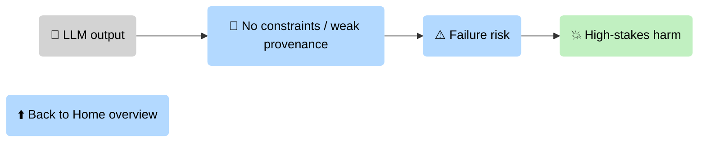
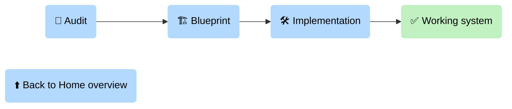
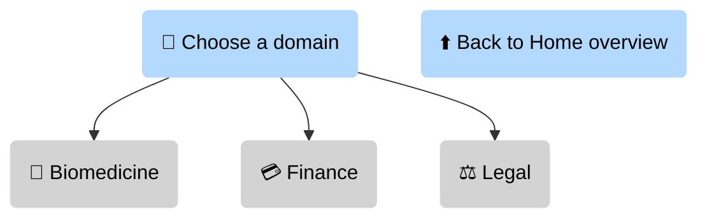
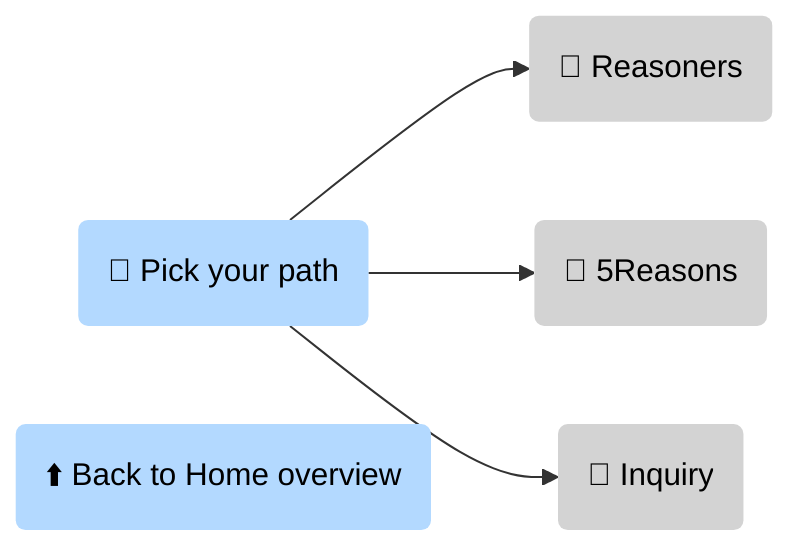

# Cognitive Technolgies & Services

--8<-- "includes/quicknav.html"

    

  

    

      
We are building memory for AI agents

      <h2 class="landing-title">Architects of mental model— and causal analytics for machines and humans.</h2>
      

        We turn messy enterprise reality (PDF + SQL + policies + domain expertise) into <strong>decision-grade cognitive infrastructure</strong>:
        causal graph memory, governance constraints, and auditable reasoning traces for LLMs and agentic systems.
      

      

        <a class="md-button md-button--primary" href="services/start/">Start a conversation</a>
        <a class="md-button" href="methodology/">Explore brModel™ methodology</a>
        <a class="md-button" href="reasoners/vision-2026/">Read the 2026 vision</a>
      

    

  

<strong>Rule of thumb:</strong> orient → self-identify → pick a tab → return here when you feel lost.

In this navigation map, the <strong>👤 Visitor (YOU)</strong> begins with <strong>🧭 Orientation</strong>, quickly uses <strong>ℹ️ Understand who we are</strong> to anchor context, then enters <strong>🧭 Self-identification</strong> to pick the next best path: <strong>🧰 Explore services</strong>, <strong>📐 Explore methodology</strong>, or <strong>📰 Explore the blog</strong> (which often leads into <strong>🧠 Explore philosophy</strong> and back into <strong>📐 methodology</strong>). Once ready, they move into <strong>📞 Start a conversation</strong> and <strong>🤝 Engagement</strong>, then follow a risk-minimizing delivery chain: <strong>🔎 Epistemic audit</strong> produces an <strong>🧾 audit report</strong>, which feeds <strong>🗺️ architectural planning</strong> and yields an <strong>📐 architecture blueprint</strong> that drives <strong>🧑‍💻 implementation</strong>. Implementation produces <strong>🧠 memory for AI agents</strong>, which then enables <strong>🛰️ agentic system operations</strong> that emit <strong>🧾 reasoning logs</strong> into <strong>🛠️ maintenance</strong>. Maintenance produces <strong>📊 reporting</strong> and also generates <strong>🧩 change proposals</strong> that flow back into <strong>🗺️ architectural planning</strong>, closing the loop.

```mermaid
flowchart TB
%% Styles (brModel Standard)
classDef s fill:#FFB3B3,stroke-width:0px,color:#000;
classDef p fill:#B3D9FF,stroke-width:0px,color:#000;
classDef r fill:#FFFFB3,stroke-width:0px,color:#000;
classDef o fill:#C1F0C1,stroke-width:0px,color:#000;

%% Entry
S_Visitor("👤 Visitor"):::s
P_Orient("🧭 Orientation"):::p
P_About("ℹ️ Understand who we are"):::p
P_Ident("🧭 Self-identification"):::p

S_Visitor --> P_Orient --> P_About --> P_Ident

%% Home subpage (key conversion)
P_Inquiry("📝 Inquiry"):::p
P_Contact -. "ready to engage" .-> P_Inquiry

%% Top-tab processes (each opens a top-level tab)
P_Services("🧰 Explore services"):::p
P_Methodology("📐 Explore methodology"):::p
P_Philosophy("🧠 Explore philosophy"):::p
P_Reasoners("🤝 Explore Reasoners"):::p
P_CaseStudies("🧾 Explore case studies"):::p
P_Blog("📰 Explore the blog"):::p

%% Minimal mental dependencies (no duplication of detailed role diagrams)
P_Ident --> P_Services
P_Ident --> P_Methodology
P_Ident --> P_Blog

P_Blog --> P_Philosophy
P_Philosophy --> P_Methodology

P_Methodology --> P_Reasoners
P_Services --> P_Reasoners
P_CaseStudies --> P_Reasoners

P_Services --> P_CaseStudies

%% Engagement (keep at top level here; details live in Services)
P_Contact("📞 Start a conversation"):::p
R_Engage("🤝 Engagement"):::r

P_Reasoners --> P_Contact --> R_Engage
P_Inquiry --> R_Engage

%% Delivery lifecycle (high-level)
P_Audit("🔎 Epistemic audit"):::p
R_AuditReport("🧾 Audit report"):::r
P_ArchPlan("🗺️ Architectural planning"):::p
R_Blueprint("📐 Architecture blueprint"):::r
P_Impl("🧑‍💻 Implementation"):::p
O_Memory("🧠 Memory for AI agents"):::o
P_Ops("🛰️ Agentic system operations"):::p
R_Logs("🧾 Reasoning logs"):::r
P_Maint("🛠️ Maintenance"):::p
O_Reporting("📊 Reporting"):::o
R_Change("🧩 Change proposals"):::r

R_Engage --> P_Audit --> R_AuditReport --> P_ArchPlan --> R_Blueprint --> P_Impl --> O_Memory
O_Memory --> P_Ops --> R_Logs --> P_Maint --> O_Reporting
P_Maint --> R_Change --> P_ArchPlan

%% Links (process → detailed explanation)
click P_Orient "/home/start-here/" "Start Here"
click P_Ident "/home/start-here/#choose-your-role" "Choose your role"
click P_Inquiry "/home/inquiry/" "Inquiry"
click P_About "/reasoners/about/" "About"

click P_Services "/services/" "Services"
click P_Methodology "/methodology/" "Methodology"
click P_Philosophy "/philosophy/" "Philosophy"
click P_Reasoners "/reasoners/" "Reasoners"
click P_CaseStudies "/case-studies/" "Case Studies"
click P_Blog "/blog/" "Blog"

click P_Contact "/services/start/" "Start a conversation"
click R_Engage "/services/" "Engagement model"

click P_Audit "/services/epistemic-audit/" "Epistemic Audit"
click P_ArchPlan "/services/blueprint/" "Architecture Blueprint"
click R_Blueprint "/services/blueprint/" "Architecture Blueprint"
click P_Impl "/services/implementation/" "Implementation"
click O_Memory "/methodology/" "Methodology"
click P_Ops "/reasoners/operating-model/" "Operating model"
click P_Maint "/services/partnership/" "Ongoing Partnership"
click O_Reporting "/reasoners/governance/" "Governance Approach"
```

## What we build

  

    

      <h3>Epistemic safety</h3>
      
Systems that say <em>“I don’t know”</em> when the graph has no valid path — instead of hallucinating a plausible paragraph.

    

    

      <h3>Causal memory for agents</h3>
      
Graph-based memory that stores meaning, mechanisms, and source provenance — not just text similarity.

    

    

      <h3>Governance you can enforce</h3>
      
Hard constraints (policy, compliance, safety) that block invalid actions at the data layer — not via prompt begging.

    

  

  
<strong>Audio:</strong> Hidden complexity makes AI memory toxic

  <audio controls preload="none" style="width: 100%;">
    <source src="/assets/Hidden_Complexity_Makes_AI_Memory_Toxic.m4a" type="audio/mp4" />
    Your browser does not support the audio element.
  </audio>

## Why “statistical AI” fails in high-stakes domains

<strong>The question this section answers</strong>: Why do LLMs fail precisely where you need correctness, provenance, and enforceable rules?

The failure mode is predictable: pattern completion + missing constraints + missing audit trail → confident errors.

Here the story is: <strong>🧠 LLM output</strong> becomes dangerous when there are <strong>🧩 no constraints / weak provenance</strong>, which increases <strong>⚠️ failure risk</strong> and can cause <strong>💥 high-stakes harm</strong>. Use <strong>⬆️ Back to Home overview</strong> to return to the main process map.

  

    
<strong>Similarity is not truth.</strong> LLMs are powerful pattern-completers, but without durable semantics and constraints they fail exactly where your organization can’t afford errors: medicine, finance, law, and critical engineering.

    
If hallucination is unacceptable, the question is no longer “Which model?” — it’s “Where is the memory, logic, and audit trail?”

    
<a class="md-button" href="philosophy/probabilistic-ai/">Read the Philosophy</a>

  

## How we work (risk-minimizing engagement)

<strong>The question this section answers</strong>: What is the lowest-risk path from curiosity to a real deployment?

We start by measuring failure modes, then design the architecture, then implement with auditable traces and enforcement.

This is the delivery chain: start with <strong>🧪 Audit</strong> to surface failure modes and constraints, convert that into a <strong>🏗️ Blueprint</strong> your team can own, then execute <strong>🛠️ Implementation</strong> until you have a <strong>✅ working system</strong>. Use <strong>⬆️ Back to Home overview</strong> to return to the main process map.

  

    

      <h3>1) Epistemic Audit</h3>
      
Reality check: data readiness, failure modes, hallucination risk, concept/ontology gaps, and a staged roadmap.

    

    

      <h3>2) Causal Architecture Blueprint</h3>
      
We design the “physics” of your domain: ontology, constraints, ingestion strategy, and a reference architecture your team can own.

    

    

      <h3>3) Glass-Box Implementation</h3>
      
Production delivery: graph memory, CausalGraphRAG reasoning traces, monitoring, and an operational playbook.

    

  

  
<a class="md-button md-button--primary" href="services/">See services</a>

## Validated where it hurts

<strong>The question this section answers</strong>: Where do these failure modes show up in the real world — and what does “good” look like?

Pick one domain and follow the diagram into a concrete case study.

Pick your operating context: <strong>🧭 Choose a domain</strong> routes you into <strong>🧬 Biomedicine</strong>, <strong>💳 Finance</strong>, or <strong>⚖️ Legal</strong>. Use <strong>⬆️ Back to Home overview</strong> to return to the main process map.

  

    

      <h3>Biomedicine</h3>
      
Mechanism discovery over PDFs + omics: explain <em>why</em> a therapy fails, not just which sentences look similar.

    

    

      <h3>Finance</h3>
      
Compliance-by-design: enforce policy constraints so agents cannot approve what regulators would reject.

    

    

      <h3>Legal</h3>
      
Contract analysis as a knowledge graph: detect logical conflicts across clauses you’d never spot with keyword search.

    

  

## Two complementary tracks

<strong>The question this section answers</strong>: Where should you go next — consulting infrastructure, public writing, or an inquiry?

Use the diagram as your navigation: pick the track that matches your intent and click straight into it.

This is the “next step” chooser: start at <strong>🧭 Pick your path</strong>, then go to <strong>🤝 Reasoners</strong> if you need infrastructure and governance, <strong>📝 5Reasons</strong> if you want analysis and diagrams, or <strong>📝 Inquiry</strong> if you want a fast fit check. Use <strong>⬆️ Back to Home overview</strong> to return to the main process map.

  

    

      <h3>Reasoners (consulting & infrastructure)</h3>
      
For organizations where hallucination is unacceptable — we build durable semantics, governance, and auditable reasoning.

      

        <a class="md-button" href="reasoners/">Start with Reasoners</a>
        <a class="md-button" href="methodology/">Technical core</a>
      

    

    

      <h3>5Reasons (writing & diagrams)</h3>
      
Public causal analysis you can argue with: models, counterfactuals, diagrams, mechanisms, and leverage points.

      

        <a class="md-button" href="blog/">Read the blog</a>
      

      

        <a class="md-button" href="about/terms/">Terms of Use</a>
        <a class="md-button" href="services/start/">Request a license</a>
      

    

    

      <h3>Inquiry (fast fit check)</h3>
      
Tell us your domain, the decision you need to support, the constraints that must be enforced, and what failure is unacceptable.

      

        <a class="md-button md-button--primary" href="home/inquiry/">Open the inquiry form</a>
        <a class="md-button" href="services/">Services</a>
      

    

  

