# Cognitive Technolgies & Services

--8<-- "includes/quicknav.html"

    

  

    

      
We are building memory for AI agents

      <h2 class="landing-title">Architects of mental model— and causal analytics for machines and humans.</h2>
      

        We turn messy enterprise reality (PDF + SQL + policies + domain expertise) into <strong>decision-grade cognitive infrastructure</strong>:
        causal graph memory, governance constraints, and auditable reasoning traces for LLMs and agentic systems.
      

      

        <a class="md-button md-button--primary" href="services/start/">Start a conversation</a>
        <a class="md-button" href="methodology/">Explore brModel™ methodology</a>
        <a class="md-button" href="reasoners/vision-2026/">Read the 2026 vision</a>
      

    

  

## What we build

```mermaid
flowchart TB
%% Styles (brModel Standard)
classDef i fill:#D3D3D3,stroke-width:0px,color:#000;
classDef p fill:#B3D9FF,stroke-width:0px,color:#000;
classDef o fill:#C1F0C1,stroke-width:0px,color:#000;

P_Start("🧭 Start"):::p
I_Services("🧰 Services"):::i
I_Method("📐 Methodology"):::i
I_Constraints("🧱 Constraints"):::i
O_System("✅ Decision-grade system"):::o

P_Start --> I_Services --> I_Method --> I_Constraints --> O_System

click I_Services "/services/" "Services"
click I_Method "/methodology/" "Methodology"
click I_Constraints "/methodology/constraints/" "Constraints & SHACL"
```

<strong>The question this section answers</strong>: What are the three building blocks of a decision-grade AI system — and where should you start reading?

If you only read three pages, follow the diagram: start with services (why), then methodology (how), then constraints (what stops failures).

  

    

      <h3>Epistemic safety</h3>
      
Systems that say <em>“I don’t know”</em> when the graph has no valid path — instead of hallucinating a plausible paragraph.

    

    

      <h3>Causal memory for agents</h3>
      
Graph-based memory that stores meaning, mechanisms, and source provenance — not just text similarity.

    

    

      <h3>Governance you can enforce</h3>
      
Hard constraints (policy, compliance, safety) that block invalid actions at the data layer — not via prompt begging.

    

  

  
<strong>Audio:</strong> Hidden complexity makes AI memory toxic

  <audio controls preload="none" style="width: 100%;">
    <source src="/assets/Hidden_Complexity_Makes_AI_Memory_Toxic.m4a" type="audio/mp4" />
    Your browser does not support the audio element.
  </audio>

## Why “statistical AI” fails in high-stakes domains

<strong>The question this section answers</strong>: Why do LLMs fail precisely where you need correctness, provenance, and enforceable rules?

The failure mode is predictable: pattern completion + missing constraints + missing audit trail → confident errors.

  

    
<strong>Similarity is not truth.</strong> LLMs are powerful pattern-completers, but without durable semantics and constraints they fail exactly where your organization can’t afford errors: medicine, finance, law, and critical engineering.

    
If hallucination is unacceptable, the question is no longer “Which model?” — it’s “Where is the memory, logic, and audit trail?”

    
<a class="md-button" href="philosophy/probabilistic-ai/">Read the Philosophy</a>

  

## How we work (risk-minimizing engagement)

<strong>The question this section answers</strong>: What is the lowest-risk path from curiosity to a real deployment?

We start by measuring failure modes, then design the architecture, then implement with auditable traces and enforcement.

  

    

      <h3>1) Epistemic Audit</h3>
      
Reality check: data readiness, failure modes, hallucination risk, concept/ontology gaps, and a staged roadmap.

    

    

      <h3>2) Causal Architecture Blueprint</h3>
      
We design the “physics” of your domain: ontology, constraints, ingestion strategy, and a reference architecture your team can own.

    

    

      <h3>3) Glass-Box Implementation</h3>
      
Production delivery: graph memory, CausalGraphRAG reasoning traces, monitoring, and an operational playbook.

    

  

  
<a class="md-button md-button--primary" href="services/">See services</a>

## Validated where it hurts

```mermaid
flowchart TB
classDef i fill:#D3D3D3,stroke-width:0px,color:#000;
classDef p fill:#B3D9FF,stroke-width:0px,color:#000;

P_Choose("🧭 Choose a domain"):::p
I_Bio("🧬 Biomedicine"):::i
I_Fin("💳 Finance"):::i
I_Legal("⚖️ Legal"):::i

P_Choose --> I_Bio
P_Choose --> I_Fin
P_Choose --> I_Legal

click I_Bio "/case-studies/biomedicine/" "Biomedicine"
click I_Fin "/case-studies/finance/" "Finance"
click I_Legal "/case-studies/legal/" "Legal"
```

<strong>The question this section answers</strong>: Where do these failure modes show up in the real world — and what does “good” look like?

Pick one domain and follow the diagram into a concrete case study.

  

    

      <h3>Biomedicine</h3>
      
Mechanism discovery over PDFs + omics: explain <em>why</em> a therapy fails, not just which sentences look similar.

    

    

      <h3>Finance</h3>
      
Compliance-by-design: enforce policy constraints so agents cannot approve what regulators would reject.

    

    

      <h3>Legal</h3>
      
Contract analysis as a knowledge graph: detect logical conflicts across clauses you’d never spot with keyword search.

    

  

## Two complementary tracks

```mermaid
flowchart LR
classDef i fill:#D3D3D3,stroke-width:0px,color:#000;
classDef p fill:#B3D9FF,stroke-width:0px,color:#000;

P_Pick("🧭 Pick your path"):::p
I_Reasoners("🤝 Reasoners"):::i
I_5Reasons("📝 5Reasons"):::i
I_Inquiry("📝 Inquiry"):::i

P_Pick --> I_Reasoners
P_Pick --> I_5Reasons
P_Pick --> I_Inquiry

click I_Reasoners "/reasoners/" "Reasoners"
click I_5Reasons "/blog/" "Blog"
click I_Inquiry "/home/inquiry/" "Inquiry"
```

<strong>The question this section answers</strong>: Where should you go next — consulting infrastructure, public writing, or an inquiry?

Use the diagram as your navigation: pick the track that matches your intent and click straight into it.

  

    

      <h3>Reasoners (consulting & infrastructure)</h3>
      
For organizations where hallucination is unacceptable — we build durable semantics, governance, and auditable reasoning.

      

        <a class="md-button" href="reasoners/">Start with Reasoners</a>
        <a class="md-button" href="methodology/">Technical core</a>
      

    

    

      <h3>5Reasons (writing & diagrams)</h3>
      
Public causal analysis you can argue with: models, counterfactuals, diagrams, mechanisms, and leverage points.

      

        <a class="md-button" href="blog/">Read the blog</a>
      

      

        <a class="md-button" href="about/terms/">Terms of Use</a>
        <a class="md-button" href="services/start/">Request a license</a>
      

    

    

      <h3>Inquiry (fast fit check)</h3>
      
Tell us your domain, the decision you need to support, the constraints that must be enforced, and what failure is unacceptable.

      

        <a class="md-button md-button--primary" href="home/inquiry/">Open the inquiry form</a>
        <a class="md-button" href="services/">Services</a>
      

    

  

