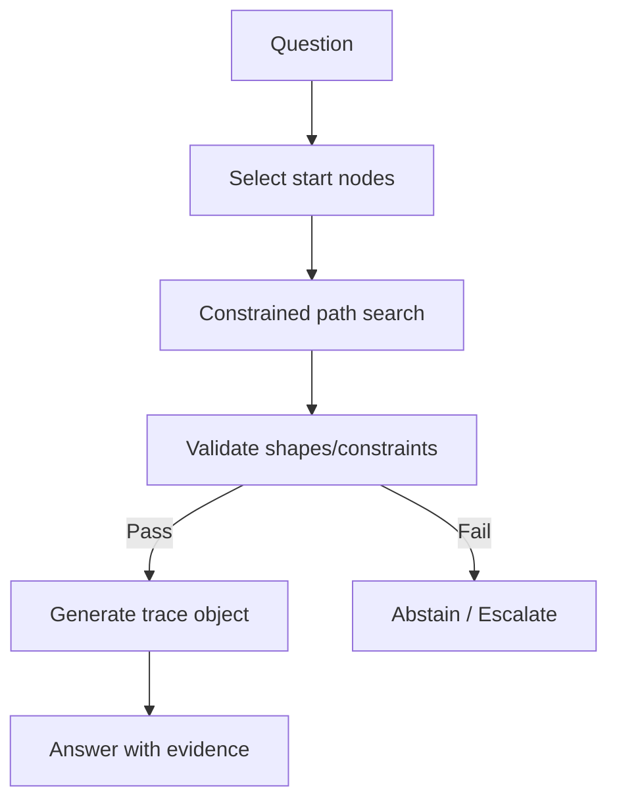
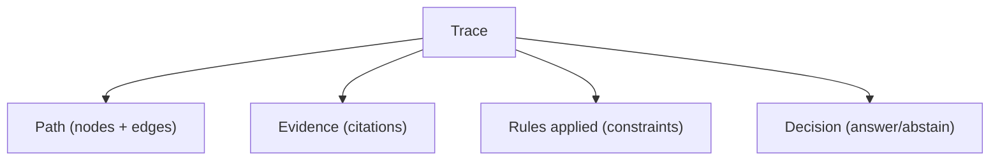

--8<-- "includes/quicknav.html"

# brCausalGraphRAG

CausalGraphRAG is the idea.
**brCausalGraphRAG** is the implementation discipline.

## What we add on top of CausalGraphRAG

- **Provenance-first primitives** (every claim carries a source object)
- **Constraint validation** (policy and safety are enforced)
- **Trace objects** (machine-verifiable reasoning paths)
- **Abstention mechanics** (refuse action/answers without a valid path)

## Diagram: decision-grade traversal

## Diagram: trace object (what gets stored)

## Why this is different from “better prompts”

Prompting is a social contract.
Constraints are an enforcement mechanism.

Next: [Governance Approach](../reasoners/governance.md).
