--8<-- "includes/quicknav.html"

    

# brCausalGraphRAG

  

    

      
Methodology → decision-grade memory

      <h2 class="landing-title">brCausalGraphRAG: active memory with identity, enforced by constraints.</h2>
      

        CausalGraphRAG is the idea: retrieve mechanistic paths instead of text chunks.
        <strong>brCausalGraphRAG</strong> is the discipline: provenance-first primitives, enforceable constraint gates, trace objects, typed identity, and versioned memory writes — with deterministic abstention.
      

      

        <a class="md-button md-button--primary" href="/methodology/constraints/">Constraints &amp; SHACL</a>
        <a class="md-button" href="/philosophy/ai-consciousness/">AI consciousness</a>
        <a class="md-button" href="/reasoners/governance/">Governance approach</a>
      

    

  

## What we add on top of CausalGraphRAG

  

    

      <h3>Provenance-first primitives</h3>
      
Claims are objects with source, version, scope, and extraction method. Evidence is never “just text”.

    

    

      <h3>Constraint validation</h3>
      
Policy and safety rules are enforced in a gate the model cannot negotiate.

    

    

      <h3>Trace objects</h3>
      
Reasoning produces machine-verifiable artifacts you can replay, diff, and audit.

    

    

      <h3>Abstention &amp; escalation</h3>
      
When there is no valid path or a rule fails, the system refuses and explains why.

    

    

      <h3>Typed identity &amp; permissions</h3>
      
Identity is explicit: roles, scopes, and allowed actions are modeled and checked. The same question can yield different valid behavior per identity.

    

    

      <h3>Versioned memory writes</h3>
      
Updates become first-class events: what changed, why it changed, and which evidence justified the update — so the memory can evolve safely.

    

  

## Why we call this a mental model for “AI consciousness” (without metaphysics)

  

    
<strong>Operational framing:</strong> “consciousness†here means persistent identity + active memory + governed action selection.

    
Not feelings. Not personhood. A system-level model that makes behavior legible and controllable.

  

  

    

      <h3>Identity</h3>
      
A stable handle: what goals, roles, permissions, and safety posture apply to this agent instance.

    

    

      <h3>Active memory</h3>
      
Memory is not a chat log; it’s a graph of validated claims and causal relations, versioned over time.

    

    

      <h3>Self-monitoring via traces</h3>
      
The system can inspect what it did, why it did it, and which rules were applied.

    

    

      <h3>Boundaries</h3>
      
Constraints define “what cannot happen”, making abstention a first-class outcome.

    

    

      <h3>Continuity over time</h3>
      
Identity + versioned memory create continuity: the system can explain what it believed before, what changed, and what it believes now.

    

    

      <h3>Action selection is governed</h3>
      
“Agency†is not improvisation. Actions are selected through constraints, permissions, and traceable justification — or blocked deterministically.

    

  

## Advantages of a brModel-based system

  

    

      <h3>Stable primitives</h3>
      
Reality is stored as durable objects (subjects, objects, processes, relations, sources), not as prompt-shaped text. That survives model churn.

    

    

      <h3>Provenance-first evidence</h3>
      
Claims are tied to sources, versions, scope, and extraction. “Grounding†becomes inspectable evidence, not a rhetorical style.

    

    

      <h3>Enforceable constraints</h3>
      
Safety and policy live outside the model. Invalid assertions and forbidden actions are rejected by gates — not politely discouraged by prompts.

    

    

      <h3>Trace as a product artifact</h3>
      
Every decision yields a machine-verifiable trace: path, evidence, rules applied, and outcome. That’s what you can audit and replay.

    

    

      <h3>Deterministic abstention</h3>
      
When the graph has no valid path, “unknown†is the correct output. The system refuses with reasons and a falsification plan.

    

    

      <h3>Reduced complexity</h3>
      
Complex domains compress into a finite set of causal relation types over a small set of primitives, making governance and evaluation tractable.

    

    

      <h3>Safer evolution</h3>
      
Updates are versioned events with provenance. You can diff memory, roll back, and test changes before they affect decisions.

    

    

      <h3>Identity-aware behavior</h3>
      
The same system can act differently by role and scope — because identity is modeled and enforced, not assumed in a hidden system prompt.

    

    

      <h3>Future-proof architecture</h3>
      
As LLMs improve, the gates and memory remain. The stack scales with capability without losing controllability, audit, or safety posture.

    

  

## Diagram: decision-grade traversal

```mermaid
flowchart TB
%% Styles (brModel Standard)
classDef i fill:#D3D3D3,stroke-width:0px,color:#000;
classDef p fill:#B3D9FF,stroke-width:0px,color:#000;
classDef r fill:#FFFFB3,stroke-width:0px,color:#000;
classDef o fill:#C1F0C1,stroke-width:0px,color:#000;
classDef s fill:#FFB3B3,stroke-width:0px,color:#000;

I_Q(["❓ Question / task"]):::i
P_S("🎯 Select start nodes"):::p
P_Search("🧭 Constrained path search"):::p
P_Val("🔒 Validate shapes + constraints"):::p
D_OK{"✅ Allowed and supported?"}:::s
R_T(["🧾 Trace object (evidence + provenance + rules)"]):::r
O_A(["✅ Answer with evidence (or execute)"]):::o
S_X(["🛑 Abstain / escalate (violation or missing path)"]):::i

I_Q --> P_S --> P_Search --> P_Val --> D_OK
D_OK -->|"Yes"| R_T --> O_A
D_OK -->|"No"| S_X

%% Clickable nodes
click P_Val "/methodology/constraints/" "Constraints & SHACL"
click R_T "/reasoners/governance/" "Governance"
```

<strong>What happens here:</strong> the system turns a <strong>ⓠquestion</strong> into a <strong>🧭 constrained path search</strong>, runs a <strong>🔒 validation gate</strong>, then either emits a <strong>🧾 trace object</strong> and a <strong>✅ decision-grade answer</strong> or <strong>🛑 abstains/escalates</strong> with a reason.

## Diagram: identity + active memory loop

```mermaid
 flowchart TB
%% Styles (brModel Standard)
classDef i fill:#D3D3D3,stroke-width:0px,color:#000;
classDef p fill:#B3D9FF,stroke-width:0px,color:#000;
classDef r fill:#FFFFB3,stroke-width:0px,color:#000;
classDef o fill:#C1F0C1,stroke-width:0px,color:#000;
classDef s fill:#FFB3B3,stroke-width:0px,color:#000;

I_ID(["🪪 Identity (role + permissions + goals)"]):::i
I_Q(["❓ Question / task"]):::i
P_TRV("🕸️ Traverse causal memory"):::p
P_G("🔒 Constraint gate"):::p
D_Allow{"✅ Allowed?"}:::s
O_ACT(["✅ Act / answer"]):::o
S_ABS(["🛑 Abstain + explain"]):::i
R_W(["🧾 Write trace + versioned memory update"]):::r

I_ID --> I_Q --> P_TRV --> P_G --> D_Allow
D_Allow -->|"Yes"| O_ACT --> R_W
D_Allow -->|"No"| S_ABS --> R_W
R_W --> I_ID
R_W --> P_TRV

%% Clickable nodes
click P_G "/methodology/constraints/" "Constraints & SHACL"
click R_W "/methodology/core-primitives/" "Core primitives"
click P_TRV "/methodology/causalgraphrag/" "CausalGraphRAG"
```

<strong>Mechanism:</strong> <strong>🪪 identity</strong> shapes what is allowed, <strong>🕸️ traversal</strong> proposes an action, the <strong>🔒 gate</strong> decides, and the system always writes a <strong>🧾 trace + memory update</strong> so behavior stays explainable over time.

## Diagram: trace object (what gets stored)

```mermaid
flowchart TB
%% Styles (brModel Standard)
classDef i fill:#D3D3D3,stroke-width:0px,color:#000;
classDef p fill:#B3D9FF,stroke-width:0px,color:#000;
classDef r fill:#FFFFB3,stroke-width:0px,color:#000;
classDef o fill:#C1F0C1,stroke-width:0px,color:#000;
classDef s fill:#FFB3B3,stroke-width:0px,color:#000;

I_Trigger(["❓ Trigger: question or proposed action"]):::i
R_Meta(["🧾 Trace header: identity, timestamp, scope"]):::r

P_Path("🧭 Select path"):::p
R_Path(["Path artifact: nodes, edges, direction"]):::r

P_Ev("📎 Collect evidence"):::p
R_Ev(["Evidence set: citations, versions, extraction"]):::r

P_Rules("🔒 Evaluate rules"):::p
R_Rules(["Rules applied: constraints, permissions, thresholds"]):::r

D_Out{"✅ Allowed and supported?"}:::s
O_Ans(["✅ Output or execute"]):::o
S_Abs(["🛑 Abstain or escalate"]):::i

P_Write("✍️ Propose memory writes"):::p
R_Writes(["Write-set: claims, edges, deltas, justification"]):::r

D_Store{"✅ Store and replay?"}:::s
O_Audit(["✅ Audit-ready trace package (replayable)"]):::o
S_Skip(["🛑 Do not store (policy or privacy)"]):::i

I_Trigger --> R_Meta --> P_Path --> R_Path --> P_Ev --> R_Ev --> P_Rules --> R_Rules --> D_Out
D_Out -->|"Yes"| O_Ans --> P_Write --> R_Writes --> D_Store
D_Out -->|"No"| S_Abs --> P_Write 
D_Store -->|"Yes"| O_Audit
D_Store -->|"No"| S_Skip

%% Clickable nodes
click P_Rules "/methodology/constraints/" "Constraints & SHACL"
click P_Path "/methodology/causalgraphrag/" "CausalGraphRAG"
click R_Ev "/methodology/core-primitives/" "Core primitives"
```

<strong>Stored artifact:</strong> a <strong>🧾 trace package</strong> that ties together <strong>🧭 the path</strong>, <strong>📠evidence versions</strong>, <strong>🔒 rules evaluated</strong>, the <strong>✅ allowed vs 🛑 abstain</strong> decision, and the <strong>✍️ exact memory writes</strong> (so you can replay, diff, and audit).

## Why this is different from “better prompts”

  

    <ul>
      <li><strong>Prompting</strong> is a social contract: editable, bypassable, and difficult to prove.</li>
      <li><strong>Constraints</strong> are an enforcement mechanism: deterministic, testable, and auditable.</li>
      <li><strong>Traces</strong> make debugging and governance concrete: you can inspect the artifact, not the vibe.</li>
    </ul>
  

## Next steps

  

    

      <a class="md-button md-button--primary" href="/methodology/constraints/">Constraints &amp; SHACL</a>
      <a class="md-button" href="/reasoners/governance/">Governance approach</a>
      <a class="md-button" href="/philosophy/ai-consciousness/">AI consciousness (operational)</a>
    

  

