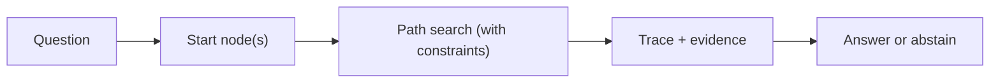
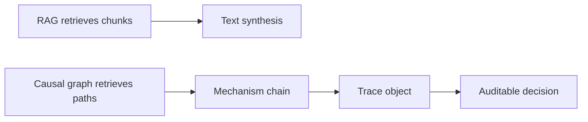
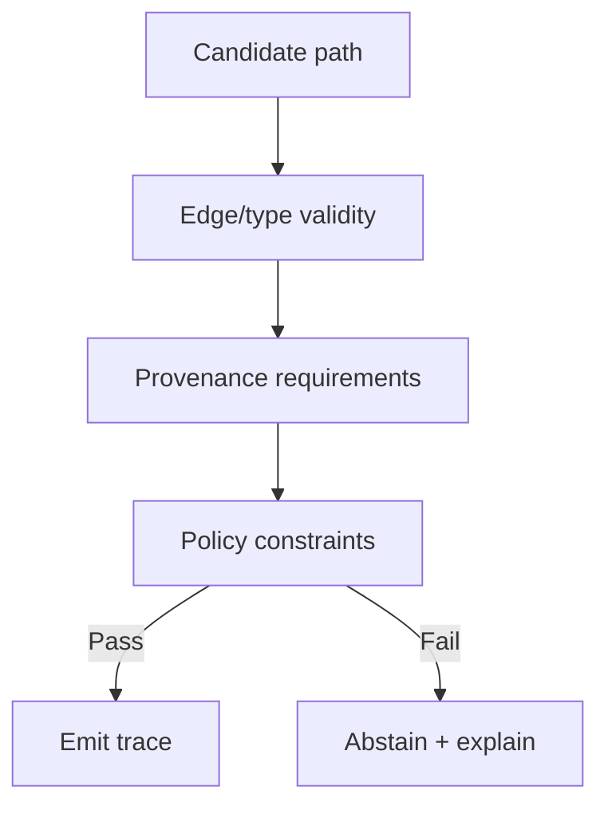

--8<-- "includes/quicknav.html"

# CausalGraphRAG

  

    

      
Methodology → causal retrieval

      <h2 class="landing-title">Stop retrieving paragraphs. Start retrieving mechanisms.</h2>
      

        Classic RAG retrieves text chunks and asks the model to stitch them into an explanation.
        CausalGraphRAG retrieves <em>paths</em> in a causal graph — then produces a trace you can audit.
      

      

        <a class="md-button md-button--primary" href="brcausalgraphrag.md">brCausalGraphRAG</a>
        <a class="md-button" href="constraints.md">Constraints &amp; SHACL</a>
        <a class="md-button" href="property-and-knowledge-graphs.md">Graphs</a>
      

    

    

      
    

  

  <h2>Why this matters</h2>
  

    

      <h3>A path is constrained</h3>
      
Edges can be typed, validated, and governed. The system can reject paths that violate rules.

    

    

      <h3>A paragraph is not</h3>
      
Text can contain contradictions, missing assumptions, and policy violations while still sounding coherent.

    

    

      <h3>Mechanism &gt; relevance</h3>
      
Similarity finds “about the topic”. Causal traversal targets “explains the outcome”.

    

    

      <h3>Unknown is an output</h3>
      
If no valid path exists, the correct behavior is abstention with a falsification plan.

    

  

  <h2>Minimal flow</h2>

  <h2>Diagram: why this beats chunk retrieval</h2>

  <h2>Diagram: validity gates (how abstention becomes deterministic)</h2>

  <h2>What you get (operationally)</h2>
  

    <ul>
      <li>A mechanistic chain (A → B → C), not a narrative collage</li>
      <li>A trace object you can store, diff, audit, and replay</li>
      <li>A crisp “unknown” when the graph has no valid path</li>
    </ul>
  

