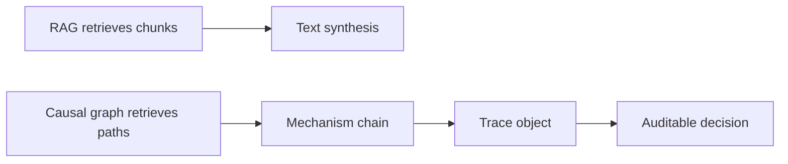

--8<-- "includes/quicknav.html"

# CausalGraphRAG

RAG retrieves *text chunks*.
CausalGraphRAG retrieves *paths in a causal graph*.

## Why that matters

A path is constrained.
A paragraph is not.

## Minimal flow

## Diagram: why this beats chunk retrieval

## What you get

- a mechanistic chain (A → B → C)
- a trace that can be audited
- a clear “unknown” when the graph has no valid path
