--8<-- "includes/quicknav.html"

# CausalGraphRAG

  

    

      
Methodology → causal retrieval

      <h2 class="landing-title">Stop retrieving paragraphs. Start retrieving mechanisms.</h2>
      

        Classic RAG retrieves text chunks and asks the model to stitch them into an explanation.
        CausalGraphRAG retrieves <em>paths</em> in a causal graph — then produces a trace you can audit.
      

      

        <a class="md-button md-button--primary" href="/methodology/brcausalgraphrag/">brCausalGraphRAG</a>
        <a class="md-button" href="/methodology/constraints/">Constraints &amp; SHACL</a>
        <a class="md-button" href="/methodology/property-and-knowledge-graphs/">Graphs</a>
      

    

  

## Why this matters

  

    

      <h3>A path is constrained</h3>
      
Edges can be typed, validated, and governed. The system can reject paths that violate rules.

    

    

      <h3>A paragraph is not</h3>
      
Text can contain contradictions, missing assumptions, and policy violations while still sounding coherent.

    

    

      <h3>Mechanism &gt; relevance</h3>
      
Similarity finds “about the topic”. Causal traversal targets “explains the outcome”.

    

    

      <h3>Unknown is an output</h3>
      
If no valid path exists, the correct behavior is abstention with a falsification plan.

    

    

      <h3>Debuggable failures</h3>
      
When something goes wrong, you can localize the break: which edge failed validation, which source is missing, or which constraint blocked the path.

    

    

      <h3>Better under change</h3>
      
As policies evolve and evidence shifts, constraints and provenance gates keep behavior stable — and make necessary updates explicit instead of silent.

    

  

    

## Advantages (why this is the future)

  

    

      <h3>Decision-grade outputs</h3>
      
Outputs are constrained by structure, not vibes. You get answers that are checkable — and abstention when checks fail.

    

    

      <h3>Auditability by default</h3>
      
Every result is a trace object linked to evidence and versions. That’s how you pass reviews, regulators, and internal postmortems.

    

    

      <h3>Governance becomes enforceable</h3>
      
Policies live as constraints, not paragraphs. The system can deterministically reject invalid paths and forbidden assertions.

    

    

      <h3>Faster iteration</h3>
      
When you change rules, you update constraints and schemas — not prompt folklore. Failures become reproducible and fixable.

    

    

      <h3>Composable across domains</h3>
      
The same primitives and gates work across medicine, finance, security, and law. Only the graph content changes, not the logic.

    

    

      <h3>Lower long-term cost</h3>
      
Model churn stops being existential. When memory and validity live outside the LLM, you can swap models without rewriting reality.

    

  

## Minimal flow

```mermaid
flowchart TB
%% Styles (brModel Standard)
classDef i fill:#D3D3D3,stroke-width:0px,color:#000;
classDef p fill:#B3D9FF,stroke-width:0px,color:#000;
classDef r fill:#FFFFB3,stroke-width:0px,color:#000;
classDef o fill:#C1F0C1,stroke-width:0px,color:#000;
classDef s fill:#FFB3B3,stroke-width:0px,color:#000;

I_Q(["❓ Question / outcome Y"]):::i
P_S("🎯 Select start nodes"):::p
P_Search("🧭 Constrained path search"):::p
P_Valid("🔒 Validate edges + provenance"):::p
D_OK{"✅ Valid path?"}:::s
R_T(["🧾 Trace object (path + evidence + assumptions)"]):::r
O_A(["✅ Answer with mechanism"]):::o
S_X(["🛑 Abstain + missing data / violated rule"]):::i

I_Q --> P_S --> P_Search --> P_Valid --> D_OK
D_OK -->|"Yes"| R_T --> O_A
D_OK -->|"No"| S_X

%% Clickable nodes
click P_Valid "/methodology/constraints/" "Constraints & SHACL"
click R_T "/methodology/brcausalgraphrag/" "brCausalGraphRAG"
```

<strong>Core loop:</strong> start with <strong>ⓠoutcome Y</strong>, choose <strong>🯠start nodes</strong>, search <strong>🧭 constrained paths</strong>, then run <strong>🔒 validation</strong>. Only a <strong>✅ valid path</strong> produces a <strong>🧾 trace object</strong> and a <strong>✅ mechanistic answer</strong>; otherwise the system <strong>🛑 abstains</strong> with a concrete failure reason.

## Diagram: why this beats chunk retrieval

```mermaid
 flowchart TB
%% Styles (brModel Standard)
classDef i fill:#D3D3D3,stroke-width:0px,color:#000;
classDef p fill:#B3D9FF,stroke-width:0px,color:#000;
classDef r fill:#FFFFB3,stroke-width:0px,color:#000;
classDef o fill:#C1F0C1,stroke-width:0px,color:#000;
classDef s fill:#FFB3B3,stroke-width:0px,color:#000;

I_Stakes(["Decision context"]):::i
D_Audit{"✅ Need audit and validity?"}:::s

P_RAG("RAG: retrieve chunks"):::p
P_TXT("Text synthesis"):::p
S_Plaus(["⚠️ Plausible narrative (unclear validity)"]):::i

P_CG("Causal graph: retrieve paths"):::p
R_Path(["Mechanism chain (A → B → C)"]):::r
R_Trace(["Trace object (evidence + provenance)"]):::r
O_Audit(["✅ Auditable decision (or refusal)"]):::o

I_Stakes --> D_Audit
D_Audit -->|"No"| P_RAG --> P_TXT --> S_Plaus
D_Audit -->|"Yes"| P_CG --> R_Path --> R_Trace --> O_Audit

%% Clickable nodes
click P_RAG "/methodology/llm-tool-rag/" "LLM + Tool + RAG"
click P_CG "/methodology/causalgraphrag/" "CausalGraphRAG"
click R_Trace "/methodology/brcausalgraphrag/" "brCausalGraphRAG"
```

<strong>Why paths beat chunks:</strong> when <strong>✅ audit and validity</strong> matter, you must route through <strong>🧠 causal paths</strong> that yield a <strong>🧾 trace</strong>. When stakes are low, teams often accept <strong>🔠chunks → text synthesis</strong>, but the output remains <strong>⚠️ plausible</strong> rather than decision-grade.

## Diagram: validity gates (how abstention becomes deterministic)

```mermaid
flowchart TB
%% Styles (brModel Standard)
classDef i fill:#D3D3D3,stroke-width:0px,color:#000;
classDef p fill:#B3D9FF,stroke-width:0px,color:#000;
classDef r fill:#FFFFB3,stroke-width:0px,color:#000;
classDef o fill:#C1F0C1,stroke-width:0px,color:#000;
classDef s fill:#FFB3B3,stroke-width:0px,color:#000;

I_P(["Candidate path"]):::i
P_V1("Edge + type validity"):::p
P_V2("Provenance requirements"):::p
P_V3("Policy + safety constraints"):::p
D_Pass{"✅ All gates pass?"}:::s
R_T(["Emit trace (what passed)"]):::r
O_O(["✅ Continue to answer"]):::o
S_X(["🛑 Refuse (why it failed)"]):::i

I_P --> P_V1 --> P_V2 --> P_V3 --> D_Pass
D_Pass -->|"Yes"| R_T --> O_O
D_Pass -->|"No"| S_X

%% Clickable nodes
click P_V3 "/methodology/constraints/" "Constraints & SHACL"
click R_T "/methodology/brcausalgraphrag/" "brCausalGraphRAG"
```

<strong>Deterministic abstention:</strong> validity is enforced as a sequence of gates (types, provenance, policy). If <strong>✅ all gates pass</strong>, the system emits a <strong>trace of what passed</strong> and proceeds; if not, it <strong>🛑 refuses</strong> with the specific gate that failed.

## What you get (operationally)

  

    <ul>
      <li>A mechanistic chain (A → B → C), not a narrative collage</li>
      <li>A trace object you can store, diff, audit, and replay</li>
      <li>A crisp “unknown” when the graph has no valid path</li>
    </ul>
  

