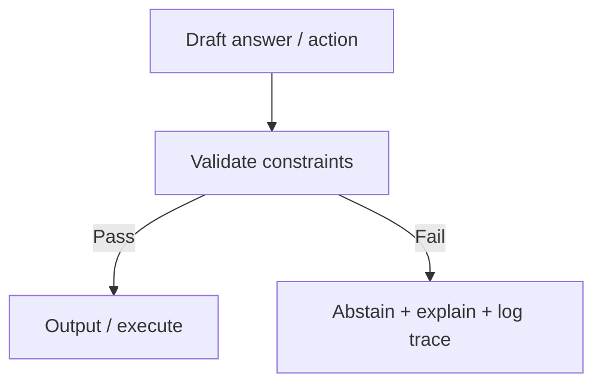
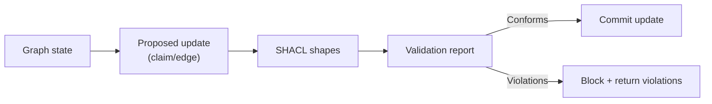

--8<-- "includes/quicknav.html"

# Constraints & SHACL

	

		

			
Methodology → governance

			<h2 class="landing-title">If a rule matters, it must be enforceable.</h2>
			

				Constraints move governance out of “prompt etiquette” and into a layer that can validate, block, and explain.
				SHACL is one practical way to formalize those constraints for graph-shaped data.
			

			

				<a class="md-button md-button--primary" href="brcausalgraphrag/">brCausalGraphRAG</a>
				<a class="md-button" href="llm-tool-rag/">LLM + Tool + RAG</a>
				<a class="md-button" href="/reasoners/governance/">Governance approach</a>
			

		

	

	<h2>The problem with prompt-only governance</h2>
	

		
<h3>Editable</h3>
Instructions can be changed, ignored, or diluted by competing context.

		
<h3>Bypassable</h3>
A sufficiently clever prompt can route around “guidelines”.

		
<h3>Hard to audit</h3>
You can’t reliably prove which rule was applied, or why an output was allowed.

		
<h3>Not deterministic</h3>
Governance becomes a probabilistic behavior, not a system guarantee.

		
<h3>Not portable</h3>
Rules don’t travel cleanly across teams, products, and model upgrades; they decay into prompt folklore.

		
<h3>Unclear failure mode</h3>
When outputs violate policy, you get excuses instead of a crisp violation report tied to a specific rule.

	

	<h2>The constraint approach</h2>
	

		
<strong>Encode rules as constraints that validate actions and outputs.</strong>

		
The model can propose; the system decides what is allowed.

	

	<h2>What SHACL gives you (practically)</h2>
	

		

			<h3>Shape validation</h3>
			
"This claim must have these fields"; "this edge is only allowed between these types".

		

		

			<h3>Policy-as-data</h3>
			
Rules live next to the schema and can be versioned, tested, and reviewed.

		

		

			<h3>Machine-verifiable failures</h3>
			
When the system refuses, it can point to the violated shape and the offending node/edge.

		

		

			<h3>Composable governance</h3>
			
Multiple rule sets (domain, safety, org policy) can be applied as separate validation layers.

		

		

			<h3>Deterministic enforcement</h3>
			
Conformance is a yes/no property of the data. That makes “allowed vs blocked” predictable and testable.

		

		

			<h3>Reviewable change control</h3>
			
Constraint changes can be code-reviewed and versioned like any other policy artifact, with diffs and rollbacks.

		

	

	<h2>Diagram: SHACL validation pipeline (conceptual)</h2>

	<h2>Examples of enforceable constraints</h2>
	

		<ul>
			<li><strong>Role-based prohibitions</strong>: certain actions cannot be executed under a role.</li>
			<li><strong>Sector restrictions</strong>: domain-specific rules (e.g., medical, legal, finance) must gate outputs.</li>
			<li><strong>Required provenance</strong>: high-stakes claims must link to source objects and versions.</li>
			<li><strong>Threshold limits</strong>: numeric or confidence thresholds for allowed decisions.</li>
			<li><strong>Mandatory escalation</strong>: some cases must route to human review.</li>
		</ul>
	

	<h2>Operational result</h2>
	

		

			A system that refuses to cross boundaries and produces a machine-verifiable reason when it abstains.
			This turns governance from “best effort” into an actual property of the system.
		

	

