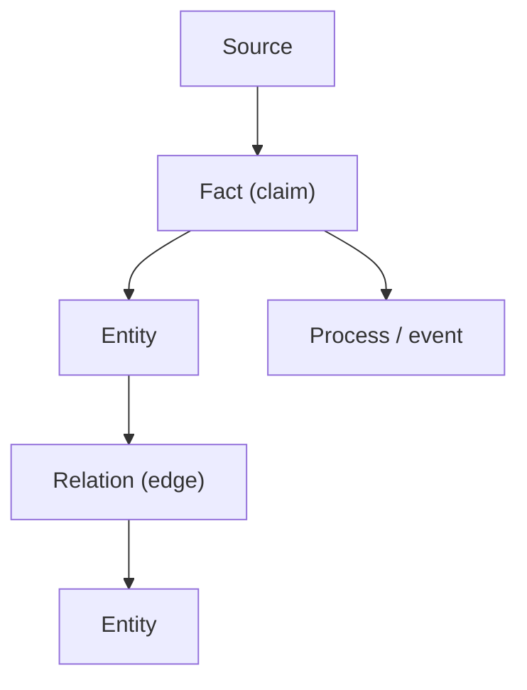
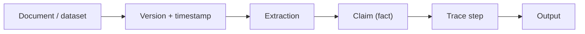

--8<-- "includes/quicknav.html"

# Core Primitives

	

		

			
Methodology → building blocks

			<h2 class="landing-title">The smallest objects that make memory auditable.</h2>
			

				A durable memory system must represent reality in a way that survives model churn.
				That means: the unit of memory is not “a paragraph” — it is a structured object with provenance.
			

			

				<a class="md-button md-button--primary" href="/methodology/">Methodology overview</a>
				<a class="md-button" href="constraints/">Constraints &amp; SHACL</a>
				<a class="md-button" href="property-and-knowledge-graphs/">Graphs</a>
			

		

		

			
		

	

	<h2>What we treat as first-class</h2>
	

		

			<h3>Entities (subjects/objects)</h3>
			
Who/what exists in the domain: people, organizations, devices, molecules, policies, contracts.

		

		

			<h3>Processes (events/transformations)</h3>
			
What happens over time: treatments, approvals, payments, failures, audits, experiments.

		

		

			<h3>Relations (edges)</h3>
			
How entities connect: causes, depends-on, contraindicates, authorizes, violates, explains.

		

		

			<h3>Sources (provenance objects)</h3>
			
Where we learned it: document IDs, versions, timestamps, authors, datasets, and extraction method.

		

	

	<h2>Diagram: primitive schema (minimal)</h2>

	<h2>Why provenance matters</h2>
	

		
<strong>Without provenance, you can’t audit, debug, or falsify.</strong>

		
Provenance turns “an answer” into a decision-grade artifact: it makes claims inspectable and contestable.

	

	

		
<h3>Audit</h3>
Which source supports this claim? Which version? Under what scope?

		
<h3>Debug</h3>
Is the failure data, extraction, constraints, or model behavior?

		
<h3>Confidence</h3>
Confidence attaches to evidence quality, not model fluency.

		
<h3>Falsification</h3>
What new data would change the conclusion? Which edge is uncertain?

	

	<h2>Diagram: provenance chain (what “grounded” really means)</h2>

	<h2>Where this connects</h2>
	

		

			<a class="md-button md-button--primary" href="property-and-knowledge-graphs/">Property Graphs &amp; Knowledge Graphs</a>
			<a class="md-button" href="llm-tool-rag/">LLM + Tool + RAG</a>
			<a class="md-button" href="causalgraphrag/">CausalGraphRAG</a>
		

	

