--8<-- "includes/quicknav.html"

# Core primitives of the brModel

    

	

		

			
Methodology → building blocks

			<h2 class="landing-title">The smallest objects that make memory auditable.</h2>
			

				A durable memory system must represent reality in a way that survives model churn.
				That means: the unit of memory is not “a paragraph” — it is a structured object with provenance.
			

			

				<a class="md-button md-button--primary" href="/methodology/">Methodology overview</a>
				<a class="md-button" href="/methodology/constraints/">Constraints &amp; SHACL</a>
				<a class="md-button" href="/methodology/property-and-knowledge-graphs/">Graphs</a>
			

		

	

## What we treat as first-class

	

		

			<h3>Subjects (actors)</h3>
			
Who acts in the domain: people, teams, organizations, services, devices. Subjects have capacity and can initiate processes and decisions.

		

		

			<h3>Objects (things acted on)</h3>
			
What is produced, consumed, owned, transferred, or constrained: contracts, assets, claims, datasets, molecules, configurations. Objects carry “what changes hands”.

		

		

			<h3>Processes (events/transformations)</h3>
			
What happens over time: treatments, approvals, payments, failures, audits, experiments. They explain how the state of entities changes.

		

		

			<h3>Relations</h3>
			
How things are connected in reality: agreements, authorizations, obligations, dependencies, contraindications, violations, explanations, causal links. Relations are queryable and auditable.

		

		

			<h3>Sources (provenance objects)</h3>
			
Where we learned it: document IDs, versions, timestamps, authors, datasets, and extraction method. Provenance turns memory into evidence.

		

		

			<h3>Interactions (meta-ontology)</h3>
			
Every domain model reduces to two reusable interaction families: <strong>Edge – Influence</strong> (one thing affects another) and <strong>Edge – Inheritance</strong> (one thing specializes another).

		

	

## The meta-ontology (why this is interdisciplinary)

	

		
<strong>We separate “what exists” from “how it interacts”.</strong>

		
The same abstract building blocks work in biotech, finance, cybersecurity, and law because they describe structure, change, and evidence — not a specific discipline.

	

	

    

		

			<h3>Element</h3>
			
An abstract “thing” in some categorical state. In the domain layer it becomes Source, Subject, Process, Relation, or Object.

		

		

			<h3>Metric</h3>
			
A quantifiable attribute of an Element (a measurable state). Metrics make monitoring, drift detection, and audits concrete.

		

		

			<h3>Cause</h3>
			
An abstract driver of change: rules, conditions, or mechanisms that initiate or constrain transitions (what can change what, and when).

		

		

			<h3>Transfer</h3>
			
A mediator of movement or transformation: how change propagates (energy, information, matter, workflow) through the system.

		

				

			<h3>Edge – Inheritance</h3>
			
Specialization and reuse. It lets a specific object inherit structure/behavior from an abstract parent — keeping schemas consistent as the system grows.

			

				
Examples

				
<strong>Apply</strong>: apply a learned rule/pattern (Cause) to a concrete case (Element). 
				<strong>Teach</strong>: generalize from concrete evidence (Element) into an abstract rule/pattern (Cause).

			

		

		

			<h3>Edge – Influence</h3>
			
Interaction and dependency. It captures how one object affects another — including triggers, propagation, feedback, and measurable deltas.

			

				
Examples

				
<strong>Unit</strong>: a Metric defines units for an Element’s measurable attribute. 
				<strong>Affect</strong>: a Cause triggers a Transfer (a transformation starts). 
				<strong>Input/Output</strong>: Transfers change Metrics; Metric changes can generate Transfers. 
				<strong>Effect</strong>: feedback from an Element back into the Causes acting on it. 
				<strong>Rest (diff)</strong>: represent a difference between two states for a Metric.

			

		

	

## Diagram: Meta-Ontology → brGraph

```mermaid
flowchart LR
    linkStyle default stroke:#888,stroke-width:2px,color:#111,font-size:9px;
    classDef e fill:#FFF,stroke:#555,color:#000,font-size:16px,font-weight:bold;
    classDef m fill:#FFF,stroke:#555,color:#000,font-size:10px;
    classDef c fill:#FFF,stroke:#555,color:#000,font-size:10px;
    classDef t fill:#FFF,stroke:#555,color:#000,font-size:8px;

   E["◻ Element - e"]:::e
   M(["○ Metric - m"]):::m
   C[/"▶ Cause - c"/]:::c
   T>"◆ Transfer - t"]:::t
      C -->|"affect - aff"| E
      T -->|"input - in"| M
      T -->|"factor - push"| C
      M -->|"output - out"| T
      E -->|"property - diff"| M
      E -->|"effect - eff"| C
```

🧱 <strong>What this diagram encodes:</strong> a deliberately small “physics set” for modeling real domains. Any problem description is reduced to four primitives — <strong>Element</strong>, <strong>Metric</strong>, <strong>Cause</strong>, <strong>Transfer</strong> — and a finite set of relation types (affect/input/output/factor/property/effect). That reduction is what makes problem-solving tractable: you can always <strong>generalize</strong> a messy situation into this bounded model.

📏 <strong>Why it matters for reasoning:</strong> once the vocabulary is finite, the system can keep an explicit accounting of <strong>what is known</strong> vs <strong>what is missing</strong> (which Elements/Metrics/Causes/Transfers are undefined, unmeasured, or unsupported). Even if it “knows nothing”, it still knows <strong>how many pieces are missing</strong>, where the gaps are, and what kind of evidence would fill them.

## Diagram: Meta-Semantics → WisdomGraph

```mermaid
flowchart LR
%% Styles (brModel Standard)
classDef i fill:#D3D3D3,stroke-width:0px,color:#000;
classDef p fill:#B3D9FF,stroke-width:0px,color:#000;
classDef r fill:#FFFFB3,stroke-width:0px,color:#000;
classDef o fill:#C1F0C1,stroke-width:0px,color:#000;
classDef s fill:#FFB3B3,stroke-width:0px,color:#000;

            subgraph info["⬛ Information - i"]
                direction LR

                information["⬛ Information - i"]:::i
                energy["🟥 Subjects - s"]:::s
                time["🟦 Processes - p"]:::p
                space["🟨 Relations - r"]:::r
                matter["🟩 Objects - o"]:::o
                information -->|"⬛⬛ context - ii"| information
                information -->|"⬛🟥 subject - is"| energy
                information -->|"⬛🟦 process - ip"| time
                information -->|"⬛🟨 relation - ir"| space
                information -->|"⬛🟩 object - io"| matter
                energy -->|"🟥🟥 role - ss"| energy
                time -->|"🟦🟦 flow - pp"| time
                space -->|"🟨🟨 item - rr"| space
                matter -->|"🟩🟩 portion - oo"| matter
                energy -->|"🟥🟨 sends - sr"| space
                energy -->|"🟩🟥 owns - so"| matter
                space -->|"🟨🟥 receives - rs"| energy
                time -->|"🟦🟥 requires - ps"| energy
                energy -->|"🟥🟦 performs - sp"| time
                matter -->|"🟩🟦 consumes - op"| time
                space -->|"🟨🟦 realizes - rp"| time
                time -->|"🟦🟩 produces - po"| matter
                energy -->|"🟥🟩 controls - so"| matter
                space -->|"🟨🟩 supplies - ro"| matter
                matter -->|"🟩🟨 requests - or"| space
                time -->|"🟦🟨 develops - pr"| space
                energy -->|"🟥⬛ creator - si"| infoNew
                time -->|"🟦⬛ create - pi"| infoNew
                space -->|"🟨⬛ form - ri"| infoNew
                matter -->|"🟩⬛ matter - oi"| infoNew
                infoNew["⬛ New Information - i"]:::i
            end

```

🧭 <strong>What this diagram encodes:</strong> a domain-facing semantic reduction. Regardless of vocabulary (biomedicine vs finance vs law), domain concepts map to five stable interfaces — <strong>Information</strong>, <strong>Subjects</strong>, <strong>Processes</strong>, <strong>Relations</strong>, <strong>Objects</strong> — and a finite set of composable edge types between them.

🧩 <strong>Why it makes problem-solving manageable:</strong> by limiting the “shape” of a domain to a bounded set of primitives and edges, you prevent unbounded description sprawl. The system can therefore <strong>abstract</strong> and <strong>generalize</strong> consistently, while also tracking gaps explicitly: how much semantic structure is already available, how much is missing, and which specific interface (subject/process/relation/object/context) needs new evidence or modeling work.

## WisdomGraph: the five domain-facing interfaces

	

		

			<h3>Source</h3>
			
The origin of information and context: discipline, system, dataset, document stream. It anchors provenance and scope.

		

		

			<h3>Subject</h3>
			
An active agent with capacity to act: person, organization, device, service, CPU. Subjects initiate actions and consume constraints.

		

		

			<h3>Process</h3>
			
A sequence over time that transforms inputs into outputs: procedure, workflow, mechanism. Processes explain how outcomes are produced.

		

		

			<h3>Relation</h3>
			
A connection in “space” (not necessarily physical): dependency, interaction, association, pathway. Relations are how systems coordinate.

		

		

			<h3>Object</h3>
			
A thing being moved or transformed: resource, artifact, contract, data, substance, tool. Objects carry “matter” in the abstract sense.

		

		

			<h3>Complexity reduction</h3>
			
These five interfaces are causally composable via a finite set of relation types. That reduction is what makes messy real systems modelable, testable, and governable.

		

	

	

		
<strong>Why it helps:</strong> different domains use different nouns, but they rhyme. This gives the memory system stable handles that survive model churn and taxonomy drift.

	

## Why provenance matters

	

		
<strong>Without provenance, you can’t audit, debug, or falsify.</strong>

		
Provenance turns “an answer” into a decision-grade artifact: it makes claims inspectable and contestable.

	

	

		
<h3>Audit</h3>
Provenance makes claims auditable: which source supports this, which version, what time window, and under what scope and assumptions.

		
<h3>Debug</h3>
Provenance narrows failures fast: was it the data, extraction, constraints, or model behavior — and which specific artifact introduced the error.

		
<h3>Confidence</h3>
Provenance shifts confidence from fluency to evidence: trust attaches to source quality, traceability, and constraint satisfaction, not wording.

		
<h3>Falsification</h3>
Provenance makes disagreement actionable: which edge is uncertain, what counterevidence would flip it, and what new data would decide.

		
<h3>Reproducibility</h3>
Provenance enables reproducibility: re-run extraction, replay traces, and verify outputs across model versions, schema changes, and evolving knowledge.

		
<h3>Governance</h3>
Provenance enables permissions, accountability, and lifecycle controls: who asserted what, when it changed, and who approved it.

	

## Diagram: provenance chain (what “grounded” really means)

```mermaid
 flowchart TB
%% Styles (brModel Standard)
classDef i fill:#D3D3D3,stroke-width:0px,color:#000;
classDef p fill:#B3D9FF,stroke-width:0px,color:#000;
classDef r fill:#FFFFB3,stroke-width:0px,color:#000;
classDef o fill:#C1F0C1,stroke-width:0px,color:#000;
classDef s fill:#FFB3B3,stroke-width:0px,color:#000;

I_D(["📄 Document / dataset"]):::i
R_V(["⏱️ Version + timestamp"]):::r
P_X("🧲 Extraction"):::p
R_C(["🧾 Claim (fact) + provenance"]):::r
R_T(["🧭 Trace step (why this edge)"]):::r
P_G("🔒 Constraint validation"):::p
O_O(["✅ Output + audit trail"]):::o
S_B(["🛑 Refuse + violation report"]):::i

I_D --> R_V --> P_X --> R_C --> R_T --> P_G
P_G -->|"Pass"| O_O
P_G -->|"Fail"| S_B

%% Clickable nodes
click P_G "/methodology/constraints/" "Constraints & SHACL"
click R_T "/methodology/brcausalgraphrag/" "brCausalGraphRAG"
```

## Where this connects

	

		

			<a class="md-button md-button--primary" href="property-and-knowledge-graphs/">Property Graphs &amp; Knowledge Graphs</a>
			<a class="md-button" href="llm-tool-rag/">LLM + Tool + RAG</a>
			<a class="md-button" href="causalgraphrag/">CausalGraphRAG</a>
		

	

