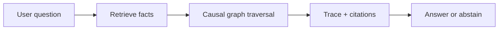
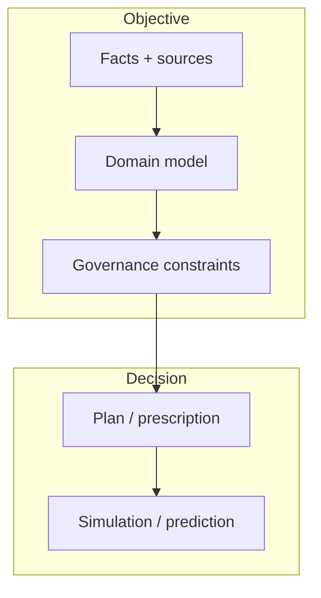

--8<-- "includes/quicknav.html"

# brModel™ Methodology

A universal operating system for AI memory.

Instead of starting with “Which LLM?”, we start with **memory** and **constraints**: the parts that survive model churn.

## Mental model

brModel™ treats knowledge as a **causal graph**, not a pile of text chunks.

- Facts become nodes with provenance.
- Relationships encode causality and permitted transformations.
- Rules become constraints that can be enforced.

## The cognitive stack (high level)

We separate immutable reality from decision-making layers:

- **Facts & provenance** (what happened, where it came from)
- **Domain models** (what concepts mean)
- **Constraints** (what is allowed)
- **Plans & predictions** (what to do next, and what might happen)

## Why this reduces hallucinations

- A model can’t “invent a relationship” if it must traverse an existing graph edge.
- A policy can’t be bypassed if it’s encoded as a constraint.
- Debugging becomes possible because you can locate failure modes (data vs. model vs. rules).

## Next pages (skeleton)

- Engagement patterns: [Services](../services/index.md)
- Applied outcomes: [Case Studies](../case-studies/index.md)
- Real example: [SK Biomedicine](../case-studies/biomedicine.md)
