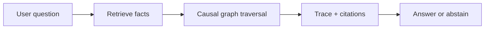
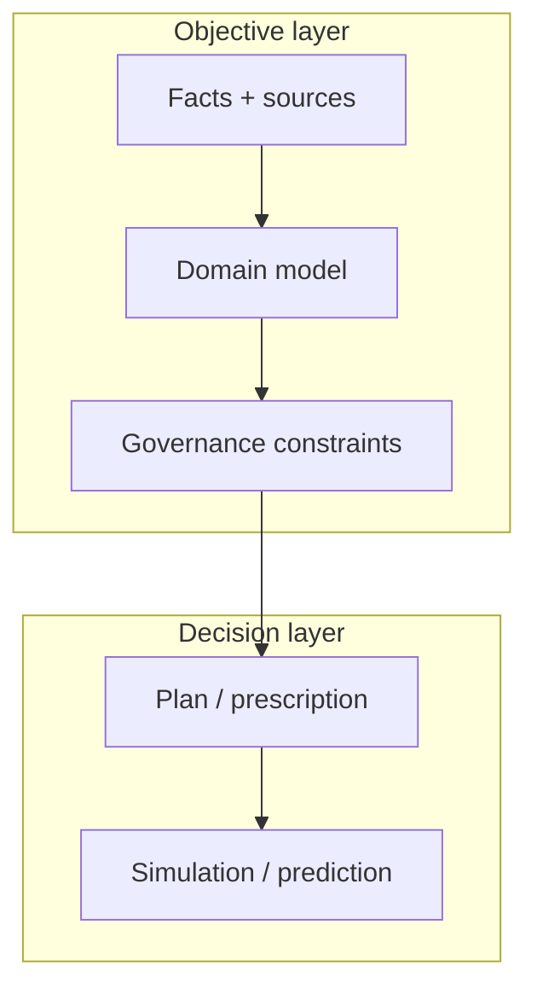

--8<-- "includes/quicknav.html"

# brModel™ Methodology

  

    

      
Methodology

      <h2 class="landing-title">A causal operating system for AI memory.</h2>
      

        Instead of starting with “Which LLM?”, we start with <strong>memory</strong> and <strong>constraints</strong> — the parts that survive model churn.
        The goal is decision-grade behavior: traceable, governable, and able to abstain.
      

      

        <a class="md-button md-button--primary" href="core-primitives/">Core primitives</a>
        <a class="md-button" href="constraints/">Constraints &amp; SHACL</a>
        <a class="md-button" href="/reasoners/governance/">Governance approach</a>
      

    

  

  <h2>Mental model</h2>
  

    
<strong>brModel™ treats knowledge as a causal graph, not a pile of text chunks.</strong>

    
Facts become nodes with provenance; relationships encode mechanisms and allowed transformations; rules become enforceable constraints.

  

  
<strong>Audio:</strong> Simulating Interventions With Executable Causal Clauses

  <audio controls preload="none" style="width: 100%;">
    <source src="\assets\Simulating_Interventions_With_Executable_Causal_Clauses.m4a" type="audio/mp4" />
    Your browser does not support the audio element.
  </audio>

  <h2>The cognitive stack (high level)</h2>
  

    
We separate immutable reality from decision-making layers:

    <ul>
      <li><strong>Facts &amp; provenance</strong> (what happened, where it came from)</li>
      <li><strong>Domain models</strong> (what concepts mean)</li>
      <li><strong>Constraints</strong> (what is allowed)</li>
      <li><strong>Plans &amp; predictions</strong> (what to do next, and what might happen)</li>
    </ul>
  

  <h2>Why this reduces hallucinations</h2>
  

    

      <h3>Edges constrain reasoning</h3>
      
A model can’t “invent a relationship” if it must traverse an existing graph edge.

    

    

      <h3>Constraints enforce policy</h3>
      
A policy can’t be bypassed if it’s encoded as an enforcement gate.

    

    

      <h3>Debugging becomes concrete</h3>
      
You can localize failures to data, model behavior, or missing rules.

    

  

  <h2>Concept map (how vs why)</h2>
  

    
Methodology is the <em>how</em>. Philosophy is the <em>why</em>.

    <ul>
      <li><strong>Philosophy</strong>: <a href="/philosophy/ai-agent-vs-agentic-ai/">AI Agent vs Agentic AI</a></li>
      <li><strong>Philosophy</strong>: <a href="/philosophy/correlation-vs-causality/">Correlation vs Causality</a></li>
      <li><strong>Philosophy</strong>: <a href="/philosophy/ai-consciousness/">AI Consciousness (operational view)</a></li>
      <li><strong>Methodology</strong>: <a href="property-and-knowledge-graphs/">Property Graphs &amp; Knowledge Graphs</a></li>
      <li><strong>Methodology</strong>: <a href="llm-tool-rag/">LLM + Tool + RAG</a></li>
      <li><strong>Methodology</strong>: <a href="causalgraphrag/">CausalGraphRAG</a></li>
      <li><strong>Methodology</strong>: <a href="brcausalgraphrag/">brCausalGraphRAG</a></li>
    </ul>
  

  <h2>Model diagrams (open in modal)</h2>
  
Click any diagram to open it in a modal and inspect the model without leaving the page.

  <a class="diagram-open" href="#" data-diagram-target="diagram-ai-agent-vs-agentic-ai">AI Agent vs Agentic AI</a>
  <a class="diagram-open" href="#" data-diagram-target="diagram-correlation-vs-causality">Correlation vs Causality</a>
  <a class="diagram-open" href="#" data-diagram-target="diagram-property-and-knowledge-graphs">Property &amp; Knowledge Graphs</a>
  <a class="diagram-open" href="#" data-diagram-target="diagram-llm-tool-rag">LLM + Tool + RAG</a>
  <a class="diagram-open" href="#" data-diagram-target="diagram-causalgraphrag">CausalGraphRAG</a>
  <a class="diagram-open" href="#" data-diagram-target="diagram-brcausalgraphrag">brCausalGraphRAG</a>

<dialog id="diagram-ai-agent-vs-agentic-ai" class="diagram-modal">
  

    
AI Agent vs Agentic AI

    <button class="diagram-modal__close" type="button" data-diagram-close>Close</button>
  

  

    

flowchart TB;
  subgraph ToolUse["AI Agent (tool-using)"];
    U["User"] --> Q["Question"];
    Q --> L["LLM"];
    L --> T["Tools"];
    T --> L;
    L --> A["Answer"];
  end;

  subgraph Agentic["Agentic AI (system property)"];
    G["Goal"] --> P["Plan"];
    P --> X["Act"];
    X --> O["Observe"];
    O --> M["Memory"];
    M --> P;
    O --> V["Validate constraints"];
    V -->|"Fail"| S["Stop / abstain / escalate"];
    V -->|"Pass"| P;
  end;
    

  

</dialog>

<dialog id="diagram-correlation-vs-causality" class="diagram-modal">
  

    
Correlation vs Causality (confounding)

    <button class="diagram-modal__close" type="button" data-diagram-close>Close</button>
  

  

    

graph LR;
  C["Confounder C"] --> X["X"];
  C --> Y["Y"];
  X --> Y;
    

  

</dialog>

<dialog id="diagram-property-and-knowledge-graphs" class="diagram-modal">
  

    
Property Graphs vs Knowledge Graphs

    <button class="diagram-modal__close" type="button" data-diagram-close>Close</button>
  

  

    

flowchart LR;
  PG["Property Graph (nodes/edges + properties)"] --> KG["Knowledge Graph (ontology + constraints + meaning)"];
  KG --> Q["Queries with validity guarantees"];
    

  

</dialog>

<dialog id="diagram-llm-tool-rag" class="diagram-modal">
  

    
LLM + Tool + RAG (baseline)

    <button class="diagram-modal__close" type="button" data-diagram-close>Close</button>
  

  

    

flowchart LR;
  U["User"] --> L["LLM"];
  L -->|"Search / retrieve"| R["RAG"];
  R --> L;
  L -->|"Call tools"| T["Tools / APIs"];
  T --> L;
  L --> A["Answer"];
    

  

</dialog>

<dialog id="diagram-causalgraphrag" class="diagram-modal">
  

    
CausalGraphRAG (paths, not paragraphs)

    <button class="diagram-modal__close" type="button" data-diagram-close>Close</button>
  

  

    

flowchart LR;
  Q["Question"] --> S["Start node(s)"];
  S --> P["Path search with constraints"];
  P --> T["Trace + evidence"];
  T --> A["Answer or abstain"];
    

  

</dialog>

<dialog id="diagram-brcausalgraphrag" class="diagram-modal">
  

    
brCausalGraphRAG (decision-grade)

    <button class="diagram-modal__close" type="button" data-diagram-close>Close</button>
  

  

    

flowchart TB;
  Q["Question"] --> S["Select start nodes"];
  S --> P["Constrained path search"];
  P --> V["Validate shapes / constraints"];
  V -->|"Pass"| T["Generate trace object"];
  T --> A["Answer with evidence"];
  V -->|"Fail"| X["Abstain / escalate"];
    

  

</dialog>

## Next pages (skeleton)

- Engagement patterns: [Services](../services/)
- Applied outcomes: [Case Studies](../case-studies/)
- Real example: [SK Biomedicine](../case-studies/biomedicine/)
