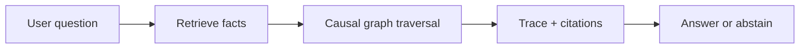
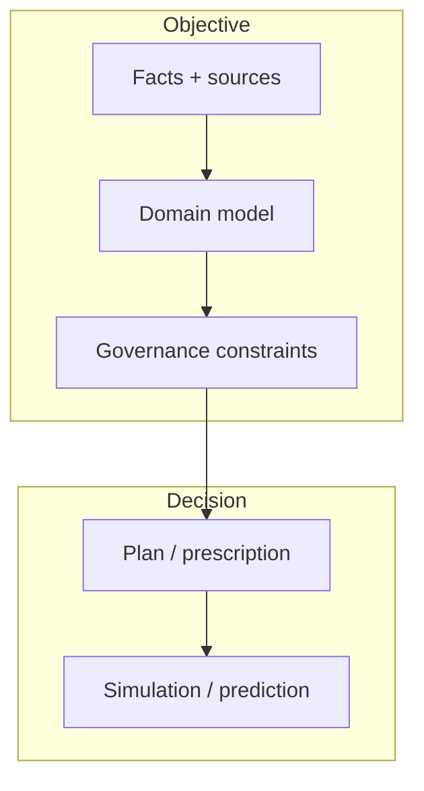

--8<-- "includes/quicknav.html"

# brModel™ Methodology

A universal operating system for AI memory.

Instead of starting with “Which LLM?”, we start with **memory** and **constraints**: the parts that survive model churn.

## Mental model

brModel™ treats knowledge as a **causal graph**, not a pile of text chunks.

- Facts become nodes with provenance.
- Relationships encode causality and permitted transformations.
- Rules become constraints that can be enforced.

## The cognitive stack (high level)

We separate immutable reality from decision-making layers:

- **Facts & provenance** (what happened, where it came from)
- **Domain models** (what concepts mean)
- **Constraints** (what is allowed)
- **Plans & predictions** (what to do next, and what might happen)

## Why this reduces hallucinations

- A model can’t “invent a relationship” if it must traverse an existing graph edge.
- A policy can’t be bypassed if it’s encoded as a constraint.
- Debugging becomes possible because you can locate failure modes (data vs. model vs. rules).

## Concepts (symmetrically scoped)

Methodology is the *how*. Philosophy is the *why*.

- Philosophy: [AI Agent vs Agentic AI](../philosophy/ai-agent-vs-agentic-ai.md)
- Philosophy: [Correlation vs Causality](../philosophy/correlation-vs-causality.md)
- Methodology: [Property Graphs & Knowledge Graphs](property-and-knowledge-graphs.md)
- Methodology: [LLM + Tool + RAG](llm-tool-rag.md)
- Methodology: [CausalGraphRAG](causalgraphrag.md)
- Methodology: [brCausalGraphRAG](brcausalgraphrag.md)

## Model diagrams (open in modal)

Click any diagram to open it in a modal and inspect the model without leaving the page.

  <a class="diagram-open" href="#" data-diagram-target="diagram-ai-agent-vs-agentic-ai">AI Agent vs Agentic AI</a>
  <a class="diagram-open" href="#" data-diagram-target="diagram-correlation-vs-causality">Correlation vs Causality</a>
  <a class="diagram-open" href="#" data-diagram-target="diagram-property-and-knowledge-graphs">Property &amp; Knowledge Graphs</a>
  <a class="diagram-open" href="#" data-diagram-target="diagram-llm-tool-rag">LLM + Tool + RAG</a>
  <a class="diagram-open" href="#" data-diagram-target="diagram-causalgraphrag">CausalGraphRAG</a>
  <a class="diagram-open" href="#" data-diagram-target="diagram-brcausalgraphrag">brCausalGraphRAG</a>

<dialog id="diagram-ai-agent-vs-agentic-ai" class="diagram-modal">
  

    
AI Agent vs Agentic AI

    <button class="diagram-modal__close" type="button" data-diagram-close>Close</button>
  

  

    

flowchart TB
  subgraph ToolUse["AI Agent (tool-using)"]
    U[User] --> Q[Question]
    Q --> L[LLM]
    L --> T[Tools]
    T --> L
    L --> A[Answer]
  end

  subgraph Agentic["Agentic AI (system property)"]
    G[Goal] --> P[Plan]
    P --> X[Act]
    X --> O[Observe]
    O --> M[Memory]
    M --> P
    O --> V[Validate constraints]
    V -->|Fail| S[Stop / Abstain / Escalate]
    V -->|Pass| P
  end
    

  

</dialog>

<dialog id="diagram-correlation-vs-causality" class="diagram-modal">
  

    
Correlation vs Causality (confounding)

    <button class="diagram-modal__close" type="button" data-diagram-close>Close</button>
  

  

    

graph LR
  C[Confounder C] --> X[X]
  C --> Y[Y]
  X --> Y
    

  

</dialog>

<dialog id="diagram-property-and-knowledge-graphs" class="diagram-modal">
  

    
Property Graphs vs Knowledge Graphs

    <button class="diagram-modal__close" type="button" data-diagram-close>Close</button>
  

  

    

flowchart LR
  PG["Property Graph (nodes/edges + properties)"] --> KG["Knowledge Graph (ontology + constraints + meaning)"]
  KG --> Q[Queries with validity guarantees]
    

  

</dialog>

<dialog id="diagram-llm-tool-rag" class="diagram-modal">
  

    
LLM + Tool + RAG (baseline)

    <button class="diagram-modal__close" type="button" data-diagram-close>Close</button>
  

  

    

flowchart LR
  U[User] --> L[LLM]
  L -->|Search/Retrieve| R[RAG]
  R --> L
  L -->|Call tools| T[Tools / APIs]
  T --> L
  L --> A[Answer]
    

  

</dialog>

<dialog id="diagram-causalgraphrag" class="diagram-modal">
  

    
CausalGraphRAG (paths, not paragraphs)

    <button class="diagram-modal__close" type="button" data-diagram-close>Close</button>
  

  

    

flowchart LR
  Q[Question] --> S[Start node(s)]
  S --> P[Path search with constraints]
  P --> T[Trace + evidence]
  T --> A[Answer or abstain]
    

  

</dialog>

<dialog id="diagram-brcausalgraphrag" class="diagram-modal">
  

    
brCausalGraphRAG (decision-grade)

    <button class="diagram-modal__close" type="button" data-diagram-close>Close</button>
  

  

    

flowchart TB
  Q[Question] --> S[Select start nodes]
  S --> P[Constrained path search]
  P --> V[Validate shapes/constraints]
  V -->|Pass| T[Generate trace object]
  T --> A[Answer with evidence]
  V -->|Fail| X[Abstain / Escalate]
    

  

</dialog>

## Next pages (skeleton)

- Engagement patterns: [Services](../services/index.md)
- Applied outcomes: [Case Studies](../case-studies/index.md)
- Real example: [SK Biomedicine](../case-studies/biomedicine.md)
