```mermaid
 flowchart TB
%% Styles (brModel Standard)
classDef i fill:#D3D3D3,stroke-width:0px,color:#000;
classDef p fill:#B3D9FF,stroke-width:0px,color:#000;
classDef r fill:#FFFFB3,stroke-width:0px,color:#000;
classDef o fill:#C1F0C1,stroke-width:0px,color:#000;
classDef s fill:#FFB3B3,stroke-width:0px,color:#000;

I_S(["Sources, documents, systems"]):::i
P_Extract("Extract and type"):::p
R_Typed(["Typed statements (claims + provenance)"]):::r
P_Graph("Assemble graph snapshot"):::p
R_Snap(["Graph snapshot (typed nodes and edges)"]):::r
P_Con("Enforce constraints"):::p
R_Valid(["Validated graph (or violations)"]):::r
D_Conform{"✅ Conforms?"}:::s
P_Path("Search under constraints"):::p
R_Path(["Path result (mechanism + evidence)"]):::r
D_Evidence{"✅ Enough evidence?"}:::s
R_Trace(["Trace object (evidence + rules)"]):::r
O_Out(["Decision-grade output or refusal"]):::o
S_Viol(["🛑 Refuse or return violations"]):::i
S_More(["🛑 Ask for more data or narrower question"]):::i

I_S --> P_Extract --> R_Typed --> P_Graph --> R_Snap --> P_Con --> R_Valid --> D_Conform
D_Conform -->|"Yes"| P_Path --> R_Path --> D_Evidence
D_Conform -->|"No"| S_Viol
D_Evidence -->|"Yes"| R_Trace --> O_Out
D_Evidence -->|"No"| S_More

click R_Typed "core-primitives/" "Core primitives"
click P_Graph "property-and-knowledge-graphs/" "Property and knowledge graphs"
click P_Con "constraints/" "Constraints and SHACL"
click P_Path "causalgraphrag/" "CausalGraphRAG"
click R_Trace "brcausalgraphrag/" "brCausalGraphRAG"
```

--8<-- "includes/quicknav.html"

# brModel™ Methodology

    

  

    

      
Methodology

      <h2 class="landing-title">A causal operating system for AI memory.</h2>
      

        Instead of starting with “Which LLM?”, we start with <strong>memory</strong> and <strong>constraints</strong> — the parts that survive model churn.
        The goal is decision-grade behavior: traceable, governable, and able to abstain.
      

      

        <a class="md-button md-button--primary" href="core-primitives/">Core primitives</a>
        <a class="md-button" href="constraints/">Constraints &amp; SHACL</a>
        <a class="md-button" href="/reasoners/governance/">Governance approach</a>
      

    

  

## Methodology map (pages and how they connect)

```mermaid
flowchart TB
%% Styles (brModel Standard)
classDef i fill:#D3D3D3,stroke-width:0px,color:#000;
classDef p fill:#B3D9FF,stroke-width:0px,color:#000;
classDef r fill:#FFFFB3,stroke-width:0px,color:#000;
classDef o fill:#C1F0C1,stroke-width:0px,color:#000;
classDef s fill:#FFB3B3,stroke-width:0px,color:#000;

I_Start(["🧭 Start here: what must be decision-grade?"]):::i

P_Prim("🧩 Core primitives (entities, relations, provenance)"):::p
P_Graphs("🕸️ Property + knowledge graphs (meaning, ontology)"):::p
P_Constraints("🔒 Constraints & SHACL (what is allowed)"):::p

P_Baseline("🧱 LLM + Tool + RAG (baseline pipeline)"):::p
P_Causal("🧠 CausalGraphRAG (paths, not paragraphs)"):::p
P_brCausal("✅ brCausalGraphRAG (validation + refusal + audit)"):::p

R_Trace(["🧾 Trace object (evidence + provenance + rationale)"]):::r
O_Behavior(["✅ Decision-grade behavior (governable + testable)"]):::o
P_Gov("🏛️ Governance approach"):::p

I_Start --> P_Prim --> P_Graphs --> P_Constraints
P_Constraints --> P_Baseline
P_Baseline --> P_Causal --> P_brCausal --> R_Trace --> O_Behavior
P_Constraints --> P_Gov --> O_Behavior

%% Clickable nodes
click P_Prim "core-primitives/" "Core primitives"
click P_Graphs "property-and-knowledge-graphs/" "Property & Knowledge Graphs"
click P_Constraints "constraints/" "Constraints & SHACL"
click P_Baseline "llm-tool-rag/" "LLM + Tool + RAG"
click P_Causal "causalgraphrag/" "CausalGraphRAG"
click P_brCausal "brcausalgraphrag/" "brCausalGraphRAG"
click P_Gov "/reasoners/governance/" "Governance"
```

<strong>How to read this:</strong> start at <strong>🧭 decision-grade stakes</strong>, then move through <strong>🧩 primitives</strong> and <strong>🕸️ graph semantics</strong> into <strong>🔒 constraints</strong>. From there you can follow the baseline <strong>🧱 LLM + Tool + RAG</strong> path, upgrade to <strong>🧠 CausalGraphRAG</strong>, and land in <strong>✅ brCausalGraphRAG</strong> where outputs become <strong>🧾 trace objects</strong> and <strong>✅ governable behavior</strong>.

## Mental model

  

    
<strong>brModel™ treats knowledge as a causal graph, not a pile of text chunks.</strong>

    
Facts become nodes with provenance; relationships encode mechanisms and allowed transformations; rules become enforceable constraints.

  

    

  
<strong>Audio:</strong> Simulating Interventions With Executable Causal Clauses

  <audio controls preload="none" style="width: 100%;">
    <source src="/assets/Simulating_Interventions_With_Executable_Causal_Clauses.m4a" type="audio/mp4" />
    Your browser does not support the audio element.

```mermaid
 flowchart TB
%% Styles (brModel Standard)
classDef i fill:#D3D3D3,stroke-width:0px,color:#000;
classDef p fill:#B3D9FF,stroke-width:0px,color:#000;
classDef r fill:#FFFFB3,stroke-width:0px,color:#000;
classDef o fill:#C1F0C1,stroke-width:0px,color:#000;
classDef s fill:#FFB3B3,stroke-width:0px,color:#000;

I_Q(["❓ Question / task"]):::i
R_Query(["📌 Query spec (intent + constraints)"]):::r
P_Retrieve("🔎 Retrieve candidates"):::p
R_Facts(["📎 Fact pack (typed claims + provenance)"]):::r
P_Traverse("🕸️ Search graph paths"):::p
R_Paths(["🧭 Path candidates (mechanisms + evidence)"]):::r
D_Gate{"✅ Valid under constraints?"}:::s
R_Trace(["🧾 Trace object (evidence + provenance)"]):::r
O_Out(["✅ Answer or abstain (audit-ready)"]):::o
S_Stop(["🛑 Abstain or escalate (why it failed)"]):::i

I_Q --> R_Query --> P_Retrieve --> R_Facts --> P_Traverse --> R_Paths --> D_Gate
D_Gate -->|"Yes"| R_Trace --> O_Out
D_Gate -->|"No"| S_Stop

%% Clickable nodes
click P_Traverse "causalgraphrag/" "CausalGraphRAG"
click R_Trace "brcausalgraphrag/" "brCausalGraphRAG"
```

  </audio>

<strong>Mechanism:</strong> a <strong>❓ question</strong> becomes a <strong>📌 query spec</strong>, flows through <strong>🔠retrieval</strong> and <strong>🕸️ path search</strong>, then hits a <strong>✅ validity gate</strong>. Passing yields a <strong>🧾 trace object</strong> and a <strong>✅ audit-ready answer</strong>; failing yields <strong>🛑 abstain/escalate</strong> with a reason.

## The cognitive stack (high level)

  

    
We separate immutable reality from decision-making layers:

    <ul>
      <li><strong>Facts &amp; provenance</strong> (what happened, where it came from)</li>
      <li><strong>Domain models</strong> (what concepts mean)</li>
      <li><strong>Constraints</strong> (what is allowed)</li>
      <li><strong>Plans &amp; predictions</strong> (what to do next, and what might happen)</li>
    </ul>
  

<strong>Stack logic:</strong> facts become a <strong>📦 versioned ledger</strong>, meaning becomes a <strong>🗺️ model artifact</strong>, governance compiles into <strong>📠enforceable rules</strong>, and decisions only proceed when <strong>✅ allowed</strong> and <strong>✅ stable under counterfactual checks</strong>. Otherwise you get <strong>🛑 refusal/escalation</strong> instead of fluent drift.

```mermaid
flowchart TB
%% Styles (brModel Standard)
classDef i fill:#D3D3D3,stroke-width:0px,color:#000;
classDef p fill:#B3D9FF,stroke-width:0px,color:#000;
classDef r fill:#FFFFB3,stroke-width:0px,color:#000;
classDef o fill:#C1F0C1,stroke-width:0px,color:#000;
classDef s fill:#FFB3B3,stroke-width:0px,color:#000;

I_F(["📌 Facts + sources"]):::i
R_Feed(["📦 Fact ledger (versioned evidence)"]):::r
P_M("📚 Model meaning"):::p
R_Model(["🗺️ Domain model artifact (concepts + relations)"]):::r
P_G("🔒 Compile constraints"):::p
R_Rules(["📐 Constraint set (enforceable rules)"]):::r
D_Allow{"✅ Allowed under rules?"}:::s
P_P("🧭 Synthesize prescription"):::p
R_Plan(["🧾 Plan artifact (steps + guards)"]):::r
P_S("🧪 Run prediction"):::p
R_Sim(["📊 Scenario outcomes (assumptions exposed)"]):::r
D_Stable{"✅ Stable under counterfactual check?"}:::s
O_D(["✅ Decision + trace (or refusal)"]):::o
S_Block(["🛑 Refuse or escalate (rule or stability failure)"]):::i

I_F --> R_Feed --> P_M --> R_Model --> P_G --> R_Rules --> D_Allow
D_Allow -->|"Yes"| P_P --> R_Plan --> P_S --> R_Sim --> D_Stable
D_Stable -->|"Yes"| O_D
D_Allow -->|"No"| S_Block
D_Stable -->|"No"| S_Block

%% Clickable nodes
click P_G "/reasoners/governance/" "Governance"
click P_M "property-and-knowledge-graphs/" "Graphs"
click P_G "constraints/" "Constraints & SHACL"
```

## Why this reduces hallucinations

  

    

      <h3>Edges constrain reasoning</h3>
      
A model can’t “invent a relationship†if it must traverse an existing graph edge.

    

    

      <h3>Constraints enforce policy</h3>
      
A policy can’t be bypassed if it’s encoded as an enforcement gate.

    

    

      <h3>Debugging becomes concrete</h3>
      
You can localize failures to data, model behavior, or missing rules.

    

  

## Concept map (how vs why)

  

    
Methodology is the <em>how</em>. Philosophy is the <em>why</em>.

    <ul>
      <li><strong>Philosophy</strong>: <a href="/philosophy/ai-agent-vs-agentic-ai/">AI Agent vs Agentic AI</a></li>
      <li><strong>Philosophy</strong>: <a href="/philosophy/correlation-vs-causality/">Correlation vs Causality</a></li>
      <li><strong>Philosophy</strong>: <a href="/philosophy/ai-consciousness/">AI Consciousness (operational view)</a></li>
      <li><strong>Methodology</strong>: <a href="property-and-knowledge-graphs/">Property Graphs &amp; Knowledge Graphs</a></li>
      <li><strong>Methodology</strong>: <a href="llm-tool-rag/">LLM + Tool + RAG</a></li>
      <li><strong>Methodology</strong>: <a href="causalgraphrag/">CausalGraphRAG</a></li>
      <li><strong>Methodology</strong>: <a href="brcausalgraphrag/">brCausalGraphRAG</a></li>
    </ul>
  

## Model diagrams

```mermaid
 flowchart TB
%% Styles (brModel Standard)
classDef i fill:#D3D3D3,stroke-width:0px,color:#000;
classDef p fill:#B3D9FF,stroke-width:0px,color:#000;
classDef r fill:#FFFFB3,stroke-width:0px,color:#000;
classDef o fill:#C1F0C1,stroke-width:0px,color:#000;
classDef s fill:#FFB3B3,stroke-width:0px,color:#000;

I_Prob(["Input problem, context, stakes"]):::i
P_L0("L0 Build causal model"):::p
R_L0(["L0 brCD artifact (executable causal claims)"]):::r
P_L1("L1 Type schema"):::p
R_L1(["L1 Schema artifact (Node Element Metric Cause Transfer)"]):::r
D_Shape{"✅ Schema consistent?"}:::s
P_L2("L2 Encode DSL"):::p
R_L2(["L2 DSL artifact (Source Subject Process Relation Object)"]):::r
P_L3("L3 Compile knowledge"):::p
R_L3(["L3 Knowledge artifact (patterns + semantics)"]):::r
P_L4("L4 Record experience"):::p
R_L4(["L4 Experience artifact (observations + instances)"]):::r
P_L5("L5 Synthesize prescription"):::p
O_L5(["L5 Prescription artifact (plans + workflows)"]):::o
P_L6("L6 Simulate prediction"):::p
O_L6(["L6 Prediction artifact (scenarios + counterfactuals)"]):::o
D_Ready{"✅ Decision-ready?"}:::s
O_Pack(["✅ Decision package (trace + plan + limits)"]):::o
S_Revise(["🛑 Revise model or request more data"]):::i

I_Prob --> P_L0 --> R_L0 --> P_L1 --> R_L1 --> D_Shape
D_Shape -->|"Yes"| P_L2 --> R_L2 --> P_L3 --> R_L3 --> P_L4 --> R_L4 --> P_L5 --> O_L5 --> P_L6 --> O_L6 --> D_Ready
D_Shape -->|"No"| S_Revise
D_Ready -->|"Yes"| O_Pack
D_Ready -->|"No"| S_Revise
S_Revise -. "model update" .-> P_L0

click R_L1 "core-primitives/" "Core primitives"
click R_L2 "property-and-knowledge-graphs/" "Graphs"
click R_L3 "property-and-knowledge-graphs/" "Knowledge graph semantics"
```

  
These diagrams are native to Methodology. They summarize the layer model, the memory schema, and the end-to-end decision-grade pipeline.

<strong>Layer model:</strong> each blue step produces a concrete artifact: <strong>L0</strong> yields <strong>🧾 brCD causal claims</strong>, <strong>L1</strong> yields <strong>typed schema</strong>, <strong>L2</strong> yields a <strong>domain DSL</strong>, <strong>L3</strong> yields <strong>knowledge patterns</strong>, and higher layers yield <strong>plans</strong> and <strong>scenarios</strong>. Two decision points (<strong>✅ schema consistent</strong>, <strong>✅ decision-ready</strong>) force revision instead of silent incoherence.

<strong>Decision-grade pipeline:</strong> sources become <strong>typed statements</strong>, then a <strong>graph snapshot</strong>, then a <strong>validated graph</strong>. Only if it <strong>✅ conforms</strong> do we search paths; only if there is <strong>✅ enough evidence</strong> do we emit a <strong>🧾 trace object</strong> and a <strong>✅ decision-grade output</strong>. Otherwise we return <strong>🛑 violations</strong> or <strong>🛑 request missing data</strong>.

<strong>Memory write discipline:</strong> raw claims are normalized into <strong>primitives</strong>, mapped to <strong>DSL roles</strong>, and typed into <strong>edge families</strong>. Two gates (<strong>✅ types consistent</strong>, <strong>✅ allowed by policy</strong>) prevent invalid commits; passing produces a <strong>✅ auditable graph commit</strong>, failing produces a <strong>🛑 rejected update</strong>.

```mermaid
flowchart TB
%% Styles (brModel Standard)
classDef i fill:#D3D3D3,stroke-width:0px,color:#000;
classDef p fill:#B3D9FF,stroke-width:0px,color:#000;
classDef r fill:#FFFFB3,stroke-width:0px,color:#000;
classDef o fill:#C1F0C1,stroke-width:0px,color:#000;
classDef s fill:#FFB3B3,stroke-width:0px,color:#000;

I_Raw(["Raw observations and claims"]):::i
P_Prim("Normalize primitives"):::p
R_Prims(["Primitives (Node Element Metric Cause Transfer)"]):::r
P_DSL("Map to DSL roles"):::p
R_DSL(["DSL roles (Source Subject Process Relation Object)"]):::r
P_Edges("Type edges"):::p
R_Edge(["Edge families (Influence Inheritance)"]):::r
D_Types{"✅ Types consistent?"}:::s
D_Policy{"✅ Allowed by policy?"}:::s
P_Write("Write versioned memory"):::p
O_Mem(["Graph commit (auditable state)"]):::o
S_Reject(["🛑 Reject update (type or policy failure)"]):::i

I_Raw --> P_Prim --> R_Prims --> P_DSL --> R_DSL --> P_Edges --> R_Edge --> D_Types
D_Types -->|"Yes"| D_Policy
D_Types -->|"No"| S_Reject
D_Policy -->|"Yes"| P_Write --> O_Mem
D_Policy -->|"No"| S_Reject

click R_Prims "core-primitives/" "Core primitives"
click R_DSL "property-and-knowledge-graphs/" "Graphs"
click R_Edge "causalgraphrag/" "CausalGraphRAG"
click P_Write "brcausalgraphrag/" "Trace objects and memory writes"
```

## Next pages (skeleton)

- Engagement patterns: [Services](../services/index.md)
- Applied outcomes: [Case Studies](../case-studies/index.md)
- Real example: [Biomedicine](../case-studies/biomedicine.md)
