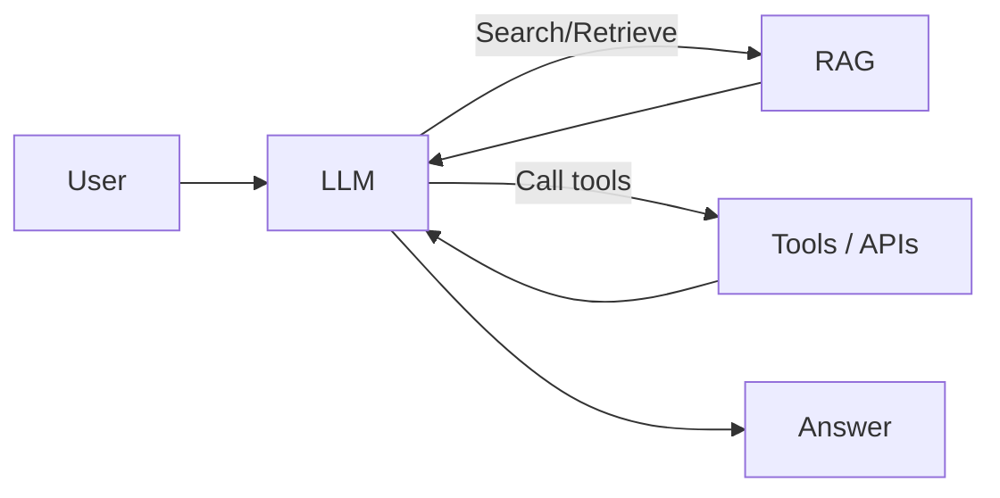
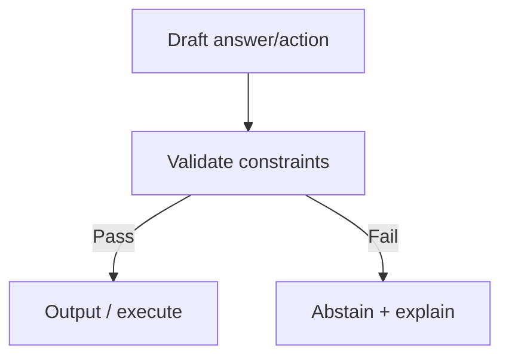

--8<-- "includes/quicknav.html"

# LLM + Tool + RAG

This is the mainstream starting point: LLM reasoning, tools for actions, and retrieval for grounding.

## The baseline architecture

## Diagram: the missing layer (constraint gate)

## Where it breaks

- Retrieval returns *relevant text* but not *valid causal paths*.
- The model can still:
  - merge incompatible sources
  - ignore a policy edge case
  - invent a relationship between retrieved facts

## What to add for high-stakes domains

- enforceable constraints (not guidelines)
- provenance as first-class data
- abstention and escalation paths

Next: [CausalGraphRAG](causalgraphrag.md).
