--8<-- "includes/quicknav.html"

# LLM + Tool + RAG

    

  

    

      
Methodology → baseline

      <h2 class="landing-title">The mainstream stack, and the exact point where it fails.</h2>
      

        LLM + Tool + RAG is a strong starting point: retrieval reduces pure invention and tools turn text into action.
        But it still lacks an enforcement layer that makes violations impossible.
      

      

        <a class="md-button md-button--primary" href="causalgraphrag/">Upgrade to CausalGraphRAG</a>
        <a class="md-button" href="/methodology/constraints/">Add constraints &amp; SHACL</a>
        <a class="md-button" href="/methodology/core-primitives/">See core primitives</a>
      

    

  

## The baseline architecture

```mermaid
 flowchart TB
%% Styles (brModel Standard)
classDef i fill:#D3D3D3,stroke-width:0px,color:#000;
classDef p fill:#B3D9FF,stroke-width:0px,color:#000;
classDef r fill:#FFFFB3,stroke-width:0px,color:#000;
classDef o fill:#C1F0C1,stroke-width:0px,color:#000;
classDef s fill:#FFB3B3,stroke-width:0px,color:#000;

I_U(["👤 User"]):::i
P_L("🧠 LLM"):::p
P_R("🔎 RAG retrieve"):::p
P_T("🧰 Tools / APIs"):::p
D_Gate{"✅ Constraint gate present?"}:::s
R_Lack(["⚠️ No hard constraints + weak trace"]):::r
O_A(["🗣️ Output (text/action proposal)"]):::o
S_Risk(["🛑 Silent violation risk"]):::i
O_Safe(["✅ Allowed output (traceable)"]):::o

I_U --> P_L
P_L --> P_R --> P_L
P_L --> P_T --> P_L
P_L --> D_Gate
D_Gate -->|"No"| R_Lack --> O_A --> S_Risk
D_Gate -->|"Yes"| O_Safe

%% Clickable nodes
click P_R "/methodology/llm-tool-rag/" "LLM + Tool + RAG"
click P_T "/methodology/llm-tool-rag/" "Tools"
```

<strong>Baseline mechanism:</strong> the <strong>🧠 LLM</strong> loops over <strong>🔠retrieval</strong> and <strong>🧰 tools</strong>, but whether the system is safe depends on a separate <strong>✅ constraint gate</strong>. Without it, you can get fluent <strong>🗣️ output</strong> with <strong>🛑 silent violation risk</strong>.

## The missing layer: constraint gate

  

    

      <h3>LLM</h3>
      
A probabilistic language engine: great at synthesis and dialogue, but it does not intrinsically know what is permitted, true, or safe to execute.

    

    

      <h3>Tools</h3>
      
Deterministic actions and APIs: they make the system do real work, but they will do the wrong thing if the plan or parameters are wrong.

    

    

      <h3>RAG</h3>
      
Retrieval for grounding: it reduces pure invention, but retrieval returns candidates — not a verified chain of claims for this specific decision.

    

    

      <h3>Why it’s insufficient: no hard rules</h3>
      
If constraints only live in text, the model can ignore them under pressure. High-stakes systems need non-negotiable checks outside the model.

    

    

      <h3>Why it’s insufficient: weak audit trail</h3>
      
You can log prompts and retrieved chunks, but that is not an auditable reasoning artifact. Governance needs structured traces and provenance.

    

    

      <h3>Why it’s insufficient: mismatch under change</h3>
      
After deployment, sources drift and policies evolve. Without validation gates, the system keeps producing fluent outputs on outdated assumptions.

    

  

  

    
<strong>Prompting is negotiable. Constraints are enforceable.</strong>

    
If a rule matters, it must live in a layer the model cannot “talk its way around”.

  

<strong>Decision point:</strong> the system produces a <strong>🧾 validation report</strong>, then a <strong>✅ conforms?</strong> gate decides whether to proceed. Passing yields <strong>✅ execute + trace</strong>; failing yields <strong>🛑 abstain/escalate</strong> and returns violations as structured feedback.

```mermaid
flowchart TB
%% Styles (brModel Standard)
classDef i fill:#D3D3D3,stroke-width:0px,color:#000;
classDef p fill:#B3D9FF,stroke-width:0px,color:#000;
classDef r fill:#FFFFB3,stroke-width:0px,color:#000;
classDef o fill:#C1F0C1,stroke-width:0px,color:#000;
classDef s fill:#FFB3B3,stroke-width:0px,color:#000;

I_D(["🗣️ Draft answer / proposed action"]):::i
P_V("🔒 Validate constraints (SHACL)"):::p
R_Report(["🧾 Validation report (violations or conformance)"]):::r
D_OK{"✅ Conforms?"}:::s
O_O(["✅ Output / execute + record trace"]):::o
S_X(["🛑 Abstain / escalate + return violations"]):::i

I_D --> P_V --> R_Report
R_Report --> D_OK
D_OK -->|"Yes"| O_O
D_OK -->|"No"| S_X

%% Clickable nodes
click P_V "/methodology/constraints/" "Constraints & SHACL"
click O_O "/methodology/brcausalgraphrag/" "brCausalGraphRAG"
```

## Where it still breaks

  

    

      <h3>Retrieval is not reasoning</h3>
      
RAG returns relevant text, not a valid causal path. The model can still stitch together incompatible pieces.

    

    

      <h3>Policy is not “just more context”</h3>
      
Policies are constraints. If they only exist as text, they are bypassable and hard to audit.

    

    

      <h3>No trace, no accountability</h3>
      
Without structured traces, you cannot reliably debug failures or identify which evidence changed the decision.

    

    

      <h3>Silent uncertainty</h3>
      
The system can be fluent while wrong; abstention must be a designed outcome, not a polite suggestion.

    

    

      <h3>Tool misuse and unsafe execution</h3>
      
Tool calls amplify impact. Without schema validation and policy checks, a small reasoning error becomes a real-world incident.

    

    

      <h3>Inconsistent answers across runs</h3>
      
Different retrieval results or model versions can produce different conclusions. Without constraints and traces, you can’t guarantee stability.

    

  

## What to add for decision-grade systems

  

    <ul>
      <li><strong>Enforceable constraints</strong> (not guidelines)</li>
      <li><strong>Provenance-first data</strong> (claims link to sources and versions)</li>
      <li><strong>Trace objects</strong> (machine-verifiable reasoning artifacts)</li>
      <li><strong>Abstention + escalation</strong> (explicit failure modes)</li>
    </ul>
  

## Next step

  

    

      <a class="md-button md-button--primary" href="causalgraphrag/">CausalGraphRAG</a>
      <a class="md-button" href="brcausalgraphrag/">brCausalGraphRAG</a>
    

  

