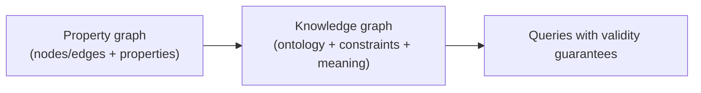
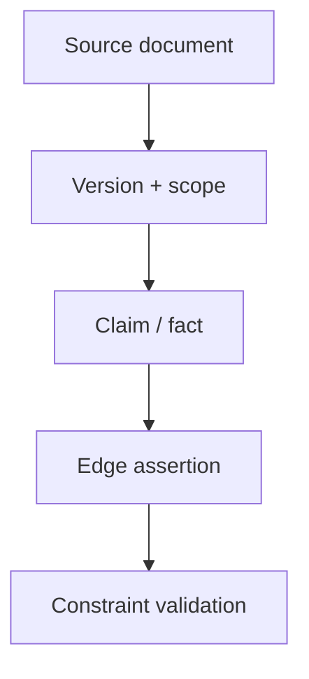

--8<-- "includes/quicknav.html"

  

    

      
Methodology → representation

      <h2 class="landing-title">Graphs are memory with structure — but not all structure is causal.</h2>
      

        Teams often say “knowledge graph” when they really mean “a graph database”.
        The difference matters because governance and meaning live in different layers than traversal and retrieval.
      

      

        <a class="md-button md-button--primary" href="core-primitives/">Core primitives</a>
        <a class="md-button" href="constraints/">Constraints &amp; SHACL</a>
        <a class="md-button" href="causalgraphrag/">CausalGraphRAG</a>
      

    

    

      
    

  

  <h2>Two graph families (and what each optimizes)</h2>
  

    

      <h3>Property graph</h3>
      
<strong>Purpose:</strong> engineering ergonomics and fast traversal.

      
<strong>Data model:</strong> nodes/edges with arbitrary key-value properties.

      
<strong>Typical wins:</strong> exploration, neighborhood expansion, ranking, path queries.

    

    

      <h3>Knowledge graph</h3>
      
<strong>Purpose:</strong> semantics, interoperability, and governance.

      
<strong>Data model:</strong> typed concepts and relations, explicit meaning, validation rules.

      
<strong>Typical wins:</strong> schema discipline, policy enforcement, consistent interpretation.

    

  

  <h2>Diagram: data vs meaning</h2>

  <h2>Where graphs help — and where they mislead</h2>
  

    
<strong>A graph can store "what is connected" without storing "why it is true".</strong>

    
Causal claims require mechanisms and counterfactual commitments; paths alone are not enough.

  

  

    

      <h3>Great for</h3>
      <ul>
        <li>Navigation: “show me what relates to X”</li>
        <li>Evidence clusters: “what supports this claim”</li>
        <li>Governance: “is this assertion even allowed”</li>
      </ul>
    

    

      <h3>Risky for</h3>
      <ul>
        <li>Equating proximity with causality</li>
        <li>Mixing incompatible sources without noticing</li>
        <li>Smuggling policy decisions into “similarity” heuristics</li>
      </ul>
    

  

  <h2>Diagram: provenance as a first-class object</h2>

  <h2>Practical rule</h2>
  

    <ul>
      <li>If you need speed and flexible ingestion: start with a <strong>property graph</strong>.</li>
      <li>If you need governance, auditability, and correctness: add <strong>knowledge-graph semantics</strong> (types + constraints + provenance).</li>
      <li>If you need “why, not just what”: build <strong>causal traversal</strong> on top (paths + traces + abstention).</li>
    </ul>
  

  <h2>Next steps</h2>
  

    

      <a class="md-button md-button--primary" href="llm-tool-rag/">LLM + Tool + RAG</a>
      <a class="md-button" href="causalgraphrag/">CausalGraphRAG</a>
      <a class="md-button" href="brcausalgraphrag/">brCausalGraphRAG</a>
    

  

