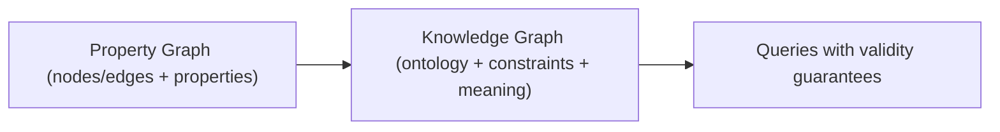
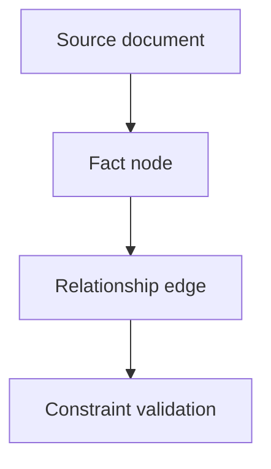

--8<-- "includes/quicknav.html"

# Property Graphs & Knowledge Graphs

Teams often say “knowledge graph” when they really mean “a graph database”.
The difference matters.

## Property graph (engineering view)

A **property graph** is a data structure: nodes/edges with arbitrary key–value properties.
It’s great for fast traversal and flexible schemas.

## Knowledge graph (semantic view)

A **knowledge graph** is a meaning system: concepts, relations, and constraints.
It cares about ontology, validity, and inferencing.

## Diagram: data vs meaning

## Diagram: provenance as a first-class object

## Practical rule

- If you need speed and flexible ingestion: start with a **property graph**.
- If you need governance, auditability, and correctness guarantees: you need **knowledge-graph semantics** (constraints, shapes, provenance).

Next: [Core Primitives](core-primitives.md) and [Constraints & SHACL](constraints.md).
