--8<-- "includes/quicknav.html"

    

  

    

      
Methodology → representation

      <h2 class="landing-title">Graphs are memory with structure — but not all structure is causal.</h2>
      

        Teams often say “knowledge graph” when they really mean “a graph database”.
        The difference matters because governance and meaning live in different layers than traversal and retrieval.
      

      

        <a class="md-button md-button--primary" href="/methodology/core-primitives/">Core primitives</a>
        <a class="md-button" href="/methodology/constraints/">Constraints &amp; SHACL</a>
        <a class="md-button" href="/methodology/causalgraphrag/">CausalGraphRAG</a>
      

    

  

## Two graph families (and what each optimizes)

  

    

      <h3>Property graph</h3>
      
<strong>Purpose:</strong> engineering ergonomics and fast traversal.

      
<strong>Data model:</strong> nodes/edges with arbitrary key-value properties.

      
<strong>Typical wins:</strong> exploration, neighborhood expansion, ranking, path queries.

    

    

      <h3>Knowledge graph</h3>
      
<strong>Purpose:</strong> semantics, interoperability, and governance.

      
<strong>Data model:</strong> typed concepts and relations, explicit meaning, validation rules.

      
<strong>Typical wins:</strong> schema discipline, policy enforcement, consistent interpretation.

    

    

      <h3>Hybrid (often best)</h3>
      
<strong>Point:</strong> not every problem fits one graph style.

      
<strong>Pattern:</strong> use a property graph for fast retrieval and workflows, then layer knowledge-graph semantics for meaning, constraints, and audit.

      
<strong>Result:</strong> speed without losing correctness when stakes rise.

    

  

## Diagram: data vs meaning

```mermaid
 flowchart TB
%% Styles (brModel Standard)
classDef i fill:#D3D3D3,stroke-width:0px,color:#000;
classDef p fill:#B3D9FF,stroke-width:0px,color:#000;
classDef r fill:#FFFFB3,stroke-width:0px,color:#000;
classDef o fill:#C1F0C1,stroke-width:0px,color:#000;
classDef s fill:#FFB3B3,stroke-width:0px,color:#000;

P_PG("🕸️ Property graph (store + traverse)"):::p
P_Ont("📚 Ontology (types + meaning)"):::p
P_Con("🔒 Constraints (SHACL rules)"):::p
R_KG(["Knowledge graph semantics (typed edges + validity)"]):::r
 D_Valid{"✅ Valid under rules?"}:::s
O_Q(["✅ Queries you can trust (valid under rules)"]):::o
S_Bad(["🛑 Block or return violations"]):::s

P_PG --> R_KG
P_Ont --> R_KG
P_Con --> R_KG --> D_Valid
D_Valid -->|"Yes"| O_Q
D_Valid -->|"No"| S_Bad

%% Clickable nodes
click P_Con "/methodology/constraints/" "Constraints & SHACL"
click P_PG "/methodology/property-and-knowledge-graphs/" "Property & Knowledge Graphs"
```

<strong>Interpretation:</strong> a property graph gives you <strong>🕸️ storage + traversal</strong>, but “knowledge†emerges only when you add <strong>📚 meaning</strong> and <strong>🔒 constraints</strong>. The <strong>✅ valid under rules?</strong> gate is what turns fast traversal into <strong>✅ queries you can trust</strong> (or <strong>🛑 violations</strong> you can fix).

## Where graphs help — and where they mislead

  

    
<strong>A graph can store "what is connected" without storing "why it is true".</strong>

    
Causal claims require mechanisms and counterfactual commitments; paths alone are not enough.

  

  

    

      <h3>Great for</h3>
      <ul>
        <li>Navigation: “show me what relates to X”</li>
        <li>Evidence clusters: “what supports this claim”</li>
        <li>Governance: “is this assertion even allowed”</li>
      </ul>
    

    

      <h3>Risky for</h3>
      <ul>
        <li>Equating proximity with causality</li>
        <li>Mixing incompatible sources without noticing</li>
        <li>Smuggling policy decisions into “similarity” heuristics</li>
      </ul>
    

    

      <h3>Helps when you need traceability</h3>
      
Graphs shine when each edge is an inspectable claim with provenance. You can ask not only <em>what</em> connects, but <em>which source</em> says so and under what scope.

    

    

      <h3>Misleads when you skip semantics</h3>
      
If relations aren’t typed and validated, traversal blends different meanings into one path. The output looks coherent, but it may be logically invalid or policy-violating.

    

    

      <h3>Helps when the world changes</h3>
      
With versioned sources and constraints, you can detect drift: what changed, which edges became stale, and which decisions must be revalidated after deployment.

    

    

      <h3>Misleads under optimization pressure</h3>
      
When graphs drive ranking or automation, agents learn to game proxies. Without guardrails and counterfactual checks, “best path†becomes a policy choice disguised as retrieval.

    

  

## Diagram: provenance as a first-class object

```mermaid
flowchart TB
%% Styles (brModel Standard)
classDef i fill:#D3D3D3,stroke-width:0px,color:#000;
classDef p fill:#B3D9FF,stroke-width:0px,color:#000;
classDef r fill:#FFFFB3,stroke-width:0px,color:#000;
classDef o fill:#C1F0C1,stroke-width:0px,color:#000;
classDef s fill:#FFB3B3,stroke-width:0px,color:#000;

I_S(["📄 Source document"]):::i
R_V(["⏱️ Version + scope"]):::r
R_F(["🧾 Claim / fact (provenance-first)"]):::r
P_E("🔗 Edge assertion (typed relation)"):::p
P_C("🔒 Constraint validation"):::p
D_OK{"✅ Allowed?"}:::s
O_OK(["✅ Commit + auditable graph state"]):::o
S_NO(["🛑 Block + violation report"]):::i

I_S --> R_V --> R_F --> P_E --> P_C
P_C --> D_OK
D_OK -->|"Yes"| O_OK
D_OK -->|"No"| S_NO

%% Clickable nodes
click P_C "/methodology/constraints/" "Constraints & SHACL"
click P_E "/methodology/core-primitives/" "Core primitives"
```

<strong>Why provenance matters:</strong> edges are not “connections†but <strong>typed assertions</strong> backed by <strong>🧾 claims</strong> tied to <strong>⏱️ versions</strong>. A <strong>✅ allowed?</strong> decision prevents invalid commits and forces explicit <strong>🛑 violation reports</strong> when rules fail.

## Practical rule

  

    <ul>
      <li>If you need speed and flexible ingestion: start with a <strong>property graph</strong>.</li>
      <li>If you need governance, auditability, and correctness: add <strong>knowledge-graph semantics</strong> (types + constraints + provenance).</li>
      <li>If you need “why, not just what”: build <strong>causal traversal</strong> on top (paths + traces + abstention).</li>
    </ul>
  

## Next steps

  

    

      <a class="md-button md-button--primary" href="llm-tool-rag/">LLM + Tool + RAG</a>
      <a class="md-button" href="causalgraphrag/">CausalGraphRAG</a>
      <a class="md-button" href="brcausalgraphrag/">brCausalGraphRAG</a>
    

  

