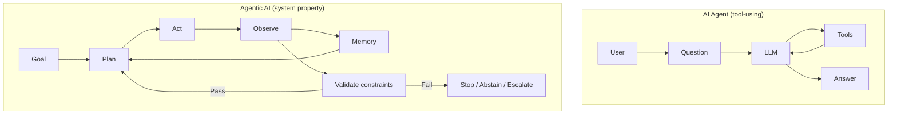
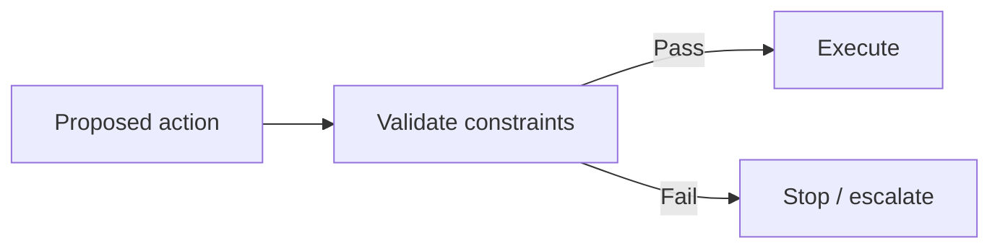

--8<-- "includes/quicknav.html"

# AI Agent vs Agentic AI

People use these terms interchangeably—and then wonder why deployments fail.

## The distinction

**AI agent** usually means a model that can use tools (search, code, APIs) to complete a task.

**Agentic AI** means a *system property*: autonomy, iteration, memory, and action loops that continue over time.

If you deploy “agentic” behavior, you are not shipping a chatbot. You are shipping a process.

## What changes when a system becomes agentic

- You must handle **feedback loops** (actions change the world; the world changes the next action).
- You must define **stopping conditions** (when to stop acting).
- You must encode **governance constraints** (what must never happen).
- You must support **abstention** (refuse to act when evidence is insufficient).

## Diagram: from tool-use to autonomy

## Diagram: governance gate (the non-negotiable)

## Practical implication

If you want agentic behavior in a high-stakes domain, the core design question is:

> What mechanisms prevent the system from acting on a wrong belief?

Next: [Governance Approach](../reasoners/governance.md) and [Constraints & SHACL](../methodology/constraints.md).
