--8<-- "includes/quicknav.html"

    

# AI Agent vs Agentic AI

  

    

      
Terminology that matters

      <h2 class="landing-title">Tool-use is not autonomy.</h2>
      

        People use “agent” and “agentic” interchangeably — and then wonder why deployments fail.
        The difference is not marketing language. It is a difference in <strong>risk surface</strong>.
      

      

        <a class="md-button md-button--primary" href="/reasoners/governance/">Governance approach</a>
        <a class="md-button" href="/methodology/constraints/">Constraints &amp; SHACL</a>
        <a class="md-button" href="/philosophy/probabilistic-ai/">Why probabilistic AI fails</a>
      

    

  

## The distinction

  

    

      <h3>AI agent (tool-using)</h3>
      
A model that can call tools (search, code, APIs) to complete a task, typically within a bounded interaction.

    

    

      <h3>Agentic AI (system property)</h3>
      
Autonomy + iteration + memory + action loops that continue over time. If you deploy this, you are shipping a process.

    

    

      <h3>Abstention</h3>
      
Refuse to act when evidence is insufficient or constraints fail.

    

  

## What changes when a system becomes agentic

  

    

      <h3>Feedback loops</h3>
      
Actions change the world; the world changes the next action. Errors compound.

    

    

      <h3>Stopping conditions</h3>
      
“Keep going” is not a control policy. You need explicit stop, timeout, and escalation rules.

    

    

      <h3>Governance constraints</h3>
      
Define what must never happen and enforce it at runtime.

    

  

## Diagram: from tool-use to autonomy

```mermaid
flowchart TB
%% Styles (brModel Standard)
classDef i fill:#D3D3D3,stroke-width:0px,color:#000;
classDef p fill:#B3D9FF,stroke-width:0px,color:#000;
classDef r fill:#FFFFB3,stroke-width:0px,color:#000;
classDef o fill:#C1F0C1,stroke-width:0px,color:#000;
classDef s fill:#FFB3B3,stroke-width:0px,color:#000;

S_User("👤 User"):::s
I_Task(["📥 Task / question"]):::i
P_LLM("🧠 LLM"):::p
P_Tools("🧰 Tool calls"):::p
O_Answer(["📝 Answer"]):::o

S_User --> I_Task --> P_LLM
P_LLM <--> P_Tools
P_LLM --> O_Answer

I_Line(["— when you add memory + loops + actions —"]):::i

S_Owner("🏢 System owner"):::s
I_Goal(["🎯 Goal"]):::i
P_Plan("🗺️ Plan"):::p
P_Act("⚙️ Act"):::p
P_Observe("👁️ Observe"):::p
R_Memory(["🧠 Memory (state + traces)"]):::r
P_Validate("🔒 Validate constraints"):::p
G_OK{"Allowed?"}:::s
O_Stop(["🛑 Stop / abstain / escalate"]):::o

S_Owner --> I_Goal --> P_Plan --> P_Act --> P_Observe --> R_Memory --> P_Plan
P_Act --> P_Validate --> G_OK
G_OK -->|"yes"| P_Observe
G_OK -->|"no"| O_Stop

%% Clickable nodes
click P_Validate "/methodology/constraints/" "Constraints & SHACL"
click R_Memory "/methodology/llm-tool-rag/" "LLM + Tool + RAG"
click O_Stop "/reasoners/governance/" "Governance"
```

## Diagram: governance gate (the non-negotiable)

```mermaid
flowchart TB
%% Styles (brModel Standard)
classDef i fill:#D3D3D3,stroke-width:0px,color:#000;
classDef p fill:#B3D9FF,stroke-width:0px,color:#000;
classDef r fill:#FFFFB3,stroke-width:0px,color:#000;
classDef o fill:#C1F0C1,stroke-width:0px,color:#000;
classDef s fill:#FFB3B3,stroke-width:0px,color:#000;

I_Action(["📥 Proposed action"]):::i
P_Validate("🔒 Validate constraints"):::p
G_OK{"Pass?"}:::s
P_Exec("⚙️ Execute"):::p
R_Log(["🧾 Log trace + provenance"]):::r
O_Done(["✅ Result (audit-ready)"]):::o

R_Refusal(["🛑 Refuse + record reason"]):::r
P_Esc("🧑‍⚖️ Escalate / ask owner"):::p

I_Action --> P_Validate --> G_OK
G_OK -->|"yes"| P_Exec --> R_Log --> O_Done
G_OK -->|"no"| R_Refusal --> P_Esc

%% Clickable nodes
click P_Validate "/methodology/constraints/" "Constraints & SHACL"
click R_Log "/reasoners/governance/" "Governance"
click P_Esc "/services/start/" "Start a conversation"
```

## Practical implication

If you want agentic behavior in a high-stakes domain, the core design question is:

> What mechanisms prevent the system from acting on a wrong belief?

Next: [Governance Approach](../reasoners/governance.md) and [Constraints & SHACL](../methodology/constraints.md).
